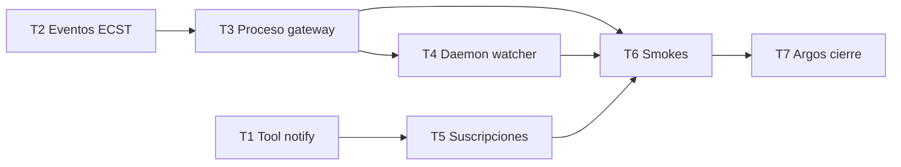

# Plan de implementación — Puente Sensorial Telegram

Blueprint para Tekton. Entrada: `objectives.md`, `clarify.md` v1.1.0, `spec.md`, PBI `Puente Sensorial Telegram Ingesta Externa y Notificación.md`.

> **Fricción de Acero (Fase A):** la cápsula `send-telegram-notification` implementa **Táctica del Refugio** — ante error de parsing Telegram, reintento inmediato sin `parse_mode`. El mensaje táctico debe llegar al dispositivo aunque falle la estética MarkdownV2.

## 0. Estado de la entrega

| Bloque | Estado | Evidencia |
|--------|--------|-----------|
| Rama de trabajo | ✅ | `feat/puente-sensorial-telegram` |
| Clarificación Mayeuta | ✅ | `clarify.md` D1–D10 |
| Especificación Dedalo | ✅ | `spec.md` |
| Planificación | ✅ | este documento |
| Tekton Fases A–E | ✅ | T1–T6 aplicados |
| `implementation.md` / `execution.md` / `validacion.md` | ✅ | Cierre documental en rama |

---

## 1. Convenciones de forja

| Tema | Regla |
|------|-------|
| Orden | Tool → Eventos + Proceso → Daemon → Suscripciones notify |
| Git | Commits atómicos por fase; sin push salvo orden explícita |
| Secretos | Nunca en diff; solo plantilla en docs |
| Prohibido | Segundo PR documental; PBI en `done/` solo pre-merge |
| Lab | `execute-process.py` + `execute-action.py` para smokes |

---

## 2. Secuencia de implementación

| Paso | Fase | Actividad | Touchpoints | Gate |
|------|------|-----------|-------------|------|
| **T1** | A | Forjar tool + cápsula HTTP + **Refugio** | `SddIA/tools/send-telegram-notification.md`, `scripts/tools/.../main.py`, `tools/index.md`, `_smoke-telegram-refugio-markdown.json` | AC3 + **AC7** (parsing → plain) |
| **T2** | B | Clases ECST dominio | `manual-task-requested.md`, `kaizen-idea-captured.md`, `events/domain/index.md` | ECST parse OK |
| **T3** | B | Proceso `telegram-gateway` | `SddIA/process/telegram-gateway.md`, `process/index.md`, capsule handler | AC4, AC5 vía execute-process |
| **T4** | C | Daemon watcher | `scripts/daemons/telegram-watcher.py`, `.gitignore` state | AC1, AC2 |
| **T5** | D | Notificaciones | `event-subscriptions.json`, handler/acción `notify-telegram-human` (si aplica) | AC6 smoke |
| **T6** | E | EDA coverage + tests | `eda-coverage.json`, `_smoke-*.json`, tests opcionales | `--scan` orphan 0 |
| **T7** | E | Argos + cierre | `implementation.md`, `execution.md`, `validacion.md`, PBI → `done/` | APTO + `pbi_archived: true` |

### Orden de dependencias



---

## 3. Checklist detallado

### T1 — Tool eferente (Fase A) — incluye Fricción de Acero

- [ ] Crear `send-telegram-notification.md` con frontmatter tools-contract
- [ ] Documentar en cuerpo tool: **Táctica del Refugio** (obligación contractual, no opcional)
- [ ] Implementar `main.py`: load env, POST sendMessage, envelope JSON salida
- [ ] Función `send_message(...)` con pipeline §3.3.1 spec (máx. 2 POST)
- [ ] `is_telegram_parse_error(response)` según §3.3.2
- [ ] Intento 1: `escape_markdown_v2` si `parse_mode=MarkdownV2`
- [ ] Intento 2 (refugio): mismo `message` input, **sin** `parse_mode`, sin re-escape
- [ ] Envelope: `attempt`, `degraded_plain_fallback`, `parse_mode_requested`
- [ ] Plantilla `_smoke-telegram-refugio-markdown.json` + test/mock AC7
- [ ] Actualizar `SddIA/tools/index.md`
- [ ] Commit sugerido: `feat(tools): send-telegram-notification con refugio plain`

**Criterio de salida:**

1. Smoke §3.4 → `success: true` (mensaje simple).
2. Smoke §3.5 / AC7 → mensaje MarkdownV2 roto → `success: true`, `degraded_plain_fallback: true`, `attempt: 2`.
3. **Prohibido** cerrar T1 sin refugio implementado.

---

### T2 — Eventos dominio (Fase B)

- [ ] Forjar `manual-task-requested.md` y `kaizen-idea-captured.md` (`event_family: domain`)
- [ ] Recalcular `hash_signature` si aplica contrato
- [ ] Actualizar `SddIA/events/domain/index.md`
- [ ] Commit sugerido: `feat(eda): eventos Manual_Task_Requested y Kaizen_Idea_Captured`

---

### T3 — Proceso gateway (Fase B)

- [ ] `telegram-gateway.md` con inputs `text` y fase única
- [ ] Registrar handler en `execute_process_capsules.py` (transmutación + `write_fractal_event`)
- [ ] `hash_signature` proceso + entrada `process/index.md`
- [ ] Plantilla `_smoke-telegram-gateway-todo.json` en persist_ref
- [ ] Commit sugerido: `feat(process): telegram-gateway transmutación a bus`

**Criterio de salida:** AC4 y AC5 — JSON en `.events/pending/`.

---

### T4 — Daemon Centinela mínimo (Fase C)

- [ ] `telegram-watcher.py` con long poll, filtro chat, estado `last_update_id`
- [ ] Flags `--once`, `--dry-run`
- [ ] Añadir `.SddIA/daemons/state/` a `.gitignore`
- [ ] Fixture `_smoke-telegram-intruder-chat.json` + prueba idempotencia
- [ ] Commit sugerido: `feat(daemon): telegram-watcher Capa 0`

**Criterio de salida:** AC1 intruso; AC2 idempotencia en lab.

---

### T5 — Cableado eferente (Fase D)

- [ ] Entradas `event-subscriptions.json` para PR y Fracture → tool o acción delgada
- [ ] Mapeo payload → mensaje (plantillas spec §7)
- [ ] Documentar en `implementation.md` si se usa acción intermedia
- [ ] Commit sugerido: `feat(eda): notificaciones Telegram en suscripciones`

---

### T6 — Coverage y QA (Fase E)

- [ ] Upsert UUIDs en `eda-coverage.json`
- [ ] `audit-entity-eda-coverage.py --scan --json`
- [ ] Tests mock HTTP si CI no tiene token
- [ ] Commit sugerido: `test(telegram): smokes puente-sensorial`

---

### T7 — Cierre documental (Fase E)

- [ ] `implementation.md` + `execution.md`
- [ ] Argos → `validacion.md` (`global: APTO`, `pbi_archived: true`, `branch: feat/puente-sensorial-telegram`)
- [ ] Mover PBI `pending/` → `done/`
- [ ] `delivery-close-cycle` → PR único
- [ ] Actualizar `objectives.md` → `status: validacion_apto`

---

## 4. Commits sugeridos (orden)

```text
1. feat(tools): send-telegram-notification cápsula ciega
2. feat(eda): eventos Manual_Task_Requested y Kaizen_Idea_Captured
3. feat(process): telegram-gateway transmutación a bus
4. feat(daemon): telegram-watcher Capa 0
5. feat(eda): notificaciones Telegram en suscripciones
6. test(telegram): smokes puente-sensorial
7. chore(eda): coverage SSOT post-telegram bridge
8. docs(puente-sensorial-telegram): validacion APTO + PBI archivado
```

---

## 5. Riesgos y mitigaciones

| Riesgo | Mitigación |
|--------|------------|
| Token en diff accidental | Pre-commit + revisión; solo `.env` local |
| Gateway no registrado en lab | T3 antes de T4 |
| MarkdownV2 falla (reportes Argos/Mayeuta) | **T1 Refugio obligatorio** — degradación plain automática; estética prescindible |
| Centinela kitchen diverge | Documentar deuda en `execution.md`; no bloquear MVP |

---

## 6. Handoff Tekton

**Estado actual:** planificación cerrada; **no ejecutar** T1–T7 hasta orden del operador.

Tras autorización:

1. Ejecutar **T1→T7** respetando dependencias §2.
2. Configurar bóveda local antes de smokes reales.
3. Documentar desviaciones en `execution.md`.
4. Invocar Argos con AC1–AC7 de `spec.md`.

**Siguiente agente:** Tekton (Ejecución) — fase 4 del proceso `feature`.
