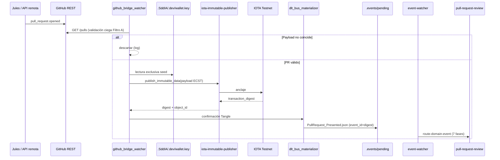

# Especificación técnica — Oráculo Sensor DLT

## 1. Contexto

El PBI v2.0.0 (`Activacion_Validacion_PR_DLT.md`) cierra la **ceguera transaccional** cuando Jules (u otro agente remoto) crea un PR en GitHub sin pasar por `delivery-close-cycle`. El flujo local Cursor permanece intacto (`emit-pr-presented-event`). Esta feature forja el **puente sensorial** que unifica ambos extremos vía anclaje IOTA Rebased Testnet antes de materializar `PullRequest_Presented` en el bus.

## 2. Diagrama de secuencia (ruta remota)



## 3. Componentes nuevos

### 3.1 `github_bridge_watcher.py` (H1 + H2)

| Aspecto | Especificación |
|---------|----------------|
| Ruta | `SddIA/scripts/daemons/github_bridge_watcher.py` |
| Modo detección | Polling GitHub REST (`GET /repos/{owner}/{repo}/pulls?state=open`) o webhook local (ngrok/relay) |
| Intervalo polling | Configurable vía `SDDIA_GITHUB_BRIDGE_POLL_SECONDS` (default 30) |
| Autenticación GH | Token vía bóveda `.dev/.env` → `GITHUB_TOKEN` (nunca en payload) |
| Eventos observados | `pull_request.opened` (extensible a `reopened`) |
| Idempotencia local | Registro de PRs ya procesados en `.SddIA/.dev/github_bridge_state.json` |
| Validación Filtro A | Contrastar `head.ref`, `html_url`, `base.ref` contra respuesta REST antes de firmar |
| Acceso wallet | Único lector de `.SddIA/.dev/wallet.key`; permisos OS 400 en Unix |

**Variables de entorno:**

| Variable | Uso |
|----------|-----|
| `SDDIA_LAB_SIMULATE_REMOTE_PR=1` | Modo lab: simula detección sin GH real (H4) |
| `SDDIA_GITHUB_BRIDGE_POLL_SECONDS` | Intervalo polling |
| `GITHUB_TOKEN` | API GitHub (bóveda) |
| `IOTA_WALLET_SECRET` | Firma DLT (bóveda; alineado `iota-immutable-publisher`) |

### 3.2 Puente firma DLT (H2)

Al confirmar PR válido, el demonio compone payload ECST pre-bus:

```json
{
  "event_type": "PullRequest_Presented",
  "timestamp": "<ISO-8601 UTC>",
  "emitter_agent": "github-bridge-watcher",
  "payload": {
    "repository": "<owner/repo>",
    "branch": "<head.ref>",
    "pr_url": "<html_url>",
    "status": "presented",
    "origin_agent": "jules",
    "signer_identity_rbac": "Vertice_Biologico_Relay"
  }
}
```

Invocación de `iota-immutable-publisher` vía patrón existente en `route_domain_event_core._invoke_iota_publisher`:

- `action: publish_immutable_data`
- `network: testnet`
- Reintentos: **3** con backoff exponencial (1s, 2s, 4s)
- Tras agotar reintentos → dead-letter con `FALLBACK_LOCAL_SIGNATURE` (Filtro B)

### 3.3 Materializador bus (H3)

| Aspecto | Especificación |
|---------|----------------|
| Ruta | Lógica embebida en `github_bridge_watcher.py` o módulo `SddIA/scripts/qa/dlt_bus_materializer.py` |
| Trigger | `transaction_digest` confirmado en envelope IOTA |
| Destino | `.events/pending/<transaction_digest>.json` |
| `event_id` | **Igual** a `transaction_digest` (idempotencia f(x)=x) |
| Pre-check | Si archivo existe con mismo digest → no-op (idempotente) |
| `delivery_state` inicial | `{ "argos": "pending", "cumulo": "success" }` cuando DLT ya anclado en H2 |

**Decisión D7 (clarify):** en ruta oráculo, `delivery_state.cumulo` se marca `success` al materializar porque el anclaje DLT ya ocurrió en H2. El suscriptor `cumulo → iota-immutable-publisher` en `route-domain-event` debe **omitir re-publicación** si `payload.dlt_anchor_address` está presente.

### 3.4 Simulador E2E (H4)

| Artefacto | Propósito |
|-----------|-----------|
| `SddIA/scripts/qa/simulate_remote_pr.py` | Emula Jules: crea rama dummy + PR vía GH API o fixture local |
| Smoke inputs | `.tmp/smoke-remote-pr-dlt.json` |

**Protocolo H4:**

1. `export SDDIA_LAB_SIMULATE_REMOTE_PR=1`
2. Ejecutar simulador (sin acceso a wallet desde el simulador)
3. Arrancar `github_bridge_watcher.py --once` en paralelo o secuencia
4. Verificar JSON en `.events/pending/`
5. `event-watcher.py --once` → aduana `pull-request-review` (7 fases)
6. Exit code binario: 0 = éxito, 1 = fallo

## 4. Evolución ECST — `pull-request-presented` v1.2.0

### 4.1 Payload ampliado (opcional, ruta oráculo)

| Campo | Tipo | Obligatorio ruta oráculo | Obligatorio ruta local |
|-------|------|--------------------------|------------------------|
| `branch` | string | Sí | Sí |
| `status` | string | Sí | Sí |
| `pr_url` | string | Sí | Opcional |
| `repository` | string | Sí | No |
| `origin_agent` | string | Sí | No (default `delivery-close-cycle`) |
| `dlt_anchor_address` | string | Sí | No |
| `signer_identity_rbac` | string | Sí | No |

### 4.2 Emisores autorizados (post-evolución)

- `emit-pr-presented-event` (ruta local Cursor)
- `github-bridge-watcher` (ruta remota Jules) — **nuevo**

## 5. Cambios en genoma / suscripciones

| Artefacto | Cambio |
|-----------|--------|
| `SddIA/events/pull-request-presented.md` | v1.2.0 — payload ampliado + emisor oráculo |
| `SddIA/core/event-subscriptions.json` | Sin cambio estructural; lógica skip IOTA en `route_domain_event_core` |
| `route_domain_event_core.py` | Guard: si `payload.dlt_anchor_address` → marcar cumulo success sin re-invocar IOTA |
| `SddIA/evolution/` | Entrada transmutación oráculo sensor |

## 6. Handler laboratorio

| Artefacto | Cambio |
|-----------|--------|
| `github_bridge_watcher.py` | `--once` para smoke CI |
| `simulate_remote_pr.py` | Fixture bajo `SDDIA_LAB_SIMULATE_REMOTE_PR=1` |
| Smoke manifest | `docs/features/pull-request-automation-dlt/_smoke-remote-pr-dlt.json` |

### Criterios de aceptación

| ID | Criterio |
|----|----------|
| CA-1 | Demonio detecta PR abierto (real o simulado) sin discriminar autor |
| CA-2 | Validación GitHub REST rechaza payload corrupto (Filtro A) |
| CA-3 | Anclaje IOTA exitoso → `transaction_digest` no vacío |
| CA-4 | Bus recibe evento con `event_id == transaction_digest`; reintento no duplica |
| CA-5 | `event-watcher --once` dispara `pull-request-review` (7 fases) |
| CA-6 | Fallback dead-letter tras 3 fallos IOTA con `FALLBACK_LOCAL_SIGNATURE` |
| CA-7 | Wallet nunca accesible desde simulador Jules ni desde contexto IA |

## 7. Seguridad

- Prohibido pasar seed/privkey en JSON de cápsulas o prompts IA.
- `wallet.key` en `.gitignore` / `.SddIA/.dev/` no rastreado.
- Token GitHub solo vía jerarquía bóvedas (`env_loader.py`).
- Logs del demonio: prohibido volcar secretos; solo digest y `pr_url`.

## 8. Fuera de alcance (spec)

- Webhook productivo permanente en org GitHub.
- HSM / custodia enterprise.
- Modificar fases de `pull-request-review` v2.
- Sustituir `delivery-close-cycle` flujo local.
