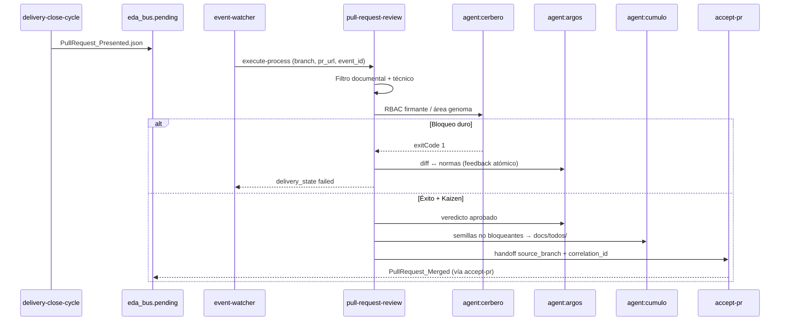

# Especificación técnica — Aduana `pull-request-review`

## 1. Contexto

El TODO arquitectónico define la **Aduana de Fricción** como guardián determinista entre la presentación del PR (`PullRequest_Presented`) y la materialización soberana (`accept-pr`). El genoma actual (`pull-request-review` v1.0.0) es un **placeholder V5** sin handler lab ni suscripción bus; esta feature lo evoluciona a **v2.0.0** operativo.

## 2. Diagrama de secuencia (aduana reactiva)



## 3. Contrato objetivo: `pull-request-review` (v2.0.0)

### 3.1 Inputs

| Campo | Tipo | Obligatorio | Origen |
|-------|------|-------------|--------|
| `pr_id_or_path` | string | Sí | Payload evento / `gh` |
| `pr_branch` | string | Sí | `payload.branch` |
| `pr_url` | string | No | `payload.pr_url` v1.1 |
| `correlation_id` | string | Sí | `event_id` ECST |
| `code_diff` | string | No | Resuelto por git-manager checkout |
| `persist_ref` | string | Sí | Inferido de rama o input explícito |
| `tasks_path` | string | No | Cúmulo → `directories.tasks` |
| `document_context` | object | No | Normas activas |
| `cumulo_topology` | object | Sí | SSOT paths |

### 3.2 Outputs

| Campo | Valores |
|-------|---------|
| `validacion.md` | Informe bajo `persist_ref` |
| `verdict` | `aprobado` \| `requiere_cambios` \| `rechazado` |
| `kaizen_seeds` | Rutas TODO generadas por Cúmulo |
| `delivery_state` | `success` \| `failed` (envelope watcher) |
| `accept_pr_handoff` | boolean — `true` solo si `verdict: aprobado` |

### 3.3 Fases (YAML declarativo v2)

| # | Nombre | delegates_to | Intent |
|---|--------|--------------|--------|
| 1 | Preparación de rama | `skill:git-manager` | Checkout reproducible de `pr_branch` |
| 2 | Triaje documental | `agent:argos` | Frontmatter + `spec/plan/implementation/objectives` |
| 3 | Triaje técnico | `action:execute-process` | Proceso/herramientas test+SAST vía cápsulas |
| 4 | Certificación RBAC | `agent:cerbero` | Token firmante vs área genoma |
| 5 | Veredicto y bloqueo | `agent:argos` | Dictamen; abort si F2–F4 fallan |
| 6 | Cosecha Kaizen | `agent:cumulo` | TODO async en `docs/todos/` |
| 7 | Handoff materialización | `action:execute-process` | `process_name: accept-pr` si F5 aprobado |

**Eliminado respecto v1.0.0:** fase `agent:dedalo`; fase genérica «Persistencia» pasa a Argos + `skill:filesystem-manager` en sub-paso de F5.

### 3.4 Reglas de aborto (Fase 2 TODO)

| Condición | `delivery_state` | Acción Argos |
|-----------|------------------|--------------|
| Frontmatter inválido o archivo base ausente | `failed` | Comentario atómico por archivo |
| Tests/SAST críticos | `failed` | Mapeo diff ↔ norma / principio |
| Cerbero RBAC | `failed` | Causa política (sin secretos) |
| Deuda Kaizen menor | `success` | Cúmulo persiste TODO; no abort |

## 4. Suscripción bus (`event-subscriptions.json`)

Entrada propuesta bajo `PullRequest_Presented` ( **además** del suscriptor IOTA existente):

```json
{
  "agent": "argos",
  "process": "pull-request-review",
  "intent": "Aduana de Fricción post-presentación; gate antes de accept-pr."
}
```

> Nota implementación: resolver invocación vía `route-domain-event` / extensión watcher según patrón Ola C (`sync-entity-index` como precedente).

Actualizar `SddIA/events/pull-request-presented.md` § Suscripciones: retirar texto «no-op hasta auditoría Argos».

## 5. Handler laboratorio

| Artefacto | Cambio |
|-----------|--------|
| `execute_process_capsules.py` | `PHYSICAL_HANDLERS["pull-request-review"]` — F1 git simulado, F2–F5 stub Argos/Cerbero con envelope JSON |
| Payload smoke | `docs/features/pull-request-review-redesign/_smoke-pr-review-presented.json` |
| `event-watcher.py` | Verificar promoción `failed` / `success` según `verdict` |

### Criterios de aceptación (validación)

1. Tras emitir `PullRequest_Presented` en lab: watcher invoca aduana (log/trace en `execution_report`).
2. Payload inválido documental → `delivery_state.failed` + `verdict: rechazado`.
3. Payload válido smoke → `verdict: aprobado` + handoff simulado `accept-pr`.
4. Kaizen simulado → archivo bajo `docs/todos/` con prefijo acordado.
5. Genoma v2 registrado en `SddIA/process/index.md` con hash actualizado.

## 6. Limpieza y deuda documentada

| Artefacto | Acción |
|-----------|--------|
| `SddIA/process/pull-request-review.md` | Reescritura v2.0.0 |
| `SddIA_4/linter/acceptable_pr.md` | Referencia obsoleta `validate-pull-requests` → `pull-request-review` (checklist plan) |
| `SddIA_1`…`SddIA_4/process/README.md` | Idem (backlog labs) |
| `SddIA/principles/index.md` | Mantener enlace `blocking_for_pr` → Argos en aduana |

## 7. Matriz de artefactos tocados (implementación)

| Artefacto | Acción |
|-----------|--------|
| `SddIA/process/pull-request-review.md` | v2.0.0 |
| `SddIA/process/index.md` | Fila actualizada |
| `SddIA/core/event-subscriptions.json` | Suscriptor aduana |
| `SddIA/events/pull-request-presented.md` | Suscripciones + nota emisor |
| `SddIA/scripts/qa/execute_process_capsules.py` | Handler |
| `docs/todos/ARQUITECTURA_Rediseno_Proceso_pull-request-review.md` | Pivot + checklist |
| `docs/features/pull-request-review-redesign/validacion.md` | Post-smoke |

## 8. Plan de implementación

Ver `plan.md` — orden: genoma → suscripción → handler lab → smoke → validación → purge refs legacy.
