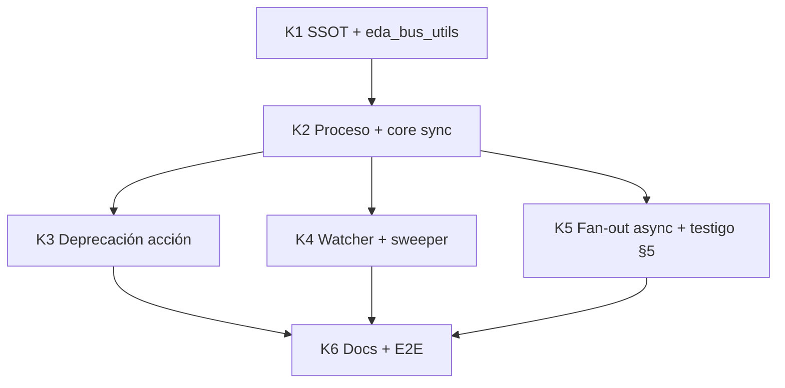

# Plan de implementación — Topología simétrica bus EDA (Ola C V3+)

Blueprint Tekton. Entrada: `objectives.md`, `clarify.md`, `spec.md`, SSOT `cumulo.paths.json`.

## 0. Estado de la entrega

| Bloque | Estado | Evidencia |
|--------|--------|-----------|
| Clarificación (Mayeuta) | ✅ | `clarify.md` D1–D7 |
| Objetivos | ✅ | `objectives.md` |
| Especificación (Dedalo) | ✅ | `spec.md` |
| Planificación (Dedalo) | ✅ | este documento |
| **K1 — SSOT topología simétrica** | ✅ | `cumulo.paths.json`, `eda_bus_utils.py` |
| **K2 — Proceso route-domain-event** | ✅ | `route_domain_event_core.py`, `process/route-domain-event.md` |
| **K3 — Deprecación acción legacy** | ✅ | action deprecated + shim `execute-action.py` |
| **K4 — Watcher + sweeper** | ✅ | `event-watcher.py`, `event-sweeper.py` |
| **K5 — Fan-out asíncrono + contrato testigo (§5)** | ✅ | async default + tests |
| **K6 — Documentación + E2E** | ✅ | `implementation.md`, `validacion.md` |
| Verificación Argos | ✅ | `validacion.md` APTO |

**Precondición:** Ola C V3 entregada (`docs/features/ola-c-v3-coreografia/`).

**Decisión arquitectónica:** Topología simétrica con cabecera por estado; orquestador = **proceso** `route-domain-event`; watcher delgado; sweeper independiente adaptado.

---

## Hito K1 — SSOT y utilidades (`eda_bus_utils`)

**Intent:** Migrar Cúmulo y helpers a árbol simétrico; bootstrap idempotente.

| # | Entregable | Detalle |
|---|------------|---------|
| K1.1 | `cumulo.paths.json` | Reemplazar `eda_bus.subscribers.*` por `processing`, `processed`, `dead_letter` |
| K1.2 | `eda_bus_utils.py` | `load_eda_bus()` con claves `*_subscribers`; alias legacy deprecados |
| K1.3 | `ensure_event_bus_topology()` | Crear `pending/`, `{processing,processed,dead-letter}/`, cada `subscribers/` |
| K1.4 | Helpers cabecera | `ensure_processing_header()`, `ensure_state_header(repo, state, uuid, source)` |
| K1.5 | Helpers testigo | Refactor `write_processing_witness`, `promote_witness` → rutas anidadas |
| K1.6 | Purge processing | `maybe_purge_processing_header(repo, bus, event_uuid, registry)` |
| K1.7 | `.gitignore` | Confirmar `/.events/` cubre nuevo árbol |

**Delegates_to:** `agent:cumulo`, `skill:filesystem-manager`

**Commit sugerido:** `refactor(eda): K1 — topología simétrica SSOT + eda_bus_utils`

**Criterio de salida:** Unit smoke: bootstrap crea 7 directorios; `load_eda_bus` sin claves planas legacy rotas.

---

## Hito K2 — Núcleo orquestador + proceso SddIA

**Intent:** Extraer lógica del watcher; forjar proceso; handler lab.

| # | Entregable | Detalle |
|---|------------|---------|
| K2.1 | `route_domain_event_core.py` | Migrar desde `event-watcher.py`: ECST gate, fan-out, promoción, idempotencia |
| K2.2 | `SddIA/process/route-domain-event.md` | Contrato process v1.0.0; fases §6.3 spec |
| K2.3 | `entity-manager` forja | `execute-process --process entity-manager` con `entity_class: process` |
| K2.4 | `process/index.md` | Fila sincronizada |
| K2.5 | `execute_process_capsules.py` | Handler físico fase fan-out → `route_domain_event_core.route()` |
| K2.6 | Tests unitarios core | Idempotencia, cabecera processing, purge último suscriptor |

**Delegates_to:** `action:execute-process`, `entity-manager`, `process-creator`, `emit-domain-mutation`

**Commit sugerido:** `feat(process): K2 — route-domain-event orquestador + core`

**Criterio de salida (v1 sync):** Lab: `execute-process --process route-domain-event --inputs '{"event_file_path":".events/pending/x.json"}'` produce topología simétrica con `dispatch_mode: sync`.

**Nota forja:** Semilla `semantic_seed` desde contrato acción legacy (inputs/outputs/capabilities); **prohibido** forja manual de `.md` sin `entity-manager`.

**Nota alcance K2 vs K5:** K2 entrega orquestador funcional **secuencial** (paridad V3). El **punto 5** del manifiesto (fan-out asíncrono + decoración testigo spec §5) se cierra en **K5**.

---

## Hito K3 — Deprecación acción legacy

**Intent:** Shim transparente; trazabilidad evolution.

| # | Entregable | Detalle |
|---|------------|---------|
| K3.1 | `actions/route-domain-event.md` | Banner deprecated → proceso |
| K3.2 | `actions/index.md` | Marcar deprecated o mover a evolution |
| K3.3 | `execute-action.py` | Handler delega en `execute-process --process route-domain-event` |
| K3.4 | `CAPSULE_ACTION_REGISTRY` | Mantener entrada con delegación documentada |
| K3.5 | `SddIA/evolution/` stub | Registro migración acción→proceso (opcional) |

**Commit sugerido:** `refactor(eda): K3 — deprecate route-domain-event action shim`

**Criterio de salida:** `execute-action --action route-domain-event` sigue funcionando vía proceso.

---

## Hito K4 — Watcher y sweeper

**Intent:** Adaptar demonios al procedimiento V3+.

| # | Entregable | Detalle |
|---|------------|---------|
| K4.1 | `event-watcher.py` | Eliminar `route_domain_event` inline; invocar `execute-process` |
| K4.2 | `event-sweeper.py` | Rutas `*/subscribers/`; purga cabeceras processed/processing |
| K4.3 | Consumidores | `run-eda-e2e-lab.py`, scripts QA que usen `subscriber_*` plano |
| K4.4 | `bus-operator` | Actualizar micro-tools si referencian rutas V3 |

**Commit sugerido:** `refactor(eda): K4 — watcher delgado + sweeper simétrico`

**Criterio de salida:** Watcher `--once` + sweeper `--once` sobre evento lab; CA1–CA7 spec cumplidos (modo sync).

---

## Hito K5 — Fan-out asíncrono y contrato testigo (spec §5 + §6.4)

**Intent:** Cumplir **punto 5** del manifiesto Kaizen: delegación **asíncrona** por suscriptor, promoción de testigos al recibir respuesta, decoración forense y convivencia multi-estado sin bloqueo secuencial.

**Referencia normativa:** `spec.md` §5 (esquemas processing/processed/dead-letter + idempotencia §5.4) y §6.4 (runtime objetivo async).

| # | Entregable | Detalle |
|---|------------|---------|
| K5.1 | Dispatcher async | `route_domain_event_core.py`: lanzar delegaciones process/action/tool **sin esperar** entre suscriptores; reunir resultados al cierre de fase o vía callback |
| K5.2 | `dispatch_mode` | Testigos en `processing/subscribers/` con `dispatch_mode: async`; sync solo bajo flag lab `SDDIA_LAB_ROUTE_SYNC=1` |
| K5.3 | Decoración processed | Campos obligatorios §5.2: `result_status`, `delegation.{kind,target,exit_code}`, `completed_at` |
| K5.4 | Decoración dead-letter | Campos obligatorios §5.3: `error_trace`, `delegation`, `failed_at` |
| K5.5 | Promoción independiente | Cada suscriptor promueve testigo y réplica cabecera en destino **en cuanto** termina (no al final del batch) |
| K5.6 | Purge processing | Invocar `maybe_purge_processing_header` tras cada terminal; no solo al cierre del batch |
| K5.7 | Idempotencia §5.4 | Skip si testigo terminal existe; reintento solo en `processing/subscribers/` |
| K5.8 | Proceso SddIA | Actualizar fase **Fan-out suscriptores** en `route-domain-event.md` (async explícito) |
| K5.9 | E2E multi-suscriptor | Lab: evento con ≥2 suscriptores; verificar testigos en distintos estados simultáneos + cabeceras replicadas |
| K5.10 | Sweeper bajo async | Validar que sweeper no purga `pending/` hasta consenso en `processed/subscribers/` con suscriptores aún en vuelo |

**Delegates_to:** `route_domain_event_core`, `skill:filesystem-manager`, `action:execute-process`, `action:execute-action`

**Commit sugerido:** `feat(eda): K5 — fan-out async suscriptores + contrato testigo V3+`

**Criterio de salida:**

- CA-O2: fan-out async demostrable (testigos `dispatch_mode: async`).
- CA10: idempotencia en re-route.
- CA11 (nuevo): dos suscriptores con tiempos distintos → estados divergentes en carpetas simultáneas.
- Decoración §5.2/5.3 presente en todos los testigos terminales.

**Secuenciación interna:**

```
K5.1–K5.2 dispatcher async
  → K5.3–K5.5 decoración + promoción por callback
  → K5.6–K5.7 purge + idempotencia
  → K5.8–K5.10 contrato + E2E + sweeper
```

---

## Hito K6 — Documentación, E2E integral y cierre documental

**Intent:** Cerrar cascada documental y preparar Argos.

| # | Entregable | Detalle |
|---|------------|---------|
| K6.1 | `implementation.md` | Touchpoints por hito (K1–K5) |
| K6.2 | `execution.md` | Registro Tekton + comandos lab (sync y async) |
| K6.3 | `validacion.md` | Matriz CA1–CA11 |
| K6.4 | `README.md` | Mapa bus si diverge de V3 |
| K6.5 | PBI todo | Mover a `done/` al cierre feature |
| K6.6 | Referencia cruzada | Nota delta en `ola-c-v3-coreografia/spec.md` (opcional, 1 párrafo) |

**Commit sugerido:** `docs(eda): K6 — validación topología simétrica V3+`

**Criterio de salida:** `validacion.md` APTO; E2E lab verde (sync + async).

---

## Orden de ejecución



**Orden estricto:** K1 → K2 → K5 (async depende del core sync). K3 y K4 pueden paralelizarse tras K2. **K6** cierra tras K3, K4 y **K5**.

---

## Riesgos y mitigaciones

| Riesgo | Mitigación |
|--------|------------|
| Consumidores con rutas V3 hardcodeadas | Grep `subscribers/processing` en repo; alias temporal en `load_eda_bus` |
| Beta `execute-process` sin handler proceso | Registrar handler en K2.5 antes de migrar watcher |
| Forja proceso sin EDA | `entity-manager` + sello `Domain_Entity_Created` |
| Regresión PR review | E2E con `PullRequest_Presented` simulado |
| Condiciones de carrera async | Promoción atómica por testigo; sweeper solo consensua `processed/subscribers/` (K5.10) |
| Regresión modo sync | Flag `SDDIA_LAB_ROUTE_SYNC=1` para E2E legacy en CI |

---

## Comandos lab de referencia

```bash
# Bootstrap + emit de prueba (existente)
python SddIA/scripts/qa/run-eda-e2e-lab.py

# Route vía proceso (post K2)
python SddIA/scripts/qa/execute-process.py \
  --process route-domain-event \
  --inputs '{"event_file_path":".events/pending/<uuid>.json"}'

# Watcher un ciclo
python SddIA/scripts/daemons/event-watcher.py --once

# Sweeper
python SddIA/scripts/daemons/event-sweeper.py --once --json

# Route async (post K5; default sin flag sync)
python SddIA/scripts/qa/execute-process.py \
  --process route-domain-event \
  --inputs '{"event_file_path":".events/pending/<uuid>.json"}'

# Route sync for regression
SDDIA_LAB_ROUTE_SYNC=1 python SddIA/scripts/qa/execute-process.py \
  --process route-domain-event \
  --inputs '{"event_file_path":".events/pending/<uuid>.json"}'
```

---

## Delegación Tekton por fase documental

| Fase refactorization | Agente | Artefacto |
|----------------------|--------|-----------|
| Estabilización | Mayeuta | `clarify.md` ✅ |
| Diseño | Dedalo | `spec.md`, `plan.md` ✅ |
| Ejecución | Tekton | K1–K6 código + `implementation.md` |
| Verificación | Argos | `validacion.md` |
| Cierre | delivery-close-cycle | PR + `PullRequest_Presented` |
