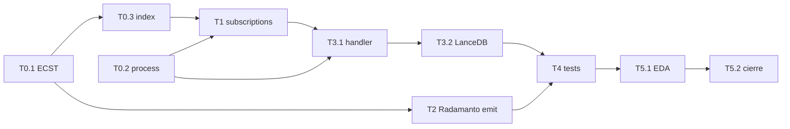

# Plan de implementación — telemetria-activa-domain-entity-updated

Blueprint Tekton. Entrada: `objectives.md`, `clarify.md`, `spec.md` (laudo Plan B), PBI v1.1.0+.

## 0. Estado de la entrega

| Bloque | Estado | Evidencia |
|--------|--------|-----------|
| Rama | ✅ | `feat/telemetria-activa-domain-entity-updated` |
| Mayeuta | ✅ | `clarify.md` |
| Dedalo spec | ✅ | `spec.md` — Plan B |
| Planificación | ✅ | este documento |
| Tekton T0–T5.1 | ✅ | Genoma + runtime + smoke + EDA |
| `implementation.md` / `execution.md` | ✅ | Persistidos |
| T5.2 Argos + cierre | ✅ | validacion.md APTO + PBI done/

---

## 1. Convenciones de forja

| Tema | Regla |
|------|-------|
| Orden | **Genoma antes de runtime** (Clase ECST + proceso antes de emitir/suscribir) |
| Forja | Solo `./sddia-run.sh --process entity-manager` (DA-2/DA-3) |
| Git | Commits atómicos por fase vía `git-manager` cuando el operador lo pida |
| Bus | `./.events/domain/` — nunca `.SddIA/events/pending/` para esta chispa |
| Fail-soft | Emisión/ingest no tumba Self-Healing |
| Cierre | Un PR; PBI a `done/` + `pbi_archived: true` en rama |

---

## 2. Secuencia Tekton

| Paso | Fase | Actividad | Touchpoints | Gate |
|------|------|-----------|-------------|------|
| **T0.1** | T0 | Forjar Clase `domain-entity-telemetry-captured` | `entity-manager` + event-creator; `SddIA/events/domain/` | Schema REQUIRED/OPTIONAL/FORBIDDEN = spec §4 |
| **T0.2** | T0 | Forjar proceso `memory-evolution-ingest` | `entity-manager` + process-creator | Inputs `event_file_path`; index proceso |
| **T0.3** | T0 | Actualizar códice familia domain | `events/domain/index.md` vía creator/sync | Fila nueva + capabilities |
| **T1** | T1 | Suscripción domain | `event-domain-subscriptions.json` | Clave `Domain_Entity_Telemetry_Captured` → process |
| **T2** | T2 | Emisión en Radamanto | `radamanto_batch_core.rs` | AC1 — chispa tras consumo OK |
| **T3.1** | T3 | Handler nativo ingest | `execute-process` residual/módulo | Invocable vía route-domain |
| **T3.2** | T3 | Persistencia mínima adapter | `lancedb_evolution_repo` | AC3 — archivos bajo vector_store/evolution |
| **T4** | T4 | Tests unit/lab + smoke | tests Rust / script lab sync | Suite verde; AC1–AC4 |
| **T5.1** | T5 | EDA coverage | emit / `eda-coverage.json` | `orphan_count: 0` |
| **T5.2** | T5 | Argos + cierre documental | `validacion.md`, PBI → `done/` | AC6 |

### Dependencias

---

## 3. Detalle por paso

### T0.1 — Clase ECST

- `lifecycle_operation: create` vía entity-manager.
- Payload tables exactas del spec §4.
- Emisor documentado: `radamanto`.
- UUID v4 nuevo; `hash_signature` anclado post-forja.

### T0.2 — Proceso ingest

- Una fase delegada a runtime nativo (sin agente IDE).
- Contrato I/O JSON stdin/stdout (`capsule-json-io`).

### T1 — Suscripciones

- Solo añadir entrada; no reordenar/alterar `Domain_Entity_Updated`.
- Formato paridad con otras claves `process`-based.

### T2 — Radamanto

- Helper `build_telemetry_captured_payload(...)`.
- Llamada única en caminos success no-duplicate.
- `actions` incluye resultado; error → objeto `{ "type": "...", "error": "..." }` sin `Err` fatal del batch.

### T3 — Handler + store

- Registrar process name en residual_runner / route fractal.
- Adapter: si bindings LanceDB no están listos, persistir `EvolutionEvent` serializado en `.SddIA/vector_store/evolution/{id}.json`.
- Idempotencia: skip si archivo/`id` ya existe para mismo `origin_stimulus.event_id` (metadata).

### T4 — Verificación

| Smoke | Cómo |
|-------|------|
| Emisión | Lab: telemetría sintética → radamanto-batch → glob domain |
| Ingest | `SDDIA_LAB_ROUTE_SYNC=1` o invoke memory-evolution-ingest |
| CRUD regresión | emit-domain-mutation update mínimo o test existente |
| Stub | No tocar; confirmar hot path sigue siendo radamanto-batch |

### T5 — Cierre

- `implementation.md` + `execution.md` con frontmatter.
- `validacion.md`: `global: APTO`, `pbi_archived: true`, `branch` coherente.
- Mover PBI a `docs/todos/done/` en esta rama.
- `delivery-close-cycle` cuando operador autorice PR.

---

## 4. Criterios de aceptación (mapeo)

| AC spec | Paso gate |
|---------|-----------|
| AC1 | T2 + T4 |
| AC2 | T1 + T3.1 + T4 |
| AC3 | T3.2 + T4 |
| AC4 | T4 |
| AC5 | T5.1 |
| AC6 | T5.2 |

---

## 5. Rollback mental

Si T0.1 falla por política creator: detener; no emitir desde Radamanto sin Clase catalogada (gate ECST → DLQ).

Si T3.2 no alcanza LanceDB real: aceptar persistencia JSON bajo vector_store (spec §8 mínimo) y registrar deuda bindings en evolution.

---

## 6. Handoff Tekton

Orden de ataque inmediato: **T0.1 → T0.2 → T0.3 → T1 → T2 → T3 → T4 → T5**.

Prohibido empezar por runtime sin genoma.
