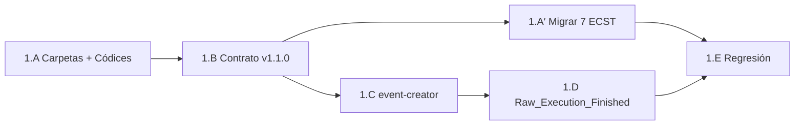

# Plan — Fase 1 · Refactor genómico Trinidad de Estímulos

## Secuencia de implementación

| Paso | Actividad | Touchpoints principales | Salida / gate |
|------|-----------|-------------------------|---------------|
| **1.A** | Crear `telemetry/`, `orchestration/`, `domain/`; redactar `index.md` por familia; reestructurar índice raíz | `SddIA/events/**` | Árbol § spec.md §2; AC1.1 parcial |
| **1.B** | Bump `events-contract.md` → v1.1.0; campo `event_family`; § Trinidad | `events-contract.md` | AC1.3 |
| **1.A′** | Migrar 7 ECST a `domain/` + cabecera `event_family: domain` | `domain/*.md`, `domain/index.md` | AC1.1, AC1.2 |
| **1.C** | Input `event_family` en `event-creator.md`; validación Cerbero/Cúmulo; ruta `{family}/{name}.md` | `SddIA/process/event-creator.md` | AC1.4 (diseño listo) |
| **1.D** | Ejecutar `event-creator` para `raw-execution-finished` en `telemetry/` | `telemetry/raw-execution-finished.md`, `telemetry/index.md` | PBI §1.D |
| **1.E** | QA + plantilla instancia + barrido referencias + `eda-coverage` si aplica | `test_eda_bus_v3plus.py`, `eda-instance-events/README.md`, `rg` Core | Regresión verde |
| **Cierre** | Argos → `validacion.md` APTO; `pbi_archived: false` | `persist_ref/validacion.md` | Feature Fase 1 cerrada; abrir Fase 2 |

## Orden de dependencias internas

> **1.B antes de migración:** las Clases migradas deben materializarse ya exigiendo `event_family` coherente con el contrato vigente.

## Checklist por paso

### 1.A — Topología física

- [ ] Crear `SddIA/events/telemetry/`, `orchestration/`, `domain/`
- [ ] `telemetry/index.md`, `orchestration/index.md`, `domain/index.md` (Códice — sin `README.md`)
- [ ] Reescribir `SddIA/events/index.md` como índice de familias
- [ ] Confirmar raíz: solo `events-contract.md` + `index.md` + tres carpetas

### 1.B — Contrato base

- [ ] `contract_version: "1.1.0"`
- [ ] Documentar `event_family` en tabla de cabecera Clase
- [ ] § Trinidad + regla Argos
- [ ] Nota: instancia ECST sin `event_family` hasta Fase 3

### 1.A′ — Migración dominio

- [ ] Mover 7 archivos `.md` a `domain/`
- [ ] Añadir `event_family: domain` + `contract: events-contract v1.1.0`
- [ ] Poblar catálogo en `domain/index.md`
- [ ] `rg` sin rutas `SddIA/events/<clase>.md` obsoletas en Core

### 1.C — create-event

- [ ] Input `event_family` en `event-creator.md` con **`default: "domain"`** y normalización `effective_event_family` (D1.9)
- [ ] Documentar en contrato: ausente/vacío → `domain`; telemetría pasa `"telemetry"` explícito
- [ ] Validación enum + emisor telemetry = CLI-only (sobre valor efectivo)
- [ ] Output path `{directories.events}/{effective_event_family}/{event_name}.md`
- [ ] Actualizar índice de familia en fase «Gobernanza de Índice»
- [ ] Smoke en `execution.md`: forja sin `event_family` → `domain/`; forja con `telemetry` → `telemetry/`
- [x] Kaizen D1.9 cerrado: `docs/todos/done/[Kaizen] event-creator — eliminar default event_family domain.md`

### 1.D — Raw_Execution_Finished

- [ ] Forja con payload REQUIRED/OPTIONAL según `clarify.md`
- [ ] Entrada en `telemetry/index.md`
- [ ] `eda-coverage` / emit si el flujo entity-manager lo exige

### 1.E — Regresión

- [ ] `test_eda_bus_v3plus.py` — ejecutar y corregir paths
- [ ] Plantilla `eda-instance-events/README.md` — nota coexistencia
- [ ] Revisar `SddIA/norms` que citen ruta plana de eventos
- [ ] Opcional: smoke `event-creator` documentado en `execution.md`

## Criterios de aceptación (PBI)

| AC | Criterio | Paso verificador |
|----|----------|------------------|
| **AC1.1** | Raíz sin esquemas sueltos; tres subcarpetas | 1.A + 1.A′ |
| **AC1.2** | `index.md` por familia con jurisdicción | 1.A |
| **AC1.3** | Contrato obliga trinidad | 1.B |
| **AC1.4** | `create-event` enruta por familia (default `domain` + explícito `telemetry`) | 1.C + 1.D |

## Riesgos y mitigación

| Riesgo | Mitigación |
|--------|------------|
| Referencias rotas post-movimiento | Barrido `rg` + actualizar `eda-coverage.json` |
| Sello `hash_signature` invalidado al mover | Política D1.4: recomputar solo si el canónico incluye path; si no, preservar uuid/hash |
| Tests V3+ asumen genoma plano | 1.E acotado a paths; no cambiar semántica bus |
| Confusión instancia vs familia | Documentar en contrato; runtime en Fase 3 |
| Default `domain` enmascara telemetría mal clasificada | Smoke dual en 1.C; Kaizen explícito para input obligatorio futuro |

## Post-Fase 1

Tras merge de `feat/telemetria-reactiva-eda-fase1` con `validacion.md` APTO:

1. Actualizar PBI maestro `active_phase: 2` al abrir `telemetria-reactiva-eda-fase2`.
2. No archivar PBI maestro hasta Done global (Fases 0–6).

## Estado de este entregable

**Ejecución completada** (2026-05-27). Pendiente: push + `delivery-close-cycle` (PR).
