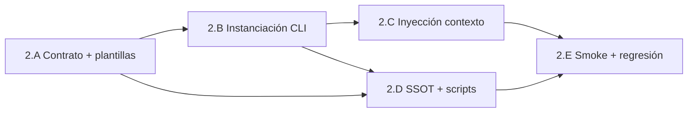

# Plan — Fase 2 · Workspaces dinámicos

## Secuencia de implementación

| Paso | Actividad | Touchpoints principales | Salida / gate |
|------|-----------|-------------------------|---------------|
| **2.A** | Bump `process-contract` v1.4.0; declarar `workspace_template` en procesos forja prioritarios | `process-contract.md`, `feature.md`, `bug-fix.md`, `refactorization.md`, `event-creator.md`, `delivery-close-cycle.md` | Contrato + ≥5 procesos con plantilla |
| **2.B** | Helpers resolución Cúmulo; `materialize_workspace`; hook pre-ejecución en CLI | `execute_process_capsules.py`, nuevo helper opcional `workspace_utils.py` | AC2.2 |
| **2.C** | Inyectar `workspace_path` + `execution_id` en estado/contexto de fases con agentes | `execute_process_capsules.py`, instrucciones delegación agente | AC2.3 |
| **2.D** | `paths.workspacesRoot` en SSOT; deprecar alias; migrar `eda_bus_utils`, `route_domain_event_core`; alinear normas | `cumulo.paths.json`, `paths-via-cumulo.md`, `eda_bus_utils.py`, `route_domain_event_core.py` | PBI §2.D |
| **2.E** | Smoke no-SW; `.gitignore`; regresión lab existente; barrido `rg featurePath` en Core | `workspace-smoke` o lab doc, `execution.md` | AC2.1 |
| **Cierre** | Argos → `validacion.md` APTO; `pbi_archived: false` | `persist_ref/validacion.md` | Feature Fase 2 cerrada; abrir Fase 3 |

## Orden de dependencias internas

> **2.A antes de 2.B:** el CLI necesita plantilla contractual para parsear; procesos sin plantilla fallan explícitamente post-bump.

## Checklist por paso

### 2.A — Contrato de procesos

- [ ] `process-contract.md` → `contract_version: "1.4.0"` + § Workspace operativo
- [ ] `workspace_template` en frontmatter de: `feature`, `bug-fix`, `refactorization`, `event-creator`, `delivery-close-cycle`
- [ ] Barrido resto `SddIA/process/*.md` — plantilla o entrada en lista diferida justificada
- [ ] Actualizar `contract:` en procesos tocados → `process-contract v1.4.0`

### 2.B — Instanciación en Aduana

- [ ] `load_paths_config` / `resolve_workspaces_root`
- [ ] `load_workspace_template(process_def)` con error claro si ausente
- [ ] `execution_id = str(uuid4())` al inicio de ejecución de proceso
- [ ] `materialize_workspace` — `mkdir(parents=True, exist_ok=True)`
- [ ] Estado: `state["workspace_path"]`, `state["execution_id"]`
- [ ] Integrar en flujo principal antes de primera fase no-git

### 2.C — Inyección de contexto

- [ ] Propagar `workspace_path` a `process_inputs` en delegaciones `agent:*`
- [ ] Documentar en contrato agente obrero: prohibición rutas fuera de workspace
- [ ] Verificar `run_workspace_init` mantiene `persist_ref` documental separado
- [ ] Preparar campo `workspace_path` para futura emisión ECST (Fase 3) — comentario/TODO acotado

### 2.D — Purga SSOT y scripts

- [ ] `cumulo.paths.json` v1.1.0: bloque `paths.workspacesRoot`
- [ ] Alias deprecated `featurePath` / `fixPath` documentados
- [ ] `execute_process_capsules`: sustituir `default_docs` literal por resolución Cúmulo
- [ ] `eda_bus_utils.infer_persist_ref_from_branch`: prefijos vía helper
- [ ] `route_domain_event_core.py`: eliminar fallback hardcodeado `docs/features/remove-cli-legacy-compat`
- [ ] `paths-via-cumulo.md`, `entidades-dominio-ecosistema-sddia.md`, `touchpoints-ia.md`
- [ ] `.gitignore`: `.SddIA/workspaces/`

### 2.E — Smoke y regresión

- [ ] Proceso smoke o invocación lab documentada (AC2.1)
- [ ] Dos ejecuciones consecutivas → `execution_id` distintos, carpetas distintas (AC2.2)
- [ ] Captura en `execution.md`: contexto agente sin rutas absolutas repo (AC2.3)
- [ ] Ejecutar tests QA existentes (`test_eda_bus_v3plus.py`, hooks si aplica)
- [ ] `rg` Core: cero literales nuevos `docs/features` en runtime orquestación (salvo convivencia documentada)

## Criterios de aceptación (PBI)

| AC | Criterio | Paso verificador |
|----|----------|------------------|
| **AC2.1** | Proceso no-SW ejecuta sin error de ruta | 2.E |
| **AC2.2** | CLI crea carpeta con UUID único por ejecución | 2.B + 2.E |
| **AC2.3** | Agentes limitados al workspace inyectado | 2.C + 2.E |
| **§2.D** | SSOT + scripts migrados | 2.D |

## Riesgos y mitigación

| Riesgo | Mitigación |
|--------|------------|
| Romper features en curso con `persist_ref` en `docs/features/` | Convivencia D2.5: no mover documentación; solo añadir workspace operativo |
| Procesos sin `workspace_template` tras bump | Lista en 2.A; CI/lab falla rápido con mensaje contractual |
| Colisión paths Windows vs POSIX | `pathlib.Path` everywhere; tests en entorno actual |
| Confusión workspace vs persist_ref | Documentar en contrato y normas; dos campos en estado CLI |
| Scope creep hacia Fase 3 (telemetría) | Checklist explícito fuera de alcance en spec.md §11 |

## Post-Fase 2

Tras merge de `feat/telemetria-reactiva-eda-fase2` con `validacion.md` APTO:

1. Actualizar PBI maestro `active_phase: 3` al abrir `telemetria-reactiva-eda-fase3`.
2. Fase 3 puede cablear Peaje Termodinámico sobre workspace ya instanciado.
3. No archivar PBI maestro hasta Done global (Fases 0–6).

## Estado de este entregable

**Ejecución completada** (2026-05-27). Pendiente: push + `delivery-close-cycle` (PR).
