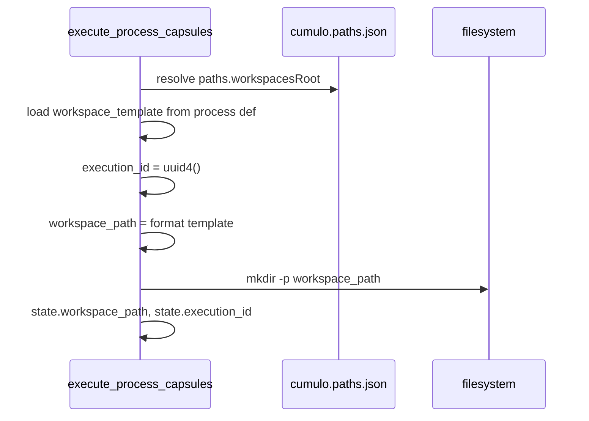

# Especificación técnica — Fase 2 · Workspaces dinámicos

## 1. Contexto

Estado actual (post Fase 1):

- **Persistencia de tareas** acoplada a software: scripts QA usan literales `docs/features` / `docs/fixes` (`execute_process_capsules.py` L1183, `eda_bus_utils.infer_persist_ref_from_branch`).
- **`cumulo.paths.json`** no declara `paths.featurePath`, `paths.fixPath` ni `paths.workspacesRoot` (H16); normas sí citan las dos primeras.
- **Ningún proceso** en `SddIA/process/*.md` declara `workspace_template` (H17).
- **CLI** no materializa carpetas bajo `.SddIA/workspaces/` ni inyecta coordenada espacial en contexto de agente.
- **Genoma fractal** (Fase 1) listo; runtime EDA sigue V3+ monolítico — sin cambio en esta fase.

Objetivo: modelo universal de territorio operativo impermanente, desacoplado del sesgo feature/fix, sin romper features en curso que usan `persist_ref` documental.

## 2. Topología objetivo

```text
.SddIA/
└── workspaces/
    └── {process_name}/
        └── {execution_id}/
            └── … artefactos operativos de la ejecución …

docs/                          # convivencia documental (directories.documentation)
├── features/{task}/           # persist_ref de features (sin cambio inmediato)
└── fixes/{task}/
```

Resolución:

```text
workspace_path = resolve(paths.workspacesRoot) / template(process_name, execution_id)
persist_ref    = input explícito | infer_persist_ref_from_branch (documentación)
```

## 3. SSOT — `cumulo.paths.json`

### 3.1 Claves nuevas

```json
"paths": {
  "workspacesRoot": ".SddIA/workspaces/",
  "featurePath": {
    "_deprecated": "Use paths.workspacesRoot + workspace_template; alias docs/features",
    "resolve": "{directories.documentation}/features"
  },
  "fixPath": {
    "_deprecated": "Use paths.workspacesRoot + workspace_template; alias docs/fixes",
    "resolve": "{directories.documentation}/fixes"
  }
}
```

> **Nota de implementación:** si el esquema actual no admite objetos anidados en `paths.*`, usar claves planas documentadas en comentario de migración y resolver alias en `cumulo.instructions.json` / helper Python. Prioridad: **`paths.workspacesRoot` string** operativo en Fase 2.

### 3.2 Bump de versión

`version`: `1.0.0` → `1.1.0` (nuevo bloque `paths`).

## 4. Contrato de procesos — `process-contract.md` v1.4.0

### 4.1 Campo nuevo en frontmatter de `{name}.md`

| Campo | Obligatorio | Descripción |
|-------|:-----------:|-------------|
| `workspace_template` | Sí (v1.4.0+) | Plantilla relativa bajo `paths.workspacesRoot`. Placeholders: `{process_name}`, `{execution_id}` |

Ejemplo:

```yaml
workspace_template: ".SddIA/workspaces/{process_name}/{execution_id}/"
```

Reglas:

- Plantilla **relativa al repo root** o relativa a `workspacesRoot` — documentar convención única en contrato (recomendado: path completo desde repo root como en PBI §2.A).
- Prohibido placeholders adicionales sin bump de contrato.
- Procesos **creators** (`event-creator`, `tool-creator`, …) deben declarar plantilla en la misma PR o lista de excepciones temporales en `clarify.md` D2.4.

### 4.2 Sección nueva en cuerpo del contrato

- **§ Workspace operativo** — instanciación CLI, Ceguera Espacial, relación `workspace_path` vs `persist_ref`.

## 5. Instanciación CLI (`execute_process_capsules.py`)

### 5.1 Flujo (nuevo — pre-primera-fase)



### 5.2 Funciones nuevas (módulo o inline)

| Función | Responsabilidad |
|---------|-----------------|
| `load_paths_config(repo)` | Cargar `cumulo.paths.json` (+ merge local si existe) |
| `resolve_workspaces_root(repo, paths)` | Devolver `Path` absoluto de `paths.workspacesRoot` |
| `load_workspace_template(process_def)` | Leer frontmatter `workspace_template`; error si ausente post-v1.4.0 |
| `materialize_workspace(repo, process_name, template, execution_id)` | Crear directorio; retornar path absoluto |
| `resolve_cumulo_path(repo, key)` | Helper genérico para deprecar literales `docs/features` |

### 5.3 Cambios en `run_workspace_init`

- Tras crear `persist_dir` documental, **no** sustituir por workspace; mantener ambos.
- Registrar en `state` / reporte de fase: `workspace_path`, `execution_id`.

### 5.4 Cambios en inferencia de rutas

| Ubicación | Antes | Después |
|-----------|-------|---------|
| `default_docs = "docs/features"` | Literal | `resolve_cumulo_path("paths.featurePath")` o `{documentation}/features` |
| `infer_persist_ref_from_branch` | Hardcoded prefix | Usar helper Cúmulo; **mantener** semántica feat/fix para `persist_ref` documental |

### 5.5 Inyección a agentes (AC2.3)

Al construir contexto de fase con `delegates_to: agent:*`:

- Inyectar `workspace_path` en `process_inputs` visible al agente.
- Plantilla de instrucción: «Opera exclusivamente en `{workspace_path}`; no accedas a otras rutas del repositorio salvo lectura de contratos Core vía Cúmulo».

Emisión ECST con campo en payload → **Fase 3**; Fase 2 valida cableado en estado CLI + smoke documentado en `execution.md`.

## 6. Procesos a actualizar (mínimo)

| Proceso | `workspace_template` | Notas |
|---------|---------------------|-------|
| `feature` | `.SddIA/workspaces/{process_name}/{execution_id}/` | Flujo principal |
| `bug-fix` | idem | `process_name` = `bug-fix` |
| `refactorization` | idem | |
| `event-creator` | `.SddIA/workspaces/{process_name}/{execution_id}/` | Forja ECST en workspace; output final sigue yendo a `directories.events/{family}/` |
| `delivery-close-cycle` | idem | Cierre PR |

Procesos restantes en `SddIA/process/`: añadir plantilla en la misma feature **o** documentar en `implementation.md` lista diferida con justificación (objetivo: 100% procesos forja en Fase 2).

## 7. Normas a alinear

| Archivo | Cambio |
|---------|--------|
| `SddIA/norms/paths-via-cumulo.md` | Añadir `paths.workspacesRoot`; marcar `featurePath`/`fixPath` deprecated |
| `SddIA/norms/entidades-dominio-ecosistema-sddia.md` | § documentación de tarea → workspace operativo + persist_ref documental |
| `SddIA/norms/touchpoints-ia.md` | Referencia workspaces en orquestación |

## 8. Scripts QA adicionales

| Script | Acción |
|--------|--------|
| `eda_bus_utils.py` | `infer_persist_ref_from_branch` usa resolución Cúmulo para prefijos |
| `route_domain_event_core.py` | Fallback `persist_ref` hardcodeado → resolver vía branch + Cúmulo |
| `verify-task-closure.py` | Sin cambio funcional obligatorio; revisar si valida paths literales |

## 9. Smoke AC2.1 — proceso no ligado a SW

Opción A (preferida): extender lab `execute-process` con proceso ficticio `workspace-smoke` (markdown mínimo en `SddIA/process/workspace-smoke.md`) que solo verifica existencia de `workspace_path`.

Opción B: documentar en `execution.md` invocación manual con `process_name: feature` y `persist_ref` apuntando a carpeta de prueba bajo `docs/features/workspace-smoke-fase2/`.

Criterio: ejecución completa sin `FileNotFoundError` por rutas feat/fix hardcodeadas.

## 10. `.gitignore`

Añadir (si ausente):

```gitignore
.SddIA/workspaces/
```

## 11. Fuera de alcance (explícito)

- Peaje Termodinámico, emisión telemetría runtime, `./.events/telemetry/`.
- Split `event-subscriptions.json`.
- Cambio de envelope ECST con `workspace_path` en bus.
- Eliminación física de `docs/features/` o migración masiva de tareas abiertas.
- GC / TTL de workspaces.
- Actualización `README.md` raíz (Fase 6).

## 12. Criterios de aceptación (trazabilidad)

| AC PBI | Verificación |
|--------|--------------|
| AC2.1 | Smoke §9 sin errores de ruta |
| AC2.2 | `execution.md`: log mkdir + UUID único por invocación |
| AC2.3 | Contexto agente incluye `workspace_path`; prompts sin rutas absolutas repo |
| §2.D | `cumulo.paths.json` + scripts migrados; normas actualizadas |
