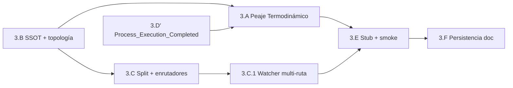

# Plan — Fase 3 · Aduana Universal + runtime fractal

## Secuencia de implementación

| Paso | Actividad | Touchpoints principales | Salida / gate |
|------|-----------|-------------------------|---------------|
| **3.A** | Peaje Termodinámico: cronómetro, `asset_id`, `write_fractal_event`, emisión `Raw_Execution_Finished` | `execute_process_capsules.py`, `eda_bus_utils.py` | AC3.1 |
| **3.B** | Bloque `eda_fractal` en SSOT; `ensure_fractal_bus_topology`; `.gitignore` | `cumulo.paths.json`, `eda_bus_utils.py` | Infra fractal |
| **3.D′** | Forjar `Process_Execution_Completed` en genoma orchestration | `event-creator`, `SddIA/events/orchestration/` | Pre-requisito 3.A orquestación |
| **3.C** | Split suscripciones; procesos `route-telemetry`, `route-orchestration`, `route-domain`; núcleo compartido | `SddIA/core/event-*-subscriptions.json`, `SddIA/process/route-*.md`, `route_*_core.py` | AC3.2 |
| **3.C.1** | Evolucionar `event-watcher.py` multi-ruta; coexistencia `pending/` | `event-watcher.py` | D0.2, D0.4 |
| **3.E** | Proceso `telemetry-batch-stub`; suscripción Radamanto; smoke `test_eda_fractal_bus.py` | `telemetry-batch-stub.md`, tests QA | AC3.3, AC3.4 |
| **3.F** | Documentar persistencia encapsulada; propagación ECST `workspace_path` | `touchpoints-ia.md`, `execution.md` smoke | PBI §3.F |
| **Cierre** | Argos → `validacion.md` APTO; `pbi_archived: false` | `persist_ref/validacion.md` | Feature Fase 3 cerrada; abrir Fase 4 |

## Orden de dependencias internas

> **3.B antes de 3.A:** `write_fractal_event` necesita rutas SSOT resueltas.  
> **3.D′ antes de emisión orquestación:** la Clase debe existir en genoma antes de instanciar.

## Checklist por paso

### 3.B — Topología runtime SSOT

- [ ] `cumulo.paths.json` → v1.2.0 + bloque `eda_fractal`
- [ ] `load_eda_fractal()` / `ensure_fractal_bus_topology()` en `eda_bus_utils.py`
- [ ] `.gitignore`: `.events/telemetry/`, `orchestration/`, `domain/`
- [ ] Plantilla `eda-instance-events/README.md`: mencionar rutas fractales

### 3.D′ — Genoma orchestration

- [ ] Ejecutar `event-creator` → `Process_Execution_Completed` en `orchestration/`
- [ ] Actualizar `orchestration/index.md`
- [ ] `eda-coverage.json` upsert si aplica gate genómico

### 3.A — Peaje Termodinámico

- [ ] `asset_id = uuid4()` al inicio ejecución; persistir en `state`
- [ ] Cronómetro `time.monotonic()` around fase principal
- [ ] `build_raw_execution_finished()` según Clase ECST
- [ ] `write_fractal_event(..., family="telemetry")` al finalizar **siempre**
- [ ] Si `success`: `write_fractal_event(Process_Execution_Completed, family="orchestration")`
- [ ] Fail-soft si escritura bus falla (log, no abortar CLI)
- [ ] Incluir `workspace_path`, `execution_id` en payload cuando disponibles

### 3.C — Split suscripciones y enrutadores

- [ ] Crear `event-telemetry-subscriptions.json` (Radamanto → stub)
- [ ] Crear `event-orchestration-subscriptions.json`
- [ ] Migrar contenido monolito → `event-domain-subscriptions.json`
- [ ] Deprecar/redirect `event-subscriptions.json` → apuntar a domain o eliminar con compat shim
- [ ] Procesos MD: `route-telemetry.md`, `route-orchestration.md`, `route-domain.md`
- [ ] Refactor `route_event_core.py` compartido desde `route_domain_event_core.py`
- [ ] Handlers en `execute_process_capsules.py`
- [ ] Actualizar `SddIA/process/index.md`

### 3.C.1 — Watcher multi-ruta

- [ ] `list_watch_roots()` con mapeo ruta → proceso
- [ ] Despacho `route-telemetry` / `route-orchestration` / `route-domain` según origen
- [ ] Mantener `pending/` → `route-domain-event` sin regresión
- [ ] Flag `SDDIA_LAB_WATCH_FRACTAL` para tests acotados
- [ ] Verificar `run-iota-ci-smoke.py` verde

### 3.E — Stub Radamanto y smoke

- [ ] Proceso `telemetry-batch-stub.md` (lab no-op + purga)
- [ ] Wire suscripción `Raw_Execution_Finished` → stub
- [ ] Test `test_eda_fractal_bus.py`: ejecutar proceso mínimo → telemetría → stub → purga
- [ ] Assert AC3.3: no cross-contamination entre carpetas fractales

### 3.F — Persistencia encapsulada (documental)

- [ ] Verificar propagación `workspace_path` en delegaciones agente (herencia F2)
- [ ] Actualizar `touchpoints-ia.md` § orquestación ECST si procede
- [ ] Smoke en `execution.md`: delegación `filesystem-manager` sobre workspace

## Criterios de aceptación (PBI)

| AC | Criterio | Paso verificador |
|----|----------|------------------|
| **AC3.1** | Toda ejecución CLI emite `Raw_Execution_Finished` en `./.events/telemetry/` | 3.A + 3.E |
| **AC3.2** | Tres suscripciones + tres enrutadores operativos | 3.C |
| **AC3.3** | Familias no contaminan rutas ajenas | 3.E |
| **AC3.4** | Suscripción telemetría cableada; Radamanto stub operativo | 3.C + 3.E |

## Riesgos y mitigación

| Riesgo | Mitigación |
|--------|------------|
| Romper pipeline V3+ / CI IOTA | No tocar lógica fan-out legacy; tests `test_eda_bus_v3plus` + `run-iota-ci-smoke` obligatorios |
| Duplicación masiva en enrutadores | Extraer `route_event_core.py` compartido |
| Peaje bloquea ejecución en error de disco | Fail-soft documentado (D3.9) |
| Orquestación sin Clase ECST | Paso 3.D′ antes de emisión |
| Scope creep hacia Radamanto real | Stub explícito; AC3.4 = cableado only |
| Confusión `route-domain` vs `route-domain-event` | Documentar: fractal vs legacy pending |

## Post-Fase 3

Tras merge de `feat/telemetria-reactiva-eda-fase3` con `validacion.md` APTO:

1. Actualizar PBI maestro `active_phase: 4` al abrir `telemetria-reactiva-eda-fase4`.
2. Fase 4 sustituye `telemetry-batch-stub` por agente Radamanto real.
3. No archivar PBI maestro hasta Done global (Fases 0–6).

## Estado de este entregable

**Ejecución completada** (2026-05-27). Pendiente: push + `delivery-close-cycle` (PR).
