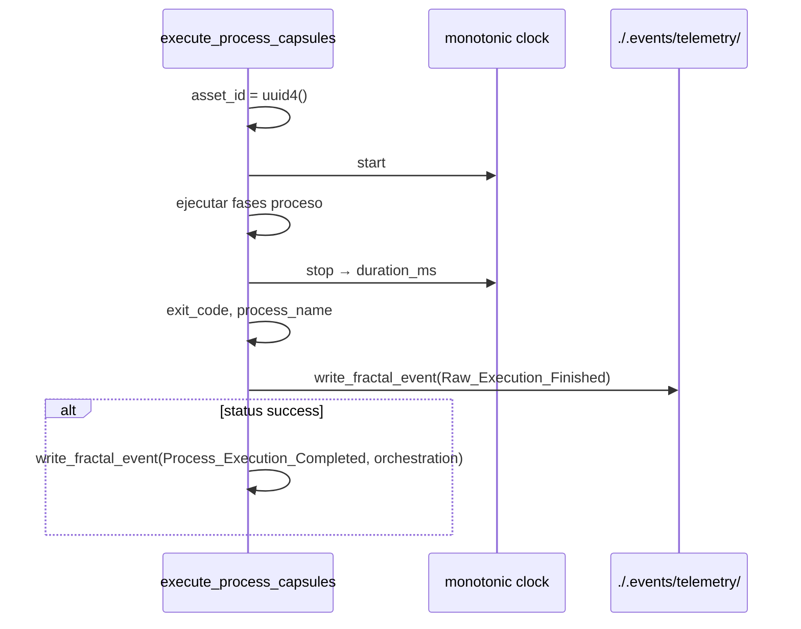

# Especificación técnica — Fase 3 · Aduana Universal + runtime fractal

## 1. Contexto

Estado actual (post Fases 1–2):

- **Genoma fractal** operativo: `SddIA/events/{telemetry,orchestration,domain}/`; `Raw_Execution_Finished` catalogado en `telemetry/`.
- **Workspaces** instanciados por CLI; `workspace_path` y `execution_id` en estado de ejecución.
- **Runtime monolítico V3+:** `./.events/pending/` → `route-domain-event` → suscriptores vía único `event-subscriptions.json`.
- **CLI** (`execute_process_capsules.py`): `write_pending_event()` escribe siempre en `eda_bus.pending`; **sin cronómetro** ni telemetría.
- **Watcher** (`event-watcher.py`): solo observa `pending/`.
- **Enrutadores dedicados** `route-telemetry` / `route-orchestration` / `route-domain`: **inexistentes**.
- **Catálogo orchestration:** vacío — requiere forja `Process_Execution_Completed` (D3.6).

Objetivo: materializar interceptación CLI (Peaje Termodinámico), bus runtime fractal y enrutadores especializados sin big-bang sobre V3+.

## 2. Topología objetivo

```text
.events/
├── pending/              # V3+ legacy (dominio PR, Domain_Entity_*, Kaizen) — D0.2
├── processing/           # V3+ estados
├── processed/
├── dead-letter/
├── telemetry/            # NUEVO — Raw_Execution_Finished
├── orchestration/        # NUEVO — Process_Execution_Completed, futuro Artifact_Validated
└── domain/               # NUEVO — instancias fractales (coexiste con pending)
```

Simetría:

```text
SddIA/events/telemetry/     ↔  ./.events/telemetry/
SddIA/events/orchestration/   ↔  ./.events/orchestration/
SddIA/events/domain/          ↔  ./.events/domain/
```

## 3. SSOT — `cumulo.paths.json`

### 3.1 Bump de versión

`version`: `1.1.0` → **`1.2.0`**

### 3.2 Bloque `eda_fractal` (nuevo)

```json
"eda_fractal": {
  "telemetry": "./.events/telemetry",
  "orchestration": "./.events/orchestration",
  "domain": "./.events/domain",
  "telemetry_subscriptions": "SddIA/core/event-telemetry-subscriptions.json",
  "orchestration_subscriptions": "SddIA/core/event-orchestration-subscriptions.json",
  "domain_subscriptions": "SddIA/core/event-domain-subscriptions.json"
}
```

### 3.3 Bloque `eda_bus` (sin cambio funcional)

Mantener `pending`, `processing`, `processed`, `dead_letter`. Actualizar comentario/descripción: `subscriptions` apunta a **`event-domain-subscriptions.json`** (contenido migrado del monolito).

## 4. Peaje Termodinámico — §3.A

### 4.1 Flujo CLI



### 4.2 Funciones nuevas (`execute_process_capsules.py` o `eda_bus_utils.py`)

| Función | Responsabilidad |
|---------|-----------------|
| `load_eda_fractal(repo)` | Leer bloque `eda_fractal` de SSOT |
| `ensure_fractal_bus_topology(repo)` | `mkdir` idempotente de `telemetry/`, `orchestration/`, `domain/` |
| `write_fractal_event(repo, event, family)` | Escribir JSON en ruta fractal; validar `event_family` coherente |
| `build_raw_execution_finished(state, exit_code, duration_ms)` | Construir instancia ECST telemetría |
| `build_process_execution_completed(state, status)` | Construir instancia ECST orquestación |
| `run_thermodynamic_toll(repo, state, exit_code, duration_ms, success)` | Orquestar emisiones post-ejecución |

### 4.3 Punto de enganche

Al final de `run_process()` / handler principal de `execute-process`, **siempre** invocar `run_thermodynamic_toll` (incluso en fallo — telemetría es ruido físico, no condicionada a éxito).

### 4.4 Restricciones

- Solo CLI emite familia `telemetry` (regla de oro PBI § Fase 1).
- `telemetry_receipt` opcional — **no parsear stdout** en Fase 3 (reservado Fase 5).
- No bloquear ciclo de vida del CLI si falla escritura telemetría — log + testigo en `state` (fail-soft documentado).

## 5. Split suscripciones — §3.C

### 5.1 Archivos

| Archivo | Eventos iniciales | Enrutador |
|---------|-------------------|-----------|
| `event-telemetry-subscriptions.json` | `Raw_Execution_Finished` | `route-telemetry` |
| `event-orchestration-subscriptions.json` | `Process_Execution_Completed` | `route-orchestration` |
| `event-domain-subscriptions.json` | Contenido actual de `event-subscriptions.json` | `route-domain` + legacy `route-domain-event` sobre `pending/` |

### 5.2 Suscripción telemetría (Radamanto stub — AC3.4)

```json
"Raw_Execution_Finished": [
  {
    "agent": "radamanto",
    "process": "telemetry-batch-stub",
    "intent": "Consumo batch stub hasta Fase 4; purga post-lectura."
  }
]
```

### 5.3 Proceso `telemetry-batch-stub`

Proceso mínimo lab: leer evento, registrar en log/state, eliminar JSON fuente (simula purga Radamanto). Sin DLT, sin umbrales.

## 6. Procesos enrutadores — §3.C

### 6.1 Patrón común

Clonar arquitectura de `route-domain-event.md` + `route_domain_event_core.py`:

| Proceso | Input principal | SSOT suscripciones | Ruta observada |
|---------|-----------------|---------------------|----------------|
| `route-telemetry` | `event_file_path` en `eda_fractal.telemetry` | `event-telemetry-subscriptions.json` | `./.events/telemetry/` |
| `route-orchestration` | idem | `event-orchestration-subscriptions.json` | `./.events/orchestration/` |
| `route-domain` | idem | `event-domain-subscriptions.json` | `./.events/domain/` |
| `route-domain-event` | (existente) | `event-domain-subscriptions.json` | `./.events/pending/` (legacy) |

### 6.2 Refactor núcleo

Extraer módulo compartido `route_event_core.py`:

- `route_event(repo, event_path, subscriptions_path, bus_mode: "v3plus" | "fractal")`
- Reutilizar fan-out, testigos y `dispatch_subscriber` de `route_domain_event_core.py`

### 6.3 Handlers lab

Registrar en `execute_process_capsules.py` (patrón existente L2085+):

- `route-telemetry` → `route_telemetry_core.route_telemetry()`
- `route-orchestration` → `route_orchestration_core.route_orchestration()`
- `route-domain` → `route_domain_fractal_core.route_domain_fractal()`

## 7. Migración `event-watcher` — §3.C.1

### 7.1 Rutas observadas

| Ruta | Proceso despachado |
|------|-------------------|
| `./.events/pending/` | `route-domain-event` (sin cambio) |
| `./.events/telemetry/` | `route-telemetry` |
| `./.events/orchestration/` | `route-orchestration` |
| `./.events/domain/` | `route-domain` |

### 7.2 Implementación

- Función `list_watch_roots(repo) -> list[tuple[Path, process_name]]`
- Poll unificado; `--event-file-path` acepta cualquier ruta fractal o legacy
- Flag lab `SDDIA_LAB_WATCH_FRACTAL=0` para desactivar rutas nuevas en regresión acotada

## 8. Clase ECST orquestación — §3.A / D3.6

Forjar vía `event-creator`:

| Campo | Valor |
|-------|-------|
| `name` | `process-execution-completed` |
| `event_type` | `Process_Execution_Completed` |
| `event_family` | `orchestration` |
| Payload REQUIRED | `process_name`, `asset_id`, `workspace_path`, `status` |
| Payload OPTIONAL | `execution_id`, `phase_count`, `persist_ref` |

Actualizar `SddIA/events/orchestration/index.md`.

## 9. Eventos dominio — §3.D

Sin migración física de instancias desde `pending/` a `domain/` en esta fase. Verificar:

- Las 7 Clases en `SddIA/events/domain/` incluyen `event_family: domain` en frontmatter.
- Nuevas emisiones fractales (p. ej. futuras desde `emit-domain-mutation` evolucionado) usan `./.events/domain/` — **opcional** en Fase 3 si implica riesgo; documentar como Kaizen si se difiere.

## 10. Persistencia encapsulada — §3.F

Flujo normativo (documentación + smoke):

1. Orquestador inyecta `workspace_path` en contexto.
2. Agente computa mutación en memoria.
3. Agente invoca `filesystem-manager` vía `capsule-json-io`.
4. Artefacto queda en workspace hasta validación Argos.

**Touchpoint Tekton:** verificar que delegaciones `agent:*` propagan `workspace_path` (herencia Fase 2) y añadir nota en `touchpoints-ia.md` si falta referencia al patrón ECST.

## 11. Scripts QA y regresión

| Script | Acción |
|--------|--------|
| `test_eda_bus_v3plus.py` | Mantener verde — pipeline legacy intacto |
| `run-iota-ci-smoke.py` | Sin regresión en `PullRequest_*` / `Domain_Entity_*` |
| Nuevo `test_eda_fractal_bus.py` | Smoke: Peaje → telemetría escrita → stub consume → archivo purgado |
| `eda_bus_utils.py` | `ensure_fractal_bus_topology`, helpers fractales |

## 12. `.gitignore`

Añadir si ausente:

```gitignore
.events/telemetry/
.events/orchestration/
.events/domain/
```

(Mantener `.events/pending/` etc. según política actual del repo.)

## 13. Fuera de alcance (explícito)

- Agente Radamanto real, umbrales, DLT, `Tool_Degraded` (Fase 4).
- `telemetry_receipt` / cumplimiento tokens (Fase 5).
- Retirada de `event-subscriptions.json` monolítico del historial git (puede quedar como redirect deprecated).
- Migración masiva instancias `pending/` → `domain/`.
- `README.md` raíz (Fase 6).

## 14. Criterios de aceptación (trazabilidad)

| AC PBI | Verificación |
|--------|--------------|
| AC3.1 | Smoke lab: toda ejecución `execute-process` emite JSON en `./.events/telemetry/` |
| AC3.2 | Tres archivos suscripción + tres procesos enrutadores registrados en `SddIA/process/index.md` |
| AC3.3 | Assert tests: telemetría no aparece en `orchestration/` ni `domain/`; dominio legacy no en `telemetry/` |
| AC3.4 | `event-telemetry-subscriptions.json` referencia `radamanto` + `telemetry-batch-stub`; stub ejecuta en lab |
