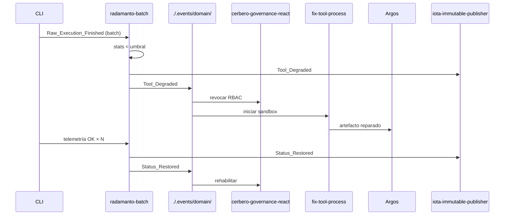

# Clarificación — Fase 4

## Precondición (gate Fase 3)

- **Fase 3** cerrada con `validacion.md` APTO (PR #54): Peaje Termodinámico, bus fractal, enrutadores `route-*`, watcher multi-ruta, stub `telemetry-batch-stub` cableado en `event-telemetry-subscriptions.json`.
- `Raw_Execution_Finished` operativo en `./.events/telemetry/` con payload `asset_id`, `exit_code`, `duration_ms`, `process_name`.
- No se reabren Fases 1–3 salvo hallazgo bloqueante durante Tekton.

## Decisiones heredadas (aplican en Fase 4)

| ID | Resolución | Uso en Fase 4 |
|----|------------|---------------|
| D0.1 | Handoff DLT gradual Cúmulo → Radamanto | Radamanto sella gobernanza herramientas; Cúmulo mantiene PR/ECST |
| D0.2 | Coexistencia V3+ + bus fractal | Eventos Self-Healing en `./.events/domain/`; legacy `pending/` intacto |
| D3.7 | Stub telemetría hasta agente real | Sustituir proceso destino en suscripción; deprecar stub |
| Axioma §0.3 | Radamanto no mide; CLI emite telemetría | AC4.2 — prohibición invocación shell/cronómetro en agente |
| PBI §3.E | Argos = materia; Radamanto = actuario | Sin solapamiento de jurisdicción en pull-request-review |

## Decisiones cerradas — Fase 4

| ID | Pregunta | Resolución |
|----|----------|------------|
| D4.1 | ¿Stub vs agente real? | Sustituir `telemetry-batch-stub` por proceso **`radamanto-batch`** invocado vía suscripción telemetría; el agente Radamanto es la entidad lógica; la lógica batch vive en handler lab + `radamanto.instructions.json` |
| D4.2 | ¿Alcance exclusividad DLT? | Radamanto es **único suscriptor** de `iota-immutable-publisher` para eventos **`Tool_Degraded`**, **`Status_Restored`**, **`Tool_Deprecated`**. Cúmulo **no pierde** suscripción en `PullRequest_*` / `Domain_Entity_*` |
| D4.3 | ¿Dónde configurar umbrales? | Bloque **`radamanto`** en `cumulo.paths.json` v1.3.0 (referencia a `SddIA/agents/radamanto.thresholds.json`) + defaults en `radamanto.instructions.json` |
| D4.4 | ¿Dimensión estadística? | Agregación por **`target_entity_id`** derivado del payload telemetría: campo nuevo opcional `capsule_id` (skill/tool/action invocada); fallback `process_name` hasta enriquecimiento Fase 5 |
| D4.5 | ¿Tamaño de lote batch? | `batch_min_events` default **10**; evaluación también por **caída abrupta** (tasa éxito ventana deslizante < umbral con ≥3 muestras) |
| D4.6 | ¿Persistencia acumulador? | Estado local `.SddIA/radamanto/stats.json` (gitignored); idempotencia por `asset_id` consumido |
| D4.7 | ¿Proceso reparación? | Forjar **`fix-tool-process`** (proceso dedicado Self-Healing): fases Dédalo diseño + Tekton ejecución en sandbox; suscrito a `Tool_Degraded` |
| D4.8 | ¿Sandbox físico? | Ruta `.SddIA/sandbox/{entity_id}/{recovery_attempt}/` — **único** destino writable para Dédalo/Tekton durante reparación; prohibido mutar `directories.tools` / `directories.skills` |
| D4.9 | ¿Cerbero ante degradación? | Nuevo handler **`cerbero-governance-react`** (proceso lab) suscrito a dominio: mantiene lista revocación en `.SddIA/cerbero/revoked_entities.json`; Cerbero runtime consulta lista en gate existente |
| D4.10 | ¿Redención? | Tras N telemetrías exitosas post-reparación (default **3**) sobre entidad en cuarentena → Radamanto emite `Status_Restored` + sellado DLT |
| D4.11 | ¿Muerte definitiva? | `max_recovery_attempts` default **3** por entidad; superado → `Tool_Deprecated` + revocación permanente Cerbero + sellado DLT obsolescencia |
| D4.12 | ¿Ventana CI dual? | Actualizar smoke `e1-iota-ci` / `test_eda_bus_v3plus`: witness Cúmulo intacto + nuevo test Radamanto sellado herramienta con flag lab `SDDIA_LAB_RADAMANTO_DLT=1` |

## Umbrales deterministas (v1)

| Regla | Condición | Acción |
|-------|-----------|--------|
| **R4.1 Éxito** | `success_rate < 0.85` en ventana ≥ `batch_min_events` | Emitir `Tool_Degraded` |
| **R4.2 Latencia** | `avg_duration_ms > latency_ms_p95_threshold` (default 30000) con ≥5 muestras | Emitir `Tool_Degraded` (motivo `latency`) |
| **R4.3 Redención** | Entidad degradada + ≥ `redemption_success_count` (3) ejecuciones `exit_code=0` consecutivas | Emitir `Status_Restored` |
| **R4.4 Muerte** | `recovery_attempts >= max_recovery_attempts` tras fallo Argos o telemetría post-fix | Emitir `Tool_Deprecated` |

## Payload telemetría enriquecido (Kaizen acotado Fase 4)

| Campo | Origen | Obligatorio F4 |
|-------|--------|:--------------:|
| `asset_id` | CLI | Sí (idempotencia) |
| `exit_code` | CLI | Sí |
| `duration_ms` | CLI | Sí |
| `process_name` | CLI | Sí |
| `capsule_id` | CLI — última cápsula delegada en cadena | Recomendado (fallback agregación) |
| `workspace_path` | Herencia F2 | Opcional |

## Secuencia Self-Healing (referencia)

## Referencias

- Gate Fase 0: `impact-analysis.md` (H10–H12, D0.1)
- Gate Fase 3: `docs/features/telemetria-reactiva-eda-fase3/validacion.md`
- PBI: § Fase 4 (4.0–4.E)
- Origen consolidado: `docs/todos/tmp/NuevoAgenteCertificador.md`, `Telemetría Reactiva SddIA_V2.md` § IV
