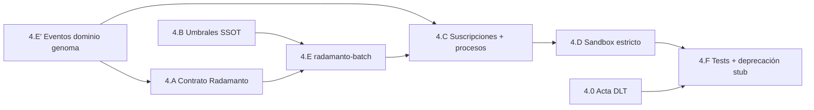

# Plan — Fase 4 · Radamanto + bucle Self-Healing

## Secuencia de implementación

| Paso | Actividad | Touchpoints principales | Salida / gate |
|------|-----------|-------------------------|---------------|
| **4.0** | Acta handoff DLT D0.1; plan ventana dual CI | `dlt-handoff-acta.md`, notas `execution.md` | Documentación transición |
| **4.E′** | Forjar Clases dominio `Tool_Degraded`, `Status_Restored`, `Tool_Deprecated` | `event-creator`, `SddIA/events/domain/` | Pre-requisito emisiones |
| **4.A** | Contrato `radamanto.md`, `radamanto.instructions.json`, índice agentes | `SddIA/agents/` | AC4.1, AC4.2 |
| **4.B** | `radamanto.thresholds.json`; bloque `radamanto` en SSOT v1.3.0; `.gitignore` | `cumulo.paths.json`, `eda_bus_utils.py` | AC4.3 |
| **4.E** | Proceso `radamanto-batch` + `radamanto_batch_core.py`; rewire suscripción telemetría | `radamanto-batch.md`, `event-telemetry-subscriptions.json`, `execute_process_capsules.py` | AC4.2 |
| **4.C** | Procesos `cerbero-governance-react`, `fix-tool-process`; ampliar `event-domain-subscriptions.json` | `cerbero-governance-react.md`, `fix-tool-process.md`, handlers core | AC4.4 |
| **4.D** | Sandbox estricto: paths, gate Cerbero revoked, handlers Dédalo/Tekton acotados | `fix_tool_process_core.py`, `execute_process_capsules.py` | AC4.5 |
| **4.F** | Tests Self-Healing + DLT Radamanto; actualizar `test_eda_fractal_bus.py`; deprecar stub | `test_radamanto_*.py`, `telemetry-batch-stub.md` | AC4.4–AC4.6 |
| **Cierre** | Argos → `validacion.md` APTO; `pbi_archived: false` | `persist_ref/validacion.md` | Feature Fase 4 cerrada; abrir Fase 5 |

## Orden de dependencias internas

> **4.E′ antes de emisiones:** las Clases ECST deben existir antes de instanciar dominio.  
> **4.B antes de 4.E:** el batch necesita rutas SSOT y umbrales resueltos.  
> **4.C después de 4.E:** suscripciones dominio requieren emisor batch operativo para smoke end-to-end.

## Checklist por paso

### 4.0 — Handoff DLT

- [ ] Redactar `dlt-handoff-acta.md` en `persist_ref` (tabla Cúmulo vs Radamanto)
- [ ] Documentar ventana dual en spec/execution (sin retirar Cúmulo)
- [ ] Identificar tests CI afectados (`run-iota-ci-smoke`, `test_eda_bus_v3plus`)

### 4.E′ — Genoma dominio Self-Healing

- [ ] Ejecutar `event-creator` → tres Clases en `domain/`
- [ ] Actualizar `domain/index.md` + `eda-coverage.json`
- [ ] Verificar `event_family: domain` y emisor `radamanto` en cabeceras

### 4.A — Contrato agente

- [ ] `radamanto.md` con prohibiciones AC4.2 explícitas
- [ ] `radamanto.instructions.json` — transiciones estado + referencia R4.x
- [ ] Fila en `agents/index.md`
- [ ] UUID único + `agents-contract v1.0.0`

### 4.B — Umbrales configurables

- [ ] `radamanto.thresholds.json` con defaults PBI (< 85% éxito)
- [ ] `cumulo.paths.json` v1.3.0 bloque `radamanto`
- [ ] Helpers `load_radamanto_config()` en `eda_bus_utils.py`
- [ ] `.gitignore`: `.SddIA/radamanto/`, `.SddIA/sandbox/`, revoked list

### 4.E — Batch Radamanto (sustituye stub)

- [ ] Proceso `radamanto-batch.md` + handler lab
- [ ] `radamanto_batch_core.py`: stats, idempotencia `asset_id`, evaluación umbrales
- [ ] Emisión `write_fractal_event(..., domain)` + fan-out DLT Radamanto
- [ ] Actualizar `event-telemetry-subscriptions.json` → `radamanto-batch`
- [ ] Purga post-consumo telemetría (paridad stub)
- [ ] Wire `route_fractal_event_core.py`

### 4.C — Suscripciones y procesos reactivos

- [ ] Entradas `Tool_Degraded`, `Status_Restored`, `Tool_Deprecated` en `event-domain-subscriptions.json`
- [ ] Proceso `cerbero-governance-react.md` + core (revoked list)
- [ ] Proceso `fix-tool-process.md` + core (delegación Dédalo/Tekton)
- [ ] Integrar check revoked en path Cerbero existente
- [ ] Actualizar `SddIA/process/index.md`

### 4.D — Sandbox estricto

- [ ] Materialización `.SddIA/sandbox/{entity_id}/{attempt}/`
- [ ] Handler rechaza writes fuera sandbox cuando `SDDIA_SANDBOX_STRICT=1`
- [ ] Fase Argos en `fix-tool-process` documentada
- [ ] Test `test_sandbox_blocks_production_write`

### 4.F — Tests y cierre stub

- [ ] `test_radamanto_self_healing.py`: degradación → revocación → fix → redención
- [ ] `test_radamanto_max_recovery_deprecated.py`: AC4.6 muerte definitiva
- [ ] `test_radamanto_dlt_tool_status.py` con flag lab
- [ ] Actualizar `test_eda_fractal_bus.py` (radamanto-batch)
- [ ] Marcar `telemetry-batch-stub` deprecated en frontmatter
- [ ] Regresión `test_eda_bus_v3plus` + IOTA smoke verde

## Criterios de aceptación (PBI)

| AC | Criterio | Paso verificador |
|----|----------|------------------|
| **AC4.1** | Contrato Radamanto + exclusividad DLT | 4.A + 4.E |
| **AC4.2** | Solo telemetría CLI; sin medición directa | 4.A + 4.E |
| **AC4.3** | Umbrales documentados y configurables | 4.B |
| **AC4.4** | Cerbero + fix-tool suscritos | 4.C + 4.F |
| **AC4.5** | Sandbox estricto reparación | 4.D |
| **AC4.6** | `max_recovery_attempts` + `Tool_Deprecated` | 4.E + 4.F |

## Riesgos y mitigación

| Riesgo | Mitigación |
|--------|------------|
| Romper CI IOTA Cúmulo | Ventana dual D0.1; no retirar suscripciones PR/ECST |
| Bucle infinito Self-Healing | `max_recovery_attempts` + `Tool_Deprecated` (D4.11) |
| Scope creep Fase 5 tokens | Excluir `telemetry_receipt` explícito en spec §13 |
| Cerbero runtime incompleto IDE | Handler lab `cerbero-governance-react` + check revoked en CLI |
| Agregación sin `capsule_id` | Fallback `process_name`; documentar Kaizen enriquecimiento CLI |
| Duplicación DLT en fan-out | Un solo witness Radamanto por evento Tool_* |

## Post-Fase 4

Tras merge de `feat/telemetria-reactiva-eda-fase4` con `validacion.md` APTO:

1. Actualizar PBI maestro `active_phase: 5` al abrir `telemetria-reactiva-eda-fase5`.
2. Fase 5 añade recibos termodinámicos y `Telemetry_Compliance_Breached`.
3. No archivar PBI maestro hasta Done global (Fases 0–6).

## Estado de este entregable

**Planificación completada** (2026-05-27). **Detenido aquí** — pendiente fase Tekton (ejecución) tras revisión del plan.
