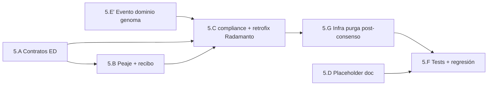

# Plan — Fase 5 · Cumplimiento termodinámico (recibos de tokens)

> **Grado evolutivo:** extensión del Peaje y contratos ED sin alterar Self-Healing. **Directriz T5.6 (Inmunidad Fan-Out)** obligatoria antes de cablear segundo suscriptor telemetría. Detener Tekton si aparece scope §5.D (gobernanza reactiva).

## Directriz de Control Tekton (obligatoria)

| # | Directriz | Verificación |
|---|-----------|--------------|
| **T5.1** | Apertura con `_init-feature-fase5.json` como SSOT inputs | Gate Fase 4 APTO + rama `feat/telemetria-reactiva-eda-fase5` |
| **T5.2** | Fail-soft recibo: omisión/parseo inválido **nunca** eleva `exit_code` negocio | Test `test_thermodynamic_no_receipt_success` |
| **T5.3** | Compliance en proceso **dedicado** — prohibido fusionar en `radamanto_batch_core.py` | Revisión diff + suscripción separada |
| **T5.4** | Sin suscripción dominio reactiva a `Telemetry_Compliance_Breached` | Assert `event-domain-subscriptions.json` sin entrada nueva |
| **T5.5** | Destino breach: `./.events/domain/` (bus fractal) | Test integración `write_fractal_event` |
| **T5.6** | **Inmunidad Fan-Out:** prohibido `os.remove()`/`unlink()` en `radamanto-batch` y `telemetry-compliance-audit` sobre JSON fuente; solo sellar `delivery_state`; purga exclusiva infra (`route-telemetry` o `event-sweeper`) | Test `test_telemetry_fan_out_no_competitive_purge` + grep diff sin `unlink` en cores consumidor |

## Secuencia de implementación

| Paso | Actividad | Touchpoints principales | Salida / gate |
|------|-----------|-------------------------|---------------|
| **5.A** | Bump contratos ED + ED smoke `text-metrics` | `skills-contract.md`, `actions-contract.md`, `text-metrics.md`, `cumulo.paths.json` | AC5.2 |
| **5.E′** | Forjar Clase `Telemetry_Compliance_Breached` | `event-creator`, `SddIA/events/domain/` | Pre-requisito emisiones |
| **5.B** | Helpers extracción recibo + extensión Peaje | `eda_bus_utils.py`, `execute_process_capsules.py` | AC5.1 |
| **5.C** | Core compliance + retrofix Radamanto + suscripción fan-out | `telemetry_compliance_audit_core.py`, `radamanto_batch_core.py`, `event-telemetry-subscriptions.json` | AC5.3 |
| **5.G** | Infra purga post-consenso (Fan-Out) | `route_fractal_event_core.py`, `eda_bus_utils.py`, opc. `event-sweeper.py` | T5.6 |
| **5.F** | Tests compliance + fan-out + regresión Radamanto/fractal | `test_telemetry_compliance*.py`, `test_eda_fractal_bus.py` | AC5.1–AC5.3 + T5.6 |
| **5.D** | Documentar placeholder gobernanza en `execution.md` | `clarify.md` §5.D, nota en spec §10 | Sin código reactivo |
| **Cierre** | Argos → `validacion.md` APTO; `pbi_archived: false` | `persist_ref/validacion.md` | Feature Fase 5 cerrada; abrir Fase 6 |

## Orden de dependencias internas

> **5.A antes de 5.C:** el auditor necesita contrato resoluble vía frontmatter ED.  
> **5.E′ antes de emisiones:** Clase ECST debe existir antes de instanciar dominio.  
> **5.B antes de 5.C:** telemetría debe transportar `telemetry_receipt` y `capsule_id` para cruce.  
> **5.G antes de 5.F:** sin purga centralizada, fan-out deja JSON huérfanos o reintroduce carrera si consumidores purgan.

## Checklist por paso

### 5.A — Contratos ED

- [ ] Bump `skills-contract.md` → v1.2.0 §6 Termodinámica declarativa
- [ ] Bump `actions-contract.md` → v1.3.0 §6 simétrica
- [ ] Actualizar referencias en `cumulo.paths.json` → `contracts.skills` / `contracts.actions`
- [ ] Marcar `text-metrics.md` con `telemetry_provided: true` + `telemetry_schema`
- [ ] Implementar `resolve_ed_telemetry_contract()` en `eda_bus_utils.py`
- [ ] Documentar default implícito `telemetry_provided: false` en contratos

### 5.E′ — Genoma dominio compliance

- [ ] Ejecutar `event-creator` → `Telemetry_Compliance_Breached` en `domain/`
- [ ] Actualizar `domain/index.md` + `eda-coverage.json`
- [ ] Verificar `event_family: domain` y emisor `telemetry-compliance-audit`
- [ ] Añadir `build_telemetry_compliance_breached_event()` en `eda_bus_utils.py`

### 5.B — Peaje CLI (fail-soft)

- [ ] Implementar `extract_telemetry_receipt()` con orden D5.1
- [ ] Capturar `state["last_capsule_envelope"]` y `state["last_capsule_id"]` en invocaciones cápsula
- [ ] Extender `build_raw_execution_finished_event()` con `capsule_id`, `telemetry_receipt`
- [ ] Cablear en `run_thermodynamic_toll()` — fail-soft channel `receipt-parse`
- [ ] Actualizar documentación genoma `raw-execution-finished.md` (ejemplo payload)
- [ ] Smoke cápsula `text-metrics` devuelve recibo simulado (lab)

### 5.C — Auditoría asíncrona + retrofix Fan-Out

- [ ] Crear `telemetry_compliance_audit_core.py`: algoritmo §5.2 spec — **sin unlink**
- [ ] Crear proceso `telemetry-compliance-audit.md` + handler `execute_telemetry_compliance_audit_phase`
- [ ] **Retrofix** `radamanto_batch_core.py`: retirar **todos** `event_path.unlink()`; sellar `delivery_state["radamanto.radamanto-batch"]` (D5.14)
- [ ] Implementar `stamp_fractal_delivery_state()` en `eda_bus_utils.py`
- [ ] Añadir bloque `telemetry_compliance` en `cumulo.paths.json`
- [ ] `.gitignore`: `.SddIA/telemetry-compliance/`
- [ ] Ampliar `event-telemetry-subscriptions.json` — suscripción paralela (no reemplazar Radamanto)
- [ ] Idempotencia breach por `asset_id`
- [ ] **Prohibido** purgar telemetría desde consumidores (T5.6)
- [ ] Actualizar `SddIA/process/index.md`

### 5.G — Infraestructura purga post-consenso (T5.6)

- [ ] Implementar `maybe_purge_fractal_telemetry_when_terminal()` en `eda_bus_utils.py`
- [ ] Cablear en `route_fractal_event` / `route_telemetry_event` tras dispatch de todos los suscriptores
- [ ] Persistir sellos `delivery_status` → `delivery_state` en el JSON del evento antes de evaluar purga
- [ ] **Fallback documentado:** extensión `event-sweeper.py` para `./.events/telemetry/` si enrutador no purga en este PR
- [ ] Verificar `route_telemetry_event` mantiene `purge_after=False` a nivel consumidor; purga solo vía consenso

### 5.F — Tests y regresión

- [ ] `test_thermodynamic_receipt_attached`
- [ ] `test_thermodynamic_no_receipt_success` (AC5.1)
- [ ] `test_telemetry_compliance_breach_missing` (AC5.3)
- [ ] `test_telemetry_compliance_no_breach_when_false`
- [ ] `test_telemetry_compliance_schema_mismatch`
- [ ] `test_telemetry_fan_out_no_competitive_purge` (T5.6)
- [ ] `test_telemetry_purge_after_all_delivery_stamps` (T5.6)
- [ ] Regresión `test_eda_fractal_bus.py` — actualizar expectativa purga consumidor → purga infra
- [ ] Regresión `test_radamanto_self_healing.py` + `test_radamanto_max_recovery_deprecated.py`

### 5.D — Placeholder gobernanza (solo documentación)

- [ ] Nota en `execution.md`: sin suscripción Cerbero/Radamanto
- [ ] Kaizen backlog opcional en `clarify.md` (contador infracciones)

## Criterios de aceptación (PBI)

| AC | Criterio | Paso verificador |
|----|----------|------------------|
| **AC5.1** | CLI sin tokens no detiene ni falla ejecución | 5.B + 5.F |
| **AC5.2** | Contrato ED declara recibos termodinámicos | 5.A |
| **AC5.3** | `Telemetry_Compliance_Breached` en `./.events/domain/` | 5.E′ + 5.C + 5.F |

## Riesgos y mitigación

| Riesgo | Mitigación |
|--------|------------|
| Scope creep §5.D gobernanza | T5.4 — prohibición suscripción dominio reactiva |
| Romper Self-Healing Radamanto | Suscripción paralela; regresión tests F4 |
| Inconsistencia envelope `data` vs `result` | Orden búsqueda D5.1 en `extract_telemetry_receipt` |
| Breach duplicado por re-proceso telemetría | Idempotencia `.SddIA/telemetry-compliance/emitted.json` |
| False positive sin `capsule_id` | R5.1 — no breach si ED no declara `telemetry_provided` |
| Parseo recibo rompe negocio | D3.13 fail-soft + T5.2 |
| **Carrera Fan-Out telemetría** | **T5.6:** sellos `delivery_state`; purga solo infra; retrofix Radamanto F4 |
| JSON telemetría huérfano sin sweeper | Paso 5.G obligatorio o fallback `event-sweeper` documentado |

## Post-Fase 5

Tras merge de `feat/telemetria-reactiva-eda-fase5` con `validacion.md` APTO:

1. Actualizar PBI maestro `active_phase: 6` al abrir `telemetria-reactiva-eda-fase6`.
2. Fase 6 documenta en `README.md` recibos termodinámicos y auditoría compliance.
3. No archivar PBI maestro hasta Done global (Fases 0–6).

## Estado de este entregable

**Implementación y validación completadas** (2026-05-28). Tests: 10/10 F5 + 35/35 QA discover. Pendiente: `delivery-close-cycle` (PR).
