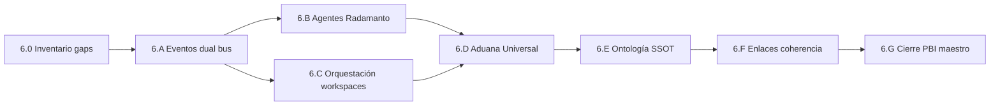

# Plan — Fase 6 · Actualización README.md

> **Grado cierre:** feature **doc-only**. Entrega principal = `README.md` alineado a Fases 1–5. **Done global** del PBI unificado en el mismo PR (`pbi_archived: true`).

## Directriz de Control Tekton (obligatoria)

| # | Directriz | Verificación |
|---|-----------|--------------|
| **T6.1** | Apertura con `_init-feature-fase6.json` como SSOT inputs | Gate Fase 5 APTO + rama `feat/telemetria-reactiva-eda-fase6` |
| **T6.2** | Diff principal = `README.md` + artefactos `persist_ref` + move PBI | Revisión PR — sin mutaciones Core salvo excepción D6.11 |
| **T6.3** | Prohibido `README.md` bajo `SddIA/events/*/` | Grep diff |
| **T6.4** | Coexistencia V3+ **y** fractal documentadas | AC6.1 + lectura § Eventos |
| **T6.5** | Done global: PBI en `docs/todos/done/` + `pbi_archived: true` | `validacion.md` + path PBI |
| **T6.6** | Cerbero ≠ Peaje Termodinámico | Terminología README sin ambigüedad (D6.4) |

## Secuencia de implementación

| Paso | Actividad | Touchpoints principales | Salida / gate |
|------|-----------|-------------------------|---------------|
| **6.0** | Inventario diff README vs spec §3–8 | Lectura `README.md`, `clarify.md` gaps | Lista cambios concretos |
| **6.A** | Reescribir § Eventos: Trinidad, genoma fractal, bus fractal, V3+ legacy | `README.md` § Eventos | AC6.1 |
| **6.B** | Ampliar § Agentes: Radamanto, delimitación, Self-Healing resumido | `README.md` § Agentes | AC6.2 |
| **6.C** | Reescribir § Orquestación: workspaces, ceguera espacial, filesystem-manager | `README.md` § Orquestación | AC6.3 |
| **6.D** | Nueva § Aduana Universal: Peaje, recibos, compliance async | `README.md` (nueva sección) | AC6.4 |
| **6.E** | Actualizar tabla ontología Event/Process; refs `workspacesRoot` | `README.md` tabla + notas SSOT | AC6.5 |
| **6.F** | Validar enlaces; marcar legacy; enlaces features fase 0–5 | `README.md` | AC6.5 |
| **6.G** | Mover PBI maestro; `implementation.md`, `execution.md` | `docs/todos/`, `persist_ref` | Done global D0.6 |
| **Cierre** | Argos → `validacion.md` APTO; `delivery-close-cycle` | `validacion.md`, PR | PBI programa cerrado |

## Orden de dependencias internas

> **6.A antes de 6.D:** la Aduana referencia familias y rutas telemetría ya introducidas.  
> **6.B antes de 6.D:** compliance y Self-Healing citan roles agente/proceso.  
> **6.F antes de 6.G:** no archivar PBI con enlaces rotos en README.

## Checklist por paso

### 6.0 — Inventario previo

- [ ] Leer `README.md` completo y marcar párrafos obsoletos (V3+-only, persist_ref operativo)
- [ ] Contrastar con `cumulo.paths.json` v1.4.0 (`eda_fractal`, `eda_bus`, `workspacesRoot`)
- [ ] Verificar existencia/rol de `SddIA/events/index.md`
- [ ] Registrar lista de enlaces a validar en `implementation.md`

### 6.A — Eventos: genoma, runtime e instancia

- [ ] Tabla Trinidad (`telemetry`, `orchestration`, `domain`) + campo `event_family`
- [ ] Diagrama/texto genoma: tres subcarpetas + `events-contract.md` en raíz
- [ ] Tabla bus fractal: `./.events/telemetry|orchestration|domain/` con consumidores
- [ ] Citas tres suscripciones JSON + procesos `route-telemetry`, `route-orchestration`, `route-domain`
- [ ] Subsección **Pipeline dominio legacy (V3+)** — reubicar contenido actual sin eliminar
- [ ] Nota coexistencia D0.2; diagrama mermaid V3+ bajo subsección legacy
- [ ] Enlaces a Códices: `telemetry/index.md`, `orchestration/index.md`, `domain/index.md`
- [ ] Corregir referencia obsoleta a índice plano si aplica

### 6.B — Agentes del Core

- [ ] Fila **Radamanto** en tabla agentes (rol actuario, DLT Tool_*)
- [ ] Párrafo delimitación Argos (materia) vs Radamanto (confianza/estadística)
- [ ] Bloque Self-Healing alto nivel (`Tool_Degraded` → … → `Status_Restored` / `Tool_Deprecated`)
- [ ] Enlace `SddIA/agents/radamanto.md`
- [ ] Mantener flujo Mayeuta → Dedalo → Tekton → Argos; Cerbero como RBAC

### 6.C — Orquestación multi-agente

- [ ] Sustituir énfasis en `persist_ref` como territorio operativo
- [ ] Documentar `workspace_template` + resolución `workspacesRoot/{process}/{execution_id}/`
- [ ] Inyección `workspace_path` en payload; Ceguera Espacial
- [ ] `persist_ref` = documentación en `docs/features|fixes/` (ortogonal)
- [ ] Persistencia encapsulada: `filesystem-manager` + `capsule-json-io`
- [ ] Deprecar narrativa `featurePath`/`fixPath` como destino ejecución

### 6.D — Aduana Universal (CLI)

- [ ] Subsección Peaje Termodinámico: cronómetro, métricas, `Raw_Execution_Finished`
- [ ] Destino `./.events/telemetry/`; emisor exclusivo CLI
- [ ] Fail-soft D3.13 (telemetría no bloquea negocio)
- [ ] `telemetry_receipt` opcional; contratos `telemetry_provided`
- [ ] `telemetry-compliance-audit` + `Telemetry_Compliance_Breached` (sin gobernanza reactiva)
- [ ] Mención Fan-Out T5.6: purga solo infraestructura
- [ ] Enlace feature fase 5

### 6.E — Ontología y SSOT

- [ ] Actualizar fila **Event** (genoma fractal, `event_family`, dual bus)
- [ ] Actualizar fila **Process** (`workspace_template` obligatorio)
- [ ] Referencia `paths.workspacesRoot` en texto o tabla auxiliar
- [ ] Nota aliases deprecated `featurePath`/`fixPath`

### 6.F — Enlaces y coherencia transversal

- [ ] Validar enlaces relativos del diff README (events-contract, agents, features)
- [ ] Eliminar o acotar lenguaje «bus monolítico» como único modelo
- [ ] Añadir referencias cruzadas programas fase 0–5 (mínimo fase 3–5)
- [ ] Verificar coherencia con `SddIA/events/`, `SddIA/core/` post-lectura
- [ ] Documentar excepciones D6.11 si se corrige enlace fuera de README

### 6.G — Cierre documental PBI maestro

- [ ] Mover PBI de `docs/todos/pending/` → `docs/todos/done/` (mismo `document_id`)
- [ ] Actualizar frontmatter PBI: `status: done`, fase 6 ✅, versión bump
- [ ] Redactar `implementation.md` + `execution.md`
- [ ] Argos: `validacion.md` con AC6.1–AC6.5, `pbi_archived: true`
- [ ] `delivery-close-cycle` → PR único

## Criterios de aceptación (PBI)

| AC | Criterio | Paso verificador |
|----|----------|------------------|
| **AC6.1** | Trinidad + rutas `./.events/{telemetry,orchestration,domain}/` | 6.A + 6.F |
| **AC6.2** | Radamanto catalogado; rol ≠ Argos | 6.B |
| **AC6.3** | Workspaces dinámicos en narrativa orquestación | 6.C |
| **AC6.4** | Aduana Universal + `Raw_Execution_Finished` | 6.D |
| **AC6.5** | Coherencia README vs genoma/core/cumulo | 6.E + 6.F |

## Riesgos y mitigación

| Riesgo | Mitigación |
|--------|------------|
| README demasiado largo | Narrativa entrada + enlaces a features/Códices (D6.2) |
| Confusión V3+ vs fractal | Subsecciones explícitas + T6.4 |
| Ambigüedad «Peaje» Cerbero vs CLI | D6.4 / T6.6 terminología dual |
| Archivar PBI con README incoherente | 6.F antes de 6.G |
| Scope creep código runtime | T6.2 doc-only; excepción D6.11 documentada |
| Olvidar `pbi_archived: true` | T6.5 checklist 6.G |

## Post-Fase 6

Tras merge de `feat/telemetria-reactiva-eda-fase6`:

1. PBI `PBI-TELEMETRIA-REACTIVA-EDA-UNIFICADO` en `docs/todos/done/`.
2. Programa Telemetría Reactiva EDA S+ Grade **Done global** (Fases 0–6).
3. Backlog Kaizen residual: gobernanza post-`Telemetry_Compliance_Breached` (§5.D), TTL workspaces (D2.9).

## Estado de este entregable

**Implementación y validación completadas** (2026-05-28). Pendiente: `delivery-close-cycle` (PR único con Done global PBI).
