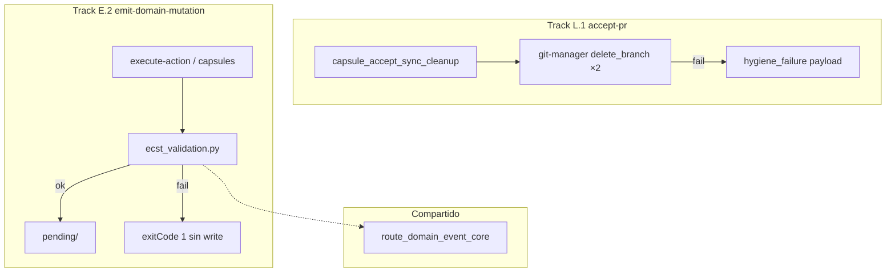

# Especificación técnica — Vanguardia Soberanía Local

## 1. Contexto

Backlog post-PR11 eleva **L.1** (`accept-pr` cápsula estricta) y **E.2** (aduana ECST en `emit-domain-mutation`) como vanguardia de fricción. La puerta de entrada local no está sellada: higiene de ramas silenciosa tras merge (PR #36) y eventos malformados pueden persistir en `pending/` antes de que el router los rechace.

## 2. Diagrama de alcance



## 3. Track L.1 — `capsule_accept_sync_cleanup`

### 3.1 Función helper propuesta

```python
def _delete_branch_hygiene(
    repo: Path, branch: str
) -> tuple[str | None, dict[str, Any] | None]:
    """
    Returns (closed_branch, hygiene_failure).
    closed_branch == branch IFF local+remote delete OK.
    """
```

### 3.2 Secuencia

1. Si `SDDIA_LAB_SKIP_GIT_PUSH` → retorno skip (sin cambio).
2. Push `main` con `SDDIA_SKIP_HOOKS=1` acotado (sin cambio).
3. Si `source_branch` vacío → `closed_branch: null`, sin `hygiene_failure`.
4. Invocar delete local; capturar `{success, error}` por op — **no** tragar excepción sin registro.
5. Invocar delete remoto; idem.
6. Derivar `closed_branch` y `hygiene_failure` según `objectives.md` L1-SPEC.

### 3.3 Contrato `hygiene_failure`

| Campo | Tipo | Obligatorio |
|-------|------|-------------|
| `survived_branch` | string | Sí, si alguna op falló |
| `branch_deleted_local` | boolean | Sí |
| `branch_deleted_remote` | boolean | Sí |
| `operations` | array | Sí |
| `operations[].op` | string | `delete_branch_local` \| `delete_branch_remote` |
| `operations[].command` | string | Comando git canónico |
| `operations[].success` | boolean | Sí |
| `operations[].error` | string | Si `success: false` |

### 3.4 Propagación en orquestador

| Punto | Cambio |
|-------|--------|
| `capsule_accept_sync_cleanup` retorno | Incluir `hygiene_failure` si aplica |
| `execute_accept_pr_phase` | Passthrough en entry fase 4 |
| `run_process` agregación `data` | `if state.get("hygiene_failure"): data["hygiene_failure"] = ...` |
| `state["closed_branch"]` | Solo rama si higiene completa |

### 3.5 Genoma `accept-pr.md`

Actualizar § Fase 4:

- Dos invocaciones `delete_branch` (local + remoto) vía contrato frozen.
- Output `closed_branch` condicionado a higiene completa.
- Documentar `hygiene_failure` como salida de fase cuando la rama sobrevive.

### 3.6 Alcance homólogo

`capsule_delivery_local_hygiene` — misma helper o extracción compartida `_delete_branch_hygiene`.

## 4. Track E.2 — Aduana ECST pre-`pending/`

### 4.1 Módulo `ecst_validation.py`

Extraer desde `route_domain_event_core.py`:

| Función | Comportamiento |
|---------|----------------|
| `load_event_class_schemas(repo)` | Parse `SddIA/events/index.md` + tablas REQUIRED/OPTIONAL/FORBIDDEN |
| `validate_ecst_instance(event, schema)` | Validar payload vs schema |
| `validate_domain_mutation_event(repo, event)` | Wrapper: resolver schema por `event_type`, delegar |

Sin efectos secundarios; importable desde router, `execute-action.py` y capsules.

### 4.2 Punto de inserción — `execute-action.py`

En `_run_emit_domain_mutation`, **después** de ensamblar `event` dict, **antes** de `_write_pending_event`:

```python
ok, errors = validate_domain_mutation_event(repo, event)
if not ok:
    raise ValueError("; ".join(errors))  # → success: false, exitCode: 1
```

### 4.3 Punto de inserción — `execute_process_capsules.py`

En `emit_domain_mutation()` y/o `capsule_emit_domain_mutation` — misma aduana antes de `write_pending_event`.

### 4.4 Genoma `emit-domain-mutation.md`

Nuevo **Paso 1b — Aduana ECST**:

- Ensamblar borrador ECST (sin persistir).
- Validar contra Clase en `SddIA/events/`.
- Abortar con error causal si violación REQUIRED/FORBIDDEN o `event_type` no catalogado.

### 4.5 Matriz de aborto

| Condición | Resultado |
|-----------|-----------|
| `payload.<required>` ausente/null | `exitCode: 1`, sin archivo |
| `payload.<forbidden>` presente (no null donde aplique) | `exitCode: 1`, sin archivo |
| `event_type` no en index | `exitCode: 1`, sin archivo |
| Instancia válida | Persistir en `pending/` como hoy |

## 5. Criterios de aceptación (validación)

### L.1

| ID | Criterio |
|----|----------|
| L1-CA1 | Smoke post-merge: rama eliminada local+remoto → `closed_branch` poblado |
| L1-CA2 | Smoke delete fallido: `hygiene_failure` presente, `closed_branch: null`, sin excepción tragada |
| L1-CA3 | `execution_report.phases[3]` incluye `hygiene_failure` en escenario fallo |
| L1-CA4 | stdout `execute-process` JSON puro — una emisión |
| L1-CA5 | `accept-pr.md` § Fase 4 alineado |

### E.2

| ID | Criterio |
|----|----------|
| E2-CA1 | Emisión create válida → archivo en `pending/` |
| E2-CA2 | Payload sin `origin_topology` (REQUIRED) → abort, cero archivos nuevos |
| E2-CA3 | `route_domain_event_core` importa `ecst_validation` — tests/regresión router verde |
| E2-CA4 | `emit-domain-mutation.md` documenta Paso 1b |

## 6. Matriz de artefactos

| Artefacto | Track | Acción |
|-----------|-------|--------|
| `SddIA/scripts/qa/ecst_validation.py` | E.2 | **Crear** |
| `SddIA/scripts/qa/route_domain_event_core.py` | E.2 | Refactor import |
| `SddIA/scripts/qa/execute-action.py` | E.2 | Aduana pre-write |
| `SddIA/scripts/qa/execute_process_capsules.py` | L.1 + E.2 | Higiene + aduana capsules |
| `SddIA/process/accept-pr.md` | L.1 | § Fase 4 |
| `SddIA/actions/emit-domain-mutation.md` | E.2 | Paso 1b |
| `SddIA/norms/git-operations.md` | L.1 | Nota delete local/remoto |
| `docs/features/vanguardia-soberania-local/_smoke-*.json` | Ambos | Fixtures smoke |
| `docs/features/vanguardia-soberania-local/validacion.md` | — | Post-implementación |

## 7. Fuera de alcance

- Hooks Git Hito 3, `pull-request-review`, DLT Oráculo.
- `event-sweeper`, recibos atómicos Ola C V3.
- `payload_schema_hash` REQUIRED.
- IOTA físico CI (E.1).
- Cambiar política merge (`gh pr merge` prohibido).

## 8. Plan de implementación

Ver `plan.md`.
