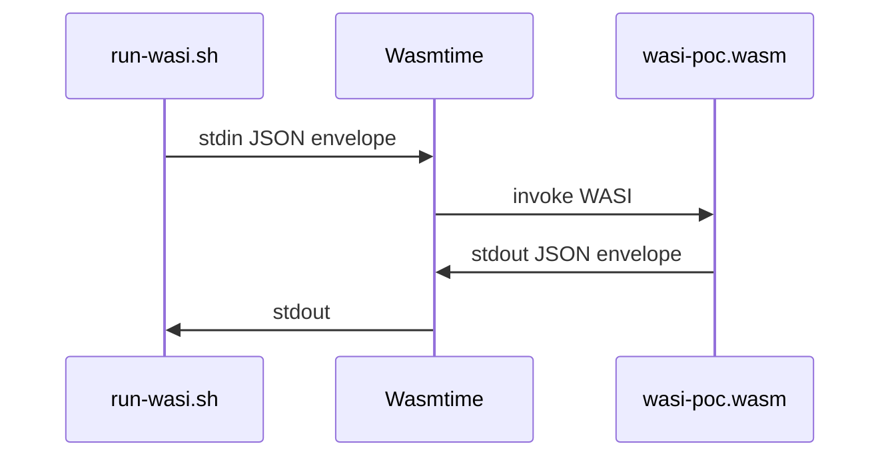

# Implementación — WASI PoC Ignition

## Touchpoints

| Archivo | Cambio |
|---------|--------|
| `SddIA/tools/wasi-poc/src/main.rs` | Envelope capsule-json-io v2.0; eco `request` en `result.echo` |
| `SddIA/tools/wasi-poc/Cargo.toml` | `edition = "2021"`; perfil release `lto` + `strip` |
| `SddIA/tools/wasi-poc/.cargo/config.toml` | Target por defecto `wasm32-wasip1` |
| `SddIA/tools/wasi-poc/scripts/build-wasi.sh` | Compilación WASM |
| `SddIA/tools/wasi-poc/scripts/run-wasi.sh` | Ejecución Wasmtime sin `--dir` del host |

## Flujo



## Dependencias de entorno

- `rustup` + target `wasm32-wasip1`
- `wasmtime` (runtime ligero, código abierto)
- Scripts cargan `~/.cargo/env` y `~/.wasmtime/bin` en shells no interactivas

## Validación PoC (sellada)

| Criterio | Estado | Evidencia |
|----------|--------|-----------|
| Compilación `wasm32-wasip1` | ✅ | `build-wasi.sh` exit 0 |
| Ejecución Wasmtime | ✅ | `run-wasi.sh` exit 0 |
| Envelope JSON sandbox | ✅ | stdout abajo |

**Veredicto:** `S+ Grade_Sealed` — PoC validada.

**Build stdout:**

```json
{"success":true,"exitCode":0,"message":"wasi artifact built","result":{"artifact":"/home/racso/Proyectos/SddIA/SddIA/tools/wasi-poc/target/wasm32-wasip1/release/wasi-poc.wasm","target":"wasm32-wasip1"}}
```

**Run stdout (payload exacto):**

```json
{"meta":{"schemaVersion":"2.0","entityKind":"tool","entityId":"wasi-poc"},"success":true,"exitCode":0,"message":"WASI capsule executed in sandbox","feedback":"I/O limited to stdin/stdout per capsule-json-io","result":{"echo":{"ping":true},"sandbox":"wasm32-wasip1","wasi_status":"S+ Grade_Sealed"},"durationMs":0}
```
