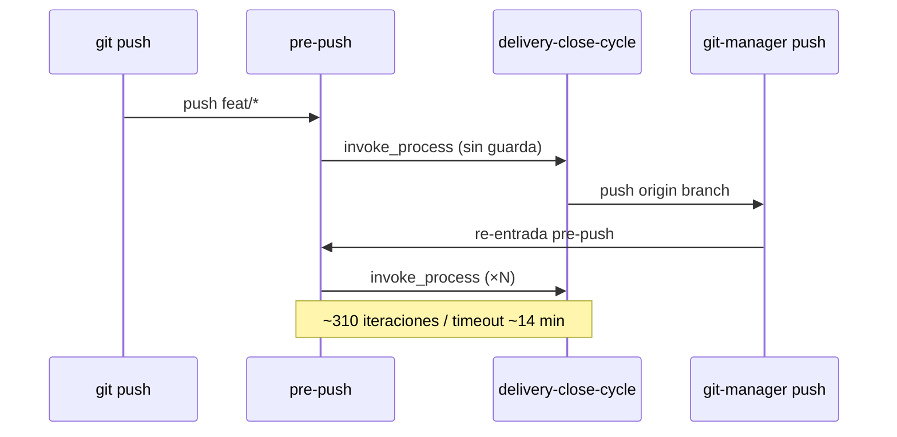

# Clarificación — Análisis de incidente y alcance

## 1. Incidente confirmado

| Campo | Evidencia |
|-------|-----------|
| PR #20 | MERGED `f0ef7bf` — `feat/ampliacion-configuracion-entornos` |
| Bus EDA | **Cero** eventos `PullRequest_Presented` / `PullRequest_Merged` para esa rama en `docs/events/` |
| Recursión hook | **310** payloads `tmp/hook-delivery-close-cycle-*.json` con `source_process: git-hook-pre-push` |
| Causa operativa | Operador aplicó `SDDIA_SKIP_HOOKS=1` + `gh pr create` + `gh pr merge` fuera de procesos canónicos |

## 2. Cadena de fallo técnico (F1–F4)

### F1 — Recursión pre-push ↔ delivery-close-cycle

- `pre_push_gate.py` invoca `delivery-close-cycle` sin variable de guarda en el entorno del subproceso.
- `capsule_delivery_remote_push` ejecuta `git push` vía `git-manager`; el hook pre-push se dispara de nuevo.
- `skip_hooks()` solo contempla `SDDIA_SKIP_HOOKS=1` global; no existe `SDDIA_HOOK_DELIVERY_CLOSE`.

### F2 — Atajos GitHub CLI

- PR #20 mergeado sin `emit-pr-presented-event` ni `emit-pr-merged-event`.
- Violación de `pull-request-orchestration.md`: cierre fuera de `delivery-close-cycle` + `accept-pr`.

### F3 — IA no escaló a PBI

- Se priorizó entrega sobre gobernanza; no se materializó deuda antes del bypass.
- `obediencia-procesos.md` v1.0 solo exige ejecución literal; **no** prohíbe bypass ante fallo.

### F4 — `resolve_persist_ref` acotado a features

- `hook_common.resolve_persist_ref` solo busca `docs/features/{slug}`.
- Ramas `fix/*` (como esta) devuelven `persist_ref: null` en el payload del hook.

## 3. Brechas idempotencia (O5)

| Guarda actual | Comportamiento | Brecha |
|---------------|----------------|--------|
| `gh_pr_open_for_branch` | Skip si PR OPEN | No cubre PR **MERGED** |
| `scan_presented_for_branch` | Skip si Presented en bus | OK si evento existe |
| `eda_bus_utils.github_pr_merged` | Existe pero **no** usada en hook | Reutilizar en `should_skip_pre_push_present` |

## 4. Ampliación de alcance (input operador)

El PBI original cubría Hitos 1–4 (Ola B). Se incorpora:

| Hito | Entrega |
|------|---------|
| **H3 ampliado** | Ley de Jurisdicción Delegada en `obediencia-procesos.md` |
| **H4 nuevo** | Evento `System_Fracture_Detected` + fan-out dual Cúmulo/Mayeuta + backfill Fase C |
| **Protocolo Kintsugi** | Intercepción → fractura → Cúmulo (Qué) → Mayeuta (Por Qué) → laudo humano |

## 5. Decisiones de diseño

1. **Guarda dual:** `SDDIA_HOOK_DELIVERY_CLOSE=1` en subproceso del hook + skip temprano en `pre_push_gate` si la variable ya está presente.
2. **Skip hooks acotado:** solo `capsule_delivery_remote_push` cuando `source_process == git-hook-pre-push`; propagar vía `env` del subproceso `git-manager`, no `os.environ` global.
3. **Fractura como evento de dominio:** fan-out ordenado Cúmulo → Mayeuta en `System_Fracture_Detected`.
4. **Retroactivo PR #20:** emisión manual con `emitter_agent: retroactive-fix`; no re-ejecutar merge físico.
