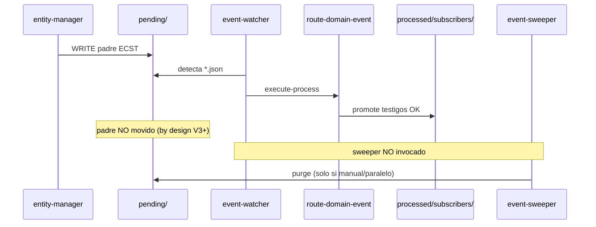

# Clarificación — Análisis de incidente y alcance

## 1. Incidente confirmado

| Campo | Evidencia |
|-------|-----------|
| Emisión | `entity-manager` → `Domain_Entity_Created` en `.events/pending/` |
| Enrutamiento | `event-watcher.py --once` → `route-domain-event` exit 0 |
| Testigos | `.events/processed/subscribers/<uuid>.cumulo.*.json` presentes |
| Padre | `.events/pending/<uuid>.json` **permanece** hasta `event-sweeper.py --once` |
| Sweeper manual | Purga `4d4f14b9-621d-4464-b31b-229b7e4b792c` y `c172ee3c-cf4d-4ddd-a9c5-b75a89651098` |
| Kaizen correcto | `5b99aa98-…` (sync-entity-index failed) y `99459a47-…` (ecst-gate) **no** purgados |

## 2. Cadena de fallo operativo

### F1 — Gap watcher ↔ sweeper

- `event-watcher.py` delega en `route-domain-event` y termina con log `"padre permanece en pending"`.
- `event-sweeper.py` es daemon **independiente** (poll 5s); no se arranca en flujos `--once` del watcher.
- README documenta pasos 2 y 5 como componentes separados; no hay encadenamiento en runtime.

### F2 — Diseño vs operación

- Ola C V3+ **intencionalmente** mantiene el padre inmutable en `pending/` hasta consenso del sweeper (`events-contract.md` §4.6).
- El contrato es correcto; la **operación lab/dev** asume un segundo daemon que frecuentemente no corre.

### F3 — route-domain-event no cierra ciclo

- `route_domain_event_core.route_domain_event()` promueve testigos y purga cabecera `processing/` vía `maybe_purge_processing_header`.
- **No** invoca `archive_event_after_sweep()` aunque todos los suscriptores requeridos estén en `processed/subscribers/`.

## 3. Causa raíz (laudo preliminar)

**Desacople operativo:** el cierre de consenso (`archive_event_after_sweep`) vive exclusivamente en `event-sweeper.py`, pero el flujo principal de consumo (`event-watcher`) no lo dispara. Resultado: bus aparentemente "gestionado" con cola `pending/` inflada.

## 4. Opciones de corrección

| Opción | Descripción | Pros | Contras |
|--------|-------------|------|---------|
| **A** | Watcher invoca `sweep_once()` tras route OK | Mínimo diff en daemon | Duplica lógica de barrido global |
| **B** | `route_domain_event` llama `try_sweep_event(uuid)` al final | Cierre inmediato por evento; sync/async ya esperan suscriptores | Acopla purga al orquestador |
| **C** | Helper `try_sweep_event` en `eda_bus_utils`; B + watcher periódico opcional | Reutilizable; sweeper sigue para stale | Requiere tests de idempotencia |

**Recomendación:** **C + B** — helper compartido invocado al cierre de `route_domain_event`; watcher actualiza log; sweeper daemon conservado para recuperación.

## 5. Fuera de alcance

- Reparar suscriptores fallidos (`sync-entity-index`, ECST gate en instancias mal formadas).
- Fusionar daemons en un solo proceso (posible mejora futura, no requisito O2).
