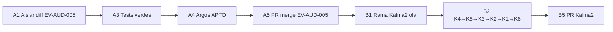

# Procedimiento de retoma — EV-AUD-005 + ola Kalma2

Handoff para continuar en otra sesión. **Dos vías paralelas**, dos PRs.

## Estado al cierre de sesión (2026-08-13)

| Vía | Estado | Bloqueo |
|-----|--------|---------|
| **A — Núcleo EV-AUD-005** | Diff aislado; tests 13/13 citados; Argos **APTO**; PBI `done/` | Ninguno (pendiente PR) |
| **B — Kalma2 K1–K6** | WIP en `stash@{0}` `via-b-kalma2-ola-wip-post-ev-aud-005` | Tras merge Vía A; rama `fix/kalma2-post-ev-aud-005-ola` |

---

## Vía A — Cerrar EV-AUD-005 (prioridad)

### A1. Aislar el diff

1. Rama base: `fix/execute-process-phase-failure-propagation`.
2. **Incluir solo** touchpoints de `spec.md` § Touchpoints núcleo:
   - `SddIA/engine/execute-process/src/engine/phase_terminal.rs`
   - `mod.rs`, `residual_runner.rs`, `executor.rs`, `delivery_close.rs`, `capsule_invoke_smoke.rs`, `thermodynamic.rs` (**solo** cambios `failed_phase*` / PEC terminal, **no** early-PEC Kalma2 si se separan)
3. **Excluir / revertir** en este PR:
   - `kalma2.rs` (instrumentación debug)
   - `task_queue_manager.rs` (K4/K5)
   - `event-watcher`, `kalma2-bridge`, `interfaces/kalma2/app.js`
   - `docs/features/evolution-contract-index-v11/*`
   - `.cursor/debug-*.log`
4. Documental: solo `docs/fixes/execute-process-phase-failure-propagation/` (canónico).

### A2. Podar dual persist_ref

1. Eliminar o archivar `docs/fixes/execute-processfallodefasedebefallarejecucinglobalev-aud-005/` (slug legado).
2. Un solo `persist_ref` canónico en frontmatter de todos los artefactos.

### A3. Evidencia física tests

```bash
cd SddIA && env -u CARGO_TARGET_DIR cargo test -p execute-process --lib phase_terminal
```

Guardar stdout en `execution.md` o adjuntar en re-auditoría Argos (CA7, `CARGO_TEST_PHASE_TERMINAL`).

### A4. Re-auditoría Argos

1. Actualizar `validacion.md`: CA7 + `CARGO_TEST_*` → APTO con cita de comando.
2. `global: APTO`, `pbi_archived: true` (solo si checks verdes).
3. Mover PBI a `docs/todos/done/` (misma rama, pre-merge).

### A5. Cierre entrega

```bash
./sddia-run.sh --process delivery-close-cycle --inputs '{...}'
```

Un único PR → merge → Done.

**Gate:** `validacion.md` APTO + PBI en `done/` en el diff del PR.

---

## Vía B — Ola Kalma2 (después o en paralelo, PR separado)

PBI: `docs/todos/pending/[OPERATIVO] Kalma2 — ola mejora post-auditoría EV-AUD-005 (K1–K5).md`

### B1. Rama limpia

```bash
git checkout main
git pull
git checkout -b fix/kalma2-post-ev-aud-005-ola
```

Cherry-pick o re-aplicar solo commits K1–K6 (no mezclar con A).

### B2. Implementar / consolidar (orden sugerido)

| Orden | ID | Acción | Verificación |
|-------|-----|--------|--------------|
| 1 | K4 | `suggested_branch` en TQM | test `suggested_branch_from_pbi_frontmatter` |
| 2 | K5 | single-flight `correlation_id` | forja duplicada → un solo hijo |
| 3 | K3 | watcher async | domain no huérfano >120s con pending largo |
| 4 | K2 | early PEC `awaiting_agents` | `/api/status` muestra awaiting_agents |
| 5 | K1 | poll UI | no para en initialized; llega a completed |
| 6 | K6 | bridge PEC reciente | PEC final gana sobre early |

### B3. Build y reinicio ecosistema

```bash
cd SddIA && env -u CARGO_TARGET_DIR cargo build -p execute-process -p event-watcher -p kalma2-bridge
# reiniciar centinelas + kalma2-bridge (./start-sddia.sh o equivalente)
```

### B4. Smoke Kalma2

1. Forjar: `Inicia proceso fix para … [FIX] execute-process … (EV-AUD-005).md`
2. Comprobar: status `awaiting_agents` → poll continúa → terminal coherente.
3. Comprobar: rama `fix/execute-process-phase-failure-propagation` (K4).

### B5. Ciclo documental propio

Opciones:

- **bug-fix** hijo con `persist_ref`: `docs/fixes/kalma2-post-ev-aud-005-ola`, o
- **feature** si se prefiere topología feature.

Argos → `validacion.md` APTO → PR independiente.

---

## Orden recomendado entre vías



**Rationale:** cerrar EV-AUD-005 sin WIP Kalma2 evita nuevo `SCOPE_WIP_CONTAMINATION`. La ola Kalma2 puede reutilizar el PBI EV-AUD-005 como smoke sin re-abrir su veredicto.

---

## Comandos rápidos de diagnóstico (retoma)

```bash
# Estado PBI EV-AUD-005
ls docs/todos/pending/*EV-AUD-005* docs/todos/done/*EV-AUD-005* 2>/dev/null

# Tests núcleo
cd SddIA && env -u CARGO_TARGET_DIR cargo test -p execute-process --lib phase_terminal

# Kalma2 vivo
curl -sf http://127.0.0.1:8765/ && pgrep -a kalma2-bridge event-watcher

# Status correlación (si existe PEC)
curl -s "http://127.0.0.1:8765/api/status?event_id=<correlation_id>"
```

---

## No hacer en la retoma

- Mezclar PR EV-AUD-005 con K1–K6.
- Declarar `global: APTO` sin stdout de tests citado.
- Archivar PBI EV-AUD-005 antes de APTO.
- Forjar genoma manual desde IDE (usar `./sddia-run.sh`).
