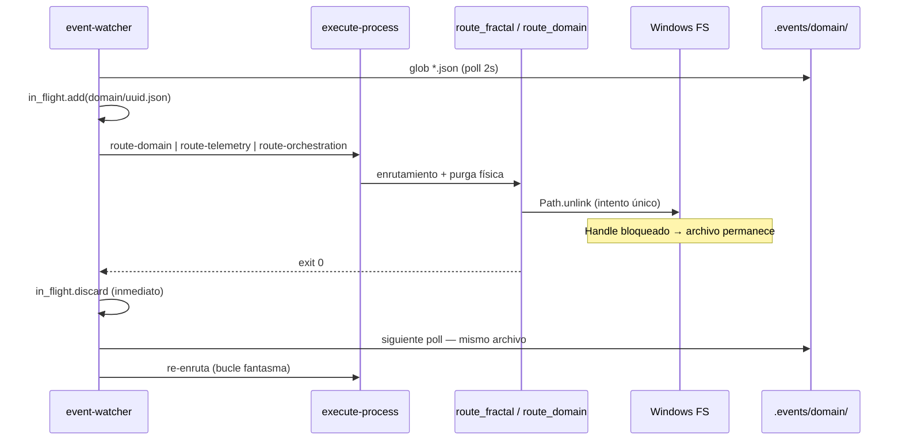

# Clarificación — Bucle fantasma del Sistema Nervioso (bus EDA / Windows)

## 1. Incidente confirmado

| Campo | Evidencia |
|-------|-----------|
| Fecha | 2026-05-29 (ventana UTC ~05:06–06:12) |
| Contexto operativo | Ráfagas de `execute-suite` con suite `core-full-stress` (programa Inmunidad/Caos Fase 4–5) |
| Síntoma | Decenas de JSON ECST permanecen en `.events/domain/` (y colas fractal) tras enrutamiento exitoso |
| Watcher | `event-watcher.py` registra `Detectado nuevo evento` → `enrutado`; al reiniciar, reprocesa los mismos UUID |
| `delivery_state` | Mayoría `{}` en padres fractal; 1 evento telemetry con sello `argos.telemetry-compliance-audit: success` |
| Conteo (lab) | 49 instancias con `timestamp` 2026-05-29: domain 46, orchestration 2, telemetry 1; 0 en `processed/` / `dead-letter/` ese día |

## 2. Cadena de fallo técnico

### F1 — Watcher: confianza en desaparición física

- `event-watcher.py` usa `in_flight` indexado por `{carpeta}/{archivo}.json` y lo **libera en cuanto** retorna el subproceso (`in_flight.discard` post-`subprocess.run`).
- No distingue «subproceso terminó» vs «instancia ECST retirada del disco».
- `MAX_ROUTE_ATTEMPTS = 3` limita reintentos por clave en una sesión; no evita acumulación ni reinicios del daemon.

### F2 — Purga fractal: intento único sin absorción E/S

- `route_fractal_event_core.py` ejecuta `event_path.unlink(missing_ok=True)` tras consenso de suscriptores.
- `eda_bus_utils.maybe_purge_fractal_telemetry_when_terminal` idem.
- En Windows, `PermissionError` / WinError 32 (archivo en uso) no se reintenta; la purga falla en silencio (`missing_ok=True`).

### F3 — Colapso operativo previo (zona cero)

- Tras stress masivo, colas activas (`domain/`, `telemetry/`, `orchestration/`) conservan JSON «zombies».
- Sin herramienta de triaje, el operador debe borrar manualmente o tolerar ruido en cada arranque del watcher.

### F4 — Relación con fixes anteriores (no duplicar)

| Fix previo | Ámbito | Relación |
|------------|--------|----------|
| `event-pending-sweeper` | Padre en `.events/pending/` + `try_sweep_event` | Complementario: cierra pending V3+; **no** cubre colas fractal directas |
| `revision-gestion-eventos-kaizen` | Kaizen + padre stale en pending | Distinto incidente (PR #30/#31) |

Este fix ataca **idempotencia del watcher** y **resiliencia de unlink** en bus fractal Windows, más **purga lab**.

## 3. Decisión de diseño (laudo preliminar)

| ID | Decisión | Rationale |
|----|----------|-----------|
| **D1** | `processing_uuids: set[str]` en watcher, clave = `event_id` (`path.stem`) | Alineado al PBI; ignora re-detección mientras el orquestador está en vuelo |
| **D2** | Liberar UUID del set **solo** al retorno oficial del subproceso (exit code) | Mandato PBI Fase 1 |
| **D3** | Complemento post-F1: si route exit 0 y archivo sigue en disco, **no** re-despachar hasta ausencia física o agotar política documentada | Cierra hueco F1↔F2: return del subprocess no implica purga OK |
| **D4** | Helper `safe_remove_path` central en `eda_bus_utils.py` (3 reintentos, 50 ms) | PBI Fase 2; único SSOT para unlink/replace |
| **D5** | `purge_stale_events.py` solo laboratorio; default `--dry-run` | PBI Fase 3; no sustituye `event-sweeper` en producción |

**Recomendación de implementación:** F1 + D3 (set `handled_until_absent` o extensión de `attempts` con semántica «routed_ok») **junto** con F2; F3 como recuperación one-shot pre-suite.

## 4. Causa raíz (síntesis)

**Desacople temporal Windows:** el runtime EDA asume semántica POSIX (unlink inmediato tras cierre de proceso). El watcher interpreta «archivo presente = trabajo pendiente», generando **re-entradas fantasma** cuando la purga física falla pese a enrutamiento lógico exitoso.

## 5. Fuera de alcance

- Cambiar suscripciones ECST, Radamanto o lógica de `core-full-stress`.
- Fusionar `event-watcher` y `event-sweeper` en un solo daemon.
- Resolver breaches `Telemetry_Compliance_Breached` (comportamiento esperado del nodo 01).
