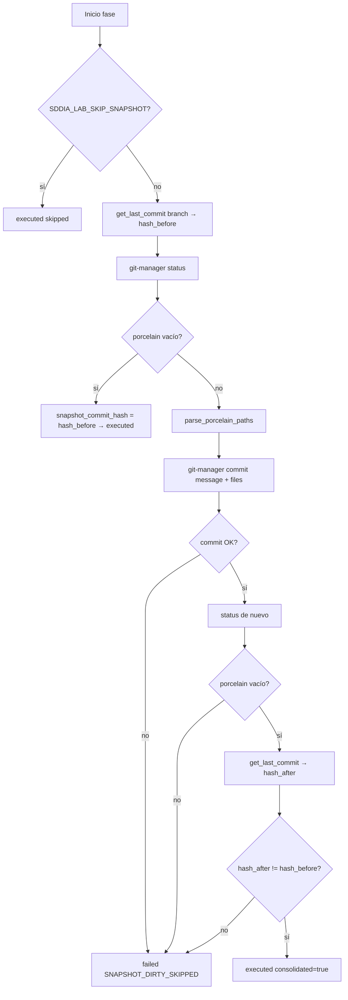

# Especificación — Snapshot final real + `pr_body` vía `--body-file`

## Problema

Incidente en cierre Hito 2 DI (PR #127, `execution_id` `067337ee-4ed1-44f5-b5be-40e8d7f6deb5`):

| Síntoma | Causa en código actual |
|---------|------------------------|
| Fase **Snapshot final** `executed` con `snapshot_commit_hash` = HEAD previo y 26 paths WIP sin consolidar | `capsule_delivery_snapshot_final_with_repo` solo invoca `git-manager get_last_commit`; no lee `status` ni hace `commit` |
| Fase **Apertura en forja** `failed`: `arguments[N] contains forbidden shell metacharacters` | `capsule_delivery_gh_pr` pasa `pr_body` multilínea como `--body <markdown>` en `arguments[]` de `shell-executor` (`assert_safe_token` rechaza `\n`) |
| Push de rama vacía de contenido nuevo | Snapshot falso → push del tip anterior |

**Estado actual (líneas relevantes):**

```105:135:SddIA/engine/execute-process/src/engine/phase_capsules.rs
pub fn capsule_delivery_snapshot_final_with_repo(...) {
    // ...
    let data = invoke_git_manager(repo, "get_last_commit", &json!({"ref": branch}))?;
    // siempre status: executed — sin status/commit previo
}
```

```240:245:SddIA/engine/execute-process/src/engine/phase_capsules.rs
    if let Some(body) = str_field(inputs, "pr_body") {
        args.push("--body".into());
        args.push(body);
    }
```

## Alcance

| ID | Objetivo | Handler |
|----|----------|---------|
| **K1** | Consolidar WIP o abortar; nunca `executed` con HEAD previo + tree sucio | `delivery-snapshot-final` |
| **K2** | `gh pr create` con `--body-file`; cero `\n` en argv de `shell-executor` | `delivery-gh-pr` |
| **K3** | `error_code` tipado en fase/envelope | ambos handlers |
| **K4** | Tests + smoke lab determinista | `phase_capsules` + `_smoke-close-cycle.json` |

**Fuera de alcance:** residual Hito 3 PBI-042; relajar allowlist de `shell-executor`; reescribir producto DI PR #127; mutar genoma (`SddIA/process/`, normas) salvo nota documental en `implementation.md`.

**Invariante:** Git exclusivamente vía `skill:git-manager`. Sin `git` ni `gh` raw en handlers.

---

## K1 — Snapshot final (`capsule_delivery_snapshot_final_with_repo`)

### Flujo



### Reglas

1. **Preflight:** capturar `hash_before` con `get_last_commit` sobre `branch_name`.
2. **Dirty tree:** `git-manager` operación `status` (ya existe). `gitStdout` vacío tras trim ⇒ limpio.
3. **Consolidación:** si hay entradas en porcelain, invocar `git-manager commit`:
   - `message`: `delivery-close: snapshot final consolidado`
   - `files`: paths relativos al repo extraídos de porcelain (ver parser abajo).
4. **Postcondición obligatoria** (gate anti-regresión del incidente):
   - Segundo `status` debe estar limpio.
   - `hash_after` ≠ `hash_before`.
   - Si cualquiera falla ⇒ fase `failed`, **no** propagar `snapshot_commit_hash` al state global.
5. **Skip lab:** `SDDIA_LAB_SKIP_SNAPSHOT=1` sin cambio de contrato.

### Parser `parse_porcelain_paths(git_stdout) -> Vec<String>`

Función pura, unit-testeable en `phase_capsules.rs`:

| Línea porcelain | Path(s) a incluir en `files` |
|-----------------|------------------------------|
| `?? path` | `path` (trim; soporta directorios `dir/`) |
| ` M path`, `M  path`, `A  path`, ` D path`, etc. | columna path (desde índice 3) |
| `R  old -> new`, `RM old -> new` | solo `new` (destino) |
| Línea vacía | ignorar |

Deduplicar paths. Si el vector resultante está vacío tras parseo de stdout no vacío ⇒ tratar como fallo `SNAPSHOT_DIRTY_SKIPPED` (estado no consolidable).

### Salida fase (éxito)

```json
{
  "status": "executed",
  "handler": "delivery-snapshot-final",
  "commit_hash": "<hash_after>",
  "branch": "<branch_name>",
  "consolidated": true,
  "files_committed": 26
}
```

`consolidated: false` (u omitido) cuando el tree ya estaba limpio.

---

## K2 — Apertura en forja (`capsule_delivery_gh_pr`)

### Flujo con `pr_body`

1. Resolver directorio de materialización (orden de precedencia):
   - `{repo}/{persist_ref}/.tmp/` si `persist_ref` presente en `inputs`.
   - Si no: `{repo}/.SddIA/workspaces/delivery-close-cycle/{execution_id}/` si `execution_id` en `inputs` o `state`.
   - Si ninguno: error explícito `persist_ref o execution_id requeridos cuando pr_body está presente`.
2. `create_dir_all` del directorio `.tmp`.
3. Escribir `{dir}/pr-body.md` con contenido UTF-8 de `pr_body` (sin transformación; admite `\n`, backticks, `$`, etc.).
4. Canonicalizar path absoluto; verificar que el path **pasa** las mismas reglas que `assert_safe_token` de `shell-executor` (sin `\n\r;|><\`&&$()` en el token argv).
5. Invocar `shell-executor`:

```text
gh pr create --title <title> --head <branch> --base <target> --body-file <abs_path>
```

6. Si `pr_body` ausente: mantener `--fill` (sin cambio).
7. Rutas `inputs.pr_url` y `SDDIA_LAB_SIMULATE_GH_PR` sin cambio.

### Prohibido

- Pasar `pr_body` (o subcadenas) en `arguments[]`.
- Usar `--body` con contenido multilínea.

---

## K3 — Diagnóstico tipado (`error_code`)

Campo nuevo en entrada de fase cuando `status == "failed"`:

| `error_code` | Fase | Condición |
|--------------|------|-----------|
| `SNAPSHOT_DIRTY_SKIPPED` | Snapshot final | commit fallido, tree sigue sucio, `hash_after == hash_before`, o parser sin paths |
| `PR_BODY_METACHAR` | Apertura en forja | error de `shell-executor` contiene `forbidden shell metacharacters`; o path `--body-file` no pasa preflight de token seguro |

Formato del campo `error` (string): prefijo `[ERROR_CODE] ` + mensaje legible.

Ejemplo fase:

```json
{
  "status": "failed",
  "handler": "delivery-gh-pr",
  "error_code": "PR_BODY_METACHAR",
  "error": "[PR_BODY_METACHAR] arguments[9] contains forbidden shell metacharacters"
}
```

El `execution_report.phases[]` del envelope de `delivery-close-cycle` debe incluir `error_code` para auditoría (Argos / handoff).

---

## K4 — Verificación (lab)

### Tests unitarios (`phase_capsules.rs`)

| Test | Verifica |
|------|----------|
| `parse_porcelain_paths_untracked_and_modified` | `??` + ` M` → paths correctos |
| `parse_porcelain_paths_rename` | `R  a -> b` → solo `b` |
| `pr_body_file_path_is_safe_token` | path generado sin metacaracteres prohibidos |
| `map_shell_metachar_error_to_pr_body_metachar` | mapeo de substring a código |
| `snapshot_dirty_failure_sets_error_code` | mock/helper: condición post-commit sucio ⇒ `SNAPSHOT_DIRTY_SKIPPED` |

### Smoke payload

Archivo: `docs/fixes/kaizen-delivery-close-snapshot-pr-body/_smoke-close-cycle.json`

```json
{
  "source_process": "bug-fix",
  "persist_ref": "docs/fixes/kaizen-delivery-close-snapshot-pr-body",
  "branch_name": "fix/kaizen-delivery-close-snapshot-pr-body",
  "pr_title": "fix(delivery-close): snapshot WIP + pr_body --body-file",
  "pr_body": "## Summary\n- Snapshot consolida untracked\n- PR body multilínea vía --body-file\n\n## Test plan\n- [x] cargo test phase_capsules\n- [x] smoke delivery-close-cycle",
  "target_branch": "main"
}
```

**Ejecución lab documentada en `implementation.md`:**

```bash
export SDDIA_LAB_SKIP_GIT_PUSH=1
export SDDIA_LAB_SIMULATE_GH_PR=1
# opcional: SDDIA_LAB_SKIP_SNAPSHOT=0 (default)
cargo test -p execute-process parse_porcelain
# execute-process delivery-close-cycle con payload smoke + WIP sintético en worktree
```

**Criterio K4:** con WIP untracked en rama de prueba, el close debe:
- **exit 0** y `consolidated: true` en fase Snapshot, **o**
- **exit 1** con `error_code: SNAPSHOT_DIRTY_SKIPPED` (nunca `executed` silencioso con HEAD previo).

Nunca debe aparecer `PR_BODY_METACHAR` cuando `pr_body` contiene newlines y se usa `--body-file`.

---

## Archivos a mutar (Tekton)

| Archivo | Cambio |
|---------|--------|
| `SddIA/engine/execute-process/src/engine/phase_capsules.rs` | K1–K3 handlers + helpers + tests |
| `docs/fixes/kaizen-delivery-close-snapshot-pr-body/_smoke-close-cycle.json` | payload K4 |
| `docs/fixes/kaizen-delivery-close-snapshot-pr-body/implementation.md` | evidencia ejecución (fase Tekton) |
| `docs/fixes/kaizen-delivery-close-snapshot-pr-body/validacion.md` | Argos (fase Verificación) |

**Sin mutación en esta fase:** `git-manager`, `shell-executor`, `delivery-close-cycle.md` (genoma).

---

## Criterios de aceptación

| ID | Criterio | Verificación |
|----|----------|--------------|
| K1-CA | WIP unstaged/untracked ⇒ commit nuevo o `failed` | test + smoke worktree |
| K1-CA2 | Nunca `executed` con `hash_after == hash_before` y tree sucio | test regresión |
| K2-CA | `pr_body` con `\n` no aparece en `arguments[]` | inspección args + test |
| K2-CA2 | `gh` recibe `--body-file` con path absoluto seguro | log fase / mock |
| K3-CA | Fases fallidas incluyen `error_code` tipado | JSON envelope |
| K4-CA | `cargo test` phase_capsules verde | CI local |
| DOC-CA | PBI archivado + `validacion.md` APTO en PR único | cierre documental |

## No objetivos

- Operación nueva `commit_all` en `git-manager` (usar `status` + `commit` existentes).
- Relajar `assert_safe_token` de `shell-executor`.
- Fallback WASM / cwd (PBI cerrado `PBI-KAIZEN-DELIVERY-CLOSE-SHELL-EXECUTOR-WASM-FALLBACK`).
