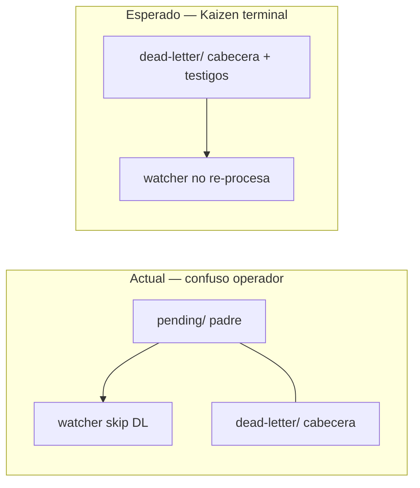

# Especificación — Terminalización Kaizen y higiene post-single-PR

## 1. Diagnóstico raíz (O1)

### 1.1 Clasificación

| Factor | Veredicto |
|--------|-----------|
| Regresión del flujo single-PR (#34) | **No** — cierres actuales con `pbi_archived: true` en rama operan correctamente |
| Residual retroactivo pre-kaizen | **Sí** — eventos `PullRequest_Presented` de PRs #30/#31 emitidos en lote retroactivo (#32) |
| Gap de diseño bus V3+ | **Sí** — estado Kaizen deja padre en `pending/` indefinidamente aunque todos los suscriptores estén terminales |

### 1.2 Eventos afectados

| event_id | PR | Rama | Suscriptor fallido | Causa |
|----------|-----|------|-------------------|-------|
| `19d44586-04ad-4c84-a025-f230139d0a4b` | #30 | `feat/kaizen-cierre-documental-post-merge` | `argos.pull-request-review` | Rama ya fusionada al re-enrutar |
| `fe567363-cf3b-4490-945e-4f5e7a6ff458` | #31 | `docs/cerrar-pbi-kaizen-pr30` | `argos.pull-request-review` | Rama docs post-merge obsoleta (2 PR) |

Ambos tienen: cabecera `dead-letter/`, testigo DL en `argos.pull-request-review`, testigo OK en `cumulo.iota-immutable-publisher`, **y** copia del padre aún en `pending/`.

### 1.3 Comportamiento actual vs esperado



`try_sweep_event` retorna `status: kaizen` y **no** purga `pending/` aunque no queden suscriptores in-flight. El watcher evita re-enrutar (línea 157), pero el padre stale en `pending/` genera ruido operativo y falsas alarmas de «eventos gestionados con error».

---

## 2. Cambio técnico (O2, O5)

### 2.1 Extender `try_sweep_event` — status `kaizen-finalized`

En `eda_bus_utils.py`, rama `kaizen` (dead-letter witnesses presentes):

| Condición | Acción |
|-----------|--------|
| Suscriptores requeridos ⊆ terminales (processed ∪ dead-letter) | Purgar padre de `pending/`; asegurar cabecera `dead-letter/`; purgar cabecera `processing/` si existe |
| Retorno | `{ status: "kaizen-finalized", purged: true, finalized: true }` |
| Suscriptores in-flight o faltantes | Mantener `{ status: "kaizen", purged: false }` (sin cambio) |

Invariante: testigos `dead-letter/subscribers/` y cabecera `dead-letter/` **permanecen** (alerta Kaizen preservada — O3 de event-pending-sweeper).

### 2.2 Integración

| Punto | Cambio |
|-------|--------|
| `route_domain_event_core.py` | Sin cambio adicional (ya invoca `try_sweep_event` al cierre) |
| `event-sweeper.py` | Log `kaizen-finalized` distinto de alerta activa |
| `event-watcher.py` | Log: `"Kaizen terminalizado — padre retirado de pending"` |
| `events-contract.md` | §4 paso 6: terminalización Kaizen cuando consenso terminal con DL |

### 2.3 Retroactivo local (O4)

Manifiesto `eda-legacy-manifest.json` en `persist_ref` con UUIDs #30/#31 y procedimiento:

```powershell
python SddIA/scripts/daemons/event-sweeper.py --once --json
# Esperado: kaizen-finalized para 19d44586… y fe567363…
```

No re-emisión ni re-merge; solo higiene del bus local (`.events/` en `.gitignore`).

---

## 3. Compatibilidad single-PR (O3)

Sin cambio en `delivery-close-cycle`, `task-closure-documental.mdc` ni emisores. Verificación: smoke E2E existente (`run-eda-e2e-lab.py`) debe seguir pasando con `parent_purged: true` en escenario éxito.

Escenario Kaizen en lab: emitir evento con suscriptor simulado fallido → tras terminalización, padre ausente en `pending/`, testigos DL presentes.

---

## 4. Criterios de aceptación

| ID | Criterio | Verificación |
|----|----------|--------------|
| CA-1 | Diagnóstico documentado | Este `spec.md` §1 |
| CA-2 | `try_sweep_event` → `kaizen-finalized` | Unit/logic en lab |
| CA-3 | Padres #30/#31 sin copia en `pending/` | Sweeper `--once` post-fix |
| CA-4 | Testigos DL preservados | Glob `dead-letter/subscribers/*.argos.*` intactos |
| CA-5 | Watcher no re-intenta eventos finalizados | `--once` sin log «Detectado nuevo evento» para UUIDs |
| CA-6 | Regresión E2E éxito | `run-eda-e2e-lab.py` exit 0 |
| CA-7 | Manifiesto retroactivo | `eda-legacy-manifest.json` en persist_ref |

---

## 5. Smoke tests

```powershell
# Terminalización retroactiva
python SddIA/scripts/daemons/event-sweeper.py --once --json

# Regresión E2E
python SddIA/scripts/qa/run-eda-e2e-lab.py

# Watcher ciclo único (sin re-detectar UUIDs finalizados)
python SddIA/scripts/daemons/event-watcher.py --once
```
