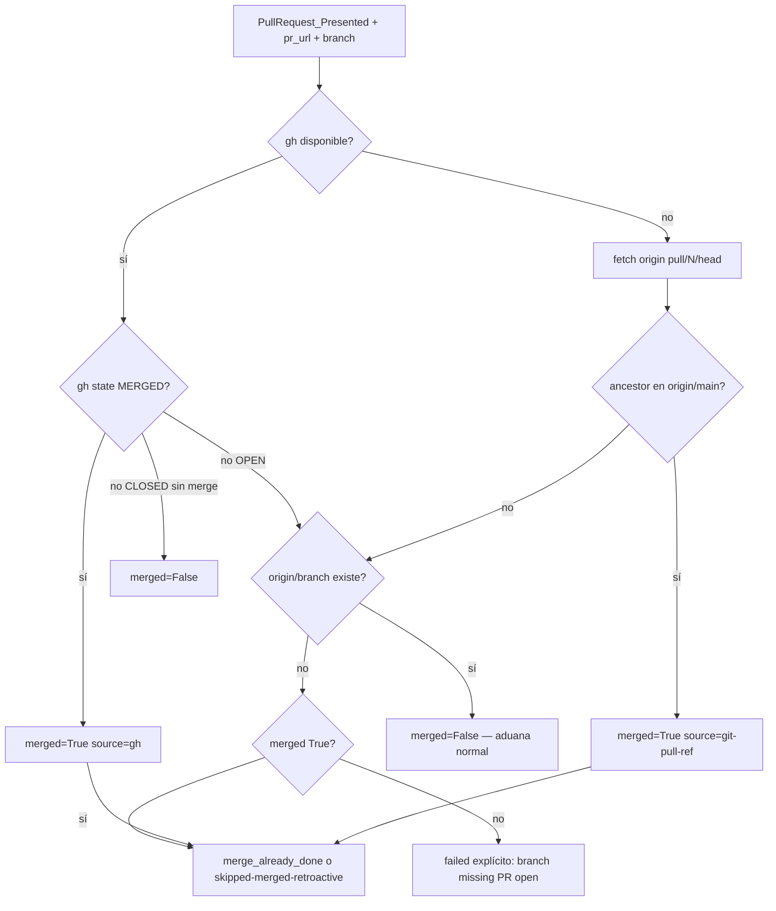

# Clarificación — route-domain-event PR merged resilience

## Preguntas cerradas

| # | Pregunta | Decisión |
|---|----------|----------|
| Q1 | ¿Bug-fix o feature? | **bug-fix** — defecto de resiliencia en router existente |
| Q2 | ¿Dónde vive la lógica nueva? | **`eda_bus_utils.py`** (`resolve_pull_request_lifecycle`); router solo consume |
| Q3 | ¿Modificar `_sync_pr_review_worktree`? | **No en H1** — el router debe evitar invocar checkout innecesario vía `merge_already_done` o skip terminal |
| Q4 | ¿Nuevo estatus terminal? | **Sí:** `skipped-merged-retroactive` — OK para sweep (como `skipped-backfill`) |
| Q5 | ¿Reintentar aduana completa post-merge? | **No** — merge implica cadena `accept-pr` ya ejecutada; aduana es no-op retroactivo |
| Q6 | ¿Depender de GitHub API REST sin `gh`? | **No en v1** — cadena gh → git refs `pull/N/head` → ancestor en `origin/main` |
| Q7 | ¿Forzar PATH a `gh`? | **Sí parcial:** `shutil.which("gh")` + env opcional `SDDIA_GH_EXECUTABLE` |

## Opciones evaluadas

| Opción | Descripción | Veredicto |
|--------|-------------|-----------|
| **A — Solo mejorar PATH gh** | Resolver ruta explícita a `gh.exe` | Insuficiente — no cubre CI sin gh |
| **B — Cadena multicapa (elegida)** | gh → fetch `pull/N/head` → `merge-base --is-ancestor` | **Elegida** |
| **C — Siempre skip si rama podada** | Asumir merge si `origin/branch` ausente | **Rechazada** — falso positivo si push falló |
| **D — Re-emitir Presented tras merge** | Segundo evento | **Rechazada** — duplica IOTA / ruido bus |

## Cadena de resolución (laudo Mayeuta)



## Contrato de salida (`resolve_pull_request_lifecycle`)

```python
{
  "merged": bool | None,       # None = indeterminado
  "source": "gh" | "git-pull-ref" | "unknown",
  "branch_on_remote": bool,
  "pr_number": int | None,
}
```

## Impacto en `dispatch_subscriber`

| Condición | Acción router |
|-----------|---------------|
| `merged is True` | `process_inputs["merge_already_done"] = True` |
| `merged is True` y proceso ≠ revisión crítica | Opcional futuro: skip directo |
| `merged is False` y `branch_on_remote is False` | `failed` con `error_trace` explícito **antes** de subprocess |
| `merged is None` y rama ausente | Intentar pull-ref; si falla → failed explícito |

## Impacto en sweep / testigos

- `_status_is_terminal_ok` debe incluir `skipped-merged-retroactive`.
- Documentar en `events-contract.md` §4 (delta en implementación).

## Riesgos y mitigaciones

| Riesgo | Mitigación |
|--------|------------|
| Falso merge por ref pull stale | Verificar ancestor contra `origin/main` (o `target_branch` del payload si existe) |
| PR de fork | Usar `pr_url` para número; fetch `pull/N/head` sigue siendo válido en mismo repo |
| Latencia extra fetch | Solo cuando gh falla o rama remota ausente |
| Regresión E2E | Tests unitarios mockeados; lab sin cambio de contrato |

## Precedentes

- `docs/fixes/revision-gestion-eventos-kaizen/` — terminalización Kaizen / DL preservado
- `docs/fixes/pr-review-fetch-prune/` — fetch con prune en aduana
- PR #18 — introducción `github_pr_merged` (capa 1 de la cadena)
