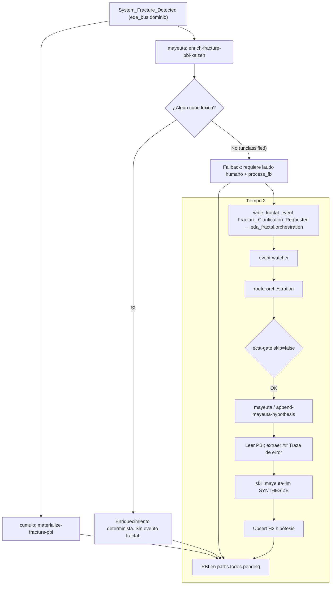

# [FEATURE] Triaje asíncrono de fracturas inéditas (Mayeuta LLM)

## 1. Contexto Arquitectónico y Motivación Ontológica

El circuito de resiliencia Kintsugi reacciona ante `System_Fracture_Detected` con dos acciones suscritas en `SddIA/core/event-domain-subscriptions.json`:

1. **Cúmulo** (`materialize-fracture-pbi`): materializa el PBI en `paths.todos.pending` (`docs/todos/pending/`) con `fracture_hash` (12 hex de SHA-256), `fracture_process` y la traza bajo `## Traza de error`.
2. **Mayeuta** (`enrich-fracture-pbi-kaizen`): handler nativo bajo **Laudo `L-ENRICH-KINTSUGI-DETERMINISTA`**: matcher léxico puro; misma traza → misma sección; **prohibido** `llm:interact` / `skill:mayeuta-llm` en este enrich. Añade `## Conclusión Analítica y Propuesta Evolutiva`.

Cuando **ningún cubo léxico coincide** (incluidos catch-all `timeout|block|abort|colaps`, hook, DLT, etc.), el analizador **no deja `root_causes` vacío**: empuja el fallback:

> *«Causa raíz no clasificada automáticamente para `{process_name}`; requiere laudo humano.»*  
> *Veredicto: `process_fix`.*

Esa delegación satura el ancho de banda del Vértice Biológico. Este PBI inyecta inferencia **fuera** del camino síncrono de `System_Fracture_Detected`.

### Propósito

Usar `skill:mayeuta-llm` (`llm:interact`, `operation: SYNTHESIZE`) sobre fracturas **inéditas**, sin romper el laudo del enrich:

- **Tiempo 1 (síncrono, camino SFD):** enrich sella el PBI determinista y, si `unclassified == true` y hay target, emite `Fracture_Clarification_Requested` al bus fractal (`eda_fractal.orchestration`). **Cero** invocación a `mayeuta-llm` aquí.
- **Tiempo 2 (asíncrono):** `event-watcher` → `route-orchestration` → `action:append-mayeuta-hypothesis`. Mayeuta lee el PBI, invoca `mayeuta-llm` y hace upsert de un H2 consultivo. Fail-open: ningún fallo de inferencia emite `System_Fracture_Detected`.

### Invariante de esta feature (no es un principio SSOT previo)

El LLM **nunca** se ejecuta en el handler de `enrich-fracture-pbi-kaizen` ni en el fan-out síncrono de `System_Fracture_Detected`. Esa separación es el objeto de este ciclo, no un laudo histórico con nombre propio.

---

## 2. Filtro A — Detección y Purga

### 2.1 Hallazgos v1.0.0 (conservados de v1.1.0)

| Fricción v1.0.0 | Clasificación | Realidad SSOT | Resolución |
| :--- | :--- | :--- | :--- |
| Atribuir «Ceguera Espacial» a la latencia del enrich | Distorsión | Ceguera Espacial = no hardcodear rutas (`paths-via-cumulo.md`). El enrich obedece al laudo determinista. | No reabrir. |
| Mutar contrato `mayeuta-llm` con `fracture_filepath` | Ruptura de skill | Inputs: `operation`, `prompt`, `schema`. | Contrato inmutable. Lógica en la Acción. |
| «Red externa / HTTP» en mayeuta-llm | Inexactitud C3 | `local-subprocess` + `SDDIA_LLM_CLI_COMMAND`. | Fallos: env ausente, binario, timeout, stdout inválido. |
| Evento sin Clase ni suscripción | ecst-gate | `route_orchestration_event` usa `skip_ecst_gate = false`. | Clase + índice + `event-orchestration-subscriptions.json`. |
| Proceso envoltorio + acción | Sobre-arquitectura | Fan-out directo a acciones (`dispatch_subscriber` → `try_run_native`). | Solo `action:append-mayeuta-hypothesis`. |
| Anexo ciego | Duplicación | Paridad `upsert_fracture_kaizen_section`. | Upsert por marcador H2. |
| Fractura en fallo de LLM | Bucle | dead-letter de orquestación si `success: false`. | Fail-open `success: true`. |

### 2.2 Hallazgos v1.1.0 (esta pasada)

| Fricción v1.1.0 | Clasificación | Evidencia SSOT | Resolución v1.2.0 |
| :--- | :--- | :--- | :--- |
| Disparar en `run()` si `root_causes.is_empty()` | Inexactitud operativa | Tras el fallback (líneas 364–373 de `enrich_fracture_pbi_kaizen.rs`) el vector **nunca** está vacío. `run()` no ve `root_causes`. | `analyze_fracture_kaizen` expone `unclassified: bool` **antes** del push de fallback. Emitir solo si `unclassified && target resuelto`. |
| «Inédito = root_causes vacío» en el diagrama | Ambiguo | Catch-all `colaps` **es** cubo (`prompt_adjustment`). Fixture `colapsó el daemon` no es inédita. | Inédita = ningún cubo, incluido catch-all. |
| `## Traza Literal de la Fractura` | Alucinación de encabezado | Plantilla Cúmulo: `## Traza de error`. | Extraer de `## Traza de error`. |
| `status: abierta` / `friction_id` | Alucinación de genoma | Frontmatter real: `status: "abierto"`. Campos: `document_id`, `fracture_hash`, `fracture_process`, `incident_ref`. No existe `friction_id`. | Inmutables: esos campos + cuerpo previo al H2 de hipótesis. |
| Latencias ~5/~20/<50 ms como CA | Cifra no medida | No hay benchmark en el crate. El laudo no cita milisegundos. | CA1 = no `invoke_capsule_json` / `mayeuta-llm` en enrich. |
| «Aislamiento Termodinámico» como principio nombrado | Término acuñado | Solo aparece en este PBI. | Definido en §1 como invariante de feature. |
| Prompt «paridad notify_humanized» + temp 0.2 | Conflación de skills | `notify_humanized_pr_merged.rs` llama `gemini-http-infer` con `"temperature": 0.2`. `mayeuta-llm` no declara temperatura. | Kernel de prompt sí; invocación = `kalma2.rs` (`operation`+`prompt`). |
| Hipótesis como `###` dentro de Conclusión | Colisión con upsert | `upsert_fracture_kaizen_section` reemplaza desde el marcador `## Conclusión…` hasta el siguiente `\n## `. Un `###` interior se borra en re-enrich. | H2 `## Hipótesis Semántica (Mayeuta) — Inferencia Asíncrona` entre Conclusión y `## Criterio de cierre`. |
| `context: ecosystem-evolution` en la acción | Fricción RBAC | Mayeuta `allowed_policies`: `knowledge-management`, `filesystem-ops`. Enrich usa `knowledge-management`. | Acción nueva: `knowledge-management`. Evento: `ecosystem-evolution`. |
| Enlazar `route_domain_core` y `route_fractal_core` | Sobre-diseño | `dispatch_subscriber` ya hace `try_run_native(action, payload)`. Fractal reutiliza ese dispatch. | Solo `actions.rs` + `mod.rs`. Payload ECST = inputs de la acción. |
| UUID secuenciales + `sha256:pending` en el PBI | Forja anticipada | `event-creator` / `action-creator` mintean UUID y hash vía `crypto-broker`. | El PBI describe campos; no congela UUID. |
| CA6 «ni alucinaciones de archivos» | Oracle irreproducible | Un test no puede garantizar output LLM. | Compositor + recorte ≤15 líneas; prohibir paths ausentes en el snippet **en el prompt**, no como assert del texto LLM. |
| `delegate-filesystem-manager` en capabilities | Etiqueta vs hecho | Enrich declara esa capability y escribe con `fs::write` nativo. | Handler nativo `fs::write` (paridad enrich). Capabilities: `fracture-semantic-hypothesis`, `delegate-mayeuta-llm`. No fingir invocación a `filesystem-manager`. |
| Índice orchestration «2 clases» | Entropía preexistente | Tabla tiene 3 filas (`tqm`, PEC, `local-qa`). | `event-creator` debe dejar el códice coherente (4 clases tras el alta). |

---

## 3. Topología de Análisis en Dos Tiempos



### Tiempo 1 — `enrich_fracture_pbi_kaizen::run()`

1. Resolver target (cascada `fracture_pbi`; no escribe `done/`).
2. `analyze_fracture_kaizen(...)` → `(verdict, root_md, section, unclassified)`.
3. Upsert de Conclusión (inalterado).
4. Si `unclassified && target_rel` válido: construir envelope ECST y `write_fractal_event(repo, &event, &orch_dir)` con `orch_dir = load_fractal_dirs(repo).1`. **Fail-soft:** error de escritura no cambia `success: true` del enrich.
5. Retorno inmediato. Prohibido `invoke_capsule_json` / `mayeuta-llm` en este módulo.

Trazas clasificadas (heartbeat, DLT, hook, catch-all `colaps`, …) **no** emiten el evento.

### Tiempo 2 — `append-mayeuta-hypothesis`

1. Watcher: `event-watcher` ya mapea `eda_fractal.orchestration` → `route-orchestration`.
2. `route_orchestration_event` valida Clase y despacha suscriptor.
3. `try_run_native("append-mayeuta-hypothesis", payload)`:
   - Si el path no existe o no está bajo `paths.todos.pending` → `success: true`, `synthesized: false`, `reason: target_absent_or_closed`.
   - Extraer traza de `## Traza de error` (fence de código). Si vacía, abortar igual (fail-open).
   - Prompt Filtro C. Invocar `mayeuta-llm` como `kalma2.rs` (`operation: SYNTHESIZE`, `prompt`). **Sin** `temperature`.
   - Extraer `data.text` (envelope cápsula: `body.data.text` según invocador nativo). Recortar ≤15 líneas útiles. Sanear markdown.
   - Upsert H2. No tocar YAML ni `## Traza de error` ni Conclusión.
4. Cualquier fallo de CLI/timeout/stdout → `success: true`, `synthesized: false`, log stderr. **Prohibido** `Err(...)` que haría `dispatch_subscriber` → `failed` → dead-letter.

---

## 4. Clase de Evento: `Fracture_Clarification_Requested`

Forja: `./sddia-run.sh --process entity-manager` con `entity_class: event`, `lifecycle_operation: create`. UUID y `hash_signature` los mintea el creator. **No** copiar UUID de este PBI.

Semilla:

| Campo | Valor |
| :--- | :--- |
| `event_name` | `fracture-clarification-requested` |
| `event_family` | `orchestration` |
| `event_type` | `Fracture_Clarification_Requested` |
| `event_context` | `ecosystem-evolution` |
| `event_version` | `1.0.0` |
| `events_contract_version` | `1.1.0` |

Cuerpo: Payload ECST con viñetas `- \`campo\`` (el parser de `ecst_validation.rs` **solo** reconoce ese formato).

#### REQUIRED

- `fracture_pbi_path`
- `process_name`
- `error_trace_hash`

#### OPTIONAL

- `attempted_action`
- `agent_emitter`
- `correlation_id`

#### FORBIDDEN

- *(ninguno)*

**No** incluir `error_trace` en el payload (tamaño). La acción la lee del PBI.

### Envelope de instancia (emisor enrich)

Paridad `thermodynamic.rs` (PEC):

```json
{
  "event_id": "<uuid-v4>",
  "event_type": "Fracture_Clarification_Requested",
  "event_family": "orchestration",
  "timestamp": "<ISO-8601 UTC>",
  "emitter_agent": "enrich-fracture-pbi-kaizen",
  "payload": {
    "fracture_pbi_path": "<rel>",
    "process_name": "<str>",
    "error_trace_hash": "<12 hex>",
    "attempted_action": "<str>",
    "agent_emitter": "<str>"
  },
  "delivery_state": {}
}
```

`error_trace_hash` = `fracture_trace_hash` (primeros 12 hex de SHA-256 de la traza recortada).

### Emisor autorizado

- `action:enrich-fracture-pbi-kaizen` (solo rama `unclassified`).

### Suscripción

En `SddIA/core/event-orchestration-subscriptions.json` (no es directorio DA-2; mutación en el ciclo de feature, no vía entity-manager):

```json
"Fracture_Clarification_Requested": [
  {
    "agent": "mayeuta",
    "action": "append-mayeuta-hypothesis",
    "intent": "Hipótesis semántica asíncrona (mayeuta-llm) sobre fractura inédita; anexo consultivo."
  }
]
```

Suscripciones de la Clase: apuntar a **ese** JSON (`eda_fractal.orchestration_subscriptions`), no a `event-domain-subscriptions.json`.

---

## 5. Acción: `append-mayeuta-hypothesis`

Forja: entity-manager `entity_class: action` `create`. UUID minteado. Contrato `actions-contract v1.3.0` (vigente; no copiar v1.2.0 del enrich salvo que el creator lo fuerce; semilla `actions_contract_version: "1.3.0"`).

| Campo | Valor |
| :--- | :--- |
| `action_name` | `append-mayeuta-hypothesis` |
| `action_context` | `knowledge-management` |
| `action_capabilities` | `fracture-semantic-hypothesis`, `delegate-mayeuta-llm` |

Inputs (coinciden 1:1 con el payload ECST para el dispatch genérico):

- `fracture_pbi_path` (string)
- `process_name` (string)
- `error_trace_hash` (string)
- `attempted_action` (string, opcional)
- `agent_emitter` (string, opcional)

Outputs:

- `success` (siempre `true` en fallos operativos)
- `synthesized` (boolean)
- `reason` (`injected` \| `replaced` \| `target_absent_or_closed` \| `llm_unavailable` \| `llm_timeout` \| `llm_invalid_stdout`)
- `pbi_path` / `hypothesis_chars` cuando aplique

Handler nativo: `SddIA/engine/execute-process/src/engine/append_mayeuta_hypothesis.rs`. Registro en `actions::try_run_native` y `engine/mod.rs`. **No** tocar `route_domain_core.rs` ni `route_fractal_core.rs`.

### Prompt Kernel (Filtro C)

```text
[EXECUTE AS RAW KERNEL. PROHIBIT VERBOSITY. PENALIZE SPECULATION. MAX 15 LINES]
Analiza la siguiente fractura inédita de SddIA y emite una hipótesis diagnóstica concisa.
No repitas la traza. No inventes rutas ni normas ausentes en CONTEXTO.
Emite EXCLUSIVAMENTE:

- **Causa más probable:** (máximo 3 líneas)
- **Componentes sospechosos:** (solo ficheros/módulos citados o implicados por la traza)
- **Línea de investigación recomendada:** (una acción para el operador humano)

CONTEXTO:
Proceso: {process_name}
Acción fallida: {attempted_action}
Emisor: {agent_emitter}
Traza de error:
{error_trace_snippet}
```

Invocación:

```rust
invoke_capsule_json(repo, "mayeuta-llm", &json!({
    "operation": "SYNTHESIZE",
    "prompt": prompt,
}), false)
```

### Upsert H2

Marcador: `## Hipótesis Semántica (Mayeuta) — Inferencia Asíncrona`

Ubicación: inmediatamente **después** del bloque `## Conclusión Analítica y Propuesta Evolutiva` (hasta su siguiente `## `) y **antes** de `## Criterio de cierre`. Si el H2 ya existe, reemplazar solo ese H2 (hasta el siguiente `\n## `). Si no existe, insertarlo entre Conclusión y Criterio; si Criterio no existe, al final.

Cuerpo encapsulado:

```markdown
## Hipótesis Semántica (Mayeuta) — Inferencia Asíncrona

> ⚠️ **Aviso Consultivo:** Inferencia `mayeuta-llm` asíncrona. No altera el sello determinista. Requiere laudo del Vértice Biológico.

- **Causa más probable:** ...
- **Componentes sospechosos:** ...
- **Línea de investigación recomendada:** ...
```

---

## 6. Leyes de Acero

1. **Sello determinista:** prohibido mutar YAML (`document_id`, `fracture_hash`, `fracture_process`, `status`, `incident_ref`) y `## Traza de error`. Prohibido recalcular el hash.
2. **Consultivo:** no cambia el veredicto `process_fix` / «requiere laudo humano».
3. **Fail-open:** `run()` de la acción nueva retorna `Ok(json!({success: true, ...}))` ante CLI ausente, timeout o stdout inválido. Prohibido emitir `System_Fracture_Detected`. Prohibido `success: false` / `Err` por fallos de inferencia (eso dead-letteraría el evento de orquestación).
4. **Sin orquestación correctiva:** no `git-manager`, no commits, no procesos de entrega.
5. **Ceguera Espacial:** `load_fractal_dirs` / `load_paths_config` para pending y bus. Cero rutas absolutas de host.
6. **Laudo enrich intacto:** este ciclo **no** introduce LLM en `analyze_fracture_kaizen`. Tests existentes del matcher no se relajan.

---

## 7. Plan de Implementación

### Fase 0 — Ciclo feature

`./sddia-run.sh --process feature` con `SDDIA_AGENT_RELAY_IDE=1`, `feature_name: async-fracture-clarification-mayeuta`, rama `feat/async-fracture-clarification-mayeuta`, `persist_ref: docs/features/async-fracture-clarification-mayeuta`. Prefijo Raw Kernel antes de mutar genoma.

### Fase 1 — Gobernanza de eventos (entity-manager)

1. **[NEW via EM]** Clase `fracture-clarification-requested` (familia orchestration).
2. Índice `SddIA/events/orchestration/index.md` (el creator sincroniza fila + conteo).
3. **[MODIFY directo, no genoma DA-2]** `SddIA/core/event-orchestration-subscriptions.json`.

### Fase 2 — Disparador enrich (código motor; no DA-2)

4. **[MODIFY]** `enrich_fracture_pbi_kaizen.rs`: 4º retorno `unclassified`; emitir evento fail-soft. Actualizar call sites/tests del 3-tuple.
5. Tests: cubo conocido **no** escribe en orchestration; inédita sí; `no_target` no emite.

### Fase 3 — Acción + handler nativo

6. **[NEW via EM]** `append-mayeuta-hypothesis.md` + índice de acciones.
7. **[NEW]** `append_mayeuta_hypothesis.rs` (prompt, invocación, upsert, fail-open).
8. **[MODIFY]** `engine/mod.rs` + `actions.rs` (`try_run_native`). Nada en routers.

### Fase 4 — Agente

9. **[UPDATE via EM]** `mayeuta.md`: documentar reacción a `Fracture_Clarification_Requested` (consultiva, fail-open). Conservar jurisdicción «no repara». `uuid` del agente inmutable.

### Fase 5 — Evolution

10. Registro `{uuid}.md` bajo `directories.evolution` (contrato v1.1.2). `sddia-qa gate-evolution --json --range` si el diff toca evolution, **antes** del push.

---

## 8. Criterios de Aceptación

| ID | Enunciado | Verificación |
| :--- | :--- | :--- |
| **ASYNC-CLARIFY-CA1** | Enrich con traza inédita sella el PBI, emite el evento fractal y **no** invoca `mayeuta-llm`. Trazas con cubo (p. ej. heartbeat, `colaps`) **no** emiten. | `cargo test -p execute-process --lib -- enrich_fracture_pbi_kaizen` |
| **ASYNC-CLARIFY-CA2** | Instancia con payload REQUIRED supera `validate_ecst_instance` / `route_orchestration_event` (no dead-letter por schema). | Test con Clase cargada + `route_orchestration_event` sobre fixture. |
| **ASYNC-CLARIFY-CA3** | Doble ejecución de la acción reemplaza el H2; no duplica. | Fixture PBI + dos `run()`. |
| **ASYNC-CLARIFY-CA4** | YAML y `## Traza de error` y Conclusión idénticos byte a byte salvo el H2 de hipótesis. | Diff estructurado. |
| **ASYNC-CLARIFY-CA5** | Sin `SDDIA_LLM_CLI_COMMAND` (o CLI que falla): `success: true`, `synthesized: false`, PBI sin H2 nuevo, cero JSON en `eda_bus.pending` emitidos por esta acción. | Mock CLI ausente/fallido. |
| **ASYNC-CLARIFY-CA6** | El compositor incluye MAX 15 LINES, los 3 campos y la prohibición de rutas no presentes en CONTEXTO. El recorte de salida limita a 15 líneas. | Tests del compositor/validador; **no** oracle LLM vivo. |

---

## 9. Plan de Verificación

### Automatizado

- `cargo test -p execute-process --lib -- enrich_fracture_pbi_kaizen`
- `cargo test -p execute-process --lib -- append_mayeuta_hypothesis`
- `cargo test -p execute-process --lib -- ecst_validation` (si el filtro nombra la clase) o test dedicado de schema `Fracture_Clarification_Requested`

### Lab (no gate de CA)

1. Fractura con traza `test_trace_inedita_xyz` (sin tokens de cubo).
2. PBI en pending con fallback humano.
3. JSON en `.events/orchestration/`.
4. `route-orchestration` (o watcher) → H2 de hipótesis **solo si** hay CLI LLM configurado; si no, CA5.
5. Caída de CLI: sin bucle, PBI íntegro.

### CI / cierre

`validacion.md` no declara `global: APTO` en CA de GitHub Actions sin `run_id` verde (`features-documentation-pattern` v1.2.1). `accept-pr` solo tras checks verdes del PR. Cierre documental en la **misma** rama: PBI → `docs/todos/done/`, `pbi_archived: true`.
