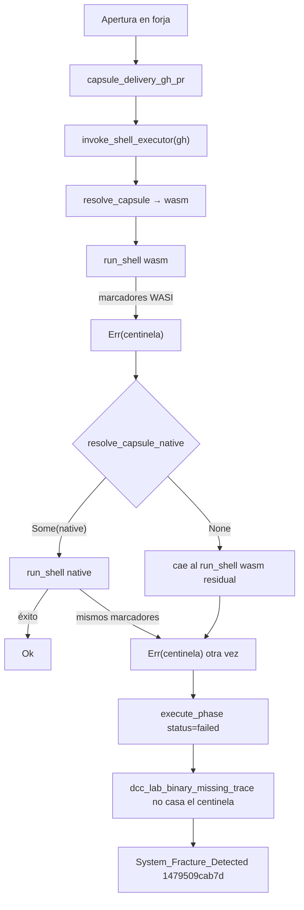

# [FIX] delivery-close-cycle — fractura sistémica (1479509cab7d)

## 1. Incidente (SSOT Cúmulo)

| Campo | Valor |
|-------|-------|
| **Proceso** | `delivery-close-cycle` |
| **Emisor** | `execute-process` |
| **Acción intentada** | `Apertura en forja` |
| **Fricción runtime** | `F-DCC-APERTURA-EN-FORJA` (`dcc_friction_id` deriva del nombre de fase; no hay friction_id tipado para este centinela) |
| **Hash de fractura** | `1479509cab7d` (`sha256("shell-executor wasm fallback marker")[:12]`, verificado) |

### Traza de error registrada

```text
shell-executor wasm fallback marker
```

### Mandato

Corregir la causa raíz del colapso y del sobre-escalado. **Prohibido bypass raw** (`gh`, `git`, `curl`) hasta cierre documentado.

---

## 2. Auditoría de alucinaciones (v1.0.0 → v1.1.0 → v1.2.0)

### 2.1 v1.0.0 (HEAD, síntesis Mayeuta)

Cuerpo committed: traza = centinela; diagnóstico = verbatim de `is_remote_branch_absent_trace`.

| Tesis v1.0.0 | Veredicto | Base |
|--------------|-----------|------|
| Causa = rama ausente / `Head sha can't be blank` | **Alucinación de asignación** | El predicado exige esas subcadenas en `error_trace`. El centinela no las contiene. La copia verbatim indica que se escribió sobre este PBI la síntesis de **otra** fractura DCC (cubo head-sha), no que el centinela casara el matcher. |
| Solución = halt post-push | **Obsoleto** | `halt_after_push` + `dcc_post_push_phase` + `dcc_push_terminal_halt` existen desde `b2698e1` (2026-08-31). No toca `shell-executor`. Prohibido reimplementar. |
| Veredicto `process_fix` genérico | **Incompleto** | El fallo vive en `invoke_shell_executor` (`capsules.rs`) + aduana Kintsugi (`delivery_close.rs`). |

### 2.2 v1.1.0 (refinamiento previo, working tree)

Acertó el síntoma (fuga del centinela + `emit_dcc_phase_fractures`). Inexactitudes:

| Tesis v1.1.0 | Corrección v1.2.0 |
|--------------|-------------------|
| «inyección ciega porque el centinela activa `is_remote_branch_absent_trace`» | Falso. El matcher no casa. Contaminación de **target/asignación**, no de matching. |
| Añadir `F-DCC-LAB-BINARY-MISSING` en `classify_delivery_error` | **Inventado.** No existe en el motor. Ola 3 suprime fractura **sin** friction_id nuevo. `classify_delivery_error` → `None` ⇒ `capsule_delivery_gh_pr` retorna `Err` ⇒ `execute_phase` sella `status: failed`. No hace falta clasificador nuevo. |
| `F-DCC-SHELL-EXECUTOR-WASM-FALLBACK` como friction runtime | Solo etiqueta documental. Runtime emite `F-DCC-APERTURA-EN-FORJA`. |
| Re-añadir match «cápsula skill 'shell-executor' no encontrada bajo sddia/target» | **Ya cubierto** por Ola 3: `dcc_lab_binary_missing_trace` = `cápsula skill` ∧ `no encontrada bajo sddia/target` (test existente L836–838). |
| Causa única = ELF ausente + re-ejecución WASM | Incompleto. `run_shell` convierte marcadores a centinela **también en vía nativa**. Lab actual tiene `SddIA/target/debug/shell-executor`. `resolve_capsule_native` puede devolver `None` con ELF presente si `SDDIA_CAPSULE_ANCHOR` y hash stale (`.ok()`). |
| `phase_capsules.rs` en `execution_file_lock` | Fuera de alcance si no se inventa friction_id. |

---

## 3. Diagnóstico técnico (causa raíz)

Dos grietas independientes; cualquiera fuga el centinela a DCC y escala a Kintsugi.



1. **Centinela como canal de control que se fuga** (`capsules.rs` `invoke_shell_executor` / `run_shell`):
   - WASM falla con `SHELL_EXECUTOR_NATIVE_FALLBACK_MARKERS` (`working_directory invalid`, `executable not found on path`, `failed to execute`, `os error 44`) → `Err("shell-executor wasm fallback marker")`.
   - Si `resolve_capsule_native` es `None`, el `if kind == "wasm"` **no retorna**; la línea residual `run_shell(repo, &kind, &path, …)` re-ejecuta WASM y devuelve el centinela crudo. Patrón correcto ya existe en `invoke_git_manager` (no reintenta WASM).
   - Si hay nativo, `run_shell` **sigue** convirtiendo marcadores a centinela. Un `gh` ausente o un `failed to execute` nativo se enmascara igual. El centinela no debe emitirse fuera de WASM.

2. **Sobre-escalado Kintsugi** (`delivery_close.rs`):
   - `dcc_lab_binary_missing_trace` casa `sddia-qa no encontrado` y el par `cápsula skill` + `no encontrada bajo sddia/target`.
   - **No** casa el centinela. `emit_dcc_phase_fractures` materializa `System_Fracture_Detected`. Receta de lab / fallback WASI ≠ colapso ontológico (paridad Ola 3 `ca3d901fdc9a`, `A-COMPILE-RECIPE-NO-KINTSUGI`). **No** `fail_soft`: el ciclo sigue `failed`.

3. **Mayeuta ciego** (`enrich_fracture_pbi_kaizen.rs`):
   - Sin cubo para el centinela. Catch-all `process_fix` o, como en v1.0.0, síntesis de otra fractura asignada a este PBI.

---

## 4. Veredicto y solución

### Veredicto: `refactor_tool` (+ aduana `process_fix` de supresión, sin friction_id nuevo)

1. **`capsules.rs` — `invoke_shell_executor`:**
   - Extraer decisión pura testeable (sin wasmtime): si WASM falla y no hay nativo, **no** re-ejecutar WASM.
   - Si el error WASM es el centinela o contiene marcadores de fallback → error canónico reutilizando el literal Ola 3:
     ```text
     cápsula skill 'shell-executor' no encontrada bajo SddIA/target (fallback nativo requerido por WASI)
     ```
     (el predicado Ola 3 ya lo casa; el sufijo es diagnóstico).
   - Si el error WASM no es de fallback → propagar el error real (tampoco re-ejecutar WASM).
   - Vía nativa: `run_shell` **no** convierte a centinela; propaga `stderr`/`error` real.
   - El centinela queda como señal interna de WASM, no como `Err` hacia DCC.

2. **`delivery_close.rs` — defensa en profundidad:**
   - Añadir el centinela a `dcc_lab_binary_missing_trace` (case-insensitive).
   - **No** re-añadir el literal canónico (ya cubierto).
   - **No** `fail_soft`. **No** `F-DCC-LAB-BINARY-MISSING`.

3. **`enrich_fracture_pbi_kaizen.rs`:**
   - Cubo explícito **antes** del catch-all: centinela o mensaje canónico de `shell-executor` ausente → `refactor_tool`, diagnóstico sandbox WASI / fallback nativo, **cero** texto de git push / head-sha.

4. **Fuera de alcance:**
   - `phase_capsules.rs` / `classify_delivery_error`.
   - Reabrir `halt_after_push`.
   - Mutar genoma DA-2 (`skills/`, `process/`, `norms/`).
   - Compilar `shell-executor` como único remedio (Ola 1–2); este ciclo sanea el runtime.

---

## 5. Criterios de aceptación

| ID | Criterio | Método |
|----|----------|--------|
| **KZ-DCC-CA1** | Tras fallo WASM sin nativo, `invoke_shell_executor` no reintenta WASM; error canónico con `cápsula skill 'shell-executor'` ∧ `no encontrada bajo SddIA/target`. Función pura de decisión cubierta por test sin wasmtime. | `capsules.rs` unit |
| **KZ-DCC-CA2** | `dcc_lab_binary_missing_trace` es `true` ante el centinela. El literal canónico de `shell-executor` sigue `true` (regresión Ola 3). Negativos Ola 3 intactos. | `delivery_close.rs` unit |
| **KZ-DCC-CA3** | `emit_dcc_phase_fractures` no escribe `System_Fracture_Detected` en `.events/pending` si `Apertura en forja` + `failed` + centinela. | `delivery_close.rs` unit |
| **KZ-DCC-CA4** | `analyze_fracture_kaizen` clasifica el centinela como `refactor_tool` (WASI / nativo ausente). Cero `Head sha` / `Halt de Apertura`. Catch-all head-sha intacto para su propia traza. | `enrich_fracture_pbi_kaizen.rs` unit |
| **KZ-DCC-CA5** | Vía nativa no emite el centinela: marcadores en error nativo se propagan como texto real. | `capsules.rs` unit |

---

## 6. Criterio de cierre

- [x] CA1–CA5 verdes (`cargo test -p execute-process` con filtros de este fix).
- [x] Argos en `{persist_ref}/validacion.md` (`pbi_archived: true`). CA de CI = `PENDIENTE-CI` hasta `run_id` verde.
- [x] Este PBI en `docs/todos/done/` en el mismo PR.
- [x] `accept-pr` solo tras checks GitHub verdes del PR.
