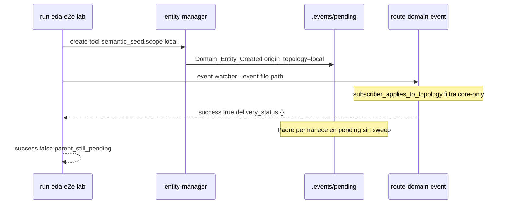

# [Kaizen] eda-bus-e2e-smoke — topología local vs suscriptores core y sweep vacío

> **Cerrado** vía consolidación e implementación en [`PBI-KAIZEN-EDA-COVERAGE-SSOT-BUS-ISOLATION`](../done/[Kaizen]%20EDA%20cobertura%20durable,%20aislamiento%20bus%20y%20smoke%20e2e%20—%20SSOT%20eda-coverage.md) (rama `feat/eda-coverage-ssot-bus-isolation`).

**Estatus:** Cerrado (consolidado)  
**Jurisdicción:** Yunque Operativo · Sistema Nervioso EDA / CI  
**Precedencia:** Kaizen higiene ficheros temporales (forja E2E con `scope: local`); **no** introducido por PR #48 (`Kaizen_Alert_Required`)

---

## 1. Incidente

| Campo | Valor |
|-------|--------|
| **Síntoma** | Job CI `eda-bus-e2e-smoke` falla con exit code 1 |
| **Workflow** | `.github/workflows/sddia-index-qa.yml` |
| **Comando** | `python SddIA/scripts/qa/run-eda-e2e-lab.py --entity-class tool --json` |
| **Alcance** | Falla en `main` previo a PR #48; persiste tras merge #48 |
| **Checks que pasan** | `verify-tools-index`, `eda-iota-smoke-simulate`, `eda-iota-physical` |

### Salida típica (local / CI)

```json
{
  "witnesses_processed": [],
  "processing_header_created": true,
  "parent_still_pending": true,
  "sweep": {},
  "parent_purged": false,
  "success": false,
  "cleaned": true
}
```

El lab **sí** limpia el artefacto forjado en `finally` (`cleaned: true`), pero el criterio de éxito del smoke exige purga del padre en el bus.

---

## 2. Causa raíz (laudo técnico)

Desacople entre **forja lab en topología `local`** y **suscripciones `Domain_Entity_*` acotadas a `core`**, amplificado por **salida anticipada del router sin sweep**.



| # | Causa | Ubicación |
|---|--------|-----------|
| **C1** | Lab forja con `scope: "local"` (higiene — no ensuciar `SddIA/tools/`) | `run-eda-e2e-lab.py` |
| **C2** | Suscriptores `Domain_Entity_Created` con `applies_to_origin_topology: ["core"]` | `event-subscriptions.json` |
| **C3** | `origin_topology: local` → lista de suscriptores vacía tras filtro | `eda_bus_utils.subscriber_applies_to_topology` |
| **C4** | `route_domain_event` retorna `success: true` sin invocar `try_sweep_event` cuando `subscribers == []` | `route_domain_event_core.py` |
| **C5** | Criterio E2E exige `not pending.is_file()` y `sweep.status == "purged"` | `run-eda-e2e-lab.py` |

**Laudo:** no es regresión de `Kaizen_Alert_Required`; es tensión **lab local vs router core-only + sweep incompleto en rama sin suscriptores**.

---

## 3. Opciones de corrección (evaluar en clarify — sin decisión cerrada)

| Opción | Descripción | Pros | Contras |
|--------|-------------|------|---------|
| **A — Router** | Si `subscribers == []` tras filtro topológico, invocar `try_sweep_event` y purgar padre cuando `required_subscriber_ids_for_event` esté vacío (`status: no-subscribers` → purga explícita) | Corrige el agujero genérico; beneficia cualquier evento sin fan-out aplicable | Cambio semántico en `route-domain-event`; requiere tests de no-regresión core |
| **B — Lab scope core** | En CI (o siempre), forzar `semantic_seed.scope: "core"` en `run-eda-e2e-lab.py` | Smoke vuelve a verde rápido | Contradice higiene Kaizen; reintroduce ruido genómico / orphans en Core |
| **C — Suscripciones local** | Añadir suscriptor lab noop para `local` (p. ej. stub `sync-entity-index` con `applies_to_origin_topology: ["local"]`) o ampliar reglas documentadas | Modelo EDA explícito para topología local | Más superficie en `event-subscriptions.json`; riesgo de fan-out innecesario en prod |
| **D — Criterio E2E** | Aceptar éxito cuando `origin_topology == local`, `delivery_status == {}`, teardown limpio y ausencia de witnesses dead-letter | Alineado con intención del lab (forja efímera) | No valida purge del bus; CI menos estricto en ciclo completo |

### Criterio de elección (borrador)

- Preferir solución que mantenga **`scope: local`** en lab (no revertir higiene).
- `eda-bus-e2e-smoke` debe quedar **verde en `main`** sin `SDDIA_SKIP_HOOKS`.
- Coherencia con PBI `PBI-KAIZEN-EDA-AUDIT-NO-BUS-DEPENDENCY`: purga / correlación no deben depender de workarounds opacos.

**Recomendación preliminar (Mayeuta):** evaluar **A** como fix estructural; **D** como complemento del contrato del lab si A no basta para el criterio `sweep.status == "purged"`.

---

## 4. Backlog atómico (borrador)

| Hito | Objetivo | Criterio |
|------|----------|----------|
| **H1** | Laudo en `clarify.md` | Opción elegida (A/B/C/D o híbrido) con trade-offs |
| **H2** | Implementación router y/o lab y/o suscripciones | Según opción elegida |
| **H3** | Smoke local reproducible | `run-eda-e2e-lab.py --json` → `success: true` |
| **H4** | CI verde | `eda-bus-e2e-smoke` SUCCESS en PR de cierre |
| **H5** | No regresión core | Smoke con entidad `core` (fixture opcional) sigue purgando vía suscriptores |
| **H6** | Documentación | `execution.md` + `validacion.md` APTO; PBI en `done/` |

---

## 5. Protocolo de validación empírica

1. En `main` (pre-fix): ejecutar lab → confirmar `parent_still_pending: true`, `success: false`.
2. Aplicar fix en rama `fix/eda-bus-e2e-smoke-local-topology`.
3. Repetir lab → `success: true`, working tree limpio post-`finally`.
4. Push PR → job `eda-bus-e2e-smoke` SUCCESS.
5. `verify-process-integrity` sin regresión.

---

## 6. Criterios de aceptación (Definition of Done)

| ID | Criterio |
|----|----------|
| E2E-CA1 | Causa raíz documentada en `clarify.md` con opción elegida |
| E2E-CA2 | `run-eda-e2e-lab.py --entity-class tool --json` → exit 0 local |
| E2E-CA3 | CI `eda-bus-e2e-smoke` SUCCESS en PR mergeado |
| E2E-CA4 | Forja lab mantiene `scope: local` (salvo laudo explícito en contra) |
| E2E-CA5 | `validacion.md` APTO + PBI archivado en `done/` (un PR) |

---

## 7. Inicio formal sugerido

| Campo | Valor |
|-------|--------|
| Proceso | `bug-fix` v1.4.0 |
| Rama | `fix/eda-bus-e2e-smoke-local-topology` |
| `persist_ref` | `docs/fixes/eda-bus-e2e-smoke-local-topology` |
