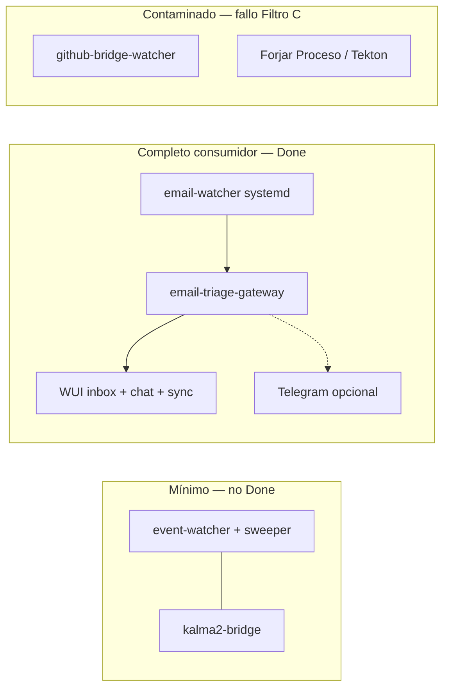

# [LABORATORIO] Ensayo Clínico — Despliegue Paciente 0 (SddIA_AP)

## 0. Estado del refinamiento

| Hecho | Verificación |
|-------|--------------|
| Genoma de triaje | **Forjado y mergeado** — `PBI-KALMA2-MVP-01A` + `01B` en `main` |
| Rol de este PBI | **Despliegue operativo autónomo** (sin dossier `feature` ni `execute-process --process feature`). No forja de entidades: el genoma ya existe en `SddIA/` |
| Paciente 0 productivo | **Kalma2** (Asistente Personal). GesFer relevado |
| Configuración usuario | **Necesidad explícita** (§4.2). MVP del ensayo = plantilla + checklist manual. UX guiada = **deuda técnica** `DT-CONFIG-UX-ONBOARDING` (§8.1) |
| Persistencia sensorial | **systemd user obligatorio** para `email-watcher` (Fase 3b, Anexo C, Gate G3b). Núcleo EDA/WUI vía `start-sddia.sh` |
| Matriz de producto | §2.1 — perfiles Mínimo / Completo consumidor / Contaminado |
| Instancia objetivo | **Materializada:** `/home/racso/Proyectos/SddIA_AP` |
| Avance implementación | **APTO archivado** — §11.7. Lab `email-watcher` permanece `inactive` hasta reactivación manual |
| Starter-kit SSOT | `SddIA/scripts/starter-kit/.SddIA/` |
| Bus runtime | `./.events/{telemetry,orchestration,domain}/` — **no** confundir con `.SddIA/events/` |
| Overlay de rutas | `.SddIA/local.paths.json` (no `local.paths.json` en raíz) |
| Constitución local | `.SddIA/constitution/CONSTITUTION.md` + `constitution.json` |
| Triaje semántico | Proceso empacado `email-triage-gateway` bajo `codex-kalma2-assistant`; inferencia vía capacidad `llm:interact` → skill `mayeuta-llm`. **No** es el agente Mayeuta orquestando el buzón |
| Mayeuta en este circuito | Agente titular de `telegram-fallback-responder` (`TelegramMessage_Received`); triaje inverso humano |
| Notificación eferente | `Email_Triaged` → tool `send-telegram-notification` (solo `verdict=actionable`) |
| Entropía excluida | `codex-software-engineering`, hooks Git, procesos `feature`/`bug-fix`/`pull-request-review`, agente Tekton |

Correcciones respecto al borrador v0: eliminadas alucinaciones de `.SddIA/events/` como bus federal, `CONSTITUTION.md` suelto en raíz, y la atribución exclusiva del triaje de correo al agente Mayeuta.

## 1. Propósito

Materializar y auditar el **primer despliegue orientado al consumidor final**: una instancia `SddIA_AP` que demuestre valor directo (triaje y gestión de correo) sobre un motor inerte (Core SddIA) con genoma de dominio inyectado (`codex-kalma2-assistant`), **sin** contaminación del ciclo de ingeniería de software del repositorio maestro.

**Done operativo:** correo real → veredicto → visibilidad humana (WUI Kalma2 y/o Telegram) en un entorno aislado, con telemetría de Aduana conforme y fricciones destiladas a documentación del motor.

## 2. Delimitación de alcance

### En alcance

| Hito | Entrega |
|------|---------|
| H1 | Topología física aislada: clon/sync del Core + overlay starter-kit |
| H2 | Configuración de instancia: bóveda documentada, overlay, constitución táctica (§4.2) |
| H3 | Ignición del Sistema Nervioso mínimo productivo (EDA + sensorial + WUI) |
| H3b | **Persistencia systemd** del centinela sensorial (`email-watcher`) — obligatorio |
| H4 | Poda de entropía de ingeniería (Filtro C) |
| H5 | Prueba de fuego causal con correo real |
| H6 | Informe de fricciones → Sabiduría Estratégica (`SddIA/evolution/` o anexo en este PBI) |

### Fuera de alcance

- Forja de entidades en genoma (`entity-manager`). Ya cerrado en MVP 01A/01B.
- Minteo real IOTA Rebased.
- `codex-software-engineering` y cualquier proceso empacado bajo él.
- Hooks pre-commit / pre-push del repo de desarrollo.
- Backfill de correo anterior a `SDDIA_EMAIL_INITIAL_LOOKBACK_DAYS` (60 días).
- **Plantillas systemd del núcleo EDA/WUI** (`event-watcher`, `event-sweeper`, `kalma2-bridge`, `telegram-watcher`). Solo `email-watcher` tiene template hoy; resto vía `start-sddia.sh` + deuda `DT-SYSTEMD-FULL-COVERAGE`.
- **Asistente UX de configuración** (wizard WUI, formularios, validación interactiva de bóveda). Necesario para usuario final; **no bloquea** el ensayo. Registrado como `DT-CONFIG-UX-ONBOARDING` (§8.1).

### 2.1 Matriz de circuitos disponibles (perfil de bóveda + ignición)

Referencia operativa: qué **producto** ve el usuario según configuración e ignición. Perfiles auditables en el informe de cierre.

| Circuito / capacidad | Mínimo | Completo consumidor | Contaminado |
|----------------------|:------:|:-------------------:|:-----------:|
| **Núcleo EDA** (`event-watcher` + `event-sweeper`) | Sí* | Sí | Sí |
| **WUI Kalma2** (`kalma2-bridge` :8765) | Sí* | Sí | Sí |
| **Chat LLM** (`POST /api/chat`) | No | Sí (bóveda LLM) | Sí |
| **Sync códice** (`POST /api/sync-assets`) | Sí* | Sí | Sí |
| **Correo aferente** (`email-watcher` → `Email_Received`) | No | Sí (IMAP en bóveda) | Sí |
| **Triaje determinista** (Triaje-C → `Email_Triaged`) | No | Sí (con correo) | Sí |
| **Triaje LLM** (fase Clasificacion) | No | Sí (IMAP + LLM) | Sí |
| **Inbox WUI + acciones rápidas** (`/api/email-inbox`, `/api/email-quick-action`) | No | Sí (veredicto `actionable`) | Sí |
| **Agenda local** (`.SddIA/agenda/`) | No | Sí (`actionable` + extracción OK) | Sí |
| **Telegram eferente** (`Email_Triaged` → `send-telegram-notification`) | No | Opcional (token) | Sí |
| **Telegram aferente** (`telegram-watcher` → `telegram-fallback-responder`) | No | Opcional (token + chat id) | Sí |
| **Persistencia sensorial systemd** (`sddia-email-watcher@`) | No | **Sí (obligatorio ensayo)** | Parcial |
| **Resiliencia SIGKILL email-watcher** (<5 s, Anexo C) | No | **Sí (Gate G3b)** | No garantizado |
| **Núcleo vía systemd** | No | No (deuda `DT-SYSTEMD-FULL-COVERAGE`) | No |
| **`github-bridge-watcher`** | No | **No (Filtro C)** | Sí† |
| **Superficie forja WUI** (botón «Forjar Proceso») | Oculta/no usada | **No usar (Filtro C)** | Expuesta‡ |
| **Procesos ingeniería** (`feature`, `PR-review`, Tekton) | No | No | Sí‡ |
| **Relay IOTA / anclaje DLT** | No | No (starter-kit puede arrancarlo) | Sí |

\* Perfil **Mínimo**: solo si el operador levanta manualmente `start-sddia.sh` sin IMAP — nodo vivo, **sin valor de correo**. No satisface Done del ensayo.

† `start-sddia.sh` actual intenta arrancar `github-bridge-watcher` como opcional → perfil **Contaminado** si arranca. Mitigación ensayo: no exportar credenciales GitHub; verificar ausencia de heartbeat en logs (§5 Fase 4).

‡ Superficie presente en genoma/WUI pero **prohibida** en SddIA_AP. Perfil **Completo consumidor** = circuitos de valor sin invocar forja.

#### Perfil objetivo del ensayo: **Completo consumidor**

Requisitos acumulativos:

1. Bóveda: IMAP (`HOST`, `USER`, `SECRET`) + LLM recomendado + Telegram opcional.
2. Ignición: `start-sddia.sh` para EDA + WUI; **systemd user** para `email-watcher` (Anexo C).
3. Filtro C: sin `github-bridge-watcher` activo, sin invocaciones de forja, sin Tekton.
4. First Blood (G5): correo real → veredicto → WUI inbox (± Telegram eferente).



## 3. Topología objetivo

```
/home/.../SddIA_AP/                          ← Instancia de consumo (WorkingDirectory)
├── SddIA/                                   ← Genoma sincronizado (solo lectura operativa)
├── interfaces/kalma2/                       ← WUI estática
├── start-sddia.sh                           ← Ignición (copiado/adaptado del maestro)
├── .dev/.env                                ← Bóveda raíz (fallback)
├── .SddIA/                                  ← Periferia de instancia (starter-kit)
│   ├── .dev/.env                            ← Bóveda instancia (prevalece)
│   ├── local.paths.json                     ← Overlay Cúmulo
│   ├── constitution/                        ← Ley táctica del consumidor
│   ├── library/codexes/                     ← Códice inyectado (sync-client-assets)
│   ├── daemons/{status,state,logs,inbox}/   ← Estado periférico
│   └── agenda/                              ← Asientos actionable
└── .events/                                 ← Bus runtime fractal (gitignored)
    ├── domain/                              ← Email_Received, Email_Triaged, …
    ├── orchestration/
    └── telemetry/                           ← Daemon_Heartbeat
```

**SSOT de rutas:** `SddIA/core/cumulo.paths.json` ± overlay `.SddIA/local.paths.json`.

## 4. Prerrequisitos

### 4.1 Host

| Requisito | Comando / evidencia |
|-----------|---------------------|
| Rust toolchain | `cargo --version` |
| Binarios nativos | `(cd SddIA && cargo build -p kalma2-bridge -p execute-process -p event-watcher -p event-sweeper -p email-watcher -p telegram-watcher)` |
| **systemd (usuario)** | `systemctl --user` operativo; `loginctl enable-linger $USER` si el centinela debe sobrevivir cierre de sesión |
| Node (relay IOTA opcional) | Solo si `SDDIA_LAB_SIMULATE_IOTA=0` |
| `curl`, `file` | Health check Kalma2 |

### 4.2 Configuración del consumidor (necesidad + MVP del ensayo)

El primer despliegue a usuario final **exige un contrato de configuración explícito**: qué informar, dónde, qué es obligatorio y qué falla si falta. Sin eso, el ensayo solo es reproducible por operadores que conocen el genoma.

#### 4.2.1 Principio

| Capa | Qué configura el usuario | Dónde |
|------|--------------------------|-------|
| Secretos y runtime | Credenciales IMAP, LLM, Telegram, puertos | `{instancia}/.SddIA/.dev/.env` (prevalece sobre `.dev/.env` raíz) |
| Identidad / ley táctica | Producto, workspace, directrices de triaje locales | `.SddIA/constitution/{CONSTITUTION.md,constitution.json}` |
| Overlay de rutas | Solo si el consumidor mueve library local | `.SddIA/local.paths.json` (plantilla starter-kit; no editar salvo soberanía) |

**Prohibido:** secretos en `SddIA/`, en Git, o en prompts de WUI sin bóveda.

#### 4.2.2 Inventario de variables (contrato de onboarding)

Fuente de verdad documental del ensayo. Los valores reales **solo** en bóveda local.

| Grupo | Variable | Obligatoria para | Efecto si falta |
|-------|----------|------------------|-----------------|
| Correo | `SDDIA_EMAIL_IMAP_HOST` | Circuito sensorial | `email-watcher` no arranca en `start-sddia.sh` |
| Correo | `SDDIA_EMAIL_IMAP_USER` | Circuito sensorial | Fallo de autenticación IMAP |
| Correo | `SDDIA_EMAIL_IMAP_SECRET` | Circuito sensorial | Fallo de autenticación IMAP |
| Correo | `SDDIA_EMAIL_IMAP_PORT` | Opcional (defecto `993`) | — |
| Correo | `SDDIA_EMAIL_MAILBOX` | Opcional (defecto `INBOX`) | — |
| Correo | `SDDIA_EMAIL_POLL_SECONDS` | Opcional (defecto `60`) | — |
| Correo | `SDDIA_EMAIL_INITIAL_LOOKBACK_DAYS` | Opcional (defecto `60`) | Primer sondeo demasiado amplio o estrecho |
| Correo | `SDDIA_EMAIL_MAX_UIDS_PER_POLL` | Opcional (defecto `50`) | Catch-up bloqueante |
| LLM | `SDDIA_LLM_CLI_COMMAND` o `SDDIA_LLM_INFER_COMMAND` | Fase Clasificacion (correo ambiguo) | Solo Triaje-C; ambiguos sin veredicto LLM |
| LLM | `SDDIA_LLM_REQUIRE_INFER` | Opcional | Soft-fail vs hard-fail en inferencia |
| Telegram | `TELEGRAM_BOT_TOKEN` | Canal eferente / `telegram-watcher` | Sin poke Telegram; WUI sigue válida |
| Telegram | `TELEGRAM_ALLOWED_CHAT_ID` | Par con token | Watcher no opera o rechaza chat |
| WUI | `SDDIA_CLIENT_PORT` | Opcional (defecto `8765`) | — |

Referencias de plantilla hoy dispersas:

- Raíz laboratorio: `.dev/.env.example` (LLM + bloque `SDDIA_EMAIL_*` comentado).
- Starter-kit: `SddIA/scripts/starter-kit/.SddIA/.dev/.env.example` (**incompleto** para Paciente 0: carece de bloque correo/LLM/Telegram).

#### 4.2.3 Entrega mínima en este PBI (manual, aceptable para ensayo)

- [x] Publicar checklist de onboarding ordenado — **Anexo D** (actualizado con systemd).
- [x] Alinear plantilla starter-kit `SddIA/scripts/starter-kit/.SddIA/.dev/.env.example` con inventario §4.2.2 (correo / LLM / Telegram / WUI / Filtro C; **cero secretos**).
- [x] Documentar fallo esperado sin `SDDIA_EMAIL_IMAP_HOST`: `start-sddia.sh` emite WARN y omite `email-watcher` (confirmado en script línea ~289).

**Gate G0-config (pre-Fase 2):** **APTO** (plantilla + bóveda real en instancia).

#### 4.2.4 Deuda técnica — UX de configuración para usuario final

**ID:** `DT-CONFIG-UX-ONBOARDING`  
**Estado:** abierta (explícitamente diferida; no bloquea Done del ensayo).  
**Problema:** editar `.env` a mano no es un proceso de consumidor. Falta un flujo guiado que reduzca fricción y error.

**Alcance diferido (PBI futuro a derivar):**

| Capacidad | Descripción |
|-----------|-------------|
| Wizard / pantalla de setup en Kalma2 | Formulario por grupos (Correo, LLM, Telegram) que escribe en `.SddIA/.dev/.env` sin exponer el archivo al usuario |
| Validación previa a ignición | Health-check de configuración: “IMAP OK / LLM ausente / Telegram opcional” antes de declarar el nodo listo |
| Plantilla única de onboarding | Un solo `.env.example` canónico de consumidor (starter-kit) como SSOT; lab de desarrollo puede extender |
| Política de secretos en UI | Nunca eco de secretos en logs WUI ni en ECST; solo estado `configured: true/false` |
| Constitución asistida | Campos mínimos de `constitution.json` + enlace a plantilla de `CONSTITUTION.md` |

**Criterio de salida de la deuda:** un usuario sin conocimiento del genoma completa la configuración en ≤15 min y el circuito sensorial arranca sin editar archivos a mano.

**Derivación:** al cerrar este laboratorio, si no se ha absorbido, abrir PBI `[FEATURE] Onboarding de configuración SddIA_AP` referenciando `DT-CONFIG-UX-ONBOARDING`.

### 4.3 Genoma mínimo requerido en `main`

Entidades y suscripciones ya presentes (referencia `spec.md` §2–§9):

- Centinela `email-watcher`, clases `Email_Received` / `Email_Triaged`
- Códice `codex-kalma2-assistant` + norma `email-triage-matrix`
- Proceso empacado `email-triage-gateway`
- Suscripción `Email_Received` → `email-triage-gateway`
- Suscripción `Email_Triaged` → `send-telegram-notification`
- Proceso `sync-client-assets` + endpoint `POST /api/sync-assets`

## 5. Plan de ejecución

### Fase 1 — Trasplante físico (instanciación)

- [x] Crear directorio aislado: `/home/racso/Proyectos/SddIA_AP`.
- [x] Clonar `main` desde repo de forja (`git clone --branch main`).
- [x] Overlay starter-kit → `.SddIA/` (+ dirs `inbox`, `agenda`, `daemons/*`, `.events/*`).
- [x] Verificar `.SddIA/local.paths.json` (`library_codexes`, `library_norms`, `local_constitution` → existen).
- [x] Compilar binarios en `SddIA/target/debug/` (ELF nativos: bridge, execute-process, watchers).
- [x] `start-sddia.sh` / `start-sddia.md` presentes en raíz de instancia.
- [x] Filtro C preliminar: `.husky` → `.husky.disabled-filtro-c`; `core.hooksPath=/dev/null`.
- [x] Identidad constitución: `workspace_id=sddia-ap-paciente-0`, `product=SddIA_AP` + directrices tácticas en `CONSTITUTION.md`.

**Gate G1:** **APTO** (rutas locales resolubles; binarios en `CARGO_TARGET_DIR=$INST/SddIA/target`).

### Fase 2 — Ley local e inyección del Códice

- [x] Constitución táctica + `constitution.json` (`SddIA_AP` / `sddia-ap-paciente-0`).
- [x] Bóveda jerárquica: IMAP + Telegram + `SDDIA_LLM_*` + `SDDIA_AGENT_RUNTIME_*` (migrado del lab).
- [x] Sync códice vía `sync-client-assets` (`asset_id=c43544f3-…`, `hash_verified=true`, target `.SddIA/library/codexes/codex-kalma2-assistant.md`).
- [x] WUI en `http://127.0.0.1:8766/` (`SDDIA_CLIENT_PORT=8766` — evita colisión con lab forja `:8765`).

**Gate G2:** **APTO**.

### Fase 3 — Ignición del Sistema Nervioso (mínimo productivo)

Componentes obligatorios para el ensayo:

| Componente | Rol | Arranque ensayo |
|------------|-----|-----------------|
| `event-watcher` | Enruta `./.events/domain/` → `route-domain-event` | `start-sddia.sh` |
| `event-sweeper` | Purga telemetría post-consenso | `start-sddia.sh` |
| `email-watcher` | IMAP read-only → `Email_Received` | **systemd user** (Fase 3b) |
| `kalma2-bridge` | WUI + orquestación fire-and-forget | `start-sddia.sh` (`:8766`) |

Componentes opcionales (canal humano eferente):

| Componente | Rol | Condición |
|------------|-----|-----------|
| `telegram-watcher` | Long-poll → `TelegramMessage_Received` | Activo; **409 conflict** con lab forja (mismo bot) |
| `github-bridge-watcher` | **Excluido** | No arrancó (binario ausente en build AP) — alineado Filtro C |

- [x] `./start-sddia.sh` en instancia → log `Ecosistema S+ Grade operativo`.
- [x] Health HTTP `http://127.0.0.1:8766/` → 200.
- [x] Heartbeats EDA: `missed_cycles=0` en audit.
- [x] `github-bridge-watcher` inactivo en AP.

**Gate G3:** **APTO** (WUI `:8766`).

### Fase 3b — Persistencia systemd (centinela sensorial)

- [x] Unidad renderizada: `~/.config/systemd/user/sddia-email-watcher@.service`.
- [x] `enable --now sddia-email-watcher@home-racso-Proyectos-SddIA_AP.service`.
- [x] WorkingDirectory instancia; lock en `.SddIA/daemons/status/`.
- [x] Email del script detenido antes de systemd (anti R-07).
- [x] **G3b:** SIGKILL → `active` de nuevo (<6 s; PID nuevo).

**Gate G3b:** **APTO**.

### Fase 4 — Poda estricta (Filtro C)

Verificación binaria — cualquier hallazgo invalida el ensayo como "puro consumidor":

- [ ] **Ausencia de `codex-software-engineering`** en `.SddIA/library/codexes/` de la instancia.
- [ ] **Cero invocaciones** a procesos bajo `codex-software-engineering/process/` en logs de la sesión de prueba.
- [ ] **Tekton desconectado:** sin agente Tekton en variables de entorno ni en `SDDIA_AGENT_RUNTIME_COMMAND`.
- [ ] **Sin hooks de forja:** pre-commit/pre-push del repo de desarrollo no aplican a `{instancia}` (idealmente instancia sin `.git` de desarrollo o con remotes de solo consumo).
- [ ] **`github-bridge-watcher` inactivo:** cero heartbeats / cero latidos en `./.events/telemetry/` atribuibles al centinela.
- [ ] **Superficie WUI de forja no usada:** botón «Forjar Proceso» no invocado en la sesión de prueba (deuda `DT-START-SDDIA-CONSUMER-PROFILE` para ocultarlo en build consumidor).

**Gate G4:** telemetría de la sesión no contiene intentos de procesos de ingeniería ni heartbeats de `github-bridge-watcher`; perfil **Completo consumidor** de §2.1 verificado.

### Fase 5 — Prueba de fuego causal (First Blood)

Escenario mínimo:

1. Inyectar (o recibir) un correo real en el buzón monitorizado.
2. Auditar cadena:

```
email-watcher
  → ./.events/domain/Email_Received
  → event-watcher → route-domain-event
  → email-triage-gateway (Triaje-C → [Clasificacion LLM] → Emision)
  → ./.events/domain/Email_Triaged
  → [send-telegram-notification si actionable] + proyección GET /api/status (WUI)
```

Checklist de auditoría:

- [ ] ECST `Email_Received` con `message_uid`, `body_ref` (sin cuerpo en bus).
- [ ] ECST `Email_Triaged` con `verdict`, `decision_path`, `thermodynamic_cost`.
- [ ] Correo con señales de lista/bulk: `decision_path: deterministic`, coste en ceros.
- [ ] Veredicto `actionable`: asiento en `.SddIA/agenda/` si extracción exitosa.
- [ ] WUI muestra el triaje sin intervención en terminal.
- [ ] (Opcional) Telegram recibe poke solo en `actionable`; `noise` silenciado.

**Gate G5:** trazabilidad completa verificable en `./.events/domain/` + WUI; telemetría CLI con `success: true` en procesos invocados.

## 6. Criterios de aceptación

- [x] **Configuración documentada:** inventario §4.2.2 + plantilla starter-kit alineada + checklist usable sin leer el genoma (Gate G0-config).
- [x] **Perfil Completo consumidor:** matriz §2.1 cumplida (IMAP + triaje + WUI; Telegram aferente OK; eferente N/A sin `actionable`).
- [x] **systemd sensorial:** `email-watcher` bajo unidad user + Gate G3b (SIGKILL < 5 s).
- [x] **Aislamiento:** `SddIA_AP` en `/home/racso/Proyectos/SddIA_AP`; `WorkingDirectory` + `EnvironmentFile` apuntan a la instancia.
- [x] **E2E correo:** recepción → triaje → pruebas humanas en `.SddIA/proofs/email-triaged/` (WUI inbox solo `actionable` — F-03). IMAP examine/PEEK (sin mutación).
- [x] **Ceguera lógica:** emisor `email-watcher` solo `Email_Received`; veredicto en `email-triage-gateway` (evidencia proofs).
- [x] **Ceguera espacial:** `rg` sin `/home/racso/Proyectos/SddIA_AP` bajo `SddIA/` (excluido `target/`).
- [x] **Filtro C:** poda operativa OK; **condicionado** por F-04 (suscriptores Fracture de forja en Core — deuda `DT-START-SDDIA-CONSUMER-PROFILE`).
- [x] **Peaje termodinámico:** 48× `deterministic`/`C-LIST` con `tokens_*=0`, `duration_ms=0`.
- [x] **Privacidad del bus:** proofs sin `body`/`attachments`/`credentials`; cuerpos solo en `.SddIA/inbox/*.eml` vía `body_ref`.
- [x] **Sincronización de activos:** `sync-client-assets` → PEC `status=success` (`sddia-ap-lab-sync-001`); códice local presente.
- [x] **Fricciones documentadas:** §11.4 (F-01…F-05).
- [x] **Deuda de onboarding reflejada:** `DT-CONFIG-UX-ONBOARDING` aplazada con justificación (§11.5).

## 7. Validación y cierre documental

Este PBI es de **laboratorio operativo**. Cierre distinto al patrón `feature`:

| Artefacto | Ubicación | Contenido mínimo |
|-----------|-----------|------------------|
| Informe de ensayo | Anexo / sección de cierre **en este PBI** (autónomo) | Gates G0-config + G1–G5 + **G3b**, matriz §2.1, evidencias, fricciones |
| Registro evolutivo | `SddIA/evolution/` | Solo si la fricción exige cambio de motor (vía proceso, no edición manual de genoma) |
| Movimiento PBI | `docs/todos/done/` | Tras informe APTO firmado por Tormentosa |
| PBI derivado (opcional) | `docs/todos/pending/` | Onboarding UX si la deuda no se aplaza de forma motivada |

**Done =** ensayo G5 superado + **G3b systemd** + Gate G0-config cumplido + matriz §2.1 en perfil **Completo consumidor** + informe de fricciones (incluye deudas técnicas) + PBI archivado.

## 8. Riesgos, deuda técnica y dependencias abiertas

| ID | Riesgo / deuda | Mitigación |
|----|----------------|------------|
| R-01 | `email-watcher` con fractura sistémica (`fe227c6e32d3`) | Cerrar FIX antes de declarar resiliencia; Gate G3b bloqueado hasta latidos estables |
| R-02 | `telegram-watcher` con fractura (`4d9431bc66b3`) | Validar WUI como canal primario; posponer Telegram eferente |
| R-03 | LLM no configurado | Triaje-C operativo; correo ambiguo queda sin veredicto LLM |
| R-04 | Confusión `.SddIA/events/` vs `./.events/` | Usar solo `./.events/` para bus runtime (README § Eventos) |
| R-05 | Plantilla starter-kit incompleta vs `.dev/.env.example` | Cerrar en §4.2.3 (MVP documental) |
| R-06 | `start-sddia.sh` intenta `github-bridge-watcher` | Verificar inactivo (Fase 4); deuda `DT-START-SDDIA-CONSUMER-PROFILE` |
| R-07 | Doble arranque `email-watcher` (script + systemd) | Omitir IMAP en bóveda durante bootstrap o desactivar rama script; solo systemd en producción |
| DT-CONFIG-UX-ONBOARDING | Sin wizard: onboarding manual frágil | Diferido (§4.2.4) |
| DT-SYSTEMD-FULL-COVERAGE | Solo `email-watcher` tiene template systemd | EDA/WUI siguen en script; derivar PBI si se exige linger total sin terminal |
| DT-START-SDDIA-CONSUMER-PROFILE | WUI expone «Forjar Proceso»; script lanza github-bridge | Perfil consumidor documentado; poda operativa en Fase 4 |

### 8.1 Deuda técnica canónica — onboarding de configuración

```text
DT-CONFIG-UX-ONBOARDING
  necesidad: facilitar al usuario informar configuraciones necesarias
  mvp_ensayo: checklist + .env.example alineado (este PBI)
  diferido: wizard Kalma2 + validación previa + secretos sin eco
  salida: ≤15 min, cero edición manual de archivos
  accion_cierre: abrir PBI feature o registrar aplazamiento motivado
```

### 8.2 Deudas técnicas complementarias

```text
DT-SYSTEMD-FULL-COVERAGE
  estado: abierta
  alcance: plantillas systemd para event-watcher, event-sweeper, kalma2-bridge, telegram-watcher
  mvp_ensayo: solo email-watcher bajo systemd (Gate G3b)
  derivacion: PBI feature si el consumidor debe operar sin terminal start-sddia.sh

DT-START-SDDIA-CONSUMER-PROFILE
  estado: abierta
  alcance: start-sddia.sh sin github-bridge-watcher; WUI sin botón Forjar Proceso en build consumidor
  mvp_ensayo: poda operativa Fase 4 + no invocar forja
  derivacion: PBI kaizen consumidor
```

## 9. Referencias SSOT

| Documento | Uso |
|-----------|-----|
| `docs/features/kalma2-mvp-paciente-0/spec.md` | Contrato técnico del circuito |
| `docs/features/kalma2-mvp-paciente-0/plan.md` | Gates de forja (referencia; no re-ejecutar) |
| `start-sddia.md` | Protocolo de ignición |
| `SddIA/scripts/starter-kit/.SddIA/` | Plantilla de instancia |
| `SddIA/core/cumulo.paths.json` | Rutas canónicas |
| `SddIA/core/event-domain-subscriptions.json` | Suscripciones `Email_*` |
| `SddIA/library/norms/email-triage-matrix.md` | Ley de triaje (vía códice) |
| `SddIA/templates/systemd/sddia-email-watcher@.service.template` | Unidad obligatoria centinela sensorial |
| `PBI-KALMA2-MVP-01` (archivado), Anexo A | Filosofía tacto inerte + protocolo de ignición systemd |
| `SddIA/CONSTITUTION_CORE.md` | Ley federal inviolable |

## Anexo A — Constitución táctica del consumidor (directrices mínimas)

La constitución local **complementa**, no sustituye, la norma `email-triage-matrix`. Debe declarar explícitamente:

1. **Remitentes de confianza** — lista blanca que eleva prioridad de revisión (no bypass de Triaje-C).
2. **Remitentes de ruido** — lista negra alimentada al Triaje-C determinista.
3. **Política de notificación** — qué veredictos elevan a Telegram vs solo WUI.
4. **Cláusula de sumisión** — `SddIA/CONSTITUTION_CORE.md` prevalece en colisión.

Plantilla base: `SddIA/scripts/starter-kit/.SddIA/constitution/CONSTITUTION.md`.

## Anexo B — Ignición híbrida (script + systemd)

Modelo de arranque del ensayo: **núcleo en terminal**, **sensorial en systemd**.

```bash
export INST=/ruta/absoluta/SddIA_AP
cd "$INST"

# 1. Build
(cd SddIA && cargo build -p kalma2-bridge -p execute-process \
  -p event-watcher -p event-sweeper -p email-watcher -p telegram-watcher)

# 2. Bóveda (Anexo D) — IMAP comentado/vacío hasta paso 5 si se evita doble arranque
cp SddIA/scripts/starter-kit/.SddIA/.dev/.env.example .SddIA/.dev/.env

# 3. Núcleo EDA + WUI (sin email-watcher si IMAP omitido)
./start-sddia.sh

# 4. WUI: http://127.0.0.1:8765/ → Sincronizar Genoma
```

## Anexo C — systemd obligatorio (`email-watcher`)

Persistencia del tacto inerte. **Gate G3b.** SSOT: `SddIA/templates/systemd/sddia-email-watcher@.service.template`.

### C.1 Renderizado (capa OS, fuera del genoma)

```bash
export INST=/ruta/absoluta/SddIA_AP
export CORE_ROOT="$INST"   # raíz donde vive SddIA/ en la instancia

sed "s|@@SDDIA_CORE_ROOT@@|${CORE_ROOT}|g" \
  "$INST/SddIA/templates/systemd/sddia-email-watcher@.service.template" \
  > "$HOME/.config/systemd/user/sddia-email-watcher@.service"

systemctl --user daemon-reload
```

### C.2 Ignición parametrizada

```bash
# %f = ruta escapada de la instancia de consumo (WorkingDirectory)
systemctl --user enable --now \
  "sddia-email-watcher@$(systemd-escape -p "$INST").service"
```

### C.3 Verificación y resiliencia

```bash
systemctl --user status "sddia-email-watcher@$(systemd-escape -p "$INST").service"
# Latido en ./.events/telemetry/ (payload daemon_name=email-watcher)

# Gate G3b: SIGKILL → resurrección < 5 s
systemctl --user kill -s SIGKILL \
  "sddia-email-watcher@$(systemd-escape -p "$INST").service"
sleep 6
systemctl --user is-active \
  "sddia-email-watcher@$(systemd-escape -p "$INST").service"
```

### C.4 Supervivencia a cierre de sesión (recomendado)

```bash
loginctl enable-linger "$USER"
```

Sin `enable-linger`, la unidad user puede detenerse al cerrar sesión gráfica aunque `email-watcher` resucite tras SIGKILL.

### C.5 Invariantes

| Regla | Motivo |
|-------|--------|
| Un solo `email-watcher` por instancia | Evitar R-07 (script + systemd) |
| `EnvironmentFile=-%f/.SddIA/.dev/.env` | Bóveda instancia; cero secretos en genoma |
| Core no conoce `%f` | Ceguera espacial; solo systemd inyecta WorkingDirectory |

EDA, WUI y centinelas opcionales siguen en `start-sddia.sh` hasta `DT-SYSTEMD-FULL-COVERAGE`.

## Anexo D — Checklist de onboarding (MVP manual)

Orden estricto para el ensayo. Sustituye al wizard diferido (`DT-CONFIG-UX-ONBOARDING`).

1. [ ] Copiar plantilla a `.SddIA/.dev/.env`.
2. [ ] Completar bloque **Correo** (`HOST`, `USER`, `SECRET`; resto por defecto).
3. [ ] Completar bloque **LLM** si se quiere Clasificacion semántica (opcional para First Blood determinista).
4. [ ] Completar bloque **Telegram** solo si el ensayo incluye canal eferente.
5. [ ] Ajustar `.SddIA/constitution/constitution.json` (`workspace_id`, `product`).
6. [ ] Ejecutar `./start-sddia.sh` (núcleo EDA + WUI; IMAP omitido si systemd tomará el sensorial).
7. [ ] **Sincronizar Genoma** en WUI.
8. [ ] Renderizar e ignicionar unidad systemd (`Anexo C`); completar bóveda IMAP; reiniciar unidad.
9. [ ] Verificar Gate **G3b** (SIGKILL < 5 s) y latido en telemetry.
10. [ ] Enviar correo de prueba y auditar **G5** (perfil **Completo consumidor**, §2.1).

Si el paso 2 o 6 fallan por variables desconocidas → actualizar plantilla (§4.2.3) antes de declarar Gate G0-config.

---

## 10. Diario de implementación

| UTC | Hito | Evidencia |
|-----|------|-----------|
| 2026-08-20 | G0 plantilla | `SddIA/scripts/starter-kit/.SddIA/.dev/.env.example` alineado §4.2.2 |
| 2026-08-20 | Fase 1 | Instancia `/home/racso/Proyectos/SddIA_AP`; build debug OK; G1 APTO |
| 2026-08-20 | Bóveda | IMAP + Telegram + `SDDIA_LLM_*` migrados; jerarquía OK; Filtro C sin GH |
| 2026-08-20 | AGENT_RUNTIME | `SDDIA_AGENT_RUNTIME_*` en raíz + instancia; `SDDIA_CLIENT_PORT=8766` |
| 2026-08-20 | Fase 2 | `sync-client-assets` → códice local `hash_verified=true` |
| 2026-08-20 | Fase 3 | `start-sddia.sh` AP → Ecosistema OK; WUI `:8766`; github-bridge no arrancó |
| 2026-08-20 | Fase 3b | systemd `email-watcher@…SddIA_AP` active; SIGKILL → active (G3b APTO) |
| 2026-08-20 | Telegram | Token dedicado AP; `telegram-watcher` reiniciado; 409 resuelto |
| 2026-08-20 | Fase 4 | Filtro C operativo APTO con fricciones (§11.2) |
| 2026-08-20 | Fase 5 / G5 | First Blood: 50× `Email_Triaged` en `.SddIA/proofs/email-triaged/` + 50× `.eml` |
| 2026-08-20 | F-02 | `SDDIA_EMAIL_IMAP_SECRET` dedicado en bóveda AP (11:52); lab `email-watcher` **stopped**; poll AP sin `Connection Lost` |
| 2026-08-20 | Cierre técnico | Criterios §6 marcados; aplazamientos §11.5; status `pendiente_auditoria` (§11.7) |
| 2026-08-20 | APTO + archivo | Dictamen Racso; PBI → `docs/todos/done/`; derivado kaizen F-04 en pending |

---

## 11. Informe de ensayo (Fases 4–5)

### 11.1 Gates

| Gate | Resultado | Evidencia |
|------|-----------|-----------|
| G0-config | **APTO** | starter-kit `.env.example` alineado §4.2.2 |
| G1 | **APTO** | Instancia `/home/racso/Proyectos/SddIA_AP`; build debug; constitución local |
| G2 | **APTO** | `sync-client-assets` → `codex-kalma2-assistant` `hash_verified=true` |
| G3 | **APTO** | EDA + WUI `:8766` + heartbeats; `email-watcher` bajo systemd |
| G3b | **APTO** | SIGKILL → `active` < 5 s |
| G4 Filtro C | **APTO condicionado** | Sin `github-bridge`/`codex-software-engineering`/hooks en AP; fricciones §11.2 |
| G5 First Blood | **APTO** | Cadena causal 09:51 CEST (§11.3) |

### 11.2 Filtro C — checklist formal

| Check | Resultado |
|-------|-----------|
| `codex-software-engineering` ausente en instancia | OK |
| `core.hooksPath=/dev/null` | OK |
| Procesos AP: solo `event-watcher`, `event-sweeper`, `kalma2-bridge`, `email-watcher`, `telegram-watcher` | OK |
| `github-bridge-watcher` no corre bajo `SddIA_AP` (sí en lab forja, aislado) | OK |
| Superficie «Forjar Proceso» no invocada | OK (deuda `DT-START-SDDIA-CONSUMER-PROFILE`) |
| Suscriptores de ingeniería ante `System_Fracture_Detected` | **FRICCIÓN** — ver F-04 |

### 11.3 First Blood — cadena causal

Poll inicial IMAP (≈09:51 CEST) en instancia AP:

```
email-watcher (systemd)
  → 50× .SddIA/inbox/{uid}.eml  (body_ref persistido; ceguera de cuerpo en bus)
  → Email_Received (emitidos; barridos por sweeper tras ruta)
  → email-triage-gateway
  → 50× .SddIA/proofs/email-triaged/*.json  (Email_Triaged)
```

Distribución de veredictos:

| verdict | decision_path | n | peaje |
|---------|---------------|---|-------|
| `noise` | `deterministic` (`C-LIST`) | 48 | `tokens_*=0`, `duration_ms=0` |
| `passive` | `llm` | 2 | Strava kudos; `duration_ms`≈40–53 |

Muestra canónica: `704431b5-45f7-4bac-97b2-1ee7e1007d1a.json` — `matched_rule=C-LIST`, `body_ref` → `102957.eml` existe, cabeceras lista (`List-Id`, `Precedence`).

WUI:

- `GET /` → 200 (Kalma2)
- `GET /api/email-inbox` → `items: []` **esperado**: API filtra solo `verdict=actionable`; el lote no contenía actionable
- Visibilidad humana del triaje: pruebas en `.SddIA/proofs/email-triaged/` (proyección inbox vacía ≠ fallo de cadena)

Telegram eferente: no aplicable (cero `actionable`). Aferente estable tras token dedicado.

### 11.4 Fricciones abiertas

| ID | Síntoma | Causa | Propuesta |
|----|---------|-------|-----------|
| F-01 | `telegram-watcher` 409 | Mismo bot token que lab | **Cerrado** — token dedicado AP |
| F-02 | `imap search: Connection Lost` post-poll | Doble `email-watcher` (lab + AP) mismo USER IMAP | **Cerrado** — SECRET app-password dedicado AP + unidad lab `inactive` durante ensayo; AP `active`, `Connection Lost=0`, missed=0. Nota: USER aún compartido; buzón 100% dedicado = mejora opcional post-ensayo |
| F-03 | WUI inbox vacío con 50 triajes | Diseño: solo `actionable` | **Aceptado por diseño** en este ensayo; documentado en onboarding. Mejora UX = deuda opcional |
| F-04 | `System_Fracture_Detected` → `enrich-fracture-pbi-kaizen` / `materialize-fracture-pbi` en DL | Suscripciones de ingeniería en Core activas en instancia consumidor | **Abierta** — subsumida en `DT-START-SDDIA-CONSUMER-PROFILE`; no bloquea G5 |
| F-05 | `/api/status` exige `event_id` | Contrato de correlación, no healthcheck | **Aceptado** — health = WUI + heartbeats |

### 11.5 Deudas — dictamen de aplazamiento / derivación

```text
DT-CONFIG-UX-ONBOARDING
  estado: aplazada (motivada)
  motivo: ensayo Paciente 0 cerrado con checklist Anexo D + .env.example;
          wizard no es prerequisito del valor E2E demostrado
  reabrir_si: onboarding a tercero no-técnico o tiempo >15 min recurrente

DT-SYSTEMD-FULL-COVERAGE
  estado: abierta (no bloqueante)
  derivar: PBI feature «systemd user full coverage» si se exige linger sin terminal

DT-START-SDDIA-CONSUMER-PROFILE
  estado: abierta (no bloqueante; refuerza F-04)
  alcance_ampliado:
    - start-sddia.sh sin github-bridge-watcher
    - WUI sin «Forjar Proceso» en build consumidor
    - suscriptores Fracture de forja inactivos / perfilados en consumidor
  derivado: docs/todos/pending/[KAIZEN] perfil ignición consumidor Filtro C.md (PBI-KAIZEN-CONSUMER-IGNITION-FILTRO-C)
```

### 11.6 Verificación runtime post-F-02 (2026-08-20 ~12:14 CEST)

| Check | Valor |
|-------|-------|
| AP `email-watcher` systemd | `active` |
| Lab `email-watcher` | `inactive` (exclusividad ensayo) |
| WUI `:8766` | HTTP 200 |
| `/api/email-inbox` | `items=0` (sin actionable; F-03) |
| proofs / eml | 50 / 50 |
| Connection Lost (10 min) | 0 |
| Ceguera espacial | OK |
| Privacidad proofs | 0 hits campos prohibidos |
| PEC sync | `status=success` |

### 11.7 Dictamen (APTO)

```text
dictamen: [x] APTO  [ ] NO-APTO
firmante: Racso (Vértice Biológico)
fecha_utc: 2026-08-20T10:16:45Z
notas: estímulo «continua» tras entrega técnica G0–G5+G3b e informe §11;
       Tormentosa puede ratificar en revisión de PR documental si se abre.
archivo:
  - PBI → docs/todos/done/[LABORATORIO] MVP Paciente 0 SddIA_AP.md
  - deuda F-04 → docs/todos/pending/[KAIZEN] perfil ignición consumidor Filtro C.md
  - lab email-watcher: systemctl --user start sddia-email-watcher@home-racso-Proyectos-SddIA.service
```

**Tekton:** archivo ejecutado.
