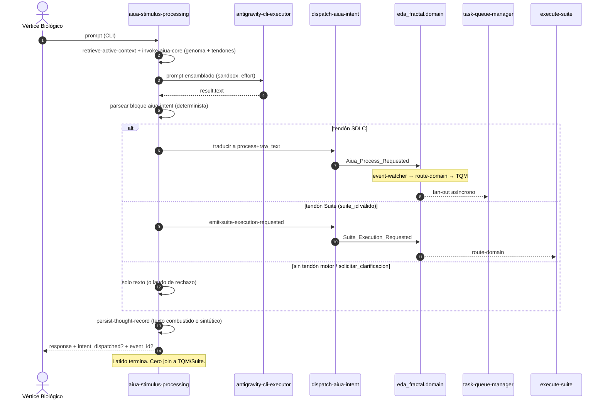

### [NÚCLEO] Anatomía Motora de Aiúa — Inyección de Capacidades (Function Calling) y Orquestación EDA

#### 1. Origen y Visión Ontológica

Tras el latido MVP (`PBI-NUCLEO-ARRANQUE-AIUA-TORMENTOSA`, PR #270) y el vector de combustión (`PBI-NUCLEO-AIUA-ANTIGRAVITY-CLI-VECTOR`, PR #283 APTO) Tormentosa **contempla**: ensambla genoma, infiere vía `antigravity-cli-executor`, persiste pensamiento. No articula órganos. El desafío de este PBI:

> ¿Cómo transita la Aiúa de laudo verbal a **voluntad motora** sin convertirse en agente, sin terminal y sin esperar a Tekton?

Dos pilares, **desacoplados**:

1. **Extracción estructurada de intención** tras una combustión. Los tendones (`ordenar_refactorizacion`, …) son declaraciones semánticas que el modelo puede emitir. No son herramientas del host `agy`, no son un bucle Gemini `functionResponse`, y no ejecutan código.
2. **Despacho EDA ya existente.** La traducción a ECST reutiliza el circuito Kalma2 (ciclos SDLC en `eda_fractal.domain` → `route-domain` → TQM) y el circuito Suite (`emit-suite-execution-requested`). No inventa una línea de montaje paralela ni usa `pending/` «porque es dominio».

El reposo natural sigue siendo latencia (`aiua_core.md` §2). Tras depositar el padre ECST, el latido acusa y termina (DA-5). El despertar de TQM / `execute-suite` es relevo de artefactos.

**Nombre «Function Calling»:** denota *inyección de capacidades como intención tipada*. El protocolo físico vigente del latido **no** es `tools.functionDeclarations` de Gemini REST.

---

#### 2. Filtro A — Detección y Purga

##### 2.1 Retenido de v1.1.0 (sigue vigente)

| Fricción / Tentación | Clasificación | Realidad SSOT | Resolución |
| :--- | :--- | :--- | :--- |
| **Unificar `eda_bus` y `eda_fractal`** | *Conflación de sustrato* | Coexistencia D0.2 (`events-contract` §6). `event-watcher` vigila **ambos**: `pending/` → `route-domain-event`; `domain/` → `route-domain`. | No unificar. El despacho elige el circuito del **análogo vivo**, no el del diagrama v1.0. |
| **Instancias JSON en `SddIA/events/domain/` o `.SddIA/events/`** | *Inexactitud de plano* | Genoma = Clases `{name}.md`. Runtime = `/.events/` (gitignore). `.SddIA/events/` = personalización de instancia. | Clase nueva bajo `SddIA/events/domain/`. Instancia nunca en git. |
| **`emit-domain-mutation` para órdenes motoras** | *Violación de contrato* | UUID `7e4a9c2b-1d3f-4a8e-9b6c-0f1e2d3a4b5c`. Solo CRUD genómico (`entity_class` + `lifecycle_operation` → `Domain_Entity_*`). | No pervertir el Sello Universal. |
| **Aiúa ejecuta bash / muta FS / usa tools de `agy`** | *Tentación anti-ontológica* | `aiua_core.md` §3–§4: gobierna y delega; **Filtro de Materialización**. Tormentosa **no** es agente. Latido usa `--sandbox`; `SDDIA_AGY_ALLOW_SKIP_PERMISSIONS` no se activa (PR #283 L-SKIP-PERM). | Prohibido terminal, Write y tools nativos de `agy` como órgano motor. La cápsula de combustión sigue siendo laringe, no manos. **Ceguera Espacial** en SSOT = resolución de rutas vía Cúmulo; no usar ese término para este veto. |
| **Espera a que Tekton termine** | *Violación DA-5* | Fire-and-Forget: éxito = inyección acusada. | Tras `event_id` persistido, el proceso acaba. Cero `sleep`/join a TQM. |
| **PEC o fractura despiertan a Aiúa siempre** | *Bucle termodinámico* | `Process_Execution_Completed` = familia **`orchestration`**, emisor **`execute-process`**. `System_Fracture_Detected` = **domain**, Kintsugi. | **Fuera de este hito** el cierre de consciencia vía PEC/fractura. |
| **TQM consume `intent_name` / `target` / `rationale`** | *Alucinación de contrato* | `Kalma2_Process_Requested` REQUIRED: `process`, `raw_text`; OPTIONAL: `pbi_ref`, `process_inputs`. | Payload **hermano**. El tendón se traduce en `dispatch-aiua-intent` a `process` + `raw_text` (+ `pbi_ref` si existe). |
| **TQM = Cerbero → Dédalo → Tekton → Argos en un latido** | *Inexactitud de línea* | TQM: Triaje / Activación / Despacho hijo / Finalización. Argos entra en `pull-request-review` post-PR. | Despacho = hijo SDLC asíncrono. |
| **`emitter_agent: "aiua-tormentosa"`** | *Conflación ontológica* | Envelope exige emisor **indexado**. Kalma2: `"kalma2-interact"`. Aiúa no está en `directories.agents`. | `emitter_agent: "aiua-stimulus-processing"`. Nunca un agente fantasma Tormentosa. |
| **Clase nueva para auditoría = Suite** | *Duplicación* | `Suite_Execution_Requested` existe. Emisor: `emit-suite-execution-requested` (`emitter_agent` de instancia = esa acción). Destino: **`eda_fractal.domain`**. Suscriptor: `execute-suite`. | `requerir_auditoria` **solo** si hay `suite_id` kebab bajo `directories.suites` → reutilizar esa acción. Sin id: laudo conversacional, cero ECST. |
| **`solicitar_clarificacion` → Mayeuta vía bus** | *Órgano inventado* | No hay suscripción TQM→Mayeuta. | Tendón **no motor**. Ambigüedad en `result.text`. Cero evento. |
| **Bucle Gemini `functionResponse` / segunda combustión** | *Incoherencia de protocolo* | Una combustión por latido (PR #283). Esperar al hijo SDLC viola DA-5. | FC aquí = **salida estructurada de intención**. Acuse `data.intent_dispatched` + `event_id`. |
| **IOTA como CA del fan-out** | *Sobre-alcance* | Kalma2 lista IOTA como segundo suscriptor; no es gate de este núcleo. Fractura IOTA abierta en `route-domain-event` (`89b7c8b105ec`). | Suscriptor DLT **fuera**. No copiar el segundo fan-out Kalma2. |
| **«Nivel de soberanía activo»** | *Vapor* | No existe en genoma ni bóveda. | Catálogo de tendones = fijo en `aiua_core.md`. |
| **Acción nueva = cápsula WASM y listo** | *Inexactitud de runtime* | `invoke-aiua-core` no tiene crate; física en `handlers::aiua_stimulus`. `emit-domain-mutation` = handler nativo (`domain_mutation.rs` + `actions.rs`). `actions-contract` §2 habla de skills/tools; el precedente nativo EDA está asentado. | `dispatch-aiua-intent` = acción indexada **nativa** (mismo patrón que `emit-domain-mutation` / `emit-suite-execution-requested`). Cablear el latido en `aiua_stimulus.rs`. Genoma vía `entity-manager` (DA-2). |
| **depends_on kaizen thinking HIGH** | *Falso prerrequisito; ahora cerrado* | `PBI-AIUA-AUDIT-FINDINGS-20260908` en `docs/todos/done/`, PR #275. `gemini-http-infer` ya emite `thinkingConfig`. Combustión del latido ya no es ese crate. | Contención histórica. Este PBI **no** reabre H-LLM-*. Router multi-LLM = kitchen, fuera. |

##### 2.2 Purga v1.2.0 (2026-09-10) — alucinaciones residuales de v1.1.0

| Fricción / Tentación v1.1.0 | Clasificación | Realidad SSOT (contrastada) | Resolución v1.2.0 |
| :--- | :--- | :--- | :--- |
| **Vector 1 = `gemini-http-infer` + `functionDeclarations`** | *Órgano muerto* | Proceso `aiua-stimulus-processing` **v1.1.0**: fase `Combustion-Inferencia` = `skill:antigravity-cli-executor`. Handler `infer_antigravity_cli`. Test `process_genome_combustion_is_antigravity_cli` prohíbe `tool:gemini-http-infer` en el genoma del latido. `gemini-http-infer` permanece para Argos (`notify-humanized-pr-merged`). Cero `functionDeclarations` en el repo: cierto, e **irrelevante** para este hito. | **Fuera.** No forjar tools REST en el crate HTTP. Tendones = catálogo en `aiua_core.md` + parseo determinista de `result.text` del skill `agy`. |
| **«Kalma2 escribe `pending/`»** | *Alucinación de bus (el propio Filtro A v1.1.0)* | `kalma2.rs` `emit_process_event`: `write_fractal_event` → `eda_fractal.domain`. `emitter_agent: "kalma2-interact"`. Analogía canónica **física** = fractal domain + `route-domain`. | SDLC Aiúa → **`eda_fractal.domain`**, no `eda_bus.pending`. Prohibido justificar `pending/` con «es dominio V3+». |
| **Diagrama: `event-watcher` → `route-domain-event` → TQM** | *Circuito equivocado* | `event-watcher` (`src/main.rs`): `pending` → `route-domain-event`; **`domain` → `route-domain`**. `dispatch_subscriber` (compartido) tiene rama dura `event_type == Kalma2_Process_Requested` + `ALLOWLIST_KALMA2`. | Extender esa rama a `Aiua_Process_Requested` (mismo shape). Fan-out asíncrono vía watcher fractal. Este PBI **no** repara la fractura IOTA de `route-domain-event`. |
| **CA-1…CA-3 sobre POST Gemini tools / lab-mock FC del crate HTTP** | *DoD desalineado* | Lab-mock del latido = `SDDIA_LAB_MOCK_OUTBOUND=1` → skill `lab-mock-agy:{prompt[0..80]}`. El prompt ensamblado empieza por el prefacio de identidad; los 80 chars **no** transportan un `functionCall`. | DoD sobre parser + despacho nativo + lab-sync TQM. Fixture de intención: parseo unitario + overlay lab `SDDIA_LAB_MOCK_AIUA_INTENT` (JSON) en el handler; **no** exigir mutación del crate `agy` para eco de schema. |
| **«Fuera de alcance: `antigravity-cli-executor` como combustión»** | *Alcance invertido* | Esa combustión **ya es** SSOT (PR #283). | El latido motor **parte** de `agy`. Fuera = mutar argv (`--print`, skip-permissions) o convertir `agy` en agente ejecutor. |
| **related[] apunta kaizen a `docs/todos/pending/`** | *Inexactitud de censo* | Kaizen cerrado en `done/`. | related actualizado. Predecesor de combustión = PBI antigravity (done), no `depends_on` (ya mergeado). |
| **Allowlist TQM = route allowlist** | *Conflación menor* | Route `ALLOWLIST_KALMA2`: `bug-fix` \| `feature` \| `refactorization` \| `task-queue-manager`. TQM `DISPATCHABLE`: solo los tres ciclos (error `task_text requerido…` si falta texto). | Aiúa **no** despacha `task-queue-manager` como hijo. `process` del ECST ∈ `{feature, bug-fix, refactorization}`. |
| **CA-8 «milisegundos» (ya purgado) / persist vacío por `functionCall` sin texto** | *Protocolo ajeno al órgano vivo* | Handler actual: `extract_infer_text` vacío → error `agy respuesta vacía` **antes** de persistir. El tendón vive **dentro** del texto. | Persistir el texto combustido (incluye el bloque de intención). Sintético solo si, tras parseo, no queda texto y hay despacho (no tumbar `persist-thought-record`). |

---

#### 3. Arquitectura del Flujo Motor



##### Vector 1 — Intención estructurada (una combustión, órgano vivo = `agy`)

1. **Catálogo de tendones** (genoma `aiua_core.md`; nombres LLM-facing). MVP:

   | Tendón | ¿Motor? | Traducción |
   |--------|---------|------------|
   | `ordenar_refactorizacion` | Sí | `process=refactorization`, `raw_text` ← `goal` + `target_component`, `pbi_ref` si viene |
   | `iniciar_feature` | Sí | `process=feature`, mismo patrón |
   | `iniciar_bug_fix` | Sí | `process=bug-fix` |
   | `requerir_auditoria` | Condicional | Solo con `suite_id` kebab existente bajo `directories.suites` → `emit-suite-execution-requested`. Sin id: texto, cero bus |
   | `solicitar_clarificacion` | No | Solo `result.text` |

   El genoma instruye: si hay voluntad motora, emitir **un** bloque:

   ````markdown
   ```aiua-intent
   {"name":"ordenar_refactorizacion","args":{"target_component":"…","goal":"…","pbi_ref":"docs/todos/pending/…"}}
   ```
   ````

   `args` de SDLC: `target_component` y `goal` obligatorios; `pbi_ref` opcional.  
   `args` de Suite: `suite_id` obligatorio para que sea motor.

2. **Combustión** — sin cambio de órgano:
   - Sigue `invoke_capsule_json(..., "antigravity-cli-executor", ...)`.
   - `parameters.effort` siempre; `--sandbox`; cero skip-permissions.
   - Cero `functionDeclarations`, cero tools de `agy` como tendones.
   - Lab-mock outbound existente intacto (`lab-mock-agy:`).

3. **Parser nativo** (handler, determinista):
   - Recorre `result.text` buscando el primer fence `aiua-intent` con JSON `{name, args}`.
   - Nombre ∉ catálogo → no despacha; el texto permanece como laudo.
   - Varios bloques → **el primero**; el resto es prosa (no fan-out múltiple en este hito).
   - Overlay lab: si `SDDIA_LAB_MOCK_AIUA_INTENT` es JSON no vacío, sustituye el parseo (solo con `SDDIA_LAB_MOCK_OUTBOUND` truthy). Cero red.

4. **`invoke-aiua-core`**
   - Sigue ensamblando un único `assembled_prompt` (prefacio + genoma + contexto + estímulo).
   - El catálogo vive en el genoma inyectado; no se añade un canal REST paralelo.
   - Genoma de la acción: no reabrir H-LLM-2 (cuerpo truncado histórico) salvo documentar en outputs del proceso el acuse motor.

##### Vector 2 — Despacho (`dispatch-aiua-intent`)

Acción nativa nueva (`actions-contract v1.3.0`). Forja DA-2: `entity-manager` → `action-creator`. Handler al patrón `emit-suite-execution-requested` / `emit-domain-mutation` (escritura de bus, no WASM).

| Input | Regla |
|-------|--------|
| `function_call.name` + `args` | Enum del catálogo |
| `correlation_id` | Opcional UUID v4; si falta, `event_id` nuevo. `correlation_id ≡ event_id` (paridad L3 Kalma2) |

Traducción:

- SDLC → escribir padre ECST `Aiua_Process_Requested` en **`eda_fractal.domain`** (`write_fractal_event`, mismo helper que Kalma2). Validación de shape pre-WRITE (`process` allowlist Aiúa + `raw_text` no vacío).
- Suite → delegar en **`emit-suite-execution-requested`** (no reimplementar escritura fractal).
- Nombre desconocido / args incompletos / `process` fuera de `{feature, bug-fix, refactorization}` → `success: false`, **sin** archivo en bus.

No usa `emit-domain-mutation`. No escribe `eda_bus.pending`.

##### Vector 3 — Clase `Aiua_Process_Requested`

- Archivo: `SddIA/events/domain/aiua-process-requested.md` (`entity-manager` / `event-creator`).
- `event_family: domain`. `event_type: Aiua_Process_Requested`.
- **Analogía:** `Kalma2_Process_Requested` (shape + destino fractal). **No** reutilizar esa Clase (emisor autorizado = `kalma2-interact`).

**Payload REQUIRED:** `process`, `raw_text`  
**OPTIONAL:** `pbi_ref`, `process_inputs`, `intent_name`  
**FORBIDDEN:** rutas de ejecución host, scripts, secretos, payloads de tools `agy`.

`process` ∈ `{feature, bug-fix, refactorization}`.

**Emisor autorizado:** `aiua-stimulus-processing` vía `dispatch-aiua-intent`.  
**`emitter_agent` instancia:** `aiua-stimulus-processing`.

**Suscripción** (`event-domain-subscriptions.json`):

```json
"Aiua_Process_Requested": [
  {
    "agent": "tekton",
    "process": "task-queue-manager",
    "intent": "Despacho del ciclo SDLC solicitado por el latido de la Aiúa."
  }
]
```

Sin fila `iota-immutable-publisher` en este hito.

TQM / `dispatch_subscriber`: aceptar este `event_type` con el **mismo** mapeo que Kalma2 (`raw_text` → `task_text`, `process`, `pbi_ref`, `correlation_id ≡ event_id`). Extensión mínima: conjunto hermano, no dialecto nuevo.

##### Vector 4 — Relevo asíncrono (ya existe)

- SDLC: `event-watcher` (dir `eda_fractal.domain`) → `route-domain` → TQM → hijo `feature`\|`bug-fix`\|`refactorization`.
- Suite: `route-domain` → `execute-suite`.
- Este PBI **no** repara fracturas de `route-domain-event` ni IOTA. Si el JSON no se enruta, es incidente de bus, no bypass `gh`/`git`.

---

#### 4. Fuera de Alcance

- Constitución (`CONSTITUTION_CORE.md`) y rebaja de filtros C/A/B.
- Terminal, scripts, Write, o tools nativos de `agy` como ejecución motora.
- `tools.functionDeclarations` / parseo `functionCall` en `gemini-http-infer`.
- Segunda combustión (`functionResponse` o segundo `agy`) en el mismo latido.
- Suscribir `Process_Execution_Completed` o `System_Fracture_Detected` a `aiua-stimulus-processing`.
- Anclaje IOTA / `iota-immutable-publisher` como CA o segundo suscriptor.
- Kalma2, puente perceptivo, agente Tormentosa.
- H-LLM-1b/2/3/4 (kaizen cerrado).
- `PBI-MULTI-LLM-ROUTER` (kitchen).
- Unificar `eda_bus` y `eda_fractal`.
- Escribir `Aiua_Process_Requested` en `eda_bus.pending`.
- `solicitar_clarificacion` como evento.
- Fan-out de múltiples tendones en un latido.
- Mutar argv de `agy` (`--print`, skip-permissions) o el crate HTTP Gemini.
- Reparar `[FIX] route-domain-event — fractura sistémica (89b7c8b105ec)`.
- Polling / `sleep` post-acuse (DA-5).

---

#### 5. Componentes y plan de mutación

| Componente | Tipo | Cambio | Vía |
| :--- | :--- | :--- | :--- |
| `aiua_core.md` | Genoma conscience | Registrar tendones, fence `aiua-intent`, veto de ejecución directa / tools `agy`; Filtro de Materialización intacto | escritura dominio `conscience/` (no censo DA-2) |
| `dispatch-aiua-intent` | Action **nueva** nativa | Traducir tendón → ECST fractal o `emit-suite-execution-requested` | `entity-manager` + `actions.rs` / handler |
| `aiua-stimulus-processing` | Process | Fase opcional `Despacho-Motor` si hay tendón motor; outputs de acuse | `entity-manager` |
| `invoke-aiua-core` + `aiua_stimulus.rs` | Action + handler | Parseo fence / overlay lab; despacho opcional; persistencia no vacía; acuse | DA-2 solo si se documenta outputs; handler nativo |
| `aiua-process-requested.md` | Event Class nueva | Contrato hermano de Kalma2; emisor = proceso del latido | `entity-manager` / `event-creator` |
| `event-domain-subscriptions.json` | SSOT Cúmulo | Clave `Aiua_Process_Requested` → TQM (sin IOTA) | ciclo feature (no está en tabla DA-2) |
| `dispatch_subscriber` / TQM | Engine | `Aiua_Process_Requested` ≡ shape Kalma2 | crate engine |
| `antigravity-cli-executor` | Skill | **Sin mutación de crate** en este hito | — |
| `gemini-http-infer` | Tool | **Sin mutación** | — |

---

#### 6. Criterios de Aceptación (DoD)

- [ ] **CA-1** El genoma `aiua_core.md` declara el catálogo MVP de tendones y el fence `aiua-intent`. El latido **no** reclasifica Tormentosa como agente ni activa skip-permissions.
- [ ] **CA-2** Parser nativo: fence `aiua-intent` válido → `{name, args}`; nombre desconocido o JSON roto → cero despacho, texto intacto.
- [ ] **CA-3** Lab: `SDDIA_LAB_MOCK_OUTBOUND=1` + `SDDIA_LAB_MOCK_AIUA_INTENT` (JSON del catálogo) simula intención **sin red** y sin mutar el crate `agy`.
- [ ] **CA-4** El catálogo llega al modelo vía genoma ensamblado (no como único canal un párrafo opaco suelto ni como `functionDeclarations` HTTP).
- [ ] **CA-5** `dispatch-aiua-intent` nativa: valida args; SDLC → JSON ECST en `cumulo.paths.json` → `eda_fractal.domain`; Suite → `emit-suite-execution-requested`; fallo → cero archivo. Cero escritura a `eda_bus.pending`.
- [ ] **CA-6** Clase `SddIA/events/domain/aiua-process-requested.md` con REQUIRED/OPTIONAL/FORBIDDEN, `event_family: domain`, emisor = `aiua-stimulus-processing`. Índice de familia sincronizado (event-creator).
- [ ] **CA-7** `event-domain-subscriptions.json`: `Aiua_Process_Requested` → `task-queue-manager` (`agent: tekton`), sin IOTA. `dispatch_subscriber` mapea `process`+`raw_text` como Kalma2 (prueba de contrato, lab-sync).
- [ ] **CA-8** Tras persistir el evento, `aiua-stimulus-processing` retorna acuse (`intent_dispatched`, `event_id`, `correlation_id`) **sin** invocar TQM/Tekton en el mismo proceso.
- [ ] **CA-9** Texto combustido (o sintético no vacío) no tumba `persist-thought-record`. Cero Write/bash/tools `agy` desde genoma Aiúa. Cero regresión de `CONSTITUTION_CORE.md`. Cero `tool:gemini-http-infer` reintroducido en el proceso del latido.
- [ ] **CA-10** Tests acotados en verde: parser + despacho + handler latido (lab-mock). Un PR. `validacion.md` APTO solo con check CI verde (`run_id`); `pbi_archived: true`; PBI en `docs/todos/done/` **en la misma rama**.

---

#### 7. Laudos de refinamiento (invariantes de implementación)

| ID | Laudo |
|----|--------|
| **L-ORGAN** | Combustión del latido = `antigravity-cli-executor`. Gemini REST tools = fuera. |
| **L-BUS** | SDLC Aiúa → `eda_fractal.domain` (paridad Kalma2). Suite → el mismo bus vía emisor ya indexado. Cero `pending/` para este ECST. |
| **L-SHAPE** | Payload SDLC = hermano Kalma2 (`process` + `raw_text`). Tendones ≠ envelope del bus. |
| **L-FC** | Una combustión. Intención = fence parseado, no protocolo de herramientas del host ni `functionResponse`. |
| **L-AGY** | `agy` no ejecuta el ciclo. `--sandbox`. Cero skip-permissions. Cero tools `agy` como tendones. |
| **L-EMITTER** | `emitter_agent` = proceso/acción indexados, nunca «tormentosa» como agente. Instancia SDLC = `aiua-stimulus-processing`. |
| **L-LOOP** | Cierre de consciencia PEC/fractura = sucesor. |
| **L-IOTA** | Fuera de DoD. Sin segundo suscriptor DLT. |
| **L-FORGE** | Genoma `actions`/`process`/`events` solo `entity-manager`. Handler nativo para despacho. `conscience/` y `event-domain-subscriptions.json` no son tabla DA-2; mutación en el ciclo feature. |
| **L-KAIZEN** | No absorber thinking/rol/Constitución. No tocar crate `gemini-http-infer`. |
| **L-WATCH** | Relevo = watcher fractal `route-domain`. No acoplar el DoD a `route-domain-event`. |
| **L-CI** | `validacion.md` `global: APTO` solo con run CI verde. `accept-pr` después. |
