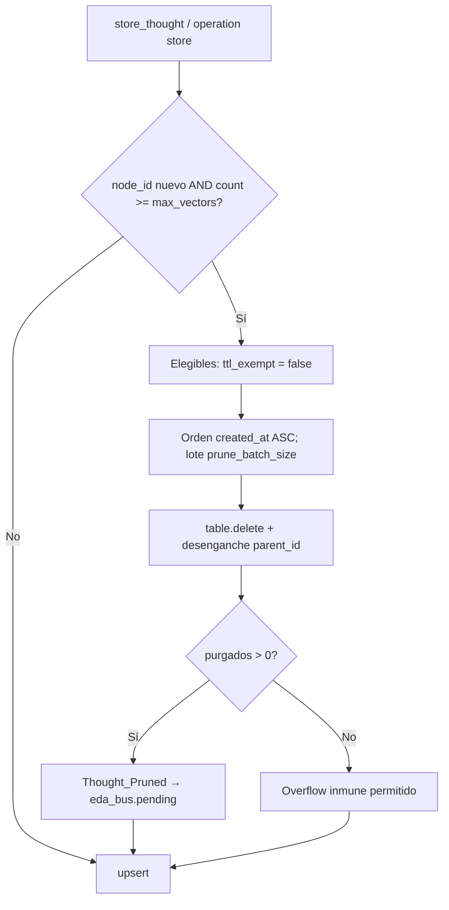

### [NÚCLEO] Protocolo de Poda Ontológica (Olvido) — Umbral de Saturación Cognitiva y Blindaje en LanceDB

#### 1. Origen y Visión Ontológica

El latido MVP persiste cada estímulo en `thought_graph_collection` (`aiua_core.md` §5 Memoria Cognitiva Vectorial). Sin techo físico, el KNN y el RAG del siguiente latido desplazan señal por volumen (secuestro semántico).

> **Imperativo:** la higiene de LanceDB es **ley de infraestructura**, no auto-auditoría consciente de la Aiúa. No consume tokens en «olvidar». El Filtro C constitucional (descartar ruido *antes* de persistir) es otro estrato; este PBI no lo implementa.

Dos fronteras que este hito **no mezcla**:

1. **Memoria de consciencia** = puerto `ThoughtGraphRepository` + adaptador `lancedb-thought-repo` + cápsula `thought-graph-access`. Exclusiva del latido / herramientas de grafo.
2. **Bus EDA** (JSON en `eda_bus.pending` / `event-sweeper`) ≠ tabla columnar. Purgar eventos no poda vectores; podar vectores no borra el bus.

---

#### 2. Filtro A — Detección y Purga (v1.1.0)

Contraste de la propuesta v1.0.0 contra SSOT. Filas **Conservar** = v1.0.0 ya correcto.

| Fricción / Tentación | Clasificación | Realidad SSOT | Resolución |
| :--- | :--- | :--- | :--- |
| **`depends_on` Anatomía Motora + Kaizen auditoría** | *Prerrequisito falso* | Anatomía = function calling / despacho EDA. Kaizen = thinking HIGH + cuerpos de acciones. La poda no usa Gemini ni tendones. El PBI hermano ya laudo: kaizen era contención de forja, no dependencia funcional. | `depends_on: []`. Quedan en `related` como hermanos del arranque Aiúa. |
| **«event-pending-sweeper» como demonio de purga** | *Fósil nominativo* | `event-pending-sweeper` fue un **fix** (`docs/fixes/event-pending-sweeper/`, PR #29): lógica absorbida en `route-domain-event` (`try_sweep_event`). El centinela vivo es `event-sweeper`. | Conservar la frontera bus ≠ LanceDB. Nombrar solo `event-sweeper` + `try_sweep_event`. |
| **`route-telemetry` como demonio que borra JSON** | *Alucinación de rol* | Proceso `SddIA/process/route-telemetry.md`: fan-out de `eda_fractal.telemetry` → Radamanto. No es daemon. No toca LanceDB. | Conservar. Cero rol de limpieza en este PBI. |
| **Filtro C en la entrada como CA de este PBI** | *Alcance inflado* | `aiua_stimulus.rs` `run()` llama `persist_thought_record` **siempre** al cierre. El handler no construye `ThoughtNode`: invoca la cápsula `thought-graph-access` `operation=store`. `CONSTITUTION_CORE.md` §4 Filtro C = triaje de propuestas, no un gate en el crate de memoria. | Este hito **etiqueta y poda**. No descarta el latido. Estrato 1 = sucesor. |
| **`retention_tier`: v1.0 §2 `transient\|permanent` vs §4.2 `+ consolidated`; inmunidad `ttl_exempt` **o** `permanent`** | *Invariante dual contradictoria* | No existen esos campos hoy. Un booleano y un enum independientes permiten `ttl_exempt=false` + `permanent`. `consolidated` no tiene emisor (Mayeuta fuera). | **L-SHIELD:** un solo gate de poda: `ttl_exempt`. `retention_tier ∈ {transient, permanent}` con invariante `permanent ⇔ ttl_exempt`. Cero `consolidated` en este hito. |
| **`created_at` «Unix / ISO UTC» y a la vez `Int64` ms** | *Unidades mezcladas* | Envelope ECST usa ISO-8601 (`Thought_Persisted.timestamp`). El esquema Arrow actual no tiene tiempo. | Columna `created_at: Int64` = Unix **milisegundos** UTC. El evento sigue en ISO. Prohibido ISO en la columna. |
| **CA-1 «compatibilidad hacia atrás» al añadir columnas NOT NULL** | *Imposibilidad del código actual* | `ensure_table` solo valida dim de `embedding`. `batches_to_thoughts` exige columnas por nombre. Tablas MVP sin las tres columnas nuevas fallan al leer. No hay `ALTER` en el adaptador. | **L-SCHEMA:** fail-closed `SchemaIncompatible` si faltan columnas. Recrear store de instancia (volumen MVP). Cero migración silenciosa. Tests de reapertura sobre esquema **nuevo**. |
| **«`persist_thought_record` sella timestamps»** | *Capa errónea* | `persist_thought_record` arma JSON `{operation: store, content, metadata}` y llama la cápsula. `ThoughtNode::new` + `store()` son quienes materializan el nodo. Acción `persist-thought-record.md`: «No emite Thought_Persisted» — emite el **adaptador** si `pending_dir` está configurado. | Sello en `ThoughtNode::new` / `store`. El handler puede pasar metadata de retención; no duplica el modelo. |
| **Poda en cada `store_thought`** | *Inexactitud de upsert* | `LanceDbThoughtRepo::upsert` = `merge_insert` por `node_id`. Update de fila existente **no** incrementa `count_rows`. | Poda automática solo si el `node_id` **no** existía y `count >= max_vectors` **antes** del insert. |
| **`table.delete` + «espacio liberado»** | *Métrica inventada* | Precedente real: `lancedb_preferences_repo` `table.delete(&pred)`. LanceDB no compacta ni reporta bytes liberados en ese API. | Payload: recuento de `node_id` borrados + `count` posterior. Cero bytes. |
| **`Thought_Pruned` a pending sin suscripción** | *Fractura de bus* | `Thought_Persisted` ya emite el adaptador a `eda_bus.pending` (`emitter_agent: lancedb-thought-repo`). `route-domain-event` exige clave en `event-domain-subscriptions.json`; lista vacía = `blocking: … sin suscriptor`. | Clase + índice + clave de suscripción. **No** `iota-immutable-publisher` (poda local ≠ retractar DLT). |
| **`Tool_Degraded` / `Tool_Deprecated` + revocación Cerbero** | *Fósil ED* | Clases vigentes: `Domain_Entity_Degraded` / `Domain_Entity_Deprecated`. Telemetría Radamanto → `eda_fractal.domain`. | Estrato 4 = contexto. Fuera de implementación. |
| **Ceguera Espacial + Aislamiento Paramétrico + CONSTITUTION §3** | *Cita falsa / fósil* | `CONSTITUTION_CORE.md` §3 = taxonomía Library_Codex/Norm/Event. **Ceguera Espacial** = no hardcodear rutas; resolver `cumulo.paths.json`. «Aislamiento Paramétrico» no es SSOT vigente. El veto de vector store a obreros vive en `aiua_core.md` §5 (cápsula exclusiva) + Filtro de Materialización, no en ese §3. | Conservar el **laudo** (cero LanceDB de tropiezos para Tekton/Dédalo/Argos). Corregir la cita. |
| **`table_name` inyectable desde Cúmulo** | *Alcance extra** | `TABLE_THOUGHT = "thought_graph_collection"` es const del adaptador. La cápsula no parametriza el nombre. | Const intacta. Cúmulo solo umbrales (`max_vectors`, `prune_batch_size`, `default_retention_tier`). |
| **Estrato 3 Mayeuta marca chatarra y dispara poda** | *Fuera de caja* | Mayeuta no escribe `ttl_exempt` hoy. | Fuera. |
| Carencia de `created_at` / contadores LRU | *Hecho* | `ThoughtNode` = `node_id, parent_id, content, metadata, friction_trace, embedding`. Esquema Arrow = esas + `embedding_model|dim|norm`. Cero tiempo, cero `access_count`. | Conservar. FIFO por `created_at`. LRU fuera (no hay contador). |
| Linaje `parent_id` huérfano | *Riesgo real* | `get_children` filtra `parent_id`. Delete ciego deja apuntadores muertos (no hay FK LanceDB; el fallo es semántico en RAG/navegación). | **L-LINEAGE:** desenganche (`parent_id = NULL`). Cero cascada (un padre transitorio no borra hijos `ttl_exempt`). |
| Hash `node_id` SHA-256 | *Aproximación v1.0* | `ThoughtNode::new` hashea `parent_id + content + friction_trace`. **No** metadata ni embedding. | No cambiar el hash. `created_at` / `ttl_exempt` / `retention_tier` **fuera** del hasher (volatilidad). |

---

#### 3. Alcance de este hito (un estrato)

Los cuatro estratos de la v1.0.0 siguen siendo mapa cognitivo. **Solo el Estrato 2 es DoD.**

| Estrato | Qué es | Este PBI |
| :--- | :--- | :--- |
| 1. Olvido preventivo (Filtro C a la entrada) | No persistir ruido | Fuera |
| **2. Techo LanceDB + escudo `ttl_exempt`** | FIFO cronológico no inmune | **Dentro** |
| 3. Destilación Mayeuta → `Library_Norm` | Git SSOT; marcar transitorios | Fuera |
| 4. Obsolescencia Radamanto + `event-sweeper` | Ya existe; otro sustrato | Fuera (no tocar) |



---

#### 4. Mecánica

##### 4.1 Configuración (`cumulo.paths.json`)

Nueva sección. La cápsula `thought-graph-access` **ya** lee Cúmulo (`/paths/vectorStore`, `/eda_bus/pending`). Extiende esa lectura. El adaptador **no** abre el JSON: recibe umbrales por constructor (tests inyectan sin Cúmulo de producción).

```json
"thought_store": {
  "max_vectors": 1000,
  "prune_batch_size": 50,
  "default_retention_tier": "transient"
}
```

`max_vectors` y `prune_batch_size` son política de instancia, no constante mágica en Rust. Default de código solo si la clave falta (mismo patrón que `unwrap_or` de `vectorStore`).

##### 4.2 Esquema Arrow — columnas **nuevas** (el resto no se reescribe)

Existentes (intocadas): `node_id`, `parent_id`, `content`, `metadata`, `friction_trace`, `embedding` (`FixedSizeList<Float32, EMBEDDING_DIM>` con `EMBEDDING_DIM=384`), `embedding_model`, `embedding_dim`, `embedding_norm`. Embedder vigente: `LocalHashingEmbedder` / `sddia-local-hashing-v1` / norma `l2`.

| Columna nueva | Tipo Arrow | Nullable | Semántica |
| :--- | :--- | :--- | :--- |
| `created_at` | `Int64` | `false` | Unix ms UTC. Default en `ThoughtNode::new`. |
| `ttl_exempt` | `Boolean` | `false` | Único escudo de poda. Default `false`. |
| `retention_tier` | `Utf8` | `false` | `"transient"` \| `"permanent"`. Default `"transient"`. |

`metadata` en Arrow sigue siendo Utf8 JSON; en Rust sigue `serde_json::Value`. No confundir.

##### 4.3 Puerto `ThoughtGraphRepository`

Hoy: `store_thought`, `get_thought_by_id`, `get_children`, `search_similar_thoughts`.

Añadir:

- `count_thoughts() -> Result<usize, Self::Error>`
- `prune_transient_thoughts(target_count: usize) -> Result<usize, Self::Error>` — borra hasta `target_count` elegibles (`ttl_exempt = false`), FIFO `created_at ASC`, desengancha hijos, **no** emite evento (el emisor es `store_thought` / la tool tras conocer el recuento, para no duplicar). Laudo de emisión: **el adaptador** emite `Thought_Pruned` (paridad `Thought_Persisted`) solo cuando el lote automático o la operación `prune` de la cápsula completa un borrado `> 0` y hay `pending_dir`.

##### 4.4 Algoritmo en `LanceDbThoughtRepo::store_thought`

1. `exists = get_thought_by_id(node_id).is_some()`.
2. Si `!exists`: `n = count_thoughts()`. Si `n >= max_vectors`: `prune_transient_thoughts(prune_batch_size)` + emisión condicional.
3. `upsert` (merge_insert) inalterado.
4. Emisión existente `Thought_Persisted` inalterada.

Si cero elegibles (todo inmune): insertar igual. El techo es blando ante el escudo. No fallar el latido.

Borrado: `table.delete` con predicado citado (`sql_quote`), precedente preferencias. Tras delete: hijos con `parent_id IN (ids)` → `parent_id` null vía merge_insert de esas filas (campos restantes intactos).

##### 4.5 Cápsula `thought-graph-access`

Operaciones hoy: `search` \| `store`. Añadir `prune`.

```json
{
  "request": {
    "operation": "prune",
    "repository_path": "<repo>",
    "force": false,
    "target_count": 50
  }
}
```

| Campo | Semántica |
| :--- | :--- |
| `force: false` | No-op si `count < max_vectors`. |
| `force: true` | Ejecuta el lote aunque no haya saturación. **No** ignora `ttl_exempt`. |
| `target_count` | Tamaño de lote de la operación manual. Default = `prune_batch_size` de Cúmulo. |

`store` acepta opcionales `ttl_exempt` / `retention_tier` en el request; aplica invariante L-SHIELD; si omitidos, defaults del modelo.

Salida JSON v2 existente (`meta.schemaVersion: "2.0"`): `result.pruned_count`, `result.remaining_count`.

##### 4.6 Evento `Thought_Pruned`

Paridad de plano con `Thought_Persisted` (no fractal):

- Clase: `SddIA/events/domain/thought-pruned.md` (forja `entity-manager` / event-creator).
- Instancia: `eda_bus.pending` (`.events/pending/`).
- `emitter_agent`: `lancedb-thought-repo`.
- Índice de familia `events/domain/index.md` sincronizado.
- Suscripción **obligatoria** (lista no vacía).

**REQUIRED:** `pruned_count`, `remaining_count`, `store_path`.  
**OPTIONAL:** `node_ids` (lote; acotar tamaño).  
**FORBIDDEN:** `biological_vertex_output`, bytes/«espacio liberado», vectores, contenido de pensamientos.

Suscriptor de este hito (observabilidad, cero DLT):

```json
"Thought_Pruned": [
  {
    "agent": "cumulo",
    "intent": "Observabilidad de higiene thought_graph_collection. Cero anclaje IOTA."
  }
]
```

No repara la fractura IOTA de `route-domain-event` ni desancla `Thought_Persisted` ya publicados.

##### 4.7 Handler / acción

`persist_thought_record` no cambia de contrato obligatorio. Defaults transitorios salen de `ThoughtNode::new`. No implementar skip Filtro C. No absorber H-LLM-2 (cuerpo truncado de la acción).

---

#### 5. Fuera de Alcance

- Filtro C de no-persistencia; clustering semántico; LRU / `access_count`.
- `retention_tier: consolidated`; Mayeuta escribiendo escudos.
- Mutar `event-sweeper`, `route-telemetry`, topología `eda_bus` / `eda_fractal`.
- Vector store para Tekton, Dédalo, Argos.
- Poda de `SddIA/library/norms/`, códices o DLT.
- Inyectar `table_name` por Cúmulo; ALTER LanceDB silencioso; compactación de ficheros.
- Anatomía motora (function calling) y kaizen thinking HIGH.
- `SDDIA_SKIP_HOOKS`, bypass `gh`/`git`.

---

#### 6. Componentes y vía de mutación

| Componente | Tipo | Cambio | Vía |
| :--- | :--- | :--- | :--- |
| `SddIA/core/cumulo.paths.json` | SSOT | Sección `thought_store` (umbrales) | Ciclo feature / Cúmulo |
| `thought_node.rs` + `ports.rs` | Crate `sddia-core-memory` | Campos + `count_thoughts` / `prune_transient_thoughts` | Crate (no DA-2) |
| `lancedb_thought_repo/src/lib.rs` | Adaptador | Schema, sello, poda, delete, desenganche, `Thought_Pruned`, config inyectada | Crate; ficha `{name}.md` bump versión si cambia contrato de schema |
| `thought-graph-access` | Tool | `operation: prune`; `store` con retención; leer umbrales Cúmulo | `entity-manager` + crate |
| `thought-pruned.md` + `events/domain/index.md` | Event Class | Contrato ECST | `entity-manager` / event-creator |
| `event-domain-subscriptions.json` | SSOT | Clave `Thought_Pruned` | Ciclo feature |
| `aiua_stimulus.rs` | Handler | Solo si se reenvía metadata de retención; no obligatorio | Crate engine |
| `persist-thought-record.md` | Action | Opcional: documentar defaults transitorios. No absorber H-LLM-2 | `entity-manager` si se toca genoma |

---

#### 7. Criterios de Aceptación (DoD)

- [ ] **CA-1 (Schema):** `thought_schema()` incluye `created_at` Int64, `ttl_exempt` Boolean, `retention_tier` Utf8. Reopen con esquema nuevo redondea. Tabla vieja sin columnas → `SchemaIncompatible`, no lectura corrupta.
- [ ] **CA-2 (Modelo):** `ThoughtNode::new` default: `created_at` = ahora (ms), `ttl_exempt: false`, `retention_tier: "transient"`. Hasher sin esos campos.
- [ ] **CA-3 (Escudo):** `ttl_exempt: true` nunca entra en el lote. `force: true` tampoco los borra. Invariante `permanent ⇔ ttl_exempt`.
- [ ] **CA-4 (Saturación):** Insert **neto** con `count >= max_vectors` borra hasta `prune_batch_size` elegibles FIFO. Update del mismo `node_id` no dispara poda.
- [ ] **CA-5 (Linaje):** Hijos de nodos podados quedan con `parent_id = None`. Cero cascada.
- [ ] **CA-6 (Tool):** `operation: prune` + JSON v2 `pruned_count` / `remaining_count`. `force: false` no poda bajo umbral.
- [ ] **CA-7 (Evento):** Purga efectiva → instancia `Thought_Pruned` en `eda_bus.pending`, emisor `lancedb-thought-repo`, clase+índice+suscripción Cúmulo. Cero IOTA.
- [ ] **CA-8 (Latido):** Tras store, nodos del latido tienen `created_at` válido y retención default transitoria sin Filtro C de descarte.
- [ ] **CA-9 (SSOT):** `thought_store` en `cumulo.paths.json`; umbrales llegan al adaptador por inyección. Cero `1000`/`50` cableados como única fuente.
- [ ] **CA-10:** Tests verdes: `sddia-infrastructure-lancedb-thought`, `thought-graph-access`, `sddia-core-memory`. Un PR. `validacion.md` APTO, `pbi_archived: true`, PBI en `docs/todos/done/` en la misma rama.

---

#### 8. Laudos de refinamiento (invariantes de implementación)

| ID | Laudo |
|----|--------|
| **L-SCOPE** | Solo Estrato 2. Filtro C de entrada y Mayeuta = sucesores. |
| **L-SHIELD** | Gate = `ttl_exempt`. `permanent ⇔ true`. Cero `consolidated`. |
| **L-TIME** | `created_at` = Unix ms. Eventos = ISO-8601. |
| **L-SCHEMA** | Fail-closed. Recrear store de instancia. |
| **L-UPSERT** | Poda automática solo en alta neta. |
| **L-LINEAGE** | Desenganche, no cascada. |
| **L-OVERFLOW** | Todo inmune + saturación → insert OK, evento solo si `pruned_count > 0`. |
| **L-BUS** | `Thought_Pruned` = mismo plano que `Thought_Persisted` (`eda_bus.pending`). No fractal. |
| **L-SUB** | Suscriptor Cúmulo observabilidad. Prohibido IOTA en este hito. |
| **L-DI** | Umbrales desde Cúmulo vía cápsula → constructor del adaptador. |
| **L-FORGE** | Genoma `tools`/`events`/`actions` solo `entity-manager`. Adaptador y `core/memory` = crates. |
| **L-WORKER** | Cero vector store de experiencia para obreros. |
| **L-IOTA** | Poda no retracta anclas DLT previas. |
