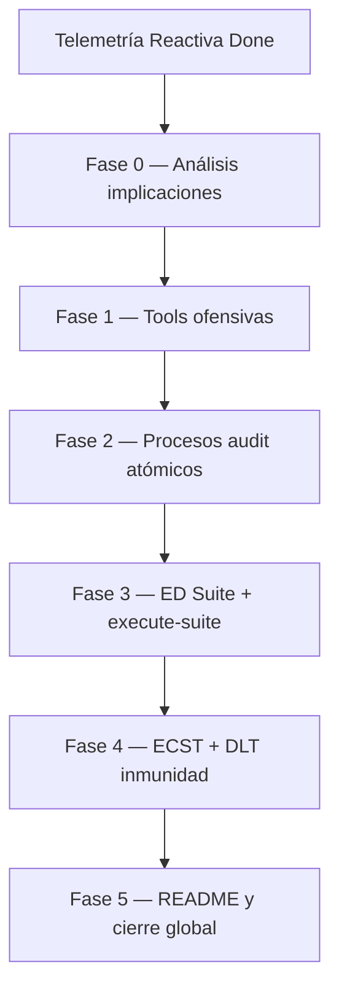

# [ARQUITECTURA] Auditoría de Inmunidad, Caos S+ Grade y ED Suite

| Campo | Valor |
|-------|-------|
| **ID** | `PBI-INMUNIDAD-CAOS-SISTEMA-NERVIOSO` |
| **Fecha creación** | 2026-05-28 |
| **Estatus** | Pendiente |
| **Prioridad** | Alta — Validación empírica del ecosistema reactivo y forja de nueva ED |
| **Alcance** | Creación de la Entidad de Dominio `Suite`, tools ofensivas, procesos de diagnóstico atómicos, orquestador de suites y sellado de resiliencia DLT |
| **Versión PBI** | 2.5.0 (Fase 4 en planificación) |
| **Feature activa** | [`docs/features/inmunidad-caos-fase4/`](../../features/inmunidad-caos-fase4/) |
| **Feature Fase 0** | [`docs/features/inmunidad-caos-fase0/`](../../features/inmunidad-caos-fase0/) (cerrada) |
| **Análisis de impacto** | [`impact-analysis.md`](../../features/inmunidad-caos-fase0/impact-analysis.md) |
| **Depende de** | Telemetría Reactiva Done (`PBI-TELEMETRIA-REACTIVA-EDA-UNIFICADO`) |

> **Gestión multi-feature:** Cada fase se ejecuta en una feature independiente (`inmunidad-caos-fase{N}`). El PBI permanece en `pending/` hasta Done global; Fase 0 no archiva el PBI (`pbi_archived: false`).

### Estado de ejecución por fase

| Fase | Estado | Feature (`persist_ref`) | Validación |
|------|--------|-------------------------|------------|
| **0** | ✅ Cerrada | [`inmunidad-caos-fase0`](../../features/inmunidad-caos-fase0/) | [`validacion.md`](../../features/inmunidad-caos-fase0/validacion.md) APTO (AC0.1–AC0.5) |
| **1** | ✅ Cerrada | [`inmunidad-caos-fase1`](../../features/inmunidad-caos-fase1/) | [`validacion.md`](../../features/inmunidad-caos-fase1/validacion.md) APTO (AC1.1–AC1.3) |
| **2** | ✅ Cerrada | [`inmunidad-caos-fase2`](../../features/inmunidad-caos-fase2/) | [`validacion.md`](../../features/inmunidad-caos-fase2/validacion.md) APTO (AC2.1–AC2.3) |
| **3** | ✅ Lista para PR | [`inmunidad-caos-fase3`](../../features/inmunidad-caos-fase3/) | [`validacion.md`](../../features/inmunidad-caos-fase3/validacion.md) APTO (AC3.1–AC3.3) |
| **4** | 📋 En planificación | [`inmunidad-caos-fase4`](../../features/inmunidad-caos-fase4/) | — |
| **5** | ⏳ Pendiente | `inmunidad-caos-fase5` (prevista) | — |

## 0. Contexto global y axiomas

La arquitectura SddIA ha evolucionado hacia un modelo reactivo (EDA Fractal) con capacidades de *Self-Healing*, Aduana Universal y Peaje Termodinámico. Para garantizar que este ecosistema no sea frágil ante la entropía, se materializa la **Ingeniería del Caos** mediante el **Patrón de Orquestación por Suite**.

Se introduce una nueva Entidad de Dominio en el Genoma: la **`Suite`**. Una Suite es un activo declarativo S+ Grade que define una secuencia orquestada de procesos, su estrategia de concurrencia y sus tolerancias a fallos. 

**Axiomas transversales:**
- **Inocuidad del Caos:** Las tools ofensivas operarán estrictamente dentro de los límites del `workspace_path` inyectado.
- **Identidad Ontológica:** Una Campaña de Caos no es un script; es una ED (`Suite`) auditable por Cerbero y anclable en Cúmulo/DLT.
- **Atomicidad Diagnóstica:** Ningún proceso de auditoría evaluará más de un vector de ataque simultáneamente.

Este documento ha de servir de registro documental sobre el avance de las diferentes fases.

### 0.2 Mapa de dependencias entre fases

| Fase | Nombre | Prioridad | Bloquea a |
|------|--------|-----------|-----------|
| 0 | Análisis de implicaciones | **Crítica** (gate) | Fases 1–5 |
| 1 | Arsenal de Entropía (tools) | **Crítica** | Fases 2–3 |
| 2 | Nodos de diagnóstico (procesos) | **Alta** | Fase 3 |
| 3 | Genoma ED `Suite` + orquestador | **Alta** | Fase 4 |
| 4 | Estímulo EDA + certificación DLT | **Alta** | Fase 5 |
| 5 | Documentación y Done global | **Alta** (cierre) | — |

### 0.3 Infraestructura reutilizable (post-Telemetría)

Barrido Fase 0 confirma **no duplicar** — reutilizar en forja Caos:

| Activo existente | Uso en programa Caos |
|------------------|----------------------|
| `run_thermodynamic_toll` (D3.13 fail-soft) | Stress `io-choke` — proceso padre debe sobrevivir fallo E/S telemetría (H22) |
| Fan-out `telemetry-compliance-audit` | Pipeline listo para `schema-corruptor` tras bump `tools-contract` (H23) |
| `workspace_utils.py` + `workspace_template` | Base workspaces audit; extender para sub-workspaces por nodo (H14–H15) |
| `fix_tool_process_core.assert_sandbox_write` | Patrón referencia Inocuidad; distinto de `.SddIA/sandbox/` Self-Healing (H12) |
| Radamanto + bus fractal domain | Extender jurisdicción DLT para `System_Immunity_Certified` (D0.4, H20) |

### 0.4 Síntesis hallazgos bloqueantes (Fase 0)

Referencia completa: [`impact-analysis.md`](../../features/inmunidad-caos-fase0/impact-analysis.md) (H01–H28).

| Cluster | Hallazgos | Fase destino |
|---------|-----------|--------------|
| **Genoma Suite ausente** | H01–H05, H17 | 3 |
| **RBAC / tools caos** | H07–H09 | 1 |
| **Inocuidad runtime** | H10–H11 | 1–2 |
| **Orquestación anidada** | H14–H15 | 3 |
| **Eventos + DLT** | H18–H21 | 4 |

**Veredicto Fase 0:** forja Fases 1–5 **viable** con decisiones D0.1–D0.9.

### 0.5 Backlog residual Kaizen (no bloqueante)

- Cerbero gate determinista en todo `execute-process` (hoy stub solo PR review — H25).
- Alinear `policy-validator` con los 8 contextos SSOT (`event-routing`, `dlt-auditing`, etc.).
- Tests E2E concurrencia real para `run_all` en `execute-suite` (post-Fase 3).

---

## Fase 0 — Análisis de implicaciones no detectadas (gate de arranque)

**Origen:** diligencia previa al programa Caos · **Prioridad:** Crítica · **Depende de:** Telemetría Reactiva Done · **Bloquea:** Fases 1–5

**Feature:** [`docs/features/inmunidad-caos-fase0/`](../../features/inmunidad-caos-fase0/)

### Objetivo individual

Recorrer `SddIA/` y acoplamientos (genoma, runtime EDA post-fractal, sandbox, entity-manager, tools, procesos, Radamanto, Cerbero, Argos) para detectar **impactos, deudas y puntos ciegos** no contemplados explícitamente en las Fases 1–5 antes de forjar código o contratos.

### Objetivo colectivo

Evitar sorpresas en mitad de la forja: conflictos RBAC con tools ofensivas, ausencia de familia `suite` en el genoma, límites ambiguos del sandbox frente a `workspace_path`, orquestación anidada incompatible con Atomicidad Diagnóstica, o jurisdicción DLT no resuelta para `System_Immunity_Certified`.

### Ámbito de exploración (checklist mínimo)

| Área | Qué buscar | Ejemplos de hallazgo |
|------|------------|----------------------|
| **Familia ED `Suite`** | Ausencia en SSOT, entity-manager, contratos, índices | No existe `SddIA/suites/` ni `suite-creator` |
| **Tools ofensivas** | Contexto RBAC, Candado Semántico, cápsulas | `io-choke` bloqueado por Cerbero sin contexto `chaos-engineering` |
| **Sandbox / Inocuidad** | `workspace_path` vs. raíz repo, path traversal | `sandbox-breacher` escribe fuera del workspace inyectado sin interceptación |
| **Procesos audit** | Patrón Tekton → tool → Argos; un vector por proceso | Proceso mezcla dos vectores de ataque |
| **Orquestador `execute-suite`** | Sub-workspaces, concurrencia, timeouts | Anidación `execute-process` sin aislamiento |
| **Eventos ECST** | `Suite_Execution_Requested`, `System_Immunity_Certified` | Emisor no autorizado en `events-contract` |
| **Radamanto / DLT** | Anclaje certificación inmunidad | Conflicto con sellos PR/ECST existentes |
| **Telemetría ↔ Caos** | Peaje fail-soft vs. `io-choke`; compliance breach | `schema-corruptor` no dispara `Telemetry_Compliance_Breached` |
| **Laboratorio QA** | Handlers, tests, flags lab | Sin cobertura de suites de caos |

### Tareas de forja

#### 0.A Inventario de acoplamientos

- Barrido sobre: `entity-manager`, `tools/`, `process/`, `filesystem-manager`, `workspace_path`, Cerbero/RBAC, `.events/domain/`, `telemetry-compliance-audit`, Radamanto, `execute_process_capsules`.
- Catalogar cada hallazgo con: **ubicación**, **fase afectada** (1–5), **severidad** (bloqueante / alto / medio / informativo).

#### 0.B Matriz de gaps vs. PBI

- Contrastar hallazgos con tareas de Fases 1–5.
- Clasificar en: *(a)* ya cubierto, *(b)* ampliar tarea, *(c)* nueva subtarea/decisión, *(d)* fuera de alcance.

#### 0.C Decisiones y refinamiento

- Resolver o escalar ítems **bloqueantes** antes de abrir Fase 1.
- Incorporar subtareas aprobadas en este documento (commit en rama del PR).

#### 0.D Entregable documental

- Redactar **`impact-analysis.md`** en [`docs/features/inmunidad-caos-fase0/`](../../features/inmunidad-caos-fase0/impact-analysis.md).

### Criterios de aceptación — Fase 0

- **AC0.1:** Existe `impact-analysis.md` con inventario completo de acoplamientos relevantes.
- **AC0.2:** Todo hallazgo bloqueante tiene decisión registrada o subtarea asignada a Fase 1–5.
- **AC0.3:** Conflictos genómicos (`suite` como ED, tools ofensivas, sandbox) están clasificados en la matriz de gaps.
- **AC0.4:** Jurisdicción DLT para `System_Immunity_Certified` está explicitada con propuesta de transición.
- **AC0.5:** Clarificación valida que Fases 1–5 refinadas son ejecutables sin ambigüedad bloqueante.

### Refinamiento post-barrido (v2.1.0 — 2026-05-28)

Decisiones de diseño incorporadas desde Fase 0 (feature `inmunidad-caos-fase0`):

| ID | Decisión | Implicación |
|----|----------|-------------|
| **D0.1** | Contexto RBAC `chaos-engineering` | Fase 1.A: norma + políticas Tekton/procesos audit |
| **D0.2** | `suite` como 9.ª clase `entity-manager` | Fase 3: `suite-creator`, SSOT, `sync-entity-index` |
| **D0.3** | Inocuidad acotada a `workspace_path` | Fase 1.C: helper cápsulas + norma filesystem |
| **D0.4** | DLT inmunidad vía Radamanto | Fase 4.C: extensión §3 Radamanto; no Cúmulo |
| **D0.5** | `tools-contract` v1.3.0 termodinámica | Fase 1.B: prerequisito `schema-corruptor` |
| **D0.6** | Sub-workspace por `atomic_node` | Fase 3.C: `execution_id` nuevo por nodo |
| **D0.7** | `survival-manifest.md` en workspace orquestador | Fase 3.D: Argos compila manifiesto |
| **D0.8** | Fase 4 = ECST; Fase 5 = README | Reordenación respecto borrador v2.0.0 |
| **D0.9** | PBI maestro en `pending/` | Cierre documental por feature de fase |

#### Orden recomendado Fase 1 (post-gate)

1. **1.A** — Contexto `chaos-engineering`
2. **1.B** — `tools-contract` v1.3.0
3. **1.C** — `assert_workspace_bound`
4. **1.D** — Forjar `io-choke`, `schema-corruptor`, `sandbox-breacher`

---

## Fase 1 — El Arsenal de Entropía (Cápsulas de Caos)

**Origen:** PBI § Fase 1 · **Prioridad:** Crítica · **Depende de:** Fase 0 (gate) · **Bloquea:** Fases 2–3

**Objetivo:** Forjar herramientas atómicas (tools) diseñadas para estresar la infraestructura y violar los contratos, integrándolas al catálogo Core.

### Tareas de forja

#### 1.A Contexto RBAC `chaos-engineering` (D0.1)

- Añadir §2.9 en `execution-contexts.md`: dominio ingeniería del caos; cápsulas ofensivas autorizadas solo bajo `workspace_path`.
- Ampliar `allowed_policies` de Tekton y procesos audit futuros.

#### 1.B Contrato tools termodinámico (D0.5)

- Bump `tools-contract.md` v1.3.0: §6 `telemetry_provided` / `telemetry_schema` (paridad skills/actions).

#### 1.C Inocuidad del Caos en runtime (D0.3)

- Helper `assert_workspace_bound(repo, target, workspace_path)` en `SddIA/scripts/qa/` (reutilizar patrón `fix_tool_process_core`).
- Norma: tools caos deben invocar helper; prohibido path fuera de `workspace_path`.

#### 1.D Tools ofensivas

1. **`tool: io-choke` (Asfixia Física):**
   - Simular bloqueos de disco/permisos durante escritura.
   - Vector: validar fail-soft Peaje Termodinámico (H22).
2. **`tool: schema-corruptor` (Alucinación de Recibos):**
   - `telemetry_provided: true`; stdout corrupto/vacío.
   - Vector: `telemetry-compliance-audit` → `Telemetry_Compliance_Breached`.
3. **`tool: sandbox-breacher` (Intento de Fuga):**
   - Intentar escribir fuera de `workspace_path` inyectado.
   - Vector: impermeabilidad sandbox / envelope error Cerbero.

### Criterios de aceptación — Fase 1

- **AC1.1:** Contexto `chaos-engineering` en norma y 3 tools catalogadas en `tools/index.md`.
- **AC1.2:** Cápsulas Python con `assert_workspace_bound` donde aplique.
- **AC1.3:** Smoke lab: `schema-corruptor` dispara breach en fan-out compliance.

---

## Fase 2 — Los Nodos de Diagnóstico (Procesos Atómicos)

**Origen:** PBI § Fase 2 · **Prioridad:** Alta · **Depende de:** Fase 1 · **Bloquea:** Fase 3

**Feature:** [`docs/features/inmunidad-caos-fase2/`](../../features/inmunidad-caos-fase2/) (lista para PR)

**Objetivo:** Procesos de auditoría **atómicos** (1 vector = 1 proceso): workspace propio, un ataque, Argos certifica reacción.

### Tareas de forja

#### 2.A `process: audit-thermodynamic-toll-failsoft`

- Tekton invoca `io-choke`. Argos valida exit 0 del proceso pese a fallo E/S telemetría.

#### 2.B `process: audit-telemetry-compliance-breach`

- Ejecuta `schema-corruptor`. Argos verifica JSON `Telemetry_Compliance_Breached` en `./.events/domain/`.

#### 2.C `process: audit-sandbox-isolation-rbac`

- Ejecuta `sandbox-breacher`. Argos certifica bloqueo (envelope error / no escritura fuera workspace).

### Criterios de aceptación — Fase 2

- **AC2.1:** Tres procesos con `workspace_template` y un solo vector cada uno.
- **AC2.2:** Handlers lab o smoke `execute-process` por proceso.
- **AC2.3:** Ningún proceso mezcla dos tools ofensivas (Atomicidad Diagnóstica).

---

## Fase 3 — El Genoma de la Suite (Nueva Entidad de Dominio)

**Origen:** PBI § Fase 3 · **Prioridad:** Alta · **Depende de:** Fase 2 · **Bloquea:** Fase 4

**Feature:** [`docs/features/inmunidad-caos-fase3/`](../../features/inmunidad-caos-fase3/) (lista para PR)

**Objetivo:** ED `Suite` + orquestador `execute-suite`.

### Tareas de forja

#### 3.A Patrón entidad de dominio (D0.2)

- `suite-creator` (simetría `tool-creator` / `norm-creator`).
- `directories.suites` + `contracts.suites` en `cumulo.paths.json`.
- Extender `entity-manager`, `sync-entity-index`, `entidades-dominio-ecosistema-sddia.md`.

#### 3.B Ley de la Suite (`suites-contract.md`)

- `SddIA/suites/` + `index.md`.
- Payload: `execution_strategy` (`fail_fast` | `run_all`), `atomic_nodes[]` (`process_name`, `expected_exit_code`, `timeout_ms`).

#### 3.C `process: execute-suite` (D0.6)

- Input `suite_id`; resolución vía Cúmulo.
- Por nodo: subproceso `execute-process` con `execution_id` y sub-`workspace_path` aislados.
- Estrategias `fail_fast` / `run_all`.

#### 3.D Manifiesto de supervivencia (D0.7)

- Argos compila `{workspace_path}/survival-manifest.md` tras nodos.

#### 3.E Instanciación — Códice de Asedio

- `SddIA/suites/core-full-stress.md` — 3 procesos Fase 2.

### Criterios de aceptación — Fase 3

- **AC3.1:** `entity-manager` acepta `entity_class: suite`.
- **AC3.2:** Smoke `execute-suite` con `core-full-stress` y manifiesto Argos.
- **AC3.3:** Sub-workspaces aislados verificables en `execution_report`.

---

## Fase 4 — El Estímulo y la Gobernanza Autónoma

**Origen:** PBI § Fase 4 · **Prioridad:** Alta · **Depende de:** Fase 3 · **Bloquea:** Fase 5

**Feature:** [`docs/features/inmunidad-caos-fase4/`](../../features/inmunidad-caos-fase4/) (planificación)

**Objetivo:** Conectar EDA con orquestador y certificar resiliencia en DLT.

### Tareas de forja

#### 4.A Clase ECST `Suite_Execution_Requested`

- Evento domain: payload `suite_id` (required), `asset_id` (optional).
- Emisor autorizado: acción/proceso indexado (no agente obrero).

#### 4.B Suscripción domain

- `event-domain-subscriptions.json`: `Suite_Execution_Requested` → `process: execute-suite`.

#### 4.C Certificación Radamanto (D0.4)

- Tras éxito `execute-suite` + manifiesto Argos: emitir `System_Immunity_Certified`.
- Radamanto: suscripción domain + `iota-immutable-publisher` (cuarto bucket DLT gobernanza).
- Acta CI: smoke witness Radamanto (no Cúmulo).

### Criterios de aceptación — Fase 4

- **AC4.1:** Eventos forjados en `SddIA/events/domain/`.
- **AC4.2:** Smoke: evento requested → execute-suite → immunity certified en bus.
- **AC4.3:** Witness DLT Radamanto en CI o lab documentado.

---

## Fase 5 — Documentación README.md y afectaciones documentales

**Origen:** PBI § Fase 5 · **Prioridad:** Alta (cierre) · **Depende de:** Fase 4

**Objetivo:** Documentación pública del patrón Suite / Caos / Inmunidad.

### Tareas de forja

#### 5.A README.md raíz

- Sección Ingeniería del Caos: axiomas, ED Suite, flujo EDA, certificación DLT.

#### 5.B Touchpoints y normas

- `touchpoints-ia.md`, `paths-via-cumulo.md`: referencias `suites/`, `chaos-engineering`.

#### 5.C Done global

- Mover PBI a `docs/todos/done/` tras merge feature Fase 5 con `pbi_archived: true`.

### Criterios de aceptación — Fase 5

- **AC5.1:** README coherente con genoma post-Fase 4.
- **AC5.2:** Done global programa Caos declarado en PBI archivado.