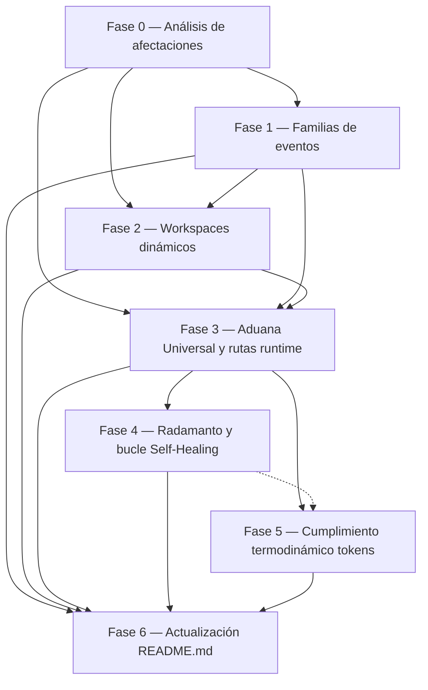
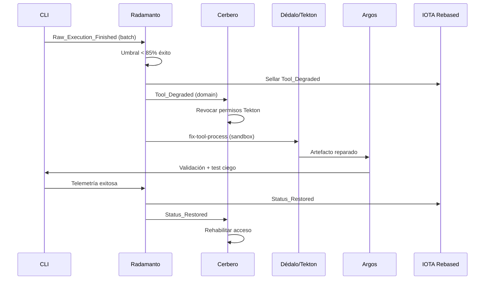

# [ARQUITECTURA] Telemetría Reactiva — Unificación EDA S+ Grade

| Campo | Valor |
|-------|-------|
| **ID** | `PBI-TELEMETRIA-REACTIVA-EDA-UNIFICADO` |
| **Fecha creación** | 2026-05-26 |
| **Estatus** | En ejecución — Fase 4 cerrada; Fase 5 pendiente (`telemetria-reactiva-eda-fase5`) |
| **Versión PBI** | 1.5.0 (cierre Fase 4 Radamanto + Self-Healing — 2026-05-27) |
| **Feature Fase 0** | [`docs/features/telemetria-reactiva-eda-fase0/`](../../features/telemetria-reactiva-eda-fase0/) (gate cerrado) |
| **Feature Fase 1** | [`docs/features/telemetria-reactiva-eda-fase1/`](../../features/telemetria-reactiva-eda-fase1/) (cerrada) |
| **Feature Fase 2** | [`docs/features/telemetria-reactiva-eda-fase2/`](../../features/telemetria-reactiva-eda-fase2/) (cerrada) |
| **Feature Fase 3** | [`docs/features/telemetria-reactiva-eda-fase3/`](../../features/telemetria-reactiva-eda-fase3/) (cerrada) |
| **Feature Fase 4** | [`docs/features/telemetria-reactiva-eda-fase4/`](../../features/telemetria-reactiva-eda-fase4/) (cerrada) |
| **Análisis de impacto** | [`impact-analysis.md`](../../features/telemetria-reactiva-eda-fase0/impact-analysis.md) |
| **Prioridad** | Alta — bloqueante para la Física del Valor y la industrialización del ecosistema |
| **Alcance** | Análisis de impacto transversal, genoma de eventos, workspaces dinámicos, Aduana Universal (CLI), Radamanto, cumplimiento termodinámico, documentación pública (`README.md`) |

> **Nota de consolidación:** Este documento unifica cinco PBI interrelacionados. Los originales están archivados en `docs/todos/tmp/` con aviso de superseded; no ejecutar como ítems independientes. Toda ejecución debe seguir las fases numeradas de este documento.

> **Gestión multi-feature:** Cada fase (0–6) se ejecuta en un **proceso `feature` independiente** con su propia rama y `persist_ref`. Este PBI permanece en `pending/` como plan de ruta hasta el Done global (§ Definition of Done). Fases 0–4 cerradas; **Fase 5 pendiente:** `telemetria-reactiva-eda-fase5` (convención).

### Estado de ejecución por fase

Evidencia operativa en `validacion.md` de cada feature; este PBI no archiva el ítem maestro hasta Done global (D0.6).

| Fase | Estado | Feature (`persist_ref`) | Validación | PR |
|------|--------|-------------------------|------------|-----|
| **0** | ✅ Cerrada | [`telemetria-reactiva-eda-fase0`](../../features/telemetria-reactiva-eda-fase0/) | [`validacion.md`](../../features/telemetria-reactiva-eda-fase0/validacion.md) APTO (AC0.1–AC0.5) | [#51](https://github.com/racso80es/SddIA/pull/51) mergeado |
| **1** | ✅ Cerrada | [`telemetria-reactiva-eda-fase1`](../../features/telemetria-reactiva-eda-fase1/) | [`validacion.md`](../../features/telemetria-reactiva-eda-fase1/validacion.md) APTO (AC1.1–AC1.4) | [#52](https://github.com/racso80es/SddIA/pull/52) mergeado |
| **2** | ✅ Cerrada | [`telemetria-reactiva-eda-fase2`](../../features/telemetria-reactiva-eda-fase2/) | [`validacion.md`](../../features/telemetria-reactiva-eda-fase2/validacion.md) APTO (AC2.1–AC2.3) | [#53](https://github.com/racso80es/SddIA/pull/53) mergeado |
| **3** | ✅ Cerrada | [`telemetria-reactiva-eda-fase3`](../../features/telemetria-reactiva-eda-fase3/) | [`validacion.md`](../../features/telemetria-reactiva-eda-fase3/validacion.md) APTO (AC3.1–AC3.4, D3.13) | [#54](https://github.com/racso80es/SddIA/pull/54) |
| **4** | ✅ Cerrada | [`telemetria-reactiva-eda-fase4`](../../features/telemetria-reactiva-eda-fase4/) | [`validacion.md`](../../features/telemetria-reactiva-eda-fase4/validacion.md) APTO (AC4.1–AC4.6, T4.3–T4.4) | [#55](https://github.com/racso80es/SddIA/pull/55) |
| **5** | ⏳ Pendiente | `telemetria-reactiva-eda-fase5` (convención) | — | — |
| **6** | ⏳ Pendiente | `telemetria-reactiva-eda-fase6` (convención) | — | — |

**Entregables cerrados en `main` (Fase 1):** genoma fractal `SddIA/events/{telemetry,orchestration,domain}/`, `events-contract` v1.1.0 con `event_family`, `event-creator` enrutado, Clase `Raw_Execution_Finished` en `telemetry/`.

---

## 0. Contexto global y axiomas

### 0.1 Visión colectiva

El ecosistema SddIA abandona la comunicación imperativa y síncrona entre Entidades de Dominio (ED) en favor de un modelo **Event-Driven Architecture (EDA)** con dos capas físicas estrictamente desacopladas:

1. **Señalización táctica (Sistema Nervioso):** comunicación asíncrona mediante **Eventos de Dominio** en el bus estático basado en archivos. Patrón *Event-Carried State Transfer*: cada evento es auto-contenido y transporta la desnormalización de datos vitales.
2. **Sustancia operativa (Línea de Montaje):** traspaso de paquetes densos mediante mutación de **Artefactos Físicos** dentro de un **Espacio de Trabajo Aislado (Workspace)** dinámico e impermanente, instanciado e inyectado por el Orquestador inerte (CLI) al despertar al agente.

Ninguna ED se auto-audita. El control estadístico y de rendimiento se delega a infraestructura inerte (CLI → telemetría) y a agentes auditores especializados (Argos, Radamanto).

### 0.2 Mapa de dependencias entre fases

| Fase | Nombre | Prioridad | Bloquea a |
|------|--------|-----------|-----------|
| 0 | Análisis de afectaciones transversal | **Crítica** (gate de arranque) | Fases 1–6 |
| 1 | Refactor genómico: Trinidad de Estímulos | **Crítica** | Fases 2–6 |
| 2 | Workspaces dinámicos (anti-sesgo de origen) | **Alta** | Fases 3–6 (contexto de agentes) |
| 3 | Aduana Universal + topología runtime | **Alta** | Fases 4–6 |
| 4 | Agente Radamanto + Self-Healing | **Alta** | Fase 6 |
| 5 | Recibos termodinámicos (tokens) | **Media** | Fase 6 |
| 6 | Actualización de `README.md` | **Alta** (cierre documental) | — |

### 0.3 Axiomas transversales (aplican a todas las fases)

- **Ceguera espacial:** las ED no conocen rutas del repositorio; operan únicamente con coordenadas inyectadas en el payload del evento.
- **Interceptación central:** toda ejecución transita por el CLI (Peaje Termodinámico); el cronómetro, `exit code` y `asset_id` se capturan antes de emitir telemetría.
- **Simetría fractal:** la topología del Genoma (`SddIA/events/`) refleja la del Runtime (`./.events/`).
- **Rutas relativas compuestas:** la ruta base la facilita Cúmulo; el proceso aporta la parte parcial/relativa (`workspace_template`).
- **Persistencia encapsulada:** las ED no escriben en disco directamente; invocan `filesystem-manager` vía `capsule-json-io` (stdin/stdout) sobre el Workspace inyectado.

---

## Fase 0 — Análisis de afectaciones transversal (gate de arranque)

**Origen:** diligencia previa al PBI unificado · **Prioridad:** Crítica · **Depende de:** ninguna · **Bloquea:** Fases 1–6

### Objetivo individual

Recorrer el árbol `SddIA/` (y sus acoplamientos con scripts, daemons, normas, plantillas e instancias `.SddIA/`) para detectar **impactos, deudas y puntos ciegos no contemplados** explícitamente en las Fases 1–6 antes de modificar código o contratos.

### Objetivo colectivo

Evitar sorpresas en mitad de la forja: dependencias ocultas, procesos legacy acoplados a rutas estáticas, suscriptores huérfanos, tests rotos o conflictos de jurisdicción (p. ej. quién invoca hoy `iota-immutable-publisher`). El resultado alimenta el refinamiento de las fases siguientes sin bloquear el diseño acordado.

### Ámbito de exploración (checklist mínimo)

| Área | Qué buscar | Ejemplos de hallazgo |
|------|------------|----------------------|
| **Genoma de eventos** | Referencias a rutas planas, emisores no autorizados por familia | Acciones que escriben en `.events/pending/` sin clasificar familia |
| **Runtime EDA** | `event-watcher`, `event-sweeper`, `route-domain-event`, topología V3+ vs. bus fractal | Daemons asumiendo un único bus; sweeper sin ruta `telemetry/` |
| **CLI / Orquestación** | `execute-process`, `execute-action`, `execute_process_capsules` | Cronometraje inexistente; paths hardcodeados a `docs/features/` o `docs/fixes/` |
| **SSOT de rutas** | `cumulo.paths.json`, `paths.*`, `persist_ref`, `featurePath`/`fixPath` | Procesos que fallarían sin workspaces |
| **Suscripciones** | `event-subscriptions.json` y consumidores | Suscriptores que mezclan telemetría con dominio |
| **Agentes y RBAC** | Contratos, `allowed_policies`, Cerbero | Permisos Tekton/Dédalo sin sandbox; conflicto Cúmulo vs. Radamanto en DLT |
| **Contratos de ED** | `*-contract.md`, specs de skills/actions/processes | Ausencia de `telemetry_provided`; I/O no compatible con `telemetry_receipt` |
| **Cápsulas y tools** | `filesystem-manager`, `iota-immutable-publisher`, stdout JSON | Tools que no devuelven recibo; escritura directa a disco desde agentes |
| **Normas y documentación** | `SddIA/norms/`, features en `docs/features/`, `README.md` | Normas que contradicen Trinidad de Estímulos o workspaces |
| **Tests y laboratorio** | `SddIA/scripts/qa/`, flags `SDDIA_LAB_*` | Regresiones no cubiertas tras split de suscripciones |
| **Instancia / starter-kit** | `.SddIA/`, plantillas EDA | Overrides de bus en instancia que colisionen con `./.events/{telemetry,orchestration,domain}/` |

### Tareas de forja

#### 0.A Inventario de acoplamientos

- Barrido grep/índice Cúmulo sobre referencias a: `.events/`, `event-subscriptions`, `featurePath`, `fixPath`, `persist_ref`, `route-domain-event`, emisores de eventos y rutas en specs de procesos.
- Catalogar cada hallazgo con: **ubicación**, **fase afectada** (1–6), **severidad** (bloqueante / alto / medio / informativo).

#### 0.B Matriz de gaps vs. PBI

- Contrastar hallazgos con las tareas ya definidas en Fases 1–6.
- Clasificar en: *(a)* ya cubierto, *(b)* requiere ampliar tarea existente, *(c)* requiere nueva subtarea o decisión de diseño, *(d)* fuera de alcance (documentar rationale).

#### 0.C Decisiones y refinamiento

- Resolver o escalar ítems **bloqueantes** antes de abrir Fase 1 (p. ej. coexistencia pipeline V3+ `pending/` vs. rutas fractal; migración gradual vs. big-bang).
- Incorporar subtareas aprobadas en las Fases 1–6 de este mismo documento (anexo inline o commit de refinamiento en la rama del PR).

#### 0.D Entregable documental

- Redactar **`impact-analysis.md`** en la carpeta de feature del PR: [`docs/features/telemetria-reactiva-eda-fase0/impact-analysis.md`](../../features/telemetria-reactiva-eda-fase0/impact-analysis.md) con: resumen ejecutivo, tabla de hallazgos, decisiones tomadas y backlog residual explícito.

### Refinamiento post-barrido (v1.1.0 — 2026-05-27)

Decisiones de diseño incorporadas desde Fase 0 (feature `telemetria-reactiva-eda-fase0`):

| ID | Decisión | Implicación |
|----|----------|-------------|
| **D0.1** | Handoff DLT gradual Cúmulo → Radamanto | Fase 4.0: Cúmulo mantiene anclaje PR/ECST hasta acta CI; Radamanto sella gobernanza de herramientas |
| **D0.2** | Coexistencia V3+ (`eda_bus.pending`) + bus fractal | No big-bang; dominio legacy sigue en pipeline V3+ en paralelo a `./.events/{telemetry,orchestration,domain}/` |
| **D0.3** | `paths.workspacesRoot` en SSOT universal | Sustituye dependencia efectiva de `featurePath`/`fixPath` no declarados hoy en `cumulo.paths.json` |
| **D0.4** | `event-watcher` evoluciona a multi-ruta | Sin apagar watcher monolítico hasta validar `PullRequest_Presented` → `pull-request-review` |
| **D0.5** | Peaje Termodinámico en cápsulas CLI | Cronómetro + emisión solo CLI; extensión `execute_process_capsules` |
| **D0.6** | PBI maestro permanece en `pending/` | Cierre documental por feature de fase; Done global tras Fases 0–6 |

### Criterios de aceptación — Fase 0

- **AC0.1:** Existe `impact-analysis.md` con inventario completo de acoplamientos relevantes en `SddIA/` y scripts asociados.
- **AC0.2:** Todo hallazgo bloqueante tiene decisión registrada o subtarea asignada a una Fase 1–6.
- **AC0.3:** No quedan referencias críticas a `featurePath`/`fixPath` sin clasificar en la matriz de gaps.
- **AC0.4:** Conflictos de jurisdicción DLT (`Cúmulo` vs. `Radamanto` sobre `iota-immutable-publisher`) están explicitados con propuesta de transición.
- **AC0.5:** Mayeuta o el agente de clarificación ha validado que las Fases 1–6 refinadas son ejecutables sin ambigüedad bloqueante.

---

## Fase 1 — Refactor genómico: Trinidad de Estímulos

**Origen:** `Refactor_Familias_Eventos.md` · **Prioridad:** Crítica (pre-requisito absoluto) · **Depende de:** Fase 0 (gate de arranque)

### Objetivo individual

Aplicar Simetría Fractal al Genoma de eventos (`SddIA/events/`), erradicar la topología plana, blindar el contrato maestro con tipificación obligatoria y actualizar el proceso de creación de eventos.

### Objetivo colectivo

Establecer la taxonomía normativa sobre la que se construyen telemetría, orquestación y dominio puro. Sin esta fase, los nuevos eventos (`Raw_Execution_Finished`, `Tool_Degraded`, etc.) carecen de hogar contractual.

### Taxonomía de familias (SSOT)

| Familia | Naturaleza | Emisor autorizado | Consumidor | Destino runtime |
|---------|------------|-------------------|------------|-----------------|
| `telemetry` | Ruido físico — chispas de infraestructura (Nivel 1) | **Solo CLI** al detener cronómetro | Radamanto (batch) | `./.events/telemetry/` → purgado tras consumo |
| `orchestration` | Comunicación entre ED — chispas tácticas | CLI (éxito `status: success`) o agentes auditores (ej. Argos → `Artifact_Validated`) | Enrutador de orquestación → obreros | `./.events/orchestration/` |
| `domain` | Verdad objetiva — chispas ontológicas (Nivel 3) | Agentes Core de Control (Cúmulo, Cerbero, Radamanto) | Cúmulo (DLT) + Cerbero (RBAC) | `./.events/domain/` |

> **Regla de oro:** prohibido mezclar eventos crudos de telemetría con notificaciones de flujo u ontología para evitar condiciones de carrera.

### Tareas de forja

#### 1.A Topología física del Genoma

- Crear subcarpetas en `SddIA/events/`: `telemetry/`, `orchestration/`, `domain/`.
- Crear `index.md` en cada subcarpeta (Códice de Familia — SSOT de propósito, definición y catálogo). Prohibido duplicar con `README.md`.
- Mantener en la raíz **únicamente** `events-contract.md`.
- Migrar los 7 eventos actuales (hoy en raíz, todos de dominio) a `domain/` y actualizar `index.md` de cada nivel.

#### 1.B Mutación del contrato base (`events-contract.md`)

- Añadir campo obligatorio `event_family`: enum estricto `{ telemetry, orchestration, domain }`.
- Actualizar reglas de auditoría: Argos rechaza eventos teóricos sin familia válida.

#### 1.C Proceso `create-event`

- Añadir input `event_family` con **fallback obligatorio `domain`** si ausente o vacío (retrocompatibilidad absoluta: procesos legacy sin cambio de payload).
- Telemetría y orquestación futuras inyectan familia explícita (p. ej. `"event_family": "telemetry"` para `Raw_Execution_Finished`).
- Normalizar `effective_event_family` antes de la primera fase; enrutar Workspace a `{directories.events}/{effective_event_family}/` (no a la raíz).
- El agente lee el `index.md` de destino y deposita el artefacto Clase allí.
- **Kaizen (deuda):** `docs/todos/pending/[Kaizen] event-creator — eliminar default event_family domain.md` — refactorizar para exigir input explícito y retirar el default.

#### 1.D Clase `Raw_Execution_Finished` (pre-requisito Fase 3)

- Forjar vía `create-event` la Clase ECST `Raw_Execution_Finished` en `SddIA/events/telemetry/` **antes** de cablear el Peaje Termodinámico en CLI (depende de 1.A–1.C).
- Payload mínimo: `asset_id`, `exit_code`, `duration_ms`, `process_name`; opcional `telemetry_receipt` (Fase 5).

#### 1.E Regresión genoma y plantillas (post Fase 0)

- Actualizar `SddIA/scripts/qa/test_eda_bus_v3plus.py` tras migración de subcarpetas.
- Alinear `SddIA/templates/eda-instance-events/README.md` con topología fractal sin romper overrides Vía C.

### Criterios de aceptación — Fase 1

- **AC1.1:** `SddIA/events/` contiene solo `events-contract.md` y tres subcarpetas; ningún esquema suelto en raíz.
- **AC1.2:** Cada subcarpeta tiene `index.md` con jurisdicción operativa y agentes autorizados a emitir.
- **AC1.3:** `events-contract.md` obliga clasificar todo evento nuevo en la trinidad.
- **AC1.4:** `create-event` deposita esquemas en la subcarpeta correcta sin intervención humana posterior.

---

## Fase 2 — Workspaces dinámicos (erradicar sesgo de origen)

**Origen:** `Patsh Destino no proceso y no por cumulo.md` · **Prioridad:** Alta · **Depende de:** Fase 1 (contratos alineados)

### Objetivo individual

Abandonar rutas rígidas ligadas a desarrollo de software (`paths.featurePath`, `paths.fixPath`) por **Espacios de Trabajo Aislados** dinámicos e impermanentes. Cualquier proceso (ingeniería, legal, documental) instancia su territorio operativo sin romper la Ceguera Espacial.

### Objetivo colectivo

Habilitar la inyección de contexto espacial que el CLI, los agentes obreros y la persistencia encapsulada (`filesystem-manager`) requieren. Sin workspaces, la telemetría y Radamanto operan sobre un modelo acoplado a features/fixes.

### Tareas de forja

#### 2.A Contrato de procesos (`SddIA/process/process-contract.md`)

- Declarar obligatoriamente `workspace_template` en cada `spec.md` / `spec.json`.
- Ejemplo: `workspace_template: ".SddIA/workspaces/{process_name}/{execution_id}/"`

#### 2.B Instanciación en la Aduana (CLI)

- Al arrancar un proceso, el Orquestador parsea la plantilla, genera UUID/hash de ejecución y **materializa la carpeta física** antes de invocar la primera Acción.

#### 2.C Inyección de contexto en eventos

- Al despertar un agente, el Orquestador inyecta la coordenada absoluta del Workspace en el payload del evento táctico.
- Tekton, Dédalo, Argos y demás ED mutan artefactos **únicamente** dentro de esa coordenada.

#### 2.D Purga del SSOT de rutas (`SddIA/core/cumulo.paths.json`)

- Declarar en el mapa universal `paths.workspacesRoot: ".SddIA/workspaces/"` (hoy las normas citan `paths.featurePath` / `paths.fixPath` pero el universal no las define — hallazgo H16).
- Deprecar progresivamente claves estáticas `featurePath` / `fixPath`; migrar scripts QA (`execute_process_capsules`, `eda_bus_utils`, `verify-task-closure`) a resolución Cúmulo + `workspace_template`.
- Cúmulo indica la ruta base; el proceso aporta la parte parcial relativa.
- Convivencia temporal: `directories.documentation: docs` + `persist_ref` en features en curso hasta migración completa.

### Refinamiento post-planificación (v1.2.0 — 2026-05-27)

Decisiones de diseño incorporadas desde Fase 2 (feature `telemetria-reactiva-eda-fase2`, planificación Mayeuta/Dedalo):

| ID | Decisión | Implicación |
|----|----------|-------------|
| **D2.1** | `process-contract` v1.4.0 | Campo obligatorio `workspace_template` en frontmatter de cada `SddIA/process/{name}.md` |
| **D2.2** | Placeholders canónicos | `{process_name}`, `{execution_id}` (UUID v4 CLI); resolución OS-agnóstica vía `pathlib`; sin expresiones arbitrarias en v1 |
| **D2.3** | Ubicación de plantilla | Frontmatter del proceso (no `spec.json` paralelo); ausencia post-bump → bloqueante |
| **D2.4** | Plantilla por defecto forja | `".SddIA/workspaces/{process_name}/{execution_id}/"` en `feature`, `bug-fix`, `refactorization` |
| **D2.5** | Convivencia `persist_ref` | Documentación en `docs/features|fixes/...` ortogonal al workspace operativo bajo `.SddIA/workspaces/` |
| **D2.6** | Deprecación `featurePath`/`fixPath` | Aliases deprecated en SSOT hacia `directories.documentation`; destino operativo = `workspacesRoot` |
| **D2.7** | Inyección espacial | Campo `workspace_path` en contexto CLI/agente; envelope ECST formal → Fase 3 |
| **D2.8** | Smoke AC2.1 | Proceso lab mínimo ejecutable sin depender de slug `docs/features/{slug}` |
| **D2.9** | Purga workspaces | Sin GC automático en Fase 2; TTL/purge → Kaizen futuro |
| **D2.10** | `.gitignore` | `.SddIA/workspaces/` no versionado |

**Resolución compuesta (normativa):** `workspace_path = resolve(paths.workspacesRoot) + workspace_template.format(process_name, execution_id)`.

### Criterios de aceptación — Fase 2

- **AC2.1:** Un proceso no ligado a desarrollo de software se ejecuta sin errores de ruta.
- **AC2.2:** El CLI crea dinámicamente la carpeta del Workspace con UUID único por ejecución.
- **AC2.3:** Las instrucciones a agentes limitan su visión al Workspace inyectado, sin mencionar directorios absolutos del repositorio.

---

## Fase 3 — Aduana Universal, rutas runtime y enrutadores

**Origen:** `Telemetría Reactiva SddIA_V2.md` (§ II, V, VI, VII) · **Prioridad:** Alta · **Depende de:** Fases 1 y 2

### Objetivo individual

Implementar el motor de telemetría e interceptación: el CLI mide, emite y desacopla; la infraestructura runtime fragmenta el bus en tres rutas; los enrutadores especializados consumen cada familia.

### Objetivo colectivo

Materializar la capa de "ruido físico" que alimenta a Radamanto (Fase 4) y la capa de orquestación que mantiene viva la Línea de Montaje. Separar jurisdicciones Argos (materia/código) vs. Radamanto (actuario/confianza).

### Tareas de forja

#### 3.A Peaje Termodinámico (CLI)

- Activar cronómetro antes de ejecutar la cápsula.
- Al finalizar: capturar `exit code`, tiempo de ejecución y `asset_id`.
- Emitir evento `Raw_Execution_Finished` (familia `telemetry`) en `./.events/telemetry/` y finalizar ciclo de vida del CLI.
- **Fail-soft (D3.13):** fallo E/S al escribir telemetría no detiene el hilo de negocio; log `[THERMODYNAMIC-TOLL-EMERGENCY]`.
- En éxito (`status: success`): emitir además evento de orquestación mapeando el blueprint del proceso.

### Refinamiento post-ejecución (v1.4.0 — 2026-05-27)

| ID | Decisión | Implicación |
|----|----------|-------------|
| **D3.13** | Aislamiento de Excepciones de E/S (Protocolo de Acero) | Peaje observador pasivo; `write_fractal_event` fail-soft; veredicto negocio inmutable |

#### 3.B Topología runtime (`./.events/`)

| Ruta | Propósito | Consumidor |
|------|-----------|------------|
| `./.events/telemetry/` | Alta frecuencia, I/O intensivo | `route-telemetry` → Radamanto |
| `./.events/orchestration/` | Latencia mínima, línea de montaje | `route-orchestration` → Acciones/Obreros |
| `./.events/domain/` | Alta seguridad, gobernanza | `route-domain` → Cerbero / Cúmulo |

#### 3.C Refactor de suscripciones (`SddIA/core/`)

Colapsar `event-subscriptions.json` en tres configuraciones homólogas:

- `event-telemetry-subscriptions.json` → `route-telemetry`
- `event-orchestration-subscriptions.json` → `route-orchestration`
- `event-domain-subscriptions.json` → `route-domain`

Misma estructura contractual ED event; reutilización del motor de enrutamiento existente.

#### 3.C.1 Migración `event-watcher` (coexistencia V3+)

- Evolucionar `event-watcher.py` a observación multi-ruta (o watchers por familia) sin apagar el flujo `PullRequest_Presented` → `pull-request-review` sobre `eda_bus.pending`.
- Mantener `route-domain-event` para eventos legacy en `pending/` hasta acta de retirada (decisión D0.2).

#### 3.D Refactor de eventos de dominio existentes

Los 7 eventos actuales (`PullRequest_Merged`, `Domain_Entity_Created`, etc.) deben cumplir las nuevas especificaciones de familia `domain` tras migración a `SddIA/events/domain/`.

#### 3.E Panteón de juicio — delimitación de jurisdicciones

| Agente | Rol | Alcance |
|--------|-----|---------|
| **Argos** | Inspector de la materia | Aduana de artefactos: calidad estructural, eficiencia termodinámica, diff de código |
| **Radamanto** | Actuario de confianza | Gobernanza macroscópica de la Librería SddIA; umbrales estadísticos agregados; firma DLT exclusiva vía `iota-immutable-publisher` |

#### 3.F Persistencia encapsulada de artefactos

1. Orquestador inyecta ruta del Workspace en micro-contexto del agente.
2. Agente computa mutación en memoria.
3. Agente invoca `filesystem-manager` con payload JSON vía `capsule-json-io`.
4. Binario Rust materializa escritura; artefacto queda en estado "Pendiente/Teórico" hasta validación Argos.

### Criterios de aceptación — Fase 3

- **AC3.1:** Toda ejecución CLI emite `Raw_Execution_Finished` en `./.events/telemetry/`.
- **AC3.2:** Existen tres archivos de suscripción y tres procesos enrutadores operativos.
- **AC3.3:** Eventos de orquestación y dominio no contaminan la ruta de telemetría.
- **AC3.4:** Argos mantiene jurisdicción sobre artefactos; Radamanto aún no implementado pero su suscripción telemetría está cableada.

---

## Fase 4 — Radamanto y bucle de Inmunidad Autónoma

**Origen:** `NuevoAgenteCertificador.md` · **Prioridad:** Alta · **Depende de:** Fase 3 (telemetría base operativa)

### Objetivo individual

Implementar Radamanto (Agente Certificador/Actuario): procesar estadísticas de rendimiento de herramientas y skills, aplicar umbrales deterministas y registrar cambios de estatus inmutablemente en IOTA Rebased.

### Objetivo colectivo

Cerrar el bucle de "Física del Valor": degradación automática, bloqueo RBAC, reparación en sandbox y redención sin intervención del Vértice Biológico.

### Arquitectura del agente

- **Genoma determinista:** no evalúa código ni interpreta intenciones; solo acumulado estadístico (batching) de eventos `telemetry`.
- **Jurisdicción criptográfica:** exclusividad absoluta sobre `iota-immutable-publisher`.
- **Batch processing:** reacciona por lotes (ej. cada 10–50 ejecuciones) o ante caídas abruptas de umbral; no ancla transacción por evento individual.

### Bucle Self-Healing

### Límite de redención (anti-bucle infinito)

- Radamanto mantiene contador inmutable de intentos de reparación por entidad (`max_recovery_attempts`, default: 3).
- Si se supera el límite: emitir `Tool_Deprecated` (o `Tool_Burned`); Cerbero bloquea permanentemente; activo/NFT obsoleto o quemado en DLT.

### Tareas de forja

#### 4.0 Handoff DLT Cúmulo → Radamanto (decisión D0.1)

- Documentar acta de transición: Cúmulo conserva `iota-immutable-publisher` en `PullRequest_Merged` y `Domain_Entity_*` hasta cierre de feature Fase 4.
- Radamanto asume sellado de estatus de herramientas (`Tool_Degraded`, `Status_Restored`, `Tool_Deprecated`).
- Actualizar `event-subscriptions.json` (o split Fase 3.C), smoke `e1-iota-ci` y `route_domain_event_core.py` en ventana dual si aplica.

#### 4.A Contrato del agente

- Crear `radamanto.json` / `radamanto.md` con exclusividad DLT y prohibición explícita de medición directa o invocación de comandos de sistema.

#### 4.B Umbrales deterministas

- Documentar reglas (ej. `< 85% éxito → Tool_Degraded`; latencia media configurable).

#### 4.C Suscripciones EDA

- `event-telemetry-subscriptions.json`: Radamanto consume telemetría.
- `event-domain-subscriptions.json`: Cerbero reacciona a `Tool_Degraded`, `Status_Restored`, `Tool_Deprecated`; procesos de refactorización reaccionan a `Tool_Degraded`.

#### 4.D Sandbox estricto (reparación)

- Tekton y Dédalo revocan escritura sobre rutas de producción (`SddIA/tools/`, `SddIA/skills/`).
- Solo operan en entorno temporal aislado hasta certificado Argos.

#### 4.E Eventos de dominio nuevos

- Definir en `SddIA/events/domain/`: `Tool_Degraded`, `Status_Restored`, `Tool_Deprecated` (familia `domain`, emisor Radamanto).

### Criterios de aceptación — Fase 4

- **AC4.1:** Contrato Radamanto creado con exclusividad DLT.
- **AC4.2:** Radamanto depende íntegramente de telemetría CLI; no mide por sí mismo.
- **AC4.3:** Umbrales deterministas documentados y configurables.
- **AC4.4:** Suscripciones EDA cablean Cerbero y procesos de refactorización.
- **AC4.5:** Sandbox estricto aplicado a fase de reparación.
- **AC4.6:** `max_recovery_attempts` configurable; lógica de muerte definitiva operativa.

---

## Fase 5 — Cumplimiento termodinámico (recibos de tokens)

**Origen:** `Ampliacion_Log_Telemetris_Tokens.md` · **Prioridad:** Media · **Depende de:** Fase 3 (pipeline telemetría); complementa Fase 4

### Objetivo individual

Auditar de forma asíncrona si una ED cumple su promesa de entregar métricas de consumo (tokens LLM) tras ejecución, sin bloquear la Línea de Montaje.

### Objetivo colectivo

Extender `Raw_Execution_Finished` con recibos termodinámicos opcionales y detonar gobernanza reactiva (`Telemetry_Compliance_Breached`) cuando el contrato promete datos que no llegan.

### Tareas de forja

#### 5.A Contratos de ED (`skills-contract.md`, `actions-contract.md`)

- Añadir propiedad declarativa: `telemetry_provided` (boolean) o `telemetry_schema` (ej. `prompt_tokens`, `completion_tokens`).

#### 5.B Tolerancia en la Aduana (CLI)

- Interceptar `stdout` de la cápsula; si existe bloque `telemetry_receipt`, anexarlo a `Raw_Execution_Finished`.
- **Falla suave:** si la cápsula omite el bloque, el CLI **no arroja error**; emite telemetría solo con métricas físicas (tiempo, exit code).

#### 5.C Bucle de auditoría asíncrona

- Regla suscrita al bus de telemetría (Argos temporalmente o sub-proceso Radamanto).
- Cruce recibo real vs. contrato `spec` de la ED invocada.
- Si `telemetry_provided: true` y recibo vacío → emitir `Telemetry_Compliance_Breached` (familia `domain`) en `./.events/domain/`.

#### 5.D Gobernanza futura (placeholder)

- Reacción ante `Telemetry_Compliance_Breached`: degradación de reputación, bloqueo tras N infracciones, o auto-reparación Tekton — **pendiente de definir**.

### Criterios de aceptación — Fase 5

- **AC5.1:** CLI ejecuta herramientas sin tokens sin detener ni marcar fallida la ejecución.
- **AC5.2:** Contrato ED puede declarar explícitamente si genera recibos termodinámicos.
- **AC5.3:** `Telemetry_Compliance_Breached` se inyecta en `./.events/domain/` ante incumplimiento detectado.

---

## Fase 6 — Actualización de `README.md` (documentación pública)

**Origen:** cierre documental del PBI unificado · **Prioridad:** Alta (cierre) · **Depende de:** Fases 1–5 (reflejar el estado real del ecosistema tras la implementación)

### Objetivo individual

Actualizar el [`README.md`](../../../README.md) de la raíz del repositorio para que la documentación de entrada refleje la arquitectura EDA S+ Grade: Trinidad de Estímulos, workspaces dinámicos, Aduana Universal, Radamanto y cumplimiento termodinámico.

### Objetivo colectivo

Evitar deriva entre el genoma/runtime implementado y la primera impresión que recibe un contribuidor o agente externo. El `README.md` es la carta de navegación del Core; debe estar alineado con `SddIA/events/`, `cumulo.paths.json` y la topología `./.events/` vigente.

> **Nota:** en subcarpetas del genoma de eventos (`SddIA/events/{telemetry,orchestration,domain}/`) rige `index.md` como Códice de Familia; **no** duplicar con `README.md` allí. Esta fase afecta exclusivamente al `README.md` raíz del repositorio.

### Tareas de forja

#### 6.A Sección «Eventos: genoma, runtime e instancia»

- Documentar la **Trinidad de Estímulos** (`telemetry`, `orchestration`, `domain`) y el campo `event_family`.
- Actualizar la topología del genoma: `SddIA/events/` con tres subcarpetas + `events-contract.md` en raíz (sin esquemas sueltos).
- Sustituir o ampliar la topología runtime plana por las tres rutas especializadas:
  - `./.events/telemetry/` — ruido físico, consumo batch (Radamanto), purga tras lectura.
  - `./.events/orchestration/` — línea de montaje, latencia mínima.
  - `./.events/domain/` — gobernanza, Cerbero/Cúmulo, anclaje DLT.
- Mantener coherencia con el pipeline existente (`pending`/`processing`/…) donde siga aplicando; explicitar qué rutas usan el modelo V3+ y cuáles el bus fractal nuevo.
- Referenciar los tres archivos de suscripción (`event-*-subscriptions.json`) y los procesos enrutadores (`route-telemetry`, `route-orchestration`, `route-domain`).

#### 6.B Sección «Agentes del Core»

- Añadir **Radamanto** (Actuario de Confianza): batching de telemetría, umbrales deterministas, exclusividad sobre `iota-immutable-publisher` para sellado de estatus.
- Delimitar jurisdicción **Argos** (materia/código/artefactos) vs. **Radamanto** (estadística/confianza/DLT).
- Mencionar el bucle Self-Healing (`Tool_Degraded` → Cerbero → sandbox → `Status_Restored` / `Tool_Deprecated`) a alto nivel.

#### 6.C Sección «Orquestación multi-agente y relevo por artefactos»

- Sustituir referencias a rutas estáticas (`features`/`fixes`, `persist_ref` acoplado a software) por **Workspaces dinámicos** (`.SddIA/workspaces/{process}/{execution_id}/`).
- Documentar que el CLI instancia el Workspace e inyecta la coordenada en el payload del evento táctico.
- Mencionar persistencia encapsulada vía `filesystem-manager` + `capsule-json-io` (las ED no escriben en disco directamente).

#### 6.D Sección «Aduana Universal (CLI)» — nueva o integrada

- Describir el **Peaje Termodinámico**: cronómetro, `exit code`, `asset_id`, emisión de `Raw_Execution_Finished`.
- Indicar tolerancia a recibos termodinámicos opcionales (`telemetry_receipt`) y auditoría asíncrona de cumplimiento (`Telemetry_Compliance_Breached`).

#### 6.E Tabla ontología y SSOT

- Revisar filas de **Event** y **Process** en la tabla de ontología para reflejar familias de eventos y `workspace_template`.
- Actualizar referencias a `cumulo.paths.json` si cambió la raíz de workspaces (`.SddIA/workspaces/`).

#### 6.F Enlaces y coherencia transversal

- Verificar que enlaces internos (`events-contract.md`, `index.md`, features de referencia) siguen siendo válidos tras la migración.
- Eliminar o marcar como legacy cualquier diagrama/flujo que describa un bus monolítico obsoleto.

### Criterios de aceptación — Fase 6

- **AC6.1:** `README.md` describe la Trinidad de Estímulos y las rutas `./.events/{telemetry,orchestration,domain}/`.
- **AC6.2:** Radamanto aparece en el catálogo de agentes con rol diferenciado de Argos.
- **AC6.3:** Workspaces dinámicos sustituyen el sesgo feature/fix en la narrativa de orquestación.
- **AC6.4:** La Aduana Universal (CLI) y `Raw_Execution_Finished` están documentados como punto de interceptación obligatorio.
- **AC6.5:** No hay contradicciones entre `README.md` y el estado real de `SddIA/events/`, `SddIA/core/` y `cumulo.paths.json` tras merge.

---

## Resumen ejecutivo — orden de ejecución

| Orden | Fase | Estado | Entregable clave | Esfuerzo relativo |
|-------|------|--------|------------------|-------------------|
| **0** | Análisis de afectaciones | ✅ Cerrada | `impact-analysis.md` + refinamiento Fases 1–6 | Gate previo |
| **1** | Familias de eventos | ✅ Cerrada | Genoma fractal + `event_family` + `create-event` | Fundacional |
| **2** | Workspaces dinámicos | ✅ Cerrada | `workspace_template` + inyección contexto + purga paths | Fundacional |
| **3** | Aduana Universal | ✅ Cerrada | Peaje CLI + bus fractal + enrutadores + D3.13 fail-soft | Core |
| **4** | Radamanto | ✅ Cerrada | Agente + Self-Healing + sandbox + eventos dominio | Alto |
| **5** | Tokens / cumplimiento | ⏳ Pendiente | Recibos opcionales + `Telemetry_Compliance_Breached` | Evolutivo |
| **6** | Actualización `README.md` | ⏳ Pendiente | Documentación pública alineada al ecosistema implementado | Cierre |

---

## Definition of Done global

El PBI unificado se considera **Done** cuando:

1. Las siete fases cumplen sus criterios de aceptación (AC0.x – AC6.x).
2. Existe un único PR mergeado en `main` con código + `validacion.md` APTO + este documento movido a `docs/todos/done/`.
3. Los cinco PBI originales consolidados permanecen archivados en `docs/todos/tmp/` (referenciados en el frontmatter) y no se ejecutan como ítems independientes.

---

## Referencias cruzadas

| Tema | Sección en este doc | Archivo en `docs/todos/tmp/` |
|------|---------------------|------------------------------|
| Análisis previo de impacto | Fase 0 | — (entregable: `impact-analysis.md` en feature del PR) |
| Taxonomía telemetry/orchestration/domain | Fase 1, §0.3 | `Telemetría Reactiva SddIA_V2.md` § V |
| Rutas `./.events/*` | Fase 3.B | `Telemetría Reactiva SddIA_V2.md` § VI |
| Split suscripciones | Fase 3.C | `Telemetría Reactiva SddIA_V2.md` § VI |
| Argos vs Radamanto | Fase 3.E, Fase 4 | `Telemetría Reactiva SddIA_V2.md` § III + `NuevoAgenteCertificador.md` |
| Self-Healing + Tool_Deprecated | Fase 4 | `Telemetría Reactiva SddIA_V2.md` § IV + `NuevoAgenteCertificador.md` |
| Workspaces + Ceguera Espacial | Fase 2 | `Patsh Destino no proceso y no por cumulo.md` |
| filesystem-manager | Fase 3.F | `Telemetría Reactiva SddIA_V2.md` § VII |
| telemetry_receipt + tokens | Fase 5 | `Ampliacion_Log_Telemetris_Tokens.md` |
| create-event + index.md por familia | Fase 1 | `Refactor_Familias_Eventos.md` |
| Documentación pública del Core | Fase 6 | `README.md` (raíz del repositorio) |
