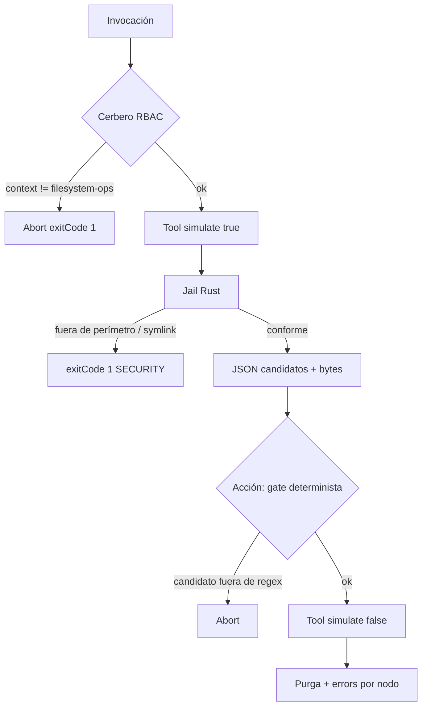

### [FEATURE] Tool: ephemeral-cache-purger (Saneamiento Termodinámico)

#### 1. Origen y Visión Ontológica

Ciclo de desarrollo asistido (Cursor / Antigravity) + `cargo` reiterado acumula artefactos bajo `/tmp/cursor-sandbox-cache/`. Evidencia de host (2026-09-09): partición raíz ~93 %; un sandbox `8ed0e32366f9f07cb451cc54ce1a30ad/cargo-target` ≈ 8.4 GB, modo `775`, uid/gid `root`. La hemorragia es real; el uid de la cápsula puede **no** poder borrarla (`EACCES`).

```
[Entorno Host]
/tmp/cursor-sandbox-cache/
  └── <sandbox-hash-32hex>/
        └── cargo-target/   <-- candidato por defecto
```

> **Imperativo de Seguridad S+ Grade:**  
> El borrado es irreversible. No depende de un LLM. Gate = whitelist/blacklist/symlink en Rust. Arquitectura en dos tiempos: `simulate: true` (inventario) antes de `simulate: false` (purga), acoplados en la **acción** (misma invocación), no por memoria del binario de la tool.

---

#### 2. Filtro A — Detección y Purga Forense

##### 2.1 v1.1.0 (conservado)

| Fricción v1.0.0 | Clasificación | SSOT | Resolución |
| :--- | :--- | :--- | :--- |
| Contexto `infrastructure-maintenance` | Alucinación normativa | `execution-contexts.md` matriz cerrada 2.1–2.9 | `context: filesystem-ops` (§2.2) |
| Cerbero filtra regex de paths | Violación SRP | `cerbero.md`: cruce `context` × `allowed_policies`; no parsea stdin | Jail físico en la tool |
| `paths.toolCapsules` | Fósil nominativo | `cumulo.execution_capsules.tools`, `compiled_capsules.*` | Crate `SddIA/tools/ephemeral-cache-purger/` |
| WASI `--dir=.` vs `/tmp` | Inviabilidad runtime | `capsules.rs`: `wasmtime run --dir=.` | Entrega: binario nativo; WASI solo si el harness preabre el prefijo |
| Argos como juez heurístico de paths | Evidencia no determinista | `argos.md` L-ARGOS-SYNTHESIS | Gate en Rust; Argos = fase Verificación del proceso `feature` |
| «Ceguera Espacial» = sandbox WASI | Distorsión doctrinal | Constitución / `paths-via-cumulo.md` | Ceguera = no hardcodear rutas de workspace; WASI = aislamiento de capacidades |
| NFT / MoveVM en este PBI | Kitchen bleed | `PBI-KITCHEN-TOKENIZACION-NFT.md` | Solo NFT-Ready (identidad S+ Grade) |

##### 2.2 v1.2.0 (este refinamiento)

| Fricción v1.1.0 | Clasificación | SSOT | Resolución |
| :--- | :--- | :--- | :--- |
| Acción invoca Argos (fases 2–3 del flujo) | Alucinación de rol | `actions-contract.md` §2: acciones invocan **solo** Skills/Tools. §2bis: flujos de ciclo de vida = procesos, no acciones. Argos es `agent`. | Acción `purge-sandbox-cache`: dos llamadas a `tool:ephemeral-cache-purger` + gate **determinista** sobre `candidate_targets`. Argos no entra en la acción. |
| Regex L-JAIL ≠ PURGE-CA2 | Incoherencia interna | Un SSOT de perímetro | Regex único: `^/tmp/cursor-sandbox-cache(/[a-f0-9]{16,64}(/.*)?)?$` |
| Blacklist «coincide o **contiene** `/`» | Bug lógico letal | Toda ruta absoluta contiene `/` | Veto por **prefijo de componente**: la ruta **es** `/` o empieza por `/bin`, `/usr`, `/etc`, `/var`, `/lib`, `/boot`, `/dev`, `/proc`, `/sys`, `/home`, `/root`, `/opt`, `/sbin`. Nunca «contains `/`». |
| `/home/racso/` en blacklist | Ceguera Espacial + Core agnóstico | README / Constitución | `$HOME` via `std::env::var("HOME")` si está definido; prefijo `/home` genérico. Cero uid de host en genoma. |
| `canonicalize` + anti-symlink | Contradicción física | `canonicalize` sigue symlinks y falla si el path no existe | Orden: absoluto → walk `symlink_metadata` **sin** seguir → rechazar symlink → prefijo whitelist sobre path léxico. `canonicalize` solo tras walk limpio y existencia. Path inexistente = error I/O, no SECURITY. |
| Envelope con `name` + `message` | Inexactitud I/O | `sddia-io` `SddiaResponse`: `success`, `exitCode`, `feedback`, `result`, `error` (strings). Tools existentes (`event-bus-audit`, `io-choke`) no emiten `name`. | Ejemplos = crate real. `error` string, no objeto. |
| `max_depth: 4` sobre el árbol | Inexactitud operativa | `cargo-target` supera 4 niveles | `max_depth` **no** recorta el recuento de bytes dentro de un `cargo-target` admitido. Opcional: tope de **raíces candidatas** (hashes), no de profundidad interna. |
| Tool recuerda dry-run previo | Alucinación de estado | Cápsula stdin/stdout sin store | `simulate: false` es seguro **solo** por el jail. El acoplamiento dos-tiempos es de la **acción** (dry-run + dictamen + purga en un proceso). |
| UUIDs del PBI como identidad forjada | Inexactitud de forja | `tool-creator` / `action-creator` → `crypto-broker` `GENERATE_UUID` | UUIDs abajo = **propuestos**. Autoridad = UUID forjado. Actualizar PBI/spec si divergen. |
| `source_sha256: "opcional_en_forja"` | Placeholder | tools-contract | Omitir hasta cómputo real. |
| PURGE-CA7 = `df -h` sobre cache root del host | DoD no reproducible | Cache 8.4 GB `root:root`; CI no es ese host | CA7 = fixture de test bajo el prefijo, uid del runner. Purga host real = verificación de laboratorio **no gate** de merge. `EACCES` → `errors[]`, no panic. |
| `execution_substrate: rust-native` vs contrato §8 WASI | Excepción no declarada | `tools-contract.md` §8 | Frontmatter `rust-native` + nota: excepción por `--dir=.`. WASI fuera de entrega v1. |

---

#### 3. Blindajes (leyes)



##### 3.1 L-RBAC

Tool y acción: `context: filesystem-ops`. Cerbero cruza contra `allowed_policies` del invocante. No inspecciona paths.

##### 3.2 L-JAIL (SSOT de perímetro)

1. **Whitelist (único regex):**
   `^/tmp/cursor-sandbox-cache(/[a-f0-9]{16,64}(/.*)?)?$`
2. **Default operativo:** `target_dir` = `/tmp/cursor-sandbox-cache`. Candidatos = `…/<hash>/cargo-target` (no el sandbox entero). Flag `purge_sandbox_root: false` (default).
3. **Blacklist de prefijo** (componentes, no substring): `/`, `/bin`, `/usr`, `/etc`, `/var`, `/lib`, `/lib64`, `/boot`, `/dev`, `/proc`, `/sys`, `/home`, `/root`, `/opt`, `/sbin`. Si `HOME` está definido, veto de ese prefijo.
4. **Anti-symlink:** `symlink_metadata` por componente; `is_symlink` → `SECURITY_VIOLATION_SYMLINK`. No seguir.
5. **Absoluto obligatorio.** Relativos y `..` léxicos → rechazo.

##### 3.3 L-TWO-PHASE

- Tool `simulate: true`: inventario, cero mutación.
- Tool `simulate: false`: `remove_dir_all` / unlink por candidato ya jail-ok; errores de nodo en `errors[]`.
- Acción: (1) simulate true (2) verificar cada `candidate_targets[i]` contra el regex (3) simulate false. Sin agente.

##### 3.4 L-EVIDENCE

Argos no es peaje de borrado. Audita el entregable del ciclo `feature` (`validacion.md`) con evidencia de tests. `approval_status` del agente ≠ runtime de la tool.

##### 3.5 L-PERMS

`PermissionDenied` no es SECURITY. Código `IO_PERMISSION_DENIED` en `errors[]`. `success: false` si `simulate: false` y ningún nodo purgado por EACCES masivo.

---

#### 4. Tool `ephemeral-cache-purger`

##### 4.1 Identidad (forja vía `entity-manager` → `tool-creator`)

Campos exigidos post-forja (el creator emite `uuid` y `hash_signature`):

```yaml
name: ephemeral-cache-purger
version: 1.0.0
contract: tools-contract v1.5.0
contract_ref: SddIA/tools/tools-contract.md
domain_origin: SddIA
context: filesystem-ops
execution_substrate: rust-native
capabilities:
  - ephemeral-cache-purger
  - sandbox-cache-cleaner
  - disk-hygiene
  - capsule-json-io
implementation_path_ref: SddIA/tools/ephemeral-cache-purger
```

UUID propuesto (no autoridad): `23035482-1017-46b1-a639-95350a097fff`.

##### 4.2 I/O (`sddia-io`)

stdin: envelope `capsule-json-io` v2.0 o payload directo (`request` opcional).

```json
{
  "meta": {
    "schemaVersion": "2.0",
    "entityKind": "tool",
    "entityId": "ephemeral-cache-purger"
  },
  "request": {
    "simulate": true,
    "target_dir": "/tmp/cursor-sandbox-cache",
    "older_than_hours": 0,
    "purge_sandbox_root": false
  }
}
```

| Campo | Tipo | Default | Notas |
| :--- | :--- | :--- | :--- |
| `simulate` | bool | — (requerido) | true = inventario |
| `target_dir` | string | `/tmp/cursor-sandbox-cache` | Debe matchear L-JAIL |
| `older_than_hours` | number | `0` | Filtra por mtime del candidato |
| `purge_sandbox_root` | bool | `false` | `true` = candidata la raíz hash; default solo `cargo-target` |

Salida éxito (`emit_success`):

```json
{
  "success": true,
  "exitCode": 0,
  "feedback": null,
  "result": {
    "simulated": true,
    "target_dir": "/tmp/cursor-sandbox-cache",
    "bytes_scanned": 9019431424,
    "human_size": "8.4 GB",
    "candidate_targets": [
      "/tmp/cursor-sandbox-cache/8ed0e32366f9f07cb451cc54ce1a30ad/cargo-target"
    ],
    "purged_directories_count": 0,
    "purged_files_count": 0,
    "errors": []
  },
  "error": null
}
```

Salida perímetro (`emit_error`):

```json
{
  "success": false,
  "exitCode": 1,
  "feedback": "SECURITY_VIOLATION_PATH_OUT_OF_BOUNDS: /home",
  "result": null,
  "error": "SECURITY_VIOLATION_PATH_OUT_OF_BOUNDS: /home"
}
```

##### 4.3 Crate

`SddIA/tools/ephemeral-cache-purger/` — auto-member `SddIA/Cargo.toml` (`tools/*`).

- `Cargo.toml`: `sddia-io = { path = "../../sddia-io" }`, `serde`, `serde_json`, `regex`.
- `src/main.rs` + `src/jail.rs` (lógica testable).
- Tests: accept hash/cargo-target; reject `/`, `/home`, relativo, `..`, symlink; `simulate: true` no borra; `simulate: false` borra fixture propio; EACCES no panic.

Compilar: `SddIA/target/release/ephemeral-cache-purger`. WASI no es entrega v1.

---

#### 5. Acción `purge-sandbox-cache`

Forja: `entity-manager` `entity_class: action`. UUID propuesto: `d518f0e1-ea40-402e-a865-f84a43bfebc5`.

- `context: filesystem-ops`.
- Orquestación: tool simulate true → validar `candidate_targets` ∩ regex → tool simulate false.
- Delivery: handler nativo en `execute-process` (`actions.rs` / módulo dedicado) vía `invoke_tool_capsule_json(..., prefer_wasm: false)`. El engine **no** es genoma DA-2.
- Prohibido: `delegates_to: agent:argos`.

---

#### 6. Línea de montaje

1. Proceso `feature` (rama `feat/tool-ephemeral-cache-purger`, `persist_ref: docs/features/tool-ephemeral-cache-purger`).
2. Commit de planificación (`clarify`/`objectives`/`spec`/`plan` + PBI v1.2.0).
3. `entity-manager` create tool + create action.
4. Crate + tests + handler de acción.
5. `implementation.md` / `execution.md` / `validacion.md`.
6. `delivery-close-cycle` → PR. CI verde (`run_id`) antes de `global: APTO`.
7. `accept-pr` + cierre documental en la misma rama.

---

#### 7. Criterios de Aceptación

- [ ] **PURGE-CA1** Spec `ephemeral-cache-purger.md` tools-contract v1.5.0, `context: filesystem-ops`, fila en `tools/index.md`, UUID forjado.
- [ ] **PURGE-CA2** Rechazo determinista fuera de `^/tmp/cursor-sandbox-cache(/[a-f0-9]{16,64}(/.*)?)?$`, symlinks, relativos, `..`, prefijos de sistema. `exitCode: 1` + `SECURITY_VIOLATION_*`.
- [ ] **PURGE-CA3** `simulate: true` no muta disco. Cuenta bytes/candidatos.
- [ ] **PURGE-CA4** I/O = `sddia-io` (`success`/`exitCode`/`result`/`error`/`feedback`).
- [ ] **PURGE-CA5** Sin panic no capturado. I/O por nodo en `errors[]`.
- [ ] **PURGE-CA6** Acción dos tiempos + gate regex. Cero invocación a Argos en runtime de purga.
- [ ] **PURGE-CA7** Tests crean fixture bajo el prefijo, purgan, aserten espacio/ausencia. Host `/tmp/cursor-sandbox-cache` real = lab opcional; `EACCES` documentado, no bloquea merge.
- [ ] **PURGE-CA8** CI del PR verde (`run_id` en `validacion.md`) antes de `accept-pr`.
