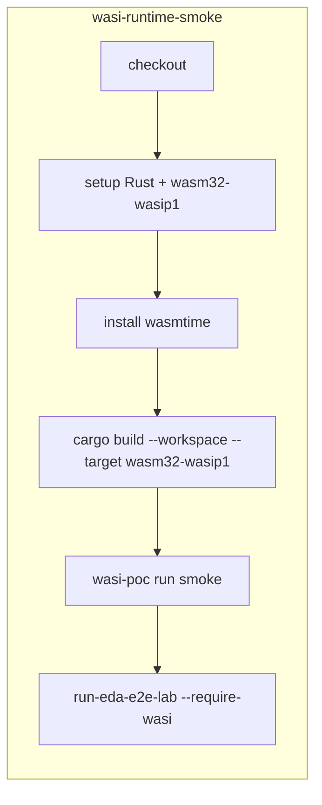

# [Kaizen] CI WASI — wasmtime y build workspace en runner

| Campo | Valor |
|-------|-------|
| **ID** | `PBI-KAIZEN-CI-WASI-RUNTIME-BUILD` |
| **Estatus** | Pendiente de forja |
| **Precedente** | [`PBI-KAIZEN-EDA-BUS-E2E-WASMTIME-FALLBACK`](../done/[Kaizen]%20eda-bus-e2e-smoke%20—%20fallback%20cryptography-manager%20sin%20wasmtime.md) (PR #83 — fallback operativo) |
| **Feature objetivo** | [`docs/features/ci-wasi-runtime-validation`](../../features/ci-wasi-runtime-validation/) |
| **Prioridad** | Alta — cerrar deuda post-migración WASI (PR #77) |

## 0. Contexto y deuda heredada

El Kaizen PR #83 restauró `eda-bus-e2e-smoke` mediante **fallback Python** (`cryptography-manager.py`) cuando `wasmtime` o los artefactos `.wasm` no existen. Eso desbloquea CI, pero **enmascara** la ausencia de validación WASI real en el runner.

La migración Rust/WASI materializó 15 cápsulas (`skills/*` + `tools/*`) bajo target `wasm32-wasip1`, pero `.github/workflows/sddia-index-qa.yml` no instala toolchain ni runtime. La deuda explícita quedó registrada en `docs/fixes/kaizen-eda-bus-e2e-wasmtime-fallback/spec.md` § No objetivos.

**Objetivo de esta fase:** que CI compile el workspace WASI, ejecute `wasmtime` y demuestre que el lab E2E **toma la ruta cápsula**, no el fallback.

---

## 1. Objetivo estratégico

Instalar en GitHub Actions el toolchain Rust/WASI + runtime `wasmtime`, compilar el workspace `SddIA/` y añadir un job de smoke que certifique la ejecución física de cápsulas WASM en el runner, complementario al job `eda-bus-e2e-smoke` existente (que puede seguir usando fallback para resiliencia).

---

## 2. Estado actual vs objetivo

| Dimensión | Hoy (post PR #83) | Objetivo |
|-----------|-------------------|----------|
| `eda-bus-e2e-smoke` | ✅ Verde vía fallback Python | ✅ Sigue verde (resiliencia) |
| Ruta WASI en CI | ❌ No ejercitada | ✅ Job dedicado obliga WASI |
| `cargo build --target wasm32-wasip1` | Solo local | ✅ En cada PR/push |
| `wasmtime` en runner | Ausente | Instalado y en `PATH` |
| Artefactos `.wasm` | No generados en CI | `SddIA/target/wasm32-wasip1/debug/*.wasm` |

---

## 3. Arquitectura CI propuesta

### 3.1 Nuevo job: `wasi-runtime-smoke`

Añadir en `.github/workflows/sddia-index-qa.yml`:

### 3.2 Pasos detallados

| Paso | Acción | Notas |
|------|--------|-------|
| 1 | `actions/checkout@v4` | — |
| 2 | `dtolnay/rust-toolchain@stable` con `targets: wasm32-wasip1` | Pin opcional en `rust-toolchain.toml` si existe |
| 3 | Instalar wasmtime | `curl https://wasmtime.dev/install.sh -sSf \| bash`; `PATH=$HOME/.wasmtime/bin:$PATH` |
| 4 | Cache Cargo | `~/.cargo/registry`, `~/.cargo/git`, `SddIA/target` — clave por lockfile |
| 5 | Build workspace | `cd SddIA && cargo build --workspace --target wasm32-wasip1` |
| 6 | PoC sellado | `SddIA/tools/wasi-poc/scripts/run-wasi.sh` con payload mínimo → `success: true` |
| 7 | E2E WASI forzado | Ver §4 |

### 3.3 Cápsulas mínimas a verificar

| Cápsula | Artefacto esperado | Rol en smoke |
|---------|-------------------|--------------|
| `cryptography-manager` | `target/wasm32-wasip1/debug/cryptography-manager.wasm` | `entity-manager` → `GENERATE_UUID` |
| `wasi-poc` | `tools/wasi-poc/target/.../wasi-poc.wasm` o workspace target | Sellado envelope JSON |
| *(stretch)* `shell-executor`, `git-manager` | homólogos en `target/` | Flujos delivery/PR futuros |

Fase 1 del PBI: **cryptography-manager + wasi-poc**. Fase 2: matriz de cápsulas críticas del workspace.

---

## 4. Cambios de código requeridos

### 4.1 Flag `SDDIA_CI_REQUIRE_WASI`

Introducir variable de entorno leída en `_crypto_wasm_ready()` / rutas homólogas:

- Si `SDDIA_CI_REQUIRE_WASI=1` y fallback sería necesario → **fallar** con error explícito (`WASI path required but wasmtime/artifact missing`).
- El job `wasi-runtime-smoke` exporta `SDDIA_CI_REQUIRE_WASI=1` antes del lab.
- El job `eda-bus-e2e-smoke` **no** la define (mantiene fallback).

Archivos tocados:

- `SddIA/scripts/qa/execute_process_capsules.py` — `crypto()`, `_crypto_wasm_ready()`
- `SddIA/scripts/qa/execute-action.py` — `_crypto()`, `_crypto_wasm_ready()`

### 4.2 Script de smoke WASI (nuevo)

`SddIA/scripts/qa/run-wasi-ci-smoke.py`:

1. Verifica `shutil.which("wasmtime")`.
2. Verifica existencia de artefactos mínimos (`cryptography-manager.wasm`, `wasi-poc.wasm`).
3. Ejecuta `cryptography-manager` vía wasmtime (`GENERATE_UUID`) y valida envelope.
4. Opcional: delega en `run-eda-e2e-lab.py` con `SDDIA_CI_REQUIRE_WASI=1`.

Salida: JSON capsule-json-io con `success`, `wasi_path_verified: true`.

### 4.3 Paridad documental

Crear `docs/features/ci-wasi-runtime-validation/` con: `spec.md`, `plan.md`, `objectives.md`, `implementation.md`, `validacion.md`.

---

## 5. Criterios de aceptación (Definition of Done)

| ID | Criterio | Verificación |
|----|----------|--------------|
| CI-W1 | Job `wasi-runtime-smoke` en workflow | Presente en `sddia-index-qa.yml` |
| CI-W2 | `cargo build --workspace --target wasm32-wasip1` exit 0 en runner | Log Actions |
| CI-W3 | `wasmtime` disponible en PATH del job | `wasmtime --version` en step |
| CI-W4 | PoC `wasi-poc` ejecuta en sandbox | `run-wasi.sh` → `success: true` |
| CI-W5 | `cryptography-manager.wasm` invocado (no fallback) | `SDDIA_CI_REQUIRE_WASI=1` + lab E2E |
| CI-W6 | `eda-bus-e2e-smoke` sin regresión | Sigue SUCCESS sin flag WASI |
| CI-W7 | Cache Cargo reduce tiempo < 15 min cold / < 8 min warm | Observación PR |
| CI-W8 | Paridad documental + `validacion.md` APTO | Aduana PR |
| CI-W9 | PBI archivado en `docs/todos/done/` | Cierre documental un PR |

---

## 6. Plan de ejecución

| Fase | Entrega | Rama sugerida |
|------|---------|---------------|
| **1** | Job CI: Rust + wasmtime + build workspace | `feat/ci-wasi-runtime-validation` |
| **2** | `run-wasi-ci-smoke.py` + PoC step | misma rama |
| **3** | `SDDIA_CI_REQUIRE_WASI` + E2E forzado | misma rama |
| **4** | Cache, optimización, documentación, cierre PBI | PR único |

---

## 7. Riesgos y mitigaciones

| Riesgo | Mitigación |
|--------|------------|
| Tiempo de build Rust en CI | Cache `actions/cache` + build solo `debug` en smoke |
| Fallo intermitente de install wasmtime | Pin versión en script o variable `WASMTIME_VERSION` |
| Divergencia debug vs release local | Documentar que CI usa `debug`; release en aduana manual |
| Job duplicado con `eda-bus-e2e-smoke` | Separación clara: uno resiliencia (fallback), otro WASI estricto |

---

## 8. Referencias

- Kaizen cerrado: [`docs/todos/done/[Kaizen] eda-bus-e2e-smoke — fallback cryptography-manager sin wasmtime.md`](../done/[Kaizen]%20eda-bus-e2e-smoke%20—%20fallback%20cryptography-manager%20sin%20wasmtime.md)
- Fix implementado: [`docs/fixes/kaizen-eda-bus-e2e-wasmtime-fallback/`](../../fixes/kaizen-eda-bus-e2e-wasmtime-fallback/)
- Migración WASI: [`docs/features/migracion-rust-wasi/`](../../features/migracion-rust-wasi/)
- PoC sellado: [`docs/features/wasi-poc-ignition/`](../../features/wasi-poc-ignition/)
