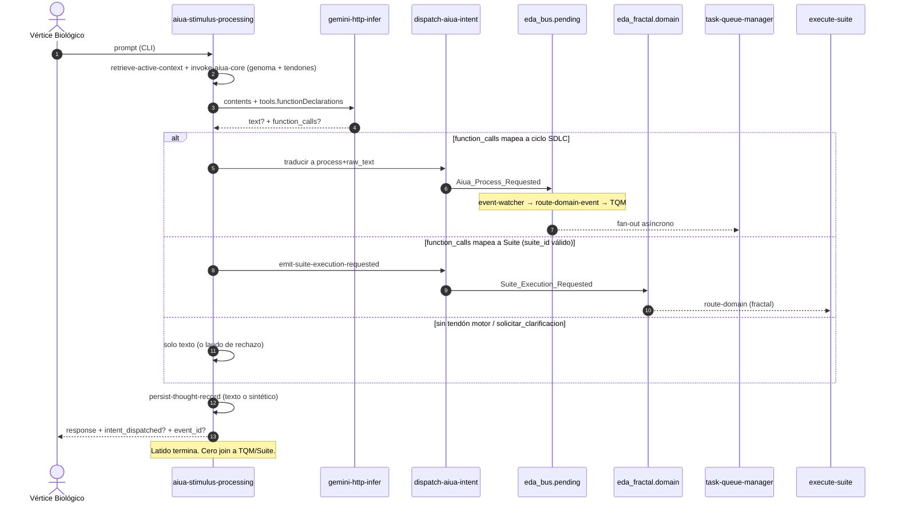

### [NÚCLEO] Anatomía Motora de Aiúa — Inyección de Capacidades (Function Calling) y Orquestación EDA

#### 1. Origen y Visión Ontológica

Tras el latido MVP (`PBI-NUCLEO-ARRANQUE-AIUA-TORMENTOSA`, PR #270 APTO) Tormentosa **contempla**: ensambla genoma, infiere, persiste pensamiento. No articula órganos. El desafío de este PBI:

> ¿Cómo transita la Aiúa de laudo verbal a **voluntad motora** sin convertirse en agente, sin terminal y sin esperar a Tekton?

Dos pilares, **desacoplados**:

1. **Extracción estructurada de intención** vía Function Calling de Gemini (`gemini-http-infer`). Las declaraciones no son comandos del host: son tendones semánticos (`ordenar_refactorizacion`, …) que el modelo puede invocar. No es un bucle Gemini `functionResponse` que espera el resultado físico.
2. **Despacho EDA ya existente.** La traducción a ECST reutiliza los circuitos Kalma2 (ciclos SDLC) y Suite (campañas), no inventa una línea de montaje paralela.

El reposo natural sigue siendo latencia (`aiua_core.md` §2). Tras depositar el padre ECST, el latido acusa y termina (DA-5). El despertar de TQM / `execute-suite` es relevo de artefactos.

---

#### 2. Filtro A — Detección y Purga (v1.1.0)

Contraste de la propuesta v1.0.0 contra SSOT. Filas **Conservar** = v1.0.0 ya correcto.

| Fricción / Tentación | Clasificación | Realidad SSOT | Resolución |
| :--- | :--- | :--- | :--- |
| **«Bus fractal (`eda_bus.pending`)»** | *Conflación de sustrato* | `eda_fractal.*` = `./.events/{telemetry,orchestration,domain}/` + `route-{family}`. `eda_bus.pending` = pipeline V3+ (`.events/pending/`) + `route-domain-event`. Coexistencia D0.2 (`events-contract` §6). Kalma2 escribe **pending/**. Suite escribe **`eda_fractal.domain`**. | No unificar buses. El despacho elige el circuito del proceso destino. Prohibido llamar «fractal» a `pending/`. |
| **Instancias JSON en `SddIA/events/domain/` o `.SddIA/events/`** | *Inexactitud de plano* | `SddIA/events/{family}/` = Clases Markdown (genoma). `.SddIA/events/` = `eda_instance.customization`, no cola. Runtime = `/.events/` (gitignore). | Conservar. Clase nueva bajo `SddIA/events/domain/`. Instancia nunca en git. |
| **`emit-domain-mutation` para órdenes motoras** | *Violación de contrato* | UUID `7e4a9c2b-1d3f-4a8e-9b6c-0f1e2d3a4b5c`. Solo CRUD genómico (`entity_class` + `lifecycle_operation` → `Domain_Entity_*`). | Conservar. No pervertir el Sello Universal. |
| **`gemini-http-infer` ya soporta tools** | *Carencia de crate* | `src/main.rs`: POST solo `contents[].parts[].text` + `temperature` opcional. `extract_text` = `parts[0].text`. `functionCall` → `gemini-empty-candidate`. Lab-mock: `lab-mock:{model}:{prompt[0..80]}`. Cero `functionDeclarations` en el repo. | Conservar el diagnóstico. Forja aditiva de tools + parseo. |
| **Aiúa ejecuta bash / muta FS** | *Tentación anti-ontológica* | `aiua_core.md` §3–§4: gobierna y delega; **Filtro de Materialización** (intención ≠ ejecución). Tormentosa **no** es agente (`README` / PBI arranque). | Prohibido terminal y Write desde el núcleo. La cápsula HTTP sigue ciega. El término **Ceguera Espacial** en SSOT = resolución de rutas vía Cúmulo (agentes/cápsulas), **no** este veto. No usar «Aislamiento Paramétrico» (fósil de PBIs viejos). |
| **Espera a que Tekton termine** | *Violación DA-5* | Fire-and-Forget: éxito = inyección acusada. | Conservar. Tras `event_id` persistido, el proceso acaba. Cero `sleep`/join a TQM. |
| **PEC o fractura despiertan a Aiúa siempre** | *Bucle termodinámico* | `Process_Execution_Completed` = familia **`orchestration`**, emisor **`execute-process`** (Peaje), suscriptores en `event-orchestration-subscriptions.json` (Cúmulo `persist-pec-correlation-proof` + Argos Telegram). **Argos no emite PEC.** `System_Fracture_Detected` = **domain**, Kintsugi (Cúmulo + Mayeuta + Telegram). | **Fuera de este hito** el cierre de consciencia vía PEC/fractura. Un suscriptor Aiúa en PEC es PBI sucesor con filtro de fricción + `correlation_id`. |
| **TQM consume `intent_name` / `target` / `rationale`** | *Alucinación de contrato* | `Kalma2_Process_Requested` REQUIRED: `process`, `raw_text`; OPTIONAL: `pbi_ref`, `process_inputs`. TQM allowlist: `bug-fix` \| `feature` \| `refactorization` \| `task-queue-manager`. Handler: `task_text`/`raw_text` obligatorio; `process` no despachable → error. | Payload hermano del de Kalma2. El tendón semántico se **traduce** en `dispatch-aiua-intent` a `process` + `raw_text` (+ `pbi_ref` si existe). |
| **TQM = Cerbero → Dédalo → Tekton → Argos en un latido** | *Inexactitud de línea* | TQM: Triaje / Activación / Despacho hijo (`feature`\|`bug-fix`\|`refactorization`) / Finalización. Argos entra en `pull-request-review` post-PR, no como fase TQM. | El diagrama no encadena Argos ni PEC de dominio. Despacho = hijo SDLC asíncrono. |
| **`emitter_agent: "aiua-tormentosa"`** | *Conflación ontológica* | Envelope ECST exige `emitter_agent` string de emisor **indexado**. Precedente Kalma2: `"kalma2-interact"` (proceso). Aiúa no está en `directories.agents`. | `emitter_agent: "aiua-stimulus-processing"` (o la acción nativa si el contrato de Clase lo fija). Nunca un agente fantasma Tormentosa. |
| **Clase nueva para auditoría = Suite** | *Duplicación* | `Suite_Execution_Requested` existe. Emisor: `emit-suite-execution-requested`. REQUIRED: `suite_id`. Destino runtime: **`eda_fractal.domain`**. Suscriptor: `execute-suite`. TQM **no** despacha `execute-suite`. | `requerir_auditoria` **solo** si hay `suite_id` indexado → reutilizar esa acción/evento. Sin `suite_id`: laudo conversacional (texto), cero ECST inventado. |
| **`solicitar_clarificacion` → Mayeuta vía bus** | *Órgano inventado* | No hay suscripción TQM→Mayeuta. `kalma2-interact` chat ≠ latido Aiúa. | Tendón **no motor**. La ambigüedad sale en `result.text`. Cero evento. |
| **Bucle Gemini `functionResponse` hasta Tekton** | *Incoherencia de protocolo* | REST `generateContent` espera `functionResponse` en un turno siguiente. Esperar al hijo SDLC viola DA-5. | Function Calling aquí = **salida estructurada de intención**. Una combustión. Sin segunda HTTP en este hito. Acuse determinista en `data.intent_dispatched` + `event_id`. `result.text` puede ir vacío. |
| **CA-8 «concluye en milisegundos»** | *Inexactitud empírica* | Latidos live PR #270: ~7–18 s de HTTP Gemini. El despacho ECST es local; el peaje no. | El CA mide **cero join a TQM/Tekton**, no la latencia de inferencia. |
| **`persist-thought-record` con texto vacío** | *Colapso de fase 4* | `response_text` obligatorio y `str_opt` rechaza vacío. Solo `functionCall` tumba `Consolidacion-Memoria`. | Persistir `response_text` sintético (`intent={name}; event_id={uuid}` o texto del modelo si hay). |
| **IOTA como CA del fan-out** | *Sobre-alcance / riesgo* | Arranque: IOTA de `Thought_Persisted` fuera de DoD. Fractura abierta `route-domain-event` (IOTA 500, `60db1db67e49`). Kalma2 sí lista IOTA; no es gate de este núcleo. | Suscriptor DLT **fuera**. No copiar el segundo fan-out Kalma2 como CA. |
| **«Nivel de soberanía activo»** | *Vapor* | No existe en genoma ni bóveda. | Eliminado. Catálogo de tendones = fijo en genoma `aiua_core.md` (o anexo `{name}.md` bajo `directories.conscience`). |
| **Acción nueva = cápsula WASM y listo** | *Inexactitud de runtime* | `invoke-aiua-core` no tiene crate; física en `handlers::aiua_stimulus`. `emit-domain-mutation` = handler nativo (`domain_mutation.rs` + `actions.rs`). | `dispatch-aiua-intent` = acción indexada **nativa** (mismo patrón). Cablear el latido en `aiua_stimulus.rs`. Genoma vía `entity-manager` (DA-2). |
| **depends_on kaizen thinking HIGH** | *Falso prerrequisito* | Kaizen (`PBI-AIUA-AUDIT-FINDINGS-20260908`) muta la **misma** cápsula (`thinkingConfig`) y el mismo handler (cuerpos de acción, prefacio). Sigue `unrefined`. FC no exige thinking HIGH. | Contención de forja, no `depends_on`. Este PBI **no** reabre H-LLM-1b/2/3/4. `generationConfig` / `tools` aditivos: no clobber. Router multi-LLM = kitchen, fuera. |

---

#### 3. Arquitectura del Flujo Motor



##### Vector 1 — Function Calling (una combustión)

1. **Catálogo de tendones** (genoma conscience; nombres LLM-facing). MVP:

   | Tendón | ¿Motor? | Traducción |
   |--------|---------|------------|
   | `ordenar_refactorizacion` | Sí | `process=refactorization`, `raw_text` ← `goal` + `target_component`, `pbi_ref` si viene |
   | `iniciar_feature` | Sí | `process=feature`, mismo patrón (`goal` / `target_component` → `raw_text`) |
   | `iniciar_bug_fix` | Sí | `process=bug-fix` |
   | `requerir_auditoria` | Condicional | Solo con `suite_id` kebab existente → `Suite_Execution_Requested`. Sin id: texto, cero bus |
   | `solicitar_clarificacion` | No | Solo `result.text` |

   Esquema Gemini REST (campo real: `functionDeclarations`, camelCase). Ejemplo motor:

   ```json
   {
     "name": "ordenar_refactorizacion",
     "description": "Solicita un ciclo refactorization del Core SddIA. No ejecuta código.",
     "parameters": {
       "type": "object",
       "properties": {
         "target_component": {"type": "string"},
         "goal": {"type": "string"},
         "pbi_ref": {"type": "string", "description": "Path docs/todos/pending/… si existe"}
       },
       "required": ["target_component", "goal"]
     }
   }
   ```

2. **`gemini-http-infer`**
   - Request: `tools` (array de declaraciones) y `tool_config` opcional.
   - Body Google: `"tools": [{"functionDeclarations": [...]}]`.
   - Parseo: recorrer `candidates[0].content.parts[]`; cada `functionCall` → `result.function_calls[{name, args}]`.
   - Éxito si hay **texto no vacío XOR ≥1 functionCall** (o ambos). Solo entonces se evita `gemini-empty-candidate`.
   - Lab-mock: simular `function_calls` por input de request (p. ej. `request.lab_mock_function_calls`) con `SDDIA_LAB_MOCK_OUTBOUND=1`. Cero red. No inventar slug de modelo en Rust.
   - Aditivo respecto de `temperature` y, si el kaizen aterriza antes, `thinkingConfig`: no pisar claves ajenas.

3. **`invoke-aiua-core` / handler**
   - Sigue ensamblando un único `assembled_prompt` (genoma + contexto + estímulo).
   - Añade `tools_schema` serializable al latido (no al prompt como prosa opaca si ya va en `tools` REST; el genoma puede enumerar tendones para Filtro B).
   - Runtime: `aiua_stimulus.rs` pasa `tools` al POST. El `{name}.md` de la acción se actualiza por `entity-manager` (cuerpo hoy truncado: **no** es alcance H-LLM-2 de este PBI más allá de documentar `tools_schema` en outputs).

##### Vector 2 — Despacho (`dispatch-aiua-intent`)

Acción nativa nueva (`actions-contract v1.3.0`). Forja DA-2: `entity-manager` → `action-creator`. Handler al patrón `emit-domain-mutation`.

| Input | Regla |
|-------|--------|
| `function_call.name` + `args` | Enum del catálogo |
| `correlation_id` | Opcional UUID v4; si falta, `event_id` nuevo |

Traducción:

- SDLC → escribir padre ECST `Aiua_Process_Requested` en **`eda_bus.pending`** (`{event_id}.json`), validación ECST pre-WRITE (como `emit-domain-mutation` §1b).
- Suite → delegar en **`emit-suite-execution-requested`** (no reimplementar escritura fractal).
- Nombre desconocido / args incompletos / `process` fuera de allowlist → `success: false`, **sin** archivo en bus.

No usa `emit-domain-mutation`.

##### Vector 3 — Clase `Aiua_Process_Requested`

- Archivo: `SddIA/events/domain/aiua-process-requested.md` (`event-creator` / `entity-manager`).
- `event_family: domain`. `event_type: Aiua_Process_Requested`.
- **Analogía:** `Kalma2_Process_Requested`. **No** reutilizar esa Clase (emisor autorizado = `kalma2-interact`).

**Payload REQUIRED:** `process`, `raw_text`  
**OPTIONAL:** `pbi_ref`, `process_inputs`, `intent_name`  
**FORBIDDEN:** rutas de ejecución host, scripts, secretos.

`process` ∈ `{feature, bug-fix, refactorization}` (no `task-queue-manager` como proceso hijo desde Aiúa).

**Emisor autorizado:** `aiua-stimulus-processing` vía `dispatch-aiua-intent`.  
**`emitter_agent` instancia:** `aiua-stimulus-processing`.

**Suscripción** (`event-domain-subscriptions.json`):

```json
"Aiua_Process_Requested": [
  {
    "agent": "tekton",
    "process": "task-queue-manager",
    "intent": "Despacho del ciclo SDLC solicitado por el latido de la Aiúa."
  }
]
```

TQM debe aceptar este `event_type` con el **mismo** shape que Kalma2 (`raw_text` / `process` / `pbi_ref`). Extensión mínima del handler/route: no un dialecto nuevo.

##### Vector 4 — Relevo asíncrono (ya existe)

- SDLC: `event-watcher` → `route-domain-event` → TQM → hijo `feature`\|`bug-fix`\|`refactorization`.
- Suite: `route-domain` (fractal) → `execute-suite`.
- Este PBI **no** repara la fractura IOTA de `route-domain-event`. Si pending/ no se enruta, es incidente de bus, no bypass `gh`/`git`.

---

#### 4. Fuera de Alcance

- Constitución (`CONSTITUTION_CORE.md`) y rebaja de filtros C/A/B.
- Terminal, scripts o Write desde el núcleo de la Aiúa.
- Segunda combustión Gemini (`functionResponse`) en el mismo o siguiente latido.
- Suscribir `Process_Execution_Completed` o `System_Fracture_Detected` a `aiua-stimulus-processing`.
- Anclaje IOTA / `iota-immutable-publisher` como CA.
- Kalma2, puente perceptivo, agente Tormentosa.
- H-LLM-1b thinking HIGH, H-LLM-2 cuerpos completos de las tres acciones, H-LLM-3 prefacio de identidad, H-LLM-4 inyección de Constitución (PBI kaizen).
- `PBI-MULTI-LLM-ROUTER` (kitchen) y `antigravity-cli-executor` como combustión.
- Unificar `eda_bus` y `eda_fractal`.
- `solicitar_clarificacion` como evento.
- Polling / `sleep` post-acuse (DA-5).

---

#### 5. Componentes y plan de mutación

| Componente | Tipo | Cambio | Vía |
| :--- | :--- | :--- | :--- |
| `gemini-http-infer` | Tool Rust | `tools` / parseo `functionCall` / lab-mock FC / éxito texto⊕FC | `entity-manager` + crate |
| `invoke-aiua-core` + `aiua_stimulus.rs` | Action + handler | Inyectar catálogo; pasar tools a infer; despacho opcional; persistencia no vacía | DA-2 genoma; handler nativo |
| `dispatch-aiua-intent` | Action **nueva** nativa | Traducir tendón → ECST o `emit-suite-execution-requested` | `entity-manager` + `actions.rs` |
| `aiua-stimulus-processing` | Process | Fase opcional `Despacho-Motor` si hay `function_calls` motores | `entity-manager` |
| `aiua-process-requested.md` | Event Class nueva | Contrato hermano de Kalma2 | `entity-manager` / `event-creator` |
| `event-domain-subscriptions.json` | SSOT | Clave `Aiua_Process_Requested` → TQM | Cúmulo / ciclo feature |
| `task_queue_manager` / `route_domain_core` | Engine | Aceptar el nuevo `event_type` con payload Kalma2-compatible | crate engine |
| `aiua_core.md` | Genoma | Registrar tendones y veto de ejecución directa; Filtro de Materialización intacto | dominio `conscience/` (no censo DA-2) |

---

#### 6. Criterios de Aceptación (DoD)

- [ ] **CA-1** `gemini-http-infer` acepta `request.tools` y serializa `functionDeclarations` en el POST.
- [ ] **CA-2** Respuesta con `functionCall` y sin `parts[0].text` → `success` + `result.function_calls`; no `gemini-empty-candidate`.
- [ ] **CA-3** Lab-mock (`SDDIA_LAB_MOCK_OUTBOUND=1`) simula `function_calls` sin red.
- [ ] **CA-4** El latido inyecta el catálogo canónico en la petición (no prosa suelta como único canal).
- [ ] **CA-5** `dispatch-aiua-intent` nativa: valida args; SDLC → JSON ECST en `cumulo.paths.json` → `eda_bus.pending`; Suite → acción existente; fallo → cero archivo.
- [ ] **CA-6** Clase `SddIA/events/domain/aiua-process-requested.md` con REQUIRED/OPTIONAL/FORBIDDEN, `event_family: domain`, emisor = proceso del latido. Índice de familia sincronizado.
- [ ] **CA-7** `event-domain-subscriptions.json`: `Aiua_Process_Requested` → `task-queue-manager` (`agent: tekton`). TQM/route despachan con `process`+`raw_text` (prueba de contrato, lab-sync).
- [ ] **CA-8** Tras persistir el evento, `aiua-stimulus-processing` retorna acuse (`intent_dispatched`, `event_id`) **sin** invocar TQM/Tekton en el mismo proceso.
- [ ] **CA-9** `functionCall` sin texto no tumba `persist-thought-record`. Cero Write/bash desde genoma Aiúa. Cero regresión de `CONSTITUTION_CORE.md`. `aiua_core.md` documenta tendones sin reclasificar Tormentosa como agente.
- [ ] **CA-10** Tests acotados en verde: crate `gemini-http-infer` + handler latido/despacho (lab-mock). Un PR. `validacion.md` APTO, `pbi_archived: true`, PBI en `docs/todos/done/` **en la misma rama**.

---

#### 7. Laudos de refinamiento (invariantes de implementación)

| ID | Laudo |
|----|--------|
| **L-BUS** | SDLC → `eda_bus.pending`. Suite → `eda_fractal.domain` vía emisor ya indexado. |
| **L-SHAPE** | Payload SDLC = hermano Kalma2 (`process` + `raw_text`). Tendones ≠ envelope del bus. |
| **L-FC** | Una combustión. FC = intención, no protocolo de herramientas del host. |
| **L-EMITTER** | `emitter_agent` = proceso/acción indexados, nunca «tormentosa» como agente. |
| **L-LOOP** | Cierre de consciencia PEC/fractura = sucesor. |
| **L-IOTA** | Fuera de DoD. |
| **L-FORGE** | Genoma `tools`/`actions`/`process`/`events` solo `entity-manager`. Handler nativo para despacho. |
| **L-KAIZEN** | No absorber thinking/rol/Constitución. Forja aditiva sobre `gemini-http-infer`. |
