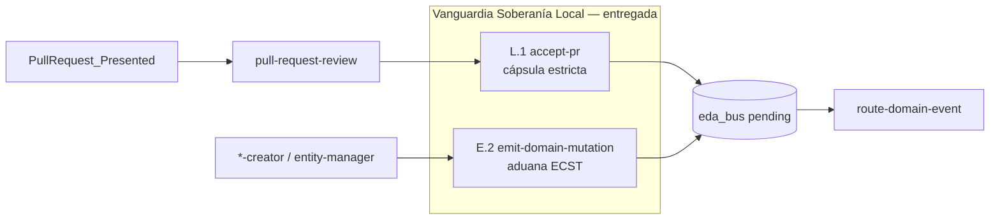

# Backlog pendiente (consolidado)

> **Contexto (2026-05-20):** **PBI-005 cerrado al 100 %** en `main` (PR #13, merge `ed543c8`, CA-3 completo). Orquestación fractal PR (PR #11), aduana `pre-commit` (PR #12) y hooks ciclo PR Ola B (PR #13) en producción. Este manifiesto agrupa la deuda **posterior al PBI** — no reabrir Hitos 1–3.

> **Actualización (2026-05-25):** **P4 Ola C V3 coreografía** — runtime en `main` (PRs #24–#29); cierre documental en PR [#41](https://github.com/racso80es/SddIA/pull/41) (`validacion.md` APTO, job CI `eda-bus-e2e-smoke`). **Única brecha operativa:** L1-O5 runbooks.

---

## Análisis de estado (2026-05-25)

| Bloque | Avance real | Brecha principal |
|--------|-------------|------------------|
| **PBI-005 / Ola C shims** | ✅ Cerrado | OC.5 residual (`execute-process.md` legacy) — no bloqueante |
| **Cadena PR reactiva** | ✅ PR #11 + #15 + #36 + #37 | Handoff review→accept probado; higiene ramas auditable vía `hygiene_failure` |
| **L.1 `accept-pr`** | 🟢 ~95 % | Cápsula 4 fases + Fase 4 estricta en `main`; runbooks legacy sin unificar |
| **E.2 `emit-domain-mutation`** | ✅ 100 % | Aduana ECST pre-`pending/` en `execute-action.py` + cápsulas |
| **L.2–L.3 laboratorio** | ✅ Entregado | Gate fase 2 DC + fases 6–7 `feature` físicas; agentes IDE 2–5 `simulated` |
| **E.1 IOTA CI** | ✅ | Feature [`e1-iota-ci`](../../features/e1-iota-ci/) — PR #40 |
| **Ola C V3 coreografía (P4)** | ✅ | Runtime `main` + cierre doc PR [#41](https://github.com/racso80es/SddIA/pull/41) |

**Dependencia crítica restante:** **L1-O5** — runbooks operativos sin invocación suelta de `git-manager` (único gate para archivar este manifiesto).

---

## Cerrado — no reabrir

| Entrega | Evidencia |
|---------|-----------|
| **PBI-005 completo** (Hitos 1–3) | `docs/todos/done/[OPERATIVO] Planificación de Backlog… (Ola A).md` v1.5.1 |
| Orquestación fractal PR presentado | PR #11 — `docs/todos/done/… Orquestación fractal PR presentado…` |
| EDA `Domain_Entity_*` universal | `docs/todos/done/… EDA — Eventos Domain_Entity…` |
| Intérprete dinámico `execute-process` | PR #9 — `refactor-execute-process-engine` |
| Laboratorio `feature` fase 1 (`workspace-init`) | `docs/todos/done/… Laboratorio — Handler físico proceso feature.md` |
| Hito 3 **Ola A** — `pre-commit` Argos | PR #12 — `docs/features/pbi-005-hito3-git-hooks/` |
| Hito 3 **Ola B** — hooks `pre-push` / `post-merge` | PR #13 — `docs/features/pbi-005-hito3-ola-b/` |
| **Deuda Ola C — shims CLI** | PR #14 MERGED — `docs/todos/done/… Deuda Ola C — Retirar compatibilidad CLI…` |
| **Vanguardia L.1 + E.2** (código) | PR #37 — `docs/features/vanguardia-soberania-local/validacion.md` APTO |
| **E.1 IOTA CI** | PR #40 — `docs/features/e1-iota-ci/validacion.md` APTO |
| **Ola C V3 coreografía (P4)** | PRs #24–#29 (runtime) + PR [#41](https://github.com/racso80es/SddIA/pull/41) (cierre doc) — `docs/features/ola-c-v3-coreografia/validacion.md` APTO |

### Trazabilidad PBI-005 Hito 3 (CA-3)

| Ola | PR | Presented | Merged | Merge `main` |
|-----|-----|-----------|--------|--------------|
| A | #12 | `0c9a8a63-…` | `34cfbad5-…` | `12119f7` |
| B | #13 | `c15a00f4-…` | `a1cf6541-…` | `ed543c8` |

---

## ~~Prioridad 1 — Deuda Ola C: retirada de shims CLI~~ (CERRADO 2026-05-22)

**Manifiesto:** [`docs/todos/done/[ARQUITECTURA] Deuda Ola C — Retirar compatibilidad CLI execute-process y execute-action.md`](done/%5BARQUITECTURA%5D%20Deuda%20Ola%20C%20%E2%80%94%20Retirar%20compatibilidad%20CLI%20execute-process%20y%20execute-action.md) — PR [#14](https://github.com/racso80es/SddIA/pull/14) en `main`; seguimiento Kaizen EDA en PR [#18](https://github.com/racso80es/SddIA/pull/18).

| ID | Estado | Nota |
|----|--------|------|
| OC.1–OC.4 | ✅ | Runtime y `SddIA/scripts/**` canónicos |
| OC.5 | ⏳ | `SddIA/actions/execute-process.md` — deuda residual no bloqueante |

---

## Prioridad 1 — Vanguardia de Fricción: Soberanía Local (L.1 + E.2)

> **Objetivo innegociable:** sellar la **puerta de entrada** del sistema local antes de ampliar laboratorio o coreografía V3.

Feature **entregada:** [`docs/features/vanguardia-soberania-local/`](../../features/vanguardia-soberania-local/) — PR [#37](https://github.com/racso80es/SddIA/pull/37) mergeado en `main` (`2d9fe64`).

### L.1 — `accept-pr`: cápsula física estricta

| Aspecto | Estado actual | Objetivo vanguardia |
|---------|---------------|---------------------|
| Fases 1–3 (Auditoría → Merge → Sello) | ✅ Handlers lab | Mantener; smoke regresión |
| Fase 4 (Push + higiene ramas) | ✅ Push OK; `hygiene_failure` auditable | ✅ Entregado PR #37 |
| `git-manager` suelto en runbooks | ⏳ Guías legacy en `docs/features/*/execution.md` históricos | Runbook único vía `execute-process --process accept-pr` |
| Incidente PR #36 | ✅ Código corregido | Manifiesto FIX pendiente de mover a `done/` |

**Criterios de cierre L.1:**

- [x] `capsule_accept_sync_cleanup` propaga `hygiene_failure` si `delete_branch` falla (vanguardia entregada).
- [x] `closed_branch` solo cuando delete local **y** remoto confirmados (`hygiene_failure` si partial).
- [x] Smoke lab post-merge: rama eliminada o `hygiene_failure` explícito.
- [x] `accept-pr.md` § Fase 4 alineado con comportamiento real de cápsula.
- [ ] Runbooks operativos sin invocación suelta de `git-manager` para merge/push/delete (solo vía proceso).

**Artefactos tocados:** `SddIA/scripts/qa/execute_process_capsules.py`, `SddIA/process/accept-pr.md`, `SddIA/norms/git-operations.md`, smoke JSON bajo `docs/features/vanguardia-soberania-local/`.

### E.2 — Validación de esquema en `emit-domain-mutation` (paralelo)

| Aspecto | Estado actual | Objetivo vanguardia |
|---------|---------------|---------------------|
| Paso 1 acción (inputs enum/hash) | ✅ Spec + `_run_emit_domain_mutation` | ✅ Mantener |
| Ensamblaje ECST (Paso 4) | ✅ JSON estándar | ✅ Mantener |
| Aduana pre-`pending/` | ✅ `validate_domain_mutation_event` pre-`WRITE_FILE` | ✅ Entregado PR #37 |
| Reutilización | ✅ `SddIA/scripts/qa/ecst_validation.py` | ✅ Router + emisores importan módulo compartido |
| Deuda Ola C V3 §2 | ✅ Cerrada en vanguardia | — |

**Criterios de cierre E.2:**

- [x] Mutación malformada → `success: false`, `exitCode: 1`, **sin** archivo en `pending/`.
- [x] Violaciones REQUIRED/FORBIDDEN de payload ECST `Domain_Entity_*` detectadas en emisor.
- [x] `event_type` no catalogado en `SddIA/events/index.md` → abortar antes de persistir.
- [x] Smoke: evento válido pasa; payload con campo FORBIDDEN aborta.
- [x] `emit-domain-mutation.md` § Orquestación documenta Paso 1b (aduana ECST).

**Artefactos tocados:** `SddIA/scripts/qa/execute-action.py`, `SddIA/scripts/qa/execute_process_capsules.py` (`capsule_emit_domain_mutation`), `SddIA/scripts/qa/ecst_validation.py`, `SddIA/actions/emit-domain-mutation.md`.

### Orquestación del frente

- **L.1** y **E.2** entregados en PR #37; residual **L1-O5** (runbooks documentales).
- **Precedencia:** E.2 aduana **antes** de `pending/` evita que entropía contamine el bus; L.1 garantiza que `main` y ramas remotas queden higiénicas tras merge soberano.
- **No reabrir:** hooks Hito 3, `pull-request-review`, DLT Oráculo — ya entregados; esta vanguardia **endurece** la base.

---

## Prioridad 2 — Laboratorio: procesos físicos completos

| ID | Proceso | Gap actual | Objetivo |
|----|---------|------------|----------|
| L.1 | **`accept-pr`** | ✅ Código; ⏳ L1-O5 runbooks | `hygiene_failure` auditable + guías unificadas |
| L.2 | **`delivery-close-cycle`** | ✅ Gate fase 2 `delivery-impact-assessment` | Fases 1, 3–7 ya físicas (PR #11+) |
| L.3 | **`feature`** | ✅ Fases 6–7 físicas; 2–5 `simulated` honesto | Feature `laboratorio-handlers-l2-l3` |

**Nota:** Presentación PR (fases 4–6) y fusión vía cápsula `accept-pr` operativas desde PR #11, PR #13 y PR #37.

---

## Prioridad 3 — EDA producción e integridad

| ID | Tarea | Estado |
|----|-------|--------|
| E.1 | IOTA **físico** en CI/validación (sin solo `SDDIA_LAB_SIMULATE_IOTA=1`) | ✅ [`e1-iota-ci`](../../features/e1-iota-ci/) |
| E.2 | Validación de esquema en `emit-domain-mutation` antes de `pending/` | ✅ PR #37 — `ecst_validation.py` |
| E.3 | `verify-process-integrity.py` + gate `pre-commit` | ✅ PR #12 |
| E.4 | Recalcular `hash_signature` tras cambio de `phases` en procesos | ✅ Disciplina PR #12+ |

---

## ~~Prioridad 4 — Ola C V3 coreografía~~ (CERRADO 2026-05-25)

**Manifiesto:** [`docs/todos/done/[ARQUITECTURA] Especificación Técnica Avanzada_ El Genoma de Eventos y Coreografía Asíncrona (Ola C) V3.md`](../done/%5BARQUITECTURA%5D%20Especificaci%C3%B3n%20T%C3%A9cnica%20Avanzada_%20El%20Genoma%20de%20Eventos%20y%20Coreograf%C3%ADa%20As%C3%ADncrona%20(Ola%20C)%20V3.md)

**Feature:** [`docs/features/ola-c-v3-coreografia/`](../../features/ola-c-v3-coreografia/) — cierre documental PR [#41](https://github.com/racso80es/SddIA/pull/41). Delta topológico V3+ en [`refactor-topologia-eventos-ola-c-v3`](../../features/refactor-topologia-eventos-ola-c-v3/).

| Componente | Estado | Evidencia |
|------------|:------:|-----------|
| Padre inmutable en `.events/pending/` | ✅ | PR #24 + #25 |
| Testigos `[UUID].[subscriber_id].json` + middleware | ✅ | `eda_bus_utils.promote_witness` |
| Topología V3+ simétrica | ✅ | PR #25 |
| `event-sweeper.py` + sweep inline | ✅ | PR #24 + #29 |
| Alerta Kaizen dead-letter | ✅ | `event-sweeper._emit_kaizen_alert` |
| CI `eda-bus-e2e-smoke` | ✅ | PR #41 — E2E lab + sweeper `--once` |
| Spec + `validacion.md` APTO | ✅ | PR #41 |

**Nota:** Recibos `.notificado` / `.procesado` y subcarpetas `receipts/` quedaron **obsoletos** — sustituidos por testigos JSON bajo `{estado}/subscribers/`. `delivery_state` en padre: legacy en emisión; trazabilidad runtime = testigos.

---

## Prioridad 5 — Higiene documental

| ID | Tarea | Estado |
|----|-------|--------|
| D.1 | PBI-005 operativo v1.5.1 completado | ✅ → `docs/todos/done/…` |
| D.2 | Consolidar activos en `docs/todos/pending/` y `done/` | 🔄 En curso — FIX `delete_branch` aún en `pending/` |
| D.3 | Reexportar PDF operativo desde `.md` | ⏳ |
| D.4 | Feature Hito 3 Ola A + Ola B | ✅ PR #12 + PR #13 |
| D.5 | Actualizar `TODO-BLINDAJE-IA-OBRERA` Fase C (pre-commit + hooks) | ⏳ |

---

## Matriz resumen

| Bloque | Prioridad | Esfuerzo | Desbloquea |
|--------|-----------|----------|------------|
| ~~Ola C shims CLI~~ | ~~—~~ | — | ✅ PR #14 |
| ~~Vanguardia L.1 + E.2 (código)~~ | ~~P1~~ | — | ✅ PR #37 |
| **L1-O5 runbooks** | **P1 residual** | Bajo | Paridad operativa post-vanguardia |
| ~~Handlers lab L.2–L.3~~ | ~~P2~~ | — | ✅ Feature `laboratorio-handlers-l2-l3` |
| ~~IOTA CI + integridad genoma (E.1)~~ | ~~P3~~ | — | ✅ PR #40 |
| ~~Ola C V3 coreografía (P4)~~ | ~~P4~~ | — | ✅ PRs #24–#29 + #41 |
| Docs / PDF / blindaje | **P5** | Bajo | Paridad administrativa |

---

## Definición de hecho (este backlog)

- [x] **PBI-005** y **CA-3** al 100 % (`main`, PR #13).
- [x] **OC.1–OC.4** completos (OC.5 residual no bloqueante).
- [x] **L.1** cápsula estricta + higiene ramas auditable (vanguardia P1, PR #37).
- [x] **E.2** aduana ECST en `emit-domain-mutation` pre-`pending/` (vanguardia P1, PR #37).
- [x] **L.2** gate Impacto SddIA en `delivery-close-cycle` (lab).
- [x] **L.3** handlers fases 6–7 en `feature` + `execution_report` honesto fases 2–5.
- [x] **E.1** IOTA físico en CI (`run-iota-ci-smoke` + workflow, PR #40).
- [x] **P4** Ola C V3 coreografía — runtime + cierre documental (`ola-c-v3-coreografia`, PR #41).
- [ ] **L1-O5** runbooks sin `git-manager` suelto.
- [ ] Este archivo → `status: cerrado` o `docs/todos/done/` cuando **L1-O5** esté resuelto.

---

## Referencias rápidas

| Tema | Ruta |
|------|------|
| PBI-005 (cerrado) | `docs/todos/done/[OPERATIVO] Planificación de Backlog… (Ola A).md` |
| Feature Ola B | `docs/features/pbi-005-hito3-ola-b/` |
| Feature Ola A | `docs/features/pbi-005-hito3-git-hooks/` |
| Presentación PR | `SddIA/process/delivery-close-cycle.md` v1.1 |
| Fusión PR | `SddIA/process/accept-pr.md` |
| Sello genoma | `SddIA/actions/emit-domain-mutation.md` |
| Validación ECST (compartida) | `SddIA/scripts/qa/ecst_validation.py` |
| Validación ECST (router) | `SddIA/scripts/qa/route_domain_event_core.py` |
| FIX delete_branch (código cerrado; doc pendiente) | `docs/todos/pending/[FIX] accept-pr — higiene silenciosa delete_branch tras merge.md` |
| Feature vanguardia | `docs/features/vanguardia-soberania-local/` |
| Feature lab L.2–L.3 | `docs/features/laboratorio-handlers-l2-l3/` |
| Feature E.1 IOTA CI | `docs/features/e1-iota-ci/` |
| Feature Ola C V3 coreografía | `docs/features/ola-c-v3-coreografia/` |
| Topología V3+ (delta) | `docs/features/refactor-topologia-eventos-ola-c-v3/` |
| Contrato hooks CA-3 | `SddIA/evolution/git-hooks-ca3-ola-b-contract.md` |
| Norma PR | `SddIA/norms/pull-request-orchestration.md` |
