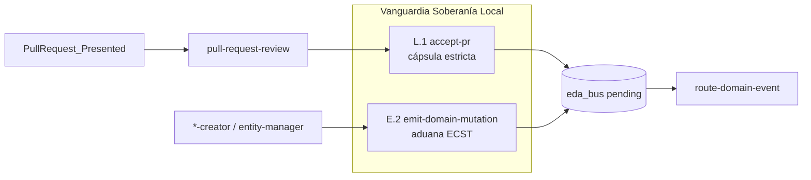

# Backlog pendiente (consolidado)

> **Contexto (2026-05-20):** **PBI-005 cerrado al 100 %** en `main` (PR #13, merge `ed543c8`, CA-3 completo). Orquestación fractal PR (PR #11), aduana `pre-commit` (PR #12) y hooks ciclo PR Ola B (PR #13) en producción. Este manifiesto agrupa la deuda **posterior al PBI** — no reabrir Hitos 1–3.

> **Actualización (2026-05-24):** Tras PR #15 (`pull-request-review-redesign`) y PR #36 (`pull-request-automation-dlt`), la cadena Presented → Review → Accept opera en lab/producción parcial. La **puerta de entrada** sigue inestable: `accept-pr` traga fallos de `delete_branch` (FIX abierto, incidente PR #36) y `emit-domain-mutation` persiste ECST sin aduana de esquema pre-`pending/`. Se eleva **Vanguardia de Fricción — Soberanía Local (L.1 + E.2)** como frente activo → feature [`docs/features/vanguardia-soberania-local/`](../../features/vanguardia-soberania-local/).

---

## Análisis de estado (2026-05-24)

| Bloque | Avance real | Brecha principal |
|--------|-------------|------------------|
| **PBI-005 / Ola C shims** | ✅ Cerrado | OC.5 residual (`execute-process.md` legacy) — no bloqueante |
| **Cadena PR reactiva** | ✅ PR #11 + #15 + #36 | Handoff review→accept probado; higiene ramas no determinista |
| **L.1 `accept-pr`** | 🟡 ~75 % | Cápsulas 4 fases en `execute_process_capsules.py`; Fase 4 silenciosa ante `delete_branch` |
| **E.2 `emit-domain-mutation`** | 🔴 ~30 % | Validación de inputs básica; **sin** ECST vs Clase antes de disco |
| **L.2–L.3 laboratorio** | 🟡 Parcial | Fases simuladas en `delivery-close-cycle` y `feature` |
| **E.1 IOTA CI** | ⏳ | Solo simulación lab (`SDDIA_LAB_SIMULATE_IOTA=1`) |
| **Ola C V3 coreografía** | ⏳ | Sweeper, recibos, middleware — visión largo plazo |

**Dependencia crítica:** hasta sellar L.1 + E.2, el ciclo de vida del código opera sobre bases inestables (merge sin higiene garantizada + bus expuesto a mutaciones malformadas).

---

## Cerrado — no reabrir

| Entrega | Evidencia |
|---------|-----------|
| **PBI-005 completo** (Hitos 1–3) | `docs/todos/done/[OPERATIVO] Planificación de Backlog… (Ola A).md` v1.5.1 |
| Orquestación fractal PR presentado | PR #11 — `docs/todos/done/… Orquestación fractal PR presentado…` |
| EDA `Domain_Entity_*` universal | `docs/todos/done/… EDA — Eventos Domain_Entity…` |
| Intérprete dinámico `execute-process` | PR #9 — `refactor-execute-process-engine` |
| Laboratorio `feature` fase 1 (`workspace-init`) | `docs/todos/done/… Laboratorio — Handler físico proceso feature.md` |
| Hito 3 **Ola A** — `pre-commit` Argos | PR #12 — `docs/features/pbi-005-hito3-git-hooks/` |
| Hito 3 **Ola B** — hooks `pre-push` / `post-merge` | PR #13 — `docs/features/pbi-005-hito3-ola-b/` |
| **Deuda Ola C — shims CLI** | PR #14 MERGED — `docs/todos/done/… Deuda Ola C — Retirar compatibilidad CLI…` |

### Trazabilidad PBI-005 Hito 3 (CA-3)

| Ola | PR | Presented | Merged | Merge `main` |
|-----|-----|-----------|--------|--------------|
| A | #12 | `0c9a8a63-…` | `34cfbad5-…` | `12119f7` |
| B | #13 | `c15a00f4-…` | `a1cf6541-…` | `ed543c8` |

---

## ~~Prioridad 1 — Deuda Ola C: retirada de shims CLI~~ (CERRADO 2026-05-22)

**Manifiesto:** [`docs/todos/done/[ARQUITECTURA] Deuda Ola C — Retirar compatibilidad CLI execute-process y execute-action.md`](done/%5BARQUITECTURA%5D%20Deuda%20Ola%20C%20%E2%80%94%20Retirar%20compatibilidad%20CLI%20execute-process%20y%20execute-action.md) — PR [#14](https://github.com/racso80es/SddIA/pull/14) en `main`; seguimiento Kaizen EDA en PR [#18](https://github.com/racso80es/SddIA/pull/18).

| ID | Estado | Nota |
|----|--------|------|
| OC.1–OC.4 | ✅ | Runtime y `SddIA/scripts/**` canónicos |
| OC.5 | ⏳ | `SddIA/actions/execute-process.md` — deuda residual no bloqueante |

---

## Prioridad 1 — Vanguardia de Fricción: Soberanía Local (L.1 + E.2)

> **Objetivo innegociable:** sellar la **puerta de entrada** del sistema local antes de ampliar laboratorio o coreografía V3.

Feature activa: [`docs/features/vanguardia-soberania-local/`](../../features/vanguardia-soberania-local/) — rama `feat/vanguardia-soberania-local`.

### L.1 — `accept-pr`: cápsula física estricta

| Aspecto | Estado actual | Objetivo vanguardia |
|---------|---------------|---------------------|
| Fases 1–3 (Auditoría → Merge → Sello) | ✅ Handlers lab | Mantener; smoke regresión |
| Fase 4 (Push + higiene ramas) | 🟡 Push OK; `delete_branch` falla en silencio | Visibilidad auditable + delete local/remoto confirmado |
| `git-manager` suelto en runbooks | ⏳ Guías legacy aún citan pasos manuales | Runbook único vía `execute-process --process accept-pr` |
| Incidente PR #36 | Rama feature no borrada post-merge | Absorbido en FIX; criterio O3 smoke post-merge |

**Criterios de cierre L.1:**

- [x] `capsule_accept_sync_cleanup` propaga `hygiene_failure` si `delete_branch` falla (vanguardia entregada).
- [x] `closed_branch` solo cuando delete local **y** remoto confirmados (`hygiene_failure` si partial).
- [x] Smoke lab post-merge: rama eliminada o `hygiene_failure` explícito.
- [x] `accept-pr.md` § Fase 4 alineado con comportamiento real de cápsula.
- [ ] Runbooks operativos sin invocación suelta de `git-manager` para merge/push/delete (solo vía proceso).

**Artefactos tocados:** `SddIA/scripts/qa/execute_process_capsules.py`, `SddIA/process/accept-pr.md`, `SddIA/norms/git-operations.md`, smoke JSON bajo `docs/features/vanguardia-soberania-local/`.

### E.2 — Validación de esquema en `emit-domain-mutation` (paralelo)

| Aspecto | Estado actual | Objetivo vanguardia |
|---------|---------------|---------------------|
| Paso 1 acción (inputs enum/hash) | ✅ Spec + `_run_emit_domain_mutation` | Mantener |
| Ensamblaje ECST (Paso 4) | ✅ JSON estándar | Mantener |
| Aduana pre-`pending/` | 🔴 Ausente | Validar instancia vs Clase catalogada **antes** de `WRITE_FILE` |
| Reutilización | — | Extraer/adaptar `load_event_class_schemas` + `validate_ecst_instance` de `route_domain_event_core.py` |
| Deuda Ola C V3 §2 | Documentada línea 50 | Cerrar en esta vanguardia, no postergar al sweeper |

**Criterios de cierre E.2:**

- [x] Mutación malformada → `success: false`, `exitCode: 1`, **sin** archivo en `pending/`.
- [x] Violaciones REQUIRED/FORBIDDEN de payload ECST `Domain_Entity_*` detectadas en emisor.
- [x] `event_type` no catalogado en `SddIA/events/index.md` → abortar antes de persistir.
- [x] Smoke: evento válido pasa; payload con campo FORBIDDEN aborta.
- [x] `emit-domain-mutation.md` § Orquestación documenta Paso 1b (aduana ECST).

**Artefactos tocados:** `SddIA/scripts/qa/execute-action.py`, `SddIA/scripts/qa/execute_process_capsules.py` (`capsule_emit_domain_mutation`), módulo compartido de validación ECST, `SddIA/actions/emit-domain-mutation.md`.

### Orquestación del frente

- **L.1** y **E.2** se ejecutan **en paralelo** (tracks independientes, mismo PR de feature si conviene revisión unificada).
- **Precedencia:** E.2 aduana **antes** de `pending/` evita que entropía contamine el bus; L.1 garantiza que `main` y ramas remotas queden higiénicas tras merge soberano.
- **No reabrir:** hooks Hito 3, `pull-request-review`, DLT Oráculo — ya entregados; esta vanguardia **endurece** la base.

---

## Prioridad 2 — Laboratorio: procesos físicos completos

| ID | Proceso | Gap actual | Objetivo |
|----|---------|------------|----------|
| L.1 | **`accept-pr`** | ✅ | Feature `vanguardia-soberania-local` — `hygiene_failure` auditable |
| L.2 | **`delivery-close-cycle`** | Fases 1–3 (`Snapshot`, Argos ×2) `simulated` | Handlers mínimos o gates documentados |
| L.3 | **`feature`** | Fases 2–6 `simulated` | Perfil IDE fuera de alcance lab; `execution_report` honesto |

**Nota:** Presentación PR (fases 4–6) y fusión vía cápsula `accept-pr` operativas desde PR #11 y PR #13.

---

## Prioridad 3 — EDA producción e integridad

| ID | Tarea | Estado |
|----|-------|--------|
| E.1 | IOTA **físico** en CI/validación (sin solo `SDDIA_LAB_SIMULATE_IOTA=1`) | ⏳ |
| E.2 | Validación de esquema en `emit-domain-mutation` antes de `pending/` | ✅ | Feature `vanguardia-soberania-local` |
| E.3 | `verify-process-integrity.py` + gate `pre-commit` | ✅ PR #12 |
| E.4 | Recalcular `hash_signature` tras cambio de `phases` en procesos | ✅ Disciplina PR #12+ |

---

## Prioridad 4 — Ola C V3 (visión largo plazo)

**Manifiesto:** [`docs/todos/done/[ARQUITECTURA] Especificación Técnica Avanzada_ El Genoma de Eventos y Coreografía Asíncrona (Ola C) V3.md`](../done/%5BARQUITECTURA%5D%20Especificaci%C3%B3n%20T%C3%A9cnica%20Avanzada_%20El%20Genoma%20de%20Eventos%20y%20Coreograf%C3%ADa%20As%C3%ADncrona%20(Ola%20C)%20V3.md)

| Componente | Estado |
|------------|--------|
| `event-sweeper.py` + recibos `[UUID].[PURPOSE].notificado` | ⏳ |
| Subcarpetas `receipts/` por estado | ⏳ |
| Middleware `.procesado` / `.error` (sello recibo) | ⏳ — hoy `delivery_state` en JSON |

---

## Prioridad 5 — Higiene documental

| ID | Tarea | Estado |
|----|-------|--------|
| D.1 | PBI-005 operativo v1.5.1 completado | ✅ → `docs/todos/done/…` |
| D.2 | Consolidar activos en `docs/todos/pending/` y `done/` | 🔄 En curso (PR Kaizen) |
| D.3 | Reexportar PDF operativo desde `.md` | ⏳ |
| D.4 | Feature Hito 3 Ola A + Ola B | ✅ PR #12 + PR #13 |
| D.5 | Actualizar `TODO-BLINDAJE-IA-OBRERA` Fase C (pre-commit + hooks) | ⏳ |

---

## Matriz resumen

| Bloque | Prioridad | Esfuerzo | Desbloquea |
|--------|-----------|----------|------------|
| ~~Ola C shims CLI~~ | ~~—~~ | — | ✅ PR #14 |
| **Vanguardia L.1 + E.2** | **P1** | Medio | Puerta de entrada sellada; base estable para lab/EDA |
| Handlers lab (L.2–L.3 restantes) | **P2** | Medio | Runbooks sin fases `simulated` |
| IOTA CI + integridad genoma (E.1) | **P3** | Bajo–Medio | Gobernanza EDA producción |
| Ola C V3 coreografía | **P4** | Alto | Visión largo plazo |
| Docs / PDF / blindaje | **P5** | Bajo | Paridad administrativa |

---

## Definición de hecho (este backlog)

- [x] **PBI-005** y **CA-3** al 100 % (`main`, PR #13).
- [x] **OC.1–OC.4** completos (OC.5 residual no bloqueante).
- [x] **L.1** cápsula estricta + higiene ramas auditable (vanguardia P1).
- [x] **E.2** aduana ECST en `emit-domain-mutation` pre-`pending/` (vanguardia P1).
- [ ] **E.1** IOTA físico en CI.
- [ ] Este archivo → `status: cerrado` o `docs/todos/done/` cuando vanguardia P1 + P2–P3 estén resueltos.

---

## Referencias rápidas

| Tema | Ruta |
|------|------|
| PBI-005 (cerrado) | `docs/todos/done/[OPERATIVO] Planificación de Backlog… (Ola A).md` |
| Feature Ola B | `docs/features/pbi-005-hito3-ola-b/` |
| Feature Ola A | `docs/features/pbi-005-hito3-git-hooks/` |
| Presentación PR | `SddIA/process/delivery-close-cycle.md` v1.1 |
| Fusión PR | `SddIA/process/accept-pr.md` |
| Sello genoma | `SddIA/actions/emit-domain-mutation.md` |
| Validación ECST (router) | `SddIA/scripts/qa/route_domain_event_core.py` |
| FIX delete_branch | `docs/todos/pending/[FIX] accept-pr — higiene silenciosa delete_branch tras merge.md` |
| Feature vanguardia | `docs/features/vanguardia-soberania-local/` |
| Contrato hooks CA-3 | `SddIA/evolution/git-hooks-ca3-ola-b-contract.md` |
| Norma PR | `SddIA/norms/pull-request-orchestration.md` |
