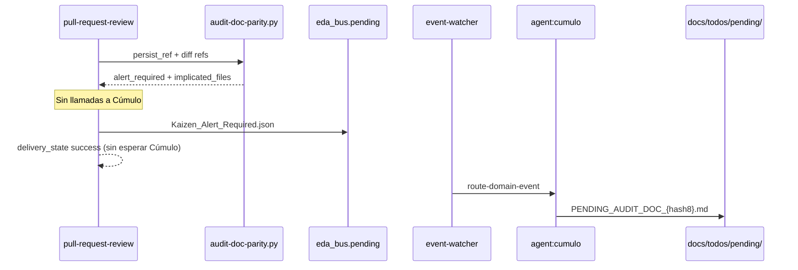

# [ARQUITECTURA] Kaizen_Alert_Required — bus reactivo y poda Cosecha Kaizen

**Estatus:** Pendiente  
**Jurisdicción:** Yunque Operativo (Tormentosa) · Sistema Nervioso EDA  
**Precedencia:** PBI `PBI-NORMA-PARIDAD-DOCUMENTAL` cerrado (PR #46) — sensor `audit-doc-parity.py` y puente lab v1 entregados

---

## 1. Declaración de Propósito

La feature **norma-paridad-documental** entregó el sensor DIA y un **puente síncrono provisional**: la cápsula `capsule_pr_review_kaizen` escribe directamente `PENDING_AUDIT_DOC_*.md` en `docs/todos/pending/` tras parsear la alerta del sensor. Eso viola el **desacople EDA** acordado: la Aduana detecta; **Cúmulo** persiste.

Este PBI cierra la deuda explícita **EDA v2**: forjar el **Chispazo** `Kaizen_Alert_Required`, inscribirlo en el Sistema Nervioso, **podar** el puente síncrono y confirmar el **despertar ontológico** de Cúmulo como único materializador de la cicatriz Kaizen documental.

### Principio rector (ceguera espacial)

```text
Aduana (pull-request-review)  →  deposita evento en eda_bus.pending  →  desentendimiento total
Cúmulo (suscriptor único)     →  consume Kaizen_Alert_Required       →  forja TODO en docs/todos/pending/
```

> **Nota de rutas:** la bandeja de entrada del bus de runtime es `eda_bus.pending` → `./.events/pending/` (`SddIA/core/cumulo.paths.json`). La carpeta `.SddIA/events/` alberga *customización* de clases ECST locales; **no** sustituye la bandeja del bus.

---

## 2. Contexto heredado (v1 entregado)

| Artefacto v1 | Comportamiento actual | Deuda |
|--------------|----------------------|-------|
| `audit-doc-parity.py` | Sensor puro; stdout JSON; sin agentes | ✅ Correcto |
| `_invoke_dia_audit` | Parsea JSON → `state["kaizen_items"]` + `state["dia_audit"]` | Debe emitir evento, no acumular items |
| `capsule_pr_review_kaizen` | Escribe `PENDING_AUDIT_DOC_{hash8}.md` directamente | **Extirpar** (escritura manual) |
| Fase **Cosecha Kaizen** | Delega a `agent:cumulo` vía cápsula síncrona | **Podar** lógica DIA; evento reemplaza fase para paridad documental |
| `pull-request-review.md` § DIA-3 | Menciona evento como deuda | Actualizar a contrato v2 operativo |

Evidencia v1: `docs/features/norma-paridad-documental/validacion.md` — smoke `smoke-dia-parity-20260525`.

---

## 3. Backlog Atómico (TODO)

| Hito | Objetivo Técnico | Criterio de Validación (Filtro A) |
| :---: | :--- | :--- |
| **H1** | **Forja del Chispazo (Contrato ECST)** | Existe `SddIA/events/kaizen-alert-required.md` registrado en `SddIA/events/index.md`; payload desnormalizado mínimo (§4) |
| **H2** | **Suscripción Sistema Nervioso** | Entrada `Kaizen_Alert_Required` en `event-subscriptions.json` con **Cúmulo como único suscriptor** |
| **H3** | **Emisión desde Aduana** | Tras `alert_required: true` del sensor, la cápsula triaje técnico deposita JSON ECST en `eda_bus.pending` y **no** propaga `kaizen_items` / `dia_audit` hacia Kaizen |
| **H4** | **Poda del Puente Síncrono** | Eliminada escritura `PENDING_AUDIT_DOC_*` y lógica DIA en `capsule_pr_review_kaizen`; fase Cosecha Kaizen sin side-effect documental DIA |
| **H5** | **Despertar Ontológico (Cúmulo)** | Genoma + instrucciones Cúmulo declaran mandato táctico: al recibir `Kaizen_Alert_Required`, materializar cicatriz en `docs/todos/pending/` |
| **H6** | **Handler / route reactivo** | `event-watcher` + `route-domain-event` despachan a Cúmulo; smoke E2E documentado en `execution.md` |

---

## 4. Forja del Chispazo — `SddIA/events/kaizen-alert-required.md`

### Metadatos ECST (borrador)

```yaml
name: "kaizen-alert-required"
event_type: "Kaizen_Alert_Required"
context: "quality-assurance"
capabilities:
  - "kaizen_alert_required"
  - "doc_parity_debt"
```

### Payload ECST — únicamente lo esencial desnormalizado

| Campo | Tipo | Obligatorio | Descripción |
|-------|------|-------------|-------------|
| `review_id` | string | **Sí** | Identificador de la revisión (UUID v4 / `correlation_id` de la aduana) |
| `alert_justification` | string | **Sí** | Código máquina + texto breve (ej. `impacts_doc_false_with_core_mutation`) |
| `implicated_files` | string[] | **Sí** | Rutas repo de archivos implicados (`monitored_hits` del sensor) |

### Campos OPTIONAL (recomendados, no bloqueantes)

| Campo | Tipo | Uso |
|-------|------|-----|
| `persist_ref` | string | Feature/fix bajo revisión |
| `pr_branch` | string | Rama del PR |
| `alert_kind` | string | Default `doc_parity` (extensible) |
| `impacts_doc` | boolean \| null | Valor resuelto del frontmatter DIA |

### FORBIDDEN en payload

- Referencias a rutas internas del sensor (`.tmp/audit-doc-parity-*.json`) — **prohibido** acoplar persistencia al artefacto efímero del sensor
- Invocaciones anidadas a agentes u órdenes imperativas hacia Cúmulo
- Payload completo del diff o contenido de archivos

### Emisores autorizados

- Proceso **`pull-request-review`** (fase Triaje técnico / cápsula post-`audit-doc-parity.py`)
- Acción **`emit-kaizen-alert-required-event`** (nueva cápsula, si se materializa vía `execute-action`)

---

## 5. Suscripción — `event-subscriptions.json`

Entrada propuesta:

```json
"Kaizen_Alert_Required": [
  {
    "agent": "cumulo",
    "intent": "Materializar cicatriz Kaizen documental en docs/todos/pending/ (único suscriptor legítimo)."
  }
]
```

**Reglas:**

- **Un solo suscriptor:** `agent: cumulo`. Prohibido fan-out a Mayeuta, Argos u otros en v1 de este evento.
- Sin suscripción IOTA/DLT en v1 (deuda Kaizen local; no anclaje DLT obligatorio).
- Actualizar `kaizen-alert-required.md` § Suscripciones con enlace bidireccional.

---

## 6. Poda del Puente Síncrono

### Extirpar en `execute_process_capsules.py`

| Bloque | Acción |
|--------|--------|
| `_dia_audit_hash` | Eliminar |
| `capsule_pr_review_kaizen` — rama `dia_audit` / `PENDING_AUDIT_DOC_*` | Eliminar |
| `_invoke_dia_audit` — append a `kaizen_items` | Sustituir por emisión ECST a `eda_bus.pending` |
| `state["dia_audit"]` | Eliminar; payload viaja en el evento |

### Aduana — nuevo contrato de desentendimiento

1. Invocar `audit-doc-parity.py` (sin cambios en el sensor).
2. Si `alert_required: true`, forjar envelope ECST y escribir en **`eda_bus.pending`**.
3. **Fin.** No invocar Cúmulo, no escribir en `docs/todos/`, no propagar a fase Cosecha Kaizen para DIA.

### Genoma `pull-request-review.md`

- Actualizar **DIA-3:** persistencia exclusivamente vía evento `Kaizen_Alert_Required`.
- Revisar fase **Cosecha Kaizen:** retirar intent DIA; mantener solo Kaizen genérico no documental si aplica (evaluar si la fase queda vacía → deprecar o redirigir).

---

## 7. Despertar Ontológico — Mandato táctico de Cúmulo

Al recibir un `Kaizen_Alert_Required` en su bandeja de entrada (`eda_bus.pending` → procesado por watcher):

| Mandato | Detalle |
|---------|---------|
| **M1 — Materializar cicatriz** | Forjar archivo TODO en `docs/todos/pending/` |
| **M2 — Nomenclatura** | `PENDING_AUDIT_DOC_{hash8}.md` donde `hash8 = SHA256(review_id + sorted(implicated_files))[:8]` |
| **M3 — Contenido mínimo** | Tabla con `review_id`, `alert_justification`, `implicated_files`, `persist_ref` (si presente), checklist de revisión DIA |
| **M4 — Idempotencia** | Si el TODO ya existe con mismo hash, no duplicar (coherente con `materialize-fracture-pbi`) |
| **M5 — No bloqueo** | La materialización Kaizen **no** altera `delivery_state` de la aduana |

### Artefactos a actualizar

| Artefacto | Cambio |
|-----------|--------|
| `SddIA/agents/cumulo.md` | § reactivo EDA — suscripción `Kaizen_Alert_Required` |
| `SddIA/agents/cumulo.instructions.json` | Regla táctica machine-readable (si existe SSOT) |
| Handler lab / `route-domain-event` | Despacho a acción Cúmulo (nueva o extensión de patrón `materialize-fracture-pbi`) |

---

## 8. Diagrama de secuencia objetivo



---

## 9. Relación con `Argos_Eda_Emision` (alcance acotado)

El stub `docs/todos/pending/Argos_Eda_Emision` registra deuda **`TODO: pending_argos_eda_emission`** en payload DLT de merge (`emit-pr-merged-event` / `execute-action.py`).

| Pregunta | Laudo |
|----------|-------|
| ¿Argos emite `Kaizen_Alert_Required`? | **No** — emisor es la **Aduana** post-sensor DIA |
| ¿Relación con DLT merge? | **Indirecta** — este PBI no cierra `pending_argos_eda_emission`; queda como Kaizen separado |
| ¿Acción en este PBI? | Referenciar en `related`; opcionalmente absorber el stub en cierre documental si se declara explícitamente fuera de alcance |

---

## 10. Matriz de contención de riesgos

| Vector | Impacto | Contramedida |
|--------|---------|--------------|
| Regresión DIA v1 | Pérdida de alertas Kaizen | Smoke dual: emisión evento + TODO materializado por Cúmulo |
| Acoplamiento Aduana ↔ Cúmulo | Violación ceguera espacial | Review estático: cero `docs/todos/` writes en cápsulas PR review post-poda |
| Evento huérfano sin handler | Deuda invisible | `event-watcher --once` en smoke; assert archivo TODO |
| Duplicación TODOs | Ruido en pending/ | Hash idempotente M4 |

---

## 11. Protocolo de Validación Empírica

1. Simular PR con diff monitorizado e `impacts_doc: false` en `spec.md`.
2. Ejecutar aduana lab (`pull-request-review`) → verificar JSON en `.events/pending/` con `event_type: Kaizen_Alert_Required`.
3. Ejecutar `event-watcher.py --once` → Cúmulo materializa `PENDING_AUDIT_DOC_*.md`.
4. Confirmar `verdict: aprobado` y `delivery_state: success` **sin** escritura síncrona previa en `docs/todos/`.
5. Confirmar ausencia de lógica DIA en `capsule_pr_review_kaizen` (grep).

---

## 12. Criterios de Aceptación (Definition of Done)

| ID | Criterio |
|----|----------|
| KA-CA1 | `SddIA/events/kaizen-alert-required.md` + fila en `events/index.md` |
| KA-CA2 | Suscripción única Cúmulo en `event-subscriptions.json` |
| KA-CA3 | Payload ECST cumple §4 (solo campos esenciales desnormalizados) |
| KA-CA4 | Aduana deposita evento; **cero** escritura directa en `docs/todos/` por cápsula PR review |
| KA-CA5 | Poda completa puente v1 (`kaizen_items` DIA, `_dia_audit_hash`, rama `PENDING_AUDIT_DOC` en cápsula) |
| KA-CA6 | Cúmulo.md + handler materializan TODO; smoke E2E verde |
| KA-CA7 | `verify-process-integrity` sin regresión |
| KA-CA8 | `validacion.md` APTO + PBI archivado en `done/` (un PR) |

---

## 13. Inicio formal sugerido

| Campo | Valor |
|-------|--------|
| Proceso | `feature` v1.3.0 |
| Rama | `feat/kaizen-alert-required-eda-v2` |
| `persist_ref` | `docs/features/kaizen-alert-required-eda-v2` |
| Dependencia dura | Merge PR #46 (`norma-paridad-documental`) |
