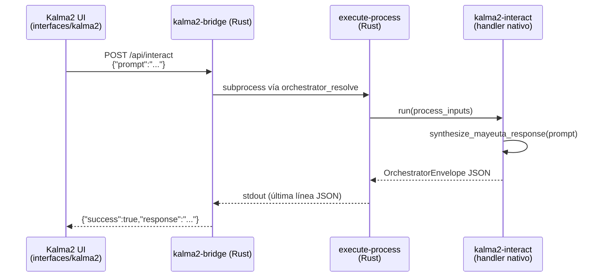

# Kalma2 — Cliente interactivo SddIA

**Kalma2** es la primera versión de cliente web para operar SddIA **sin depender de Cursor** como intermediario obligado. Ofrece una superficie mínima (prompt → envío → respuesta) conectada a un puente HTTP local que delega en el orquestador del Core respetando el contrato JSON stdin/stdout.

> **Nota de nomenclatura:** el cliente se denomina **Kalma2** (`interfaces/kalma2/`). **karma2-token** es una entidad distinta del genoma (`SddIA/tokens/karma2-token.md`): token de seguridad y auditoría del ecosistema. En el PoC actual el puente **no** valida Karma2Token ni Cerbero/RBAC.

---

## Objetivos

| ID | Objetivo | Estado PoC |
|----|----------|------------|
| **O1** | UI mínima viable: textarea de prompt, botón de envío y área de respuesta de solo lectura | ✅ |
| **O2** | Puente HTTP local con `POST /api/interact` y body `{"prompt": string}` | ✅ |
| **O3** | Frontend inerte: sin lógica de negocio ni resolución de rutas del Core | ✅ |
| **O4** | Carga de bóvedas antes del motor (`load_hierarchical_env`) | ✅ |
| **O5** | Estado cero en el navegador: cada envío es atómico, sin sesión ni historial | ✅ |
| **O6** | Inmunidad a doble envío: botón deshabilitado mientras el `fetch` está pendiente | ✅ |
| **O7** | Invocación del proceso genoma `kalma2-interact` vía orquestador nativo | ✅ |
| **O8** | Validación manual y automatizada (smoke, tests unitarios, prueba navegador) | ✅ |

### Fuera de alcance (PoC)

- Autenticación multiusuario, Cerbero, Karma2Token en el puente.
- WebSockets, SSE o colas de mensajes.
- Despliegue remoto, frameworks SPA o empaquetado npm.
- LLM externo: la respuesta es síntesis Mayeuta de laboratorio (determinista).

---

## Arquitectura



### Capas

| Capa | Artefacto | Responsabilidad |
|------|-----------|-----------------|
| **Material (UI)** | `index.html`, `app.js`, `style.css` | Captura el prompt, llama al puente y muestra la respuesta |
| **Puente HTTP** | `SddIA/target/{debug,release}/kalma2-bridge` | Sirve estáticos, expone `/api/interact`, invoca orquestador nativo |
| **Orquestador** | `execute-process` (binario Rust) | Resuelve el proceso, aplica peaje termodinámico y enruta al handler |
| **Proceso** | `SddIA/process/kalma2-interact.md` | Contrato declarativo: fases Síntesis → Respuesta |
| **Handler** | `engine/handlers/kalma2.rs` | Ejecuta la síntesis Mayeuta lab y devuelve el envelope JSON |

---

## Proceso interno: `kalma2-interact`

Definición atómica: `SddIA/process/kalma2-interact.md` (uuid `acdb6c88-f0d9-4e10-9d2f-7e4b5401a892`).

### Contrato

| Entrada | Obligatorio | Descripción |
|---------|:-----------:|-------------|
| `prompt` | Sí | Texto del operador desde el cliente Kalma2 |

| Salida | Descripción |
|--------|-------------|
| `response` | Texto de síntesis Mayeuta (≤ 2 líneas, voz Tormentosa/Aiúa) |

### Fases

1. **Síntesis** — Transmuta el `prompt` en respuesta orgánica breve mediante `synthesize_mayeuta_response` (laboratorio, sin LLM externo). Paridad con el patrón `telegram-fallback-responder`.
2. **Respuesta** — Devuelve `response` en el campo `data` del envelope JSON para consumo del puente HTTP o CLI.

### Ejemplo de respuesta Mayeuta

```
[Tormentosa/Aiúa] Recibo el estímulo: «tu prompt aquí».
Lo asimilo como fricción arquitectónica — ¿es señal o ruido?
```

### Flujo en el puente

1. Recibe `POST /api/interact` con JSON `{"prompt": "..."}`.
2. Valida que `prompt` sea string no vacío.
3. Resuelve comando del orquestador con `orchestrator_resolve.resolve_orchestrator_cmd`.
4. Ejecuta: `--process kalma2-interact --inputs '{"prompt":"..."}'`.
5. Parsea la última línea JSON de stdout.
6. Extrae `data.response` y responde al cliente: `{"success": true, "response": "...", "duration_ms": N}`.

---

## Levantar el sistema

### Requisitos previos

- Python 3 (stdlib; el puente usa `http.server`).
- Binario Rust del orquestador compilado:

```bash
cd SddIA && cargo build -p execute-process
```

Sin binario, `orchestrator_resolve` falla explícitamente. Override opcional: `SDDIA_EXECUTE_PROCESS_BIN=/ruta/al/execute-process`.

### Opción A — Ecosistema completo

Desde la raíz del repositorio:

```bash
./start-sddia.sh
```

Levanta demonios del Sistema Nervioso (si existen en `.SddIA/scripts/daemons/`) y el puente Kalma2. La UI queda en **http://127.0.0.1:8765**. `Ctrl+C` apaga todos los procesos hijos.

### Opción B — Solo Kalma2

```bash
# o build + arranque directo:
cd SddIA && cargo build -p kalma2-bridge
SDDIA_REPO_ROOT=$PWD/.. SddIA/target/debug/kalma2-bridge
```

Abrir en el navegador: **http://127.0.0.1:8765/**

Escribir un prompt → pulsar **Forjar** (o `Ctrl+Enter` / `Cmd+Enter`).

### Opción C — Motor directo (sin UI)

```bash
./sddia-run.sh --process kalma2-interact --inputs '{"prompt":"ping de prueba"}'
```

Equivalente al binario nativo vía SSOT `orchestrator_resolve.py`.

---

## Configuración

### Bóvedas de entorno

El puente carga al arranque la jerarquía de bóvedas (local prevalece sobre global):

| Orden | Archivo | Ámbito |
|-------|---------|--------|
| 1 | `.dev/.env` | Global del repositorio |
| 2 | `.SddIA/.dev/.env` | Instancia local (override) |

Implementación: `SddIA/scripts/qa/env_loader.py` → `load_hierarchical_env(repo_root)`.

### Variables relevantes

| Variable | Default | Descripción |
|----------|---------|-------------|
| `SDDIA_CLIENT_PORT` | `8765` | Puerto del puente HTTP |
| `SDDIA_CLIENT_TIMEOUT_SECONDS` | `120` | Timeout del subproceso al orquestador |
| `SDDIA_EXECUTE_PROCESS_BIN` | *(auto)* | Ruta explícita al binario `execute-process` |

Ejemplo en `.SddIA/.dev/.env`:

```env
SDDIA_CLIENT_PORT=8765
SDDIA_CLIENT_TIMEOUT_SECONDS=120
# SDDIA_EXECUTE_PROCESS_BIN=/home/user/SddIA/SddIA/target/debug/execute-process
```

### Bind de red

El puente escucha exclusivamente en **`127.0.0.1`** (localhost). No está pensado para exposición en red pública en esta fase PoC.

---

## API del puente

### `GET /`

Sirve el bundle estático de `interfaces/kalma2/` (`index.html`, `app.js`, `style.css`).

### `POST /api/interact`

**Request:**

```json
{ "prompt": "texto del operador" }
```

**Response (éxito):**

```json
{
  "success": true,
  "response": "[Tormentosa/Aiúa] Recibo el estímulo: «...».\nLo asimilo como fricción arquitectónica — ¿es señal o ruido?",
  "duration_ms": 42
}
```

**Response (error):**

```json
{
  "success": false,
  "message": "descripción del fallo",
  "exit_code": 1
}
```

---

## Verificación

```bash
# Tests unitarios del core Python (paridad histórica)
python3 -m unittest SddIA.scripts.qa.test_kalma2_interact -v

# Smoke HTTP
# o build + arranque directo:
cd SddIA && cargo build -p kalma2-bridge
SDDIA_REPO_ROOT=$PWD/.. SddIA/target/debug/kalma2-bridge &
curl -s -X POST http://127.0.0.1:8765/api/interact \
  -H 'Content-Type: application/json' \
  -d @docs/features/poc-interface-comunicacion/_smoke-kalma2-interact.json

# Smoke orquestador nativo
./sddia-run.sh --process kalma2-interact --inputs '{"prompt":"ping"}'
```

---

## Referencias

| Recurso | Ruta |
|---------|------|
| Proceso genoma | `SddIA/process/kalma2-interact.md` |
| Handler Rust | `SddIA/engine/execute-process/src/engine/handlers/kalma2.rs` |
| Puente HTTP | `SddIA/interfaces/kalma2-bridge/` (binario) |
| SSOT orquestador | `SddIA/scripts/qa/orchestrator_resolve.py` |
| Feature PoC | `docs/features/poc-interface-comunicacion/` |
| Token de seguridad (relacionado, no integrado) | `SddIA/tokens/karma2-token.md` |
