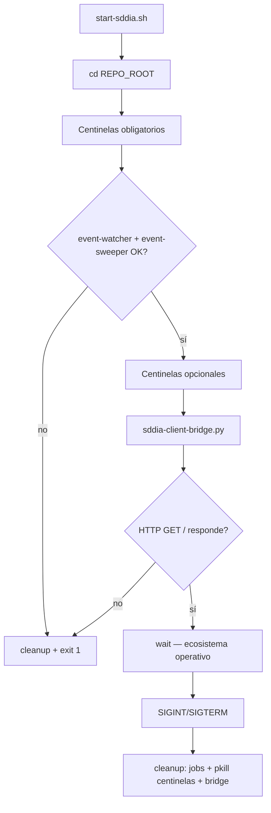

# Ignición del ecosistema SddIA (`start-sddia.sh`)

Script de arranque unificado del nodo local: levanta los **Centinelas** (Sistema Nervioso EDA) y el puente **Kalma2** (interfaz HTTP). Vive en la raíz del repositorio como artefacto de **instancia**; no muta el genoma (`SddIA/`).

## Objetivo

| Componente | Rol | Ruta de arranque |
|------------|-----|------------------|
| **Centinelas obligatorios** | Bus EDA y barrido de pendientes | `SddIA/scripts/daemons/event-watcher.sh`, `event-sweeper.sh` |
| **Centinelas opcionales** | Telegram y GitHub bridge | `SddIA/scripts/daemons/telegram-watcher.sh`, `github-bridge-watcher.sh` |
| **Kalma2** | UI + `POST /api/interact` | `.SddIA/client/sddia-client-bridge.py` |

## Separación genoma / instancia

- **Genoma** (`SddIA/`): definiciones, lanzadores canónicos (`SddIA/scripts/daemons/`), entrypoints Rust (`SddIA/daemons/*.sh`), binarios en `SddIA/target/release/`.
- **Instancia** (`.SddIA/`): puente cliente Kalma2, locks, estado y logs de demonios (`.SddIA/daemons/{status,state,logs}`).

SSOT de rutas: `SddIA/core/cumulo.paths.json` (`directories.daemons`, `daemons_instance`).

## Secuencia de ignición



1. Ancla el directorio de trabajo en la raíz del repo.
2. Lanza cada centinela vía `SddIA/scripts/daemons/<name>.sh` → `_run_daemon.sh` → `_exec_daemon.sh` → binario Rust nativo.
3. Verifica que el proceso sigue vivo (`kill -0` o `pgrep -x`).
4. Arranca el puente Kalma2 y espera respuesta HTTP en `http://127.0.0.1:8765/` (configurable con `SDDIA_CLIENT_PORT`).
5. Bloquea con `wait` hasta Ctrl+C o señal de terminación.

## Uso

```bash
cd /ruta/al/repo/SddIA
chmod +x start-sddia.sh   # una sola vez si hace falta
./start-sddia.sh
```

Variables de entorno relevantes:

| Variable | Default | Efecto |
|----------|---------|--------|
| `SDDIA_CLIENT_PORT` | `8765` | Puerto HTTP de Kalma2 |
| `SDDIA_CLIENT_TIMEOUT_SECONDS` | `120` | Timeout del motor en el bridge |

Bóvedas cargadas por centinelas y bridge: `.dev/.env`, `.SddIA/.dev/.env` (vía `env_loader`).

## Apagado limpio

`Ctrl+C` o `SIGTERM` ejecutan `cleanup`:

- `kill` de jobs en background del script.
- `pkill -x` por nombre de cada centinela (`event-watcher`, `event-sweeper`, `telegram-watcher`, `github-bridge-watcher`).
- `pkill -f sddia-client-bridge.py`.

## Requisitos previos

- **Binarios Rust** compilados: `cd SddIA && cargo build -p event-watcher -p event-sweeper -p telegram-watcher -p github-bridge-watcher` (o build release en `SddIA/target/release/`).
- **Python 3** con acceso a `SddIA/scripts/qa/env_loader.py` y `orchestrator_resolve.py`.
- **Bundle UI** presente en `interfaces/kalma2/`.
- **curl** disponible para la comprobación de salud del puente.

## Diagnóstico

| Síntoma | Acción |
|---------|--------|
| `[AVISO] *.sh no encontrado` | Comprobar que exista `SddIA/scripts/daemons/` (no `.SddIA/scripts/`). |
| Centinela no arranca | Revisar `.SddIA/daemons/logs/<name>.log` y locks en `.SddIA/daemons/status/`. |
| Kalma2 no responde | Verificar `interfaces/kalma2/index.html` y stderr del bridge al arrancar. |
| Permisos en `.SddIA/daemons/` | Ajustar propietario si locks/logs son `root` y el operador es otro usuario. |

## Verificación rápida

Tras `./start-sddia.sh`, comprobar:

```bash
pgrep -x event-watcher && pgrep -x event-sweeper
curl -sf -o /dev/null -w '%{http_code}\n' http://127.0.0.1:8765/
```

Resultado esperado: procesos de centinelas obligatorios presentes y HTTP `200` en Kalma2.

**Validación en caliente (2026-06-19):** los cuatro centinelas arrancaron (`4/4`), Kalma2 respondió `GET /` con HTTP 200, y `SIGTERM` al script ejecutó cleanup con apagado de centinelas y puente.

## Referencias

- Kalma2 (UI y contrato HTTP): `interfaces/kalma2/README.MD`
- Catálogo de centinelas: `SddIA/daemons/index.md`
- Contrato de familia: `SddIA/daemons/daemons-contract.md`
- Proceso `kalma2-interact`: `SddIA/process/kalma2-interact.md`
