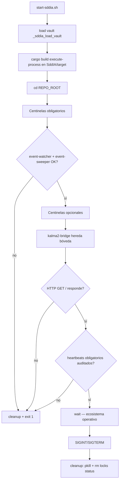

# Ignición del ecosistema SddIA (`start-sddia.sh`)

Script de arranque unificado del nodo local: levanta los **Centinelas** (Sistema Nervioso EDA) y el puente **Kalma2** (binario Rust `kalma2-bridge`). Vive en la raíz del repositorio como artefacto de **instancia**.

**v1.2.1:** ignición recompila `execute-process` en `SddIA/target` (`CARGO_TARGET_DIR` explícito) y exporta `SDDIA_EXECUTE_PROCESS_BIN` a los centinelas. Evita ELF stale de caché sandbox / `target` ajeno.

## Objetivo

| Componente | Rol | Ruta de arranque |
|------------|-----|------------------|
| **Servicios de Red** | Puente local hacia IOTA Rebased (Relay) | `.SddIA/services/iota-publish-relay/server.mjs` (Node.js) |
| **Centinelas obligatorios** | Bus EDA y barrido de pendientes | `SddIA/scripts/daemons/event-watcher.sh`, `event-sweeper.sh` |
| **Centinelas opcionales** | Telegram y GitHub bridge | `SddIA/scripts/daemons/telegram-watcher.sh`, `github-bridge-watcher.sh` |
| **Kalma2** | UI + `POST /api/interact` | `SddIA/target/{debug,release}/kalma2-bridge` |

## Separación genoma / instancia

- **Genoma** (`SddIA/`): centinelas, orquestador `execute-process`, crate `kalma2-bridge` en `SddIA/interfaces/kalma2-bridge/`.
- **Instancia** (`.SddIA/`): locks, estado y logs de demonios (`.SddIA/daemons/{status,state,logs}`).
- **Bundle UI** (`interfaces/kalma2/`): estáticos servidos por el bridge.

SSOT de rutas: `SddIA/core/cumulo.paths.json`.

## Secuencia de ignición



1. Ancla `REPO_ROOT` y carga bóveda (`_sddia_load_vault`) para que `kalma2-bridge`/`mayeuta-llm` hereden `SDDIA_LLM_*`.
2. `cargo build -p execute-process` con `CARGO_TARGET_DIR=$REPO/SddIA/target`; exporta `SDDIA_EXECUTE_PROCESS_BIN`.
3. Lanza centinelas vía `SddIA/scripts/daemons/<name>.sh`.
4. Resuelve y arranca `kalma2-bridge` nativo ELF (`SDDIA_KALMA2_BRIDGE_BIN` o `SddIA/target/{debug,release}/`).
5. Health check HTTP en `http://127.0.0.1:8765/`.
6. Gate: `daemon-heartbeat-audit` confirma latidos frescos de obligatorios (`missed_cycles < 3`).
7. `wait` hasta señal de terminación; cleanup elimina locks en `.SddIA/daemons/status/`.

## Uso

```bash
(cd SddIA && cargo build -p kalma2-bridge -p execute-process \
  -p event-watcher -p event-sweeper -p telegram-watcher -p github-bridge-watcher)
./start-sddia.sh
```

Variables de entorno:

| Variable | Default | Efecto |
|----------|---------|--------|
| `SDDIA_CLIENT_PORT` | `8765` | Puerto HTTP Kalma2 |
| `SDDIA_CLIENT_TIMEOUT_SECONDS` | `120` | Timeout subproceso orquestador |
| `SDDIA_KALMA2_BRIDGE_BIN` | autodetect | Override binario bridge |
| `SDDIA_EXECUTE_PROCESS_BIN` | autodetect | Override orquestador (bridge) |
| `SDDIA_REPO_ROOT` | autodetect | Raíz repo (bridge) |

## Apagado limpio

- `kill` jobs en background.
- `pkill -x` centinelas + `kalma2-bridge`.
- Elimina `{daemons_instance.status}/{name}.lock` de los cuatro centinelas (contrato CEN-01; evita PIDs muertos residuales).

## Requisitos previos

```bash
(cd SddIA && cargo build -p kalma2-bridge -p execute-process \
  -p event-watcher -p event-sweeper -p telegram-watcher -p github-bridge-watcher)
```

- Bundle UI en `interfaces/kalma2/`.
- `curl` para health check y `file` para validar ejecutables ELF nativos.

## Garantía de ejecución nativa

- Los dos centinelas obligatorios deben iniciar como ELF nativo; el fallo de cualquiera cancela la ignición antes de lanzar Kalma2.
- Los centinelas opcionales no alteran la condición de éxito de los obligatorios.
- El arranque muestra la ruta del ELF resuelto para cada componente. La prioridad es `debug` y después `release`, coherente con `cargo build` del uso documentado.
- `SDDIA_KALMA2_BRIDGE_BIN` y `SDDIA_EXECUTE_PROCESS_BIN` solo admiten binarios ELF ejecutables; un script Python u otro wrapper es rechazado explícitamente.

## Diagnóstico

| Síntoma | Acción |
|---------|--------|
| `kalma2-bridge no encontrado` | `cargo build -p kalma2-bridge` |
| `orquestador no encontrado` (POST) | `cargo build -p execute-process` |
| Centinela no arranca | `.SddIA/daemons/logs/<name>.log` |
| `Error IOTA: Connection refused (os error 111)` | Revisar `.SddIA/services/iota-publish-relay/relay.log` |

## Verificación rápida

```bash
pgrep -x event-watcher && pgrep -x event-sweeper
pgrep -x kalma2-bridge
curl -sf -o /dev/null -w '%{http_code}\n' http://127.0.0.1:8765/
curl -sf -XPOST http://127.0.0.1:8765/api/interact -H 'Content-Type: application/json' -d '{"prompt":"hola"}'
```

## Referencias

- Feature bridge Rust: `docs/features/kalma2-bridge-rust/`
- Kalma2 UI: `interfaces/kalma2/README.MD`
- Proceso motor: `SddIA/process/kalma2-interact.md`
- CLI orquestador: `./sddia-run.sh --process kalma2-interact --inputs '{"prompt":"..."}'`
